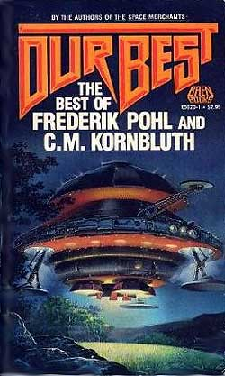

# The Way the Future Blogs

Frederik Pohl

## Cleaning Up the Hater’s Mess Goes On

Dear People:

As you know, I have a problem, and its name is [**Mark Rich**](/posts/2010-11-07-great-subject-really-lousy-book/).  For some reason, and I have no clue as to what that reason is, it is quite obvious that he hates me.

Now, I don’t particularly care whether someone named Mark Rich hates me, since as far as I know, I’ve never met the man.  The difficulty, however,  is that he has written a book about it, and it comes at a bad time.   I’m not young, and I’m not in particularly good health, and there are a number of things that are important to me that I want to get done.  Dealing with the attacks of this man was not one of them

But I really can’t let him go on unchecked.  It isn’t just that he hates me.  He makes up whole scenarios that never happened to hate me for, like the one I wrote about last week in this blog.  And honestly, Mr. Rich, that’s pathological.

So I am going to have to do some setting of the record straight.

This presents a big problem for me, one I thought I had faced and settled 25 years ago.

You see, when I first began writing the autobiographical sort of material that ultimately turned into the book [The Way the Future Was](https://web.archive.org/web/20160531110959/http://www.amazon.com/gp/product/0345260597?ie=UTF8&tag=7159-20&linkCode=as2&camp=1789&creative=390957&creativeASIN=0345260597), I had to decide just how much truth I wanted to tell.  What I decided was that I would try to be as candid as possible about everything I had done, even the things I wished I hadn’t.  The trouble with that was that I was not the only person involved in those matters.  If I chose to Tell All about everything I did, it unfortunately would sometimes involve simultaneously Telling All about others, which I had no right or desire to do.

Understand that I am not saying that that sf community in New York in the 1950s and ’60s was riddled with vice and degeneracy.  It wasn’t.  Well, not a lot, anyway.  But these were young people who did a fair amount of drinking and sometimes a modest amount of drugs.  That is to say, in those respects they were quite like young adult bridge clubs, church groups and party-givers all over America.  Only in their cases some of them got kind of famous.

There was, for all these reasons, a lot of stuff I didn’t write about concerning some of the other people involved because I didn’t want to embarrass them.  In particular, that applied to my one-time wife, [Judy Merril](https://web.archive.org/web/20160531110959/http://www.judithmerril.com/).  We had just begun being good friends again as I was writing that book, and that was a good feeling.  It gave us a chance to enjoy our increasing numbers of grandchildren together, and it let us remember, as Judy said to me once,  “Why I liked you in the first place.”

Rich however seems to think that I persecuted Judy, and I will take that up.

He also all but states that I embezzled some of Cyril’s share of the earnings from [The Space Merchants.](https://web.archive.org/web/20160531110959/http://www.amazon.com/gp/product/0312749511?ie=UTF8&tag=7159-20&linkCode=as2&camp=1789&creative=390957&creativeASIN=0312749511)I’ll deal with that one, too, and with several others of his very bad guesses.  But I want to do something else first.

Rich apparently believes that, apart from dishonesty, my career in science fiction  has been marked by general incompetence in just about everything I tried, as agent, as editor, as collaborator and as author.  If I left anything out, he thinks I was lousy at that, too.

In the scheme of things entire, I would like not to care what somebody I never heard of thinks of me.  This time, though, I don’ have that privilege, because Rich went and wrote this damn book.  Lots of people do care about [**Cyril Kornbluth**](/posts/2009-04-20-cyril/) and are likely to want to read about him.  (Even more, I think, may be likely to hear of our present differences and want to see what he said for themselves.)  Some of them may know very little about me, or about what the rest of the world thinks of me, and how that contrasts with Rich’s opinions and flights of fantasy.

That would be a pity, so let’s look at the record.

Start with this: I have seven Hugo Awards.

That’s not a remarkable number, but I won three of them for writing (four if you count the [**new one**](/posts/2010-09-10-thank-you-fandom/) I unexpectedly got this year) and three as editor, and I would like to point out that in all the years Hugo Awards have been given out, nobody else in the world has ever won the Hugo in both those major categories. (The editing awards were for [If](https://web.archive.org/web/20160531110959/http://www.isfdb.org/wiki/index.php/Magazine:If), and the fiction awards included those for my novel [Gateway](https://web.archive.org/web/20160531110959/http://www.amazon.com/gp/product/0345475836?ie=UTF8&tag=7159-20&linkCode=as2&camp=1789&creative=390957&creativeASIN=0345475836) and a short story, “[Fermi and Frost](https://web.archive.org/web/20160531110959/http://www.amazon.com/gp/product/0312875274?ie=UTF8&tag=7159-20&linkCode=as2&camp=1789&creative=390957&creativeASIN=0312875274).”)

One Hugo Award I shared with Cyril, posthumously, for a short story, “[The Meeting](https://web.archive.org/web/20160531110959/http://www.amazon.com/gp/product/0671656201?ie=UTF8&tag=twtfb-20&linkCode=as2&camp=1789&creative=390957&creativeASIN=0671656201),” and that’s of interest here.  When Cyril died, his widow, Mary, gave me some scraps and fragments of stories that he had left behind, apparently because he got that far and bogged down and couldn’t figure where to go with them.  I agreed to try to make complete stories out of them, sell them for publication and split whatever they earned fifty-fifty.

One of those fragments was a scene set in a parents’ association for a school for handicapped children.  Like almost everything else Cyril was writing in those days, it was beautifully done, but there was no story.  I gave it a story.  I believe Rich thinks I screwed that up, too, but I don’t have the patience to go back and reread his dizzy-minded remarks.

So I will just say that what actually happened is that it won a Hugo — the only Hugo, I am sorry to say, that Cyril’s writing ever earned.

### 13 Comments

- Chad Thorson says:
Your writings will continue to be read for generations but the Mark Rich\\\\\\\’s of the world will fade into obscurity.
[**November 27, 2010, 2:36 am**](/posts/2010-11-27-cleaning-up-the-hater-s-mess-goes-on/)
- [Rick Jackson](https://web.archive.org/web/20160531110959/http://www.spacedogpodcast.com/) says:
It’s a shame that you need to focus your attention on this dim bulb. Let’s hope someone writes a really good bio on Cyril so we can all forget this one. Even if I didn’t know you were a beloved personality in SF, I could see by the number of collaborative title with the likes of Cyril, Jack Williamson, Arthur C. Clarke and so many others that you must be a generous person with your talent and artistry.
[**November 27, 2010, 12:31 pm**](/posts/2010-11-27-cleaning-up-the-hater-s-mess-goes-on/)
- Ed Ever says:
I suspect that more people read this blog in a day than will ever read that book.  And no one who reads a bio (loosely termed) of Kornbluth is going to be unaware of Pohl’s POV.  We don’t even need an item by item refutation — just list the pages that contain falsehoods and we’ll take it from there.  Decrease your stress.
[**November 27, 2010, 1:21 pm**](/posts/2010-11-27-cleaning-up-the-hater-s-mess-goes-on/)
- Pat says:
He hates his idea of you, like a student affecting a hatred of a philosopher they have never read.
How many biographers are remembered?
[**November 27, 2010, 2:58 pm**](/posts/2010-11-27-cleaning-up-the-hater-s-mess-goes-on/)
- [wishnevsky](https://web.archive.org/web/20160531110959/http://wishbass.com/) says:
My sympathies. I’m sure you don’t need advice from one 2/3 your age, but i always say when criticized unjustly, “The dogs bark, the caravan moves on.”
When they write your bio, Rich will not even be a footnote.
[**November 27, 2010, 3:07 pm**](/posts/2010-11-27-cleaning-up-the-hater-s-mess-goes-on/)
- Ken says:
Dear Fred,
Why are you wasting your breath on this miserable jerk? No talent hacks that spew mis-information and outright lies love it when they can actually get a rise out of a victim of their hatchet job. In fact that is usually their plan, as evidenced by his flip and strangely cheerful reply to your email. Far from hating you, he is actually no doubt loving you right about now. You’re playing right into his game. A single sentence dismissal of his lousy book is all that is needed from you. I have not read his book and I don’t plan to – as soon as you called it crap why would I waste my time? In a few years, or more likely a few months, no one will remember him or his garbage book, that is unless you keep bringing it up. Your legacy as one of the greatest SF writers, collaborators, editors, and agents of all time (not to mention overall decent human being) is cemented in my mind and 99.9 percent of the world. If .1 percent is actually dumb enough to believe his trash, well who cares? Ignore him and soon he’ll slither back into whatever sewer he oozed from and good riddance.
Best regards,  

Ken
[**November 27, 2010, 4:27 pm**](/posts/2010-11-27-cleaning-up-the-hater-s-mess-goes-on/)
- Paul Oldroyd says:
What the others said.
He’s not worth wasting time on!
Paul
[**November 28, 2010, 3:04 am**](/posts/2010-11-27-cleaning-up-the-hater-s-mess-goes-on/)
- John H says:
While I certainly agree that Rich is not worthy of a response, I’m glad you’re setting the record straight. In doing so you’re not only putting Rich in his place, but more importantly adding to the wonderful historical record your blog has become.
Kudos to you, and continued good fortune!
[**December 2, 2010, 4:13 pm**](/posts/2010-11-27-cleaning-up-the-hater-s-mess-goes-on/)
- Don says:
Really, just stop mentioning the guy! Its the best (and probably the only) publicity he’ll ever get!
[**December 2, 2010, 9:38 pm**](/posts/2010-11-27-cleaning-up-the-hater-s-mess-goes-on/)
- [TK Kenyon](https://web.archive.org/web/20160531110959/http://www.tkkenyon.com/) says:
Rich is not worth your time. No one respects or listens to him. 
Just ignore him. 
Everyone else does. 
Take the Bill O’Reilly/Keith Olbermann spat to heart. When Olbermann began his show, his ratings were ~ <30% of O’Reilly’s. Olbermann said some nasty stuff about O’Reilly. O’Reilly went nuts and slammed Olbermann, mocking him and discussing him again and again on his show. 
O’Reilly’s ratings declined slightly. 
Olbermann’s tripled. 
Always pick a fight with people bigger than you. Never respond and give publicity to yappy little dogs trying to get your and everyone else’s attention. 
TK
[**December 4, 2010, 8:07 pm**](/posts/2010-11-27-cleaning-up-the-hater-s-mess-goes-on/)
- Curt Phillips says:
Thanks for writing this Fred.  I’d heard of but not read Mark Rich’s book and now I know that I needn’t bother.  You’ve saved me the price of that book!
I’ve read your most of your writings – SF, non-sf, articles, fanzines, – and have followed your editorial work from ASTONISHING through IF and beyond.  Your track record is solid as a rock with me, and your integrity is beyond question.  Thank you for all that you’ve written over the decades and for all that you continue to write.  You are one of only a dozen or so science fiction writers who have made the genre important to my life, and I owe you a debt that I can never repay for that.
Curt Phillips
[**December 11, 2010, 7:44 am**](/posts/2010-11-27-cleaning-up-the-hater-s-mess-goes-on/)
- [Spider Robinson](https://web.archive.org/web/20160531110959/http://www.spiderrobinson.com/) says:
Send him this message, Fred: “Dear Mr. Rich: I am seated in the smallest room of my home. Your book is before me. By the end of the month, it will be behind me. –Appreciatively, Frederik Pohl.”
[**January 2, 2011, 1:58 am**](/posts/2010-11-27-cleaning-up-the-hater-s-mess-goes-on/)
- Jim Satterfield says:
Fred is right, IMO. You can\’t just ignore this kind of blather. If someone writes crap like this about you, stand up and point out where they are wrong and tell the truth.
[**February 12, 2011, 9:03 pm**](/posts/2010-11-27-cleaning-up-the-hater-s-mess-goes-on/)

[WordPress](https://web.archive.org/web/20160531110959/http://wordpress.org/)
[TWTFB2](https://web.archive.org/web/20160531110959/http://dicksmithsoftware.com/)