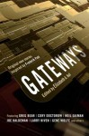

<!-- translated by Yandex Translate -->

# Путь к блогам будущего

Фредерик Пол

## Какую УСЛУГУ Ты можешь позволить себе оказать Мне?

Некоторые хорошие друзья и блогеры говорили мне, что, хотя все они полностью на моей стороне в моей борьбе с [*силами зла**](/fred-pohl/2010-11-27-cleaning-up-the-hater-s-mess-goes-on/), они давно приняли решение и хотели бы, чтобы я прекратил говорить об этой ненавистной клевете и лжи.  Я горд и счастлив сообщить вам, что — с вашей помощью — я, возможно, нашел реальный способ достичь этого.

Это тоже нетрудно.  Для этого требуется всего два действия, одно от вас и одно от меня.

Первая часть, моя часть, - это та часть, которая не совсем проста, потому что от меня потребуется много работы, но я уже приступил к ней. То есть подготовить новое издание Ретроспективы Будущего([The Way The Future Was](https://web.archive.org/web/20150912131755/http://www.amazon.com/gp/product/0345260597?ie=UTF8&tag=7159-20&linkCode=as2&camp=1789&creative=390957&creativeASIN=0345260597)), чтобы прояснить многие моменты, которые были неясны в первом издании.  Причина, по которой они были неясны, заключалась в том, что, хотя я делал все возможное, чтобы рассказать все о своих собственных действиях, даже о тех, о которых я жалел, что не совершал, были моменты, когда я не мог рассказать все о себе, не рассказав также все о каком-то другом человеке, и к этому я не был готов.

Пожалуйста, поймите меня.  Я не собираюсь рассказывать о том, кто с кем спал ради сексуального возбуждения, но о таких вещах, как то, почему один известный автор наставил на меня пистолет и прицелился мне в лицо, после чего мы подрались на кулаках. И тому подобное.

Это моя часть, довольно большую часть которой я собираюсь опубликовать в блоге задолго до выхода книги.  А что у тебя?

Что я прошу вас сделать, так это всякий раз, когда вы посещаете вечеринку, конвента или что-то в этом роде, и кто-то повторяет одну из этих ложей обо мне, как будто это факт, вы достаете свой экземпляр подарка моей жене на день рождения, [**Шлюзы**](/fred-pohl/2009-01-01-elizabeth-anne-hull/) с буквой s, и показываете ему, что уважаемый люди должны говорить на эту тему..

Ты можешь сделать это для меня?

Я знаю, что [покупка копии](https://web.archive.org/web/20150912131755/http://www.amazon.com/gp/product/0765326620?ie=UTF8&tag=twtfb-20&linkCode=as2&camp=1789&creative=390957&creativeASIN=0765326620) обойдется вам в деньги, если у вас ее еще нет. Но это дало бы мне возможность уйти от этой неприятной темы.  Пожалуйста.

### 28 Комментариев

- Скотт Хаугер говорит:
Это сделка  

Скотт
[**3 декабря 2010 года, 12:58 утра**](/fred-pohl/2010-12-03-how-much-of-a-favor-can-you-afford-to-do-me/)
- [Билл Гудвин](https://web.archive.org/web/20150912131755/http://771715/) говорит:
Сделано.  С удовольствием.
[**3 декабря 2010 года, 1:07 утра**](/fred-pohl/2010-12-03-how-much-of-a-favor-can-you-afford-to-do-me/)
- [Ралан](https://web.archive.org/web/20150912131755/http://www.ralan.com/) говорит:
Это сделка! Я включил шлюзы в свой список желаний на праздник. Если никто не даст мне копию, я куплю ее сам сразу после праздника. С нетерпением жду возможности прочитать это и узнать, кто был тот вооруженный писатель.
[**3 декабря 2010 года, 4:48 утра**](/fred-pohl/2010-12-03-how-much-of-a-favor-can-you-afford-to-do-me/)
- Пэт говорит:
Я никогда никого не вижу в НФ в реальной жизни, но если я когда-нибудь увижу, что кто-то оскорбляет вас в Интернете, я спокойно исправлю его. Если бы я мог купить шлюзы, я бы это сделал. Я не думаю, что они пока доступны по эту сторону пруда.
Распространены ли в США угрозы оружием, за которыми следуют побои? Я определенно куплю новую автобиографию с такого рода дополнениями.
[**3 декабря 2010 года, 7:41 утра**](/fred-pohl/2010-12-03-how-much-of-a-favor-can-you-afford-to-do-me/)
- [ТК Кеньон](https://web.archive.org/web/20150912131755/http://www.tkkenyon.com/) говорит:
Сделаю. 
Сделал бы это в любом случае. 
Также с нетерпением жду выхода нового, расширенного издания TWTFW. 
ТК Кеньон
[**3 декабря 2010 года, 8:00 утра**](/fred-pohl/2010-12-03-how-much-of-a-favor-can-you-afford-to-do-me/)
- [Майк Рэнсом](https://web.archive.org/web/20150912131755/http://tulsatvmemories.com/) говорит:
Я только что добавила “Шлюзы” в свой список желаний Amazon на Рождество. Я тоже с нетерпением жду нового TWTFW. TWTFB - мой любимый блог.
[**3 декабря 2010 года, 9:10 утра**](/fred-pohl/2010-12-03-how-much-of-a-favor-can-you-afford-to-do-me/)
- Кен говорит:
Отличный план, Фред, я с нетерпением жду выхода нового выпуска "Как было будущее" Ретроспектива Будущего (The Way The Future Was). Как только я закончу писать это, я собираюсь пришить к своим джинсам задний карман побольше, чтобы я мог мгновенно достать свой экземпляр "Врат" и опровергнуть силы зла!
Кен
[**3 декабря 2010 года, 9:17 утра**](/fred-pohl/2010-12-03-how-much-of-a-favor-can-you-afford-to-do-me/)
- Джим Брейден говорит:
Уважаемый мистер Пол,
говорят, что о человеке можно судить не только по его друзьям, но и по его врагам.  

Из того, что я здесь прочитал, следует, что вы являетесь победителем на обоих фронтах.  

Я заказал свой экземпляр Gateways и с нетерпением жду нового издания TWTFW - оно может стоять на полке рядом с моим старым изданием, которое я купил в Seacon еще в 1979 году и которое вы были так любезны подписать для меня.
Джим Брейден
[**3 декабря 2010 года, 10:00 утра**](/fred-pohl/2010-12-03-how-much-of-a-favor-can-you-afford-to-do-me/)
- Росс Прессер говорит:
Но никто никогда не приглашает меня на вечеринки.
[**3 декабря 2010 года, 10:43 утра**](/fred-pohl/2010-12-03-how-much-of-a-favor-can-you-afford-to-do-me/)
- Порча говорит:
Что ж, я прочитала мемуары Джудит об инциденте с пистолетом у твоего лица, и должна сказать, что, хотя от этого у меня немного отвисла челюсть, это бледнеет по сравнению с другой дикой и безумной историей об авторах НФ и оружии – Харлане Эллисоне, Теде Уайте и “Пари”. Я думаю именно тогда фэн Эллисона во мне окончательно умер.
[**3 декабря 2010, 14:39 вечера**](/fred-pohl/2010-12-03-how-much-of-a-favor-can-you-afford-to-do-me/)
- Джон Миллер говорит:
Я думаю, что то, что ваши фэны не могут понять, почему гигант беспокоится о блохе, является показателем вас как автора и человека.
Итак, прихлопнув и поцарапав обидчивую блоху, пожалуйста, верните свое внимание к тем из нас, кто ценит вас за то, что вы есть, в отличие от тех, кто поносит вас за то, чем вы не являетесь.
[**3 декабря 2010, 14:22**](/fred-pohl/2010-12-03-how-much-of-a-favor-can-you-afford-to-do-me/)
- [Джей](https://web.archive.org/web/20150912131755/http://betweendrafts.com/) говорит:
Уилко.
[**3 декабря 2010, 18:24 вечера**](/fred-pohl/2010-12-03-how-much-of-a-favor-can-you-afford-to-do-me/)
- Джон N говорит:
“Шлюзы” есть в моей корзине.  Также с нетерпением жду нового издания, которое будет размещено рядом с различными книгами, которые вы любезно подписали для меня в Чикаго в 1998 году.
...Я могу вспомнить одного известного автора научной фантастики, который вполне способен на такое поведение.  Кто бы это ни был, я надеюсь, вы заставили его пожалеть об этом!
[**3 декабря 2010 года, 9:23 вечера**](/fred-pohl/2010-12-03-how-much-of-a-favor-can-you-afford-to-do-me/)
- Трейси Си говорит:
Сделано, и с удовольствием, хотя я действительно хотел бы, чтобы ваша творческая энергия нашла лучшее применение, чем необходимость отвечать на ложь и клевету о вашей жизни от какого-нибудь халтурщика.
[**3 декабря 2010, 10:29 вечера**](/fred-pohl/2010-12-03-how-much-of-a-favor-can-you-afford-to-do-me/)
- Джо Уолтон говорит:
У меня есть GATEWAYS, но это увесистая книга в твердом переплете, и я бы значительно замедлился, если бы постоянно носил ее с собой на всякий случай, если бы она понадобилась мне для опровержения идиотов. Могу ли я просто процитировать это, если необходимо? И я сомневаюсь, что в этом будет необходимость, потому что я сомневаюсь, что многие люди обратят внимание на этого идиота и его клевету. Я был в SFContario пару недель назад, и единственные разговоры, в которых я участвовал, касающиеся вас, были о том, как мы рады, что вы выиграли премию Fanwriter Hugo, и как сильно нам нравится этот блог.
[**4 декабря 2010 года, 8:00 утра**](/fred-pohl/2010-12-03-how-much-of-a-favor-can-you-afford-to-do-me/)
- [Алан Робсон](https://web.archive.org/web/20150912131755/http://tyke.net.nz/) говорит:
Мне очень понравилось читать “Врата”, и я также с удовольствием читал ваши многочисленные романы, рассказы и мемуары. Я буду счастлив и горд выполнить свою часть этой сделки.
[**4 декабря 2010, 14:16 вечера**](/fred-pohl/2010-12-03-how-much-of-a-favor-can-you-afford-to-do-me/)
- Тина Блэк говорит:
Фред, я не думаю, что когда-либо слышал, чтобы кто-нибудь говорил о тебе что-то негативное, не менее клеветническое.  Ах, как невинно жить на Среднем Западе и держаться подальше от табачного дыма.
[**4 декабря 2010, 14:39 вечера**](/fred-pohl/2010-12-03-how-much-of-a-favor-can-you-afford-to-do-me/)
- [Джо Ириарте](https://web.archive.org/web/20150912131755/http://joeicarus.blogspot.com/) говорит:
Он добавлен в мой список желаний на Amazon. Возможно, пройдет несколько недель, прежде чем я смогу его купить, но я это сделаю. Я с нетерпением жду возможности прочитать это. 
[**4 декабря 2010, 19:31 вечера**](/fred-pohl/2010-12-03-how-much-of-a-favor-can-you-afford-to-do-me/)
- grs1961 говорит:
Правильно – купите “Gateways”, а когда он выйдет, получите новое издание “Ретроспективы Будущего (The Way The Future Was)”.
Хм, наверное, стоит купить книгу “Лучше любить: жизнь Джудит Меррил” (если я смогу найти копию), чтобы прикрепить к древнему экземпляру TWTFW!
[**4 декабря 2010, 19:02 вечера**](/fred-pohl/2010-12-03-how-much-of-a-favor-can-you-afford-to-do-me/)
- [Стефан Джонс](https://web.archive.org/web/20150912131755/http://www.flickr.com/photos/stefan_e_jones/) говорит:
Только что заказал “Gateways” и трибьют-антологию Джека Вэнса. Они будут моим чтением на рождественских каникулах.
[**5 декабря 2010 года, 12:02 утра**](/fred-pohl/2010-12-03-how-much-of-a-favor-can-you-afford-to-do-me/)
- [Билл Гудвин](https://web.archive.org/web/20150912131755/http://771715/) говорит:
Сбой  

в темноте  

Зуд  

и лай  

Но богатый?  

Нет, только не Марк
[**5 декабря 2010 года, 2:44 ночи**](/fred-pohl/2010-12-03-how-much-of-a-favor-can-you-afford-to-do-me/)
- Ил говорит:
Почему то, что говорят "уважаемые люди", должно быть аргументом? Это заблуждение (обращение к авторитету: смотрите [http://en.wikipedia.org/wiki/Appeal_to_authority](https://web.archive.org/web/20150912131755/http://en.wikipedia.org/wiki/Appeal_to_authority) ). Честно говоря, я начинаю чувствовать, что ваше отношение к этому вопросу (например, просить людей купить книгу и повторять то, о чем они лично мало что знают) несколько неприятное. Ни у кого никогда не было причин верить тому, что написал Марк Рич (и у меня до сих пор нет), но становится все более очевидным, что у вас действительно есть некоторые неподобающие качества.
[**5 декабря 2010 года, 6:23 утра**](/fred-pohl/2010-12-03-how-much-of-a-favor-can-you-afford-to-do-me/)
- Тим Бартик говорит:
Я не согласен с тоном предыдущего постера. Нет, Фред Пол не обязан давать подробную критику книги Марка Рича. Я вполне могу понять, почему он может чувствовать, что у него нет на это времени или энергии. Нет ничего “неприличного” в том, что Пол не представил эту подробную критику.
Я все еще нахожу очень странным, что мистер Рич не взял интервью у мистера Пола для его биографии. Мне кажется, что этот отказ взять интервью у мистера Пола должен вызвать серьезные сомнения в достоверности биографии.
Тем не менее, я по-прежнему считаю, что если вы ДЕЙСТВИТЕЛЬНО хотите внести ясность в историю, кто-нибудь из сторонников Пола должен составить список из 10 наиболее важных ошибок в книге Рича и исправить эти ошибки. То есть, на p. x Рич говорит следующее, но это неправильно, и истина заключается в следующем.
Я не думаю, что новое издание TWTFW заменит эту критику.
[**6 декабря 2010, 12:24 вечера**](/fred-pohl/2010-12-03-how-much-of-a-favor-can-you-afford-to-do-me/)
- Карл Гловер говорит:
Между прочим, я не читал книгу Марка Рича и, следовательно, не имею никакого мнения о точности чего-либо, содержащегося в ней.  Я лично ничего не знаю ни о каких событиях или лицах, вовлеченных в них.
Но поскольку мистер Пол решил подвергнуть сомнению некоторые утверждения Рича, он обязан предоставить доказательства обратного.  Нельзя просто сказать: “Это неправда”, - и оставить все как есть.  Насколько я понимаю закон о клевете, бремя доказывания в таких случаях лежит на истце.  Опровержение по пунктам - это минимальное юридическое требование.  Я согласен с тем, что для своих нынешних целей мистер Пол не обязан представлять такие доказательства.  Его блог не является юридическим документом, и его читатели не являются присяжными.  Тем не менее, я, со своей стороны, хотел бы, чтобы он выступил с большей защитой, чем он предоставлял до сих пор.  Неспособность сделать это просто оставляет слишком много места для сомнений в его личной правдивости. 
Поймите, что я не принимаю ничью сторону в этом вопросе.  У меня нет личных претензий.  Но то, что мне понравились некоторые истории мистера Пола, не заставляет меня автоматически вставать на его защиту, как, по-видимому, справедливо для ряда присутствующих здесь респондентов.  Это именно тот вид “доказательств”, который наверняка приведет к проигрышу дела о клевете.  В таком случае я бы посоветовал мистеру Полу либо подать такой иск, либо закрыть этот вопрос.  В нынешнем виде его призывы к другим поднять его знамя недостойны его и, действительно, довольно смущают.
[** 7 декабря 2010 года, 8:18 утра**](/fred-pohl/2010-12-03-how-much-of-a-favor-can-you-afford-to-do-me/)
- [Майк Рэнсом](https://web.archive.org/web/20150912131755/http://tulsatvmemories.com/) говорит:
Расслабьтесь, Ил и Карл. Мистер Пол уже пообещал обсудить эти вопросы более подробно. Если вам не нравится то, что он говорит, вы можете пересмотреть свои опасения по поводу обращения к властям и закона о клевете.
[**8 декабря 2010 года, 3:05 утра**](/fred-pohl/2010-12-03-how-much-of-a-favor-can-you-afford-to-do-me/)
- Барбара (котенок) говорит:
У меня есть первое издание TWTFW, и я с нетерпением жду выхода нового издания.  Принес домой “better to have loved” из Torcon 3. и приобрел шлюзы для своего Kindle, пока был на Windycon 2010.
Что касается Рича, то к черту его, если он не понимает шуток... просто забудь о нем... он не стоит твоего времени.
*объятия*
[**8 декабря 2010, 15:51**](/fred-pohl/2010-12-03-how-much-of-a-favor-can-you-afford-to-do-me/)
- Джон Джей Пирс говорит:
Не часто бываю на вечеринках и тому подобном, особенно сейчас, когда я лежу со сломанным плечом в результате несчастного случая с наездом. И я даже не знал об антологии GATEWAYS, но теперь, когда я знаю, я ее получу.
Немного информации для вашего автобиографии: пару лет назад я подтвердил, что Лестер дель Рей на самом деле был Леонардом Нэппом. Я нашел его ребенком в переписи населения 1920 года (в этом районе нет дель Рей), а также нашел некролог другого члена семьи. Я коротко поговорила с младшей сестрой, которая сказала, что он ненавидел расти в бедной семье и отчаянно хотел уехать. Он не был добр к ним, но под своей новой личиной он был добр ко мне и многим другим людям.
[**14 декабря 2010, 20:18 вечера**](/fred-pohl/2010-12-03-how-much-of-a-favor-can-you-afford-to-do-me/)
- [Клифф Винниг](https://web.archive.org/web/20150912131755/http://cliffwinnig.com/) говорит:
Абсолютно!  У меня уже есть моя копия Gateways, и я с удовольствием покажу ее по мере необходимости.  В дополнение ко всему хорошему, что люди говорили о вас в Gateways, я продолжу рассказывать истории о том, каким милым вы были всякий раз, когда я встречал вас на WorldCons и других конвенциях.
[**21 декабря 2010, 18:07 вечера**](/fred-pohl/2010-12-03-how-much-of-a-favor-can-you-afford-to-do-me/)

[WordPress](https://web.archive.org/web/20150912131755/http://wordpress.org/)
[TWTFB2](https://web.archive.org/web/20150912131755/http://dicksmithsoftware.com/)