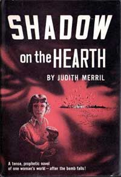

<!-- translated by Yandex Translate -->

# Путь к блогам будущего

Фредерик Пол

## Джудит Меррил, часть 5: Ее собственный хороший, успешный роман

То [** прошлое лето**](/fred-pohl/2010-12-06-judith-merril-part-4-last-attempts-at-having-a-family/), которое мы провели в большом старом доме над водохранилищем Ашокан, было временем, когда Джуди написала большую часть своего романа.  Она была там, с нашими дочерьми, все лето.  Она пригласила нескольких своих старых подруг провести с ней большую часть лета — кажется, [Кэтрин Маклин](https://web.archive.org/web/20150922191417/http://www.sfwa.org/archive/awards/2003/KMcL-ae.html) была одной из них, но не помню, кто еще, — и Джуди с легкостью вызвалась помочь ей присмотреть за детьми, чтобы сама Джуди могла поработать над своей книгой.  Затем, по выходным, когда я была там, я брала на себя большую часть (на самом деле довольно несложных) обязанностей по уходу за детьми.  Так было в первой половине лета.

Затем, поскольку у Джуди возникли трудности с книгой, она начала снимать комнату у подножия холма, как только я приезжала туда на выходные, чтобы взять на себя основную заботу о наших дочерях, и писала в пятницу вечером и в субботу вечером, пока не сменила меня в воскресенье.  У меня не было никаких возражений против всего этого.  Как ее агент, я заключил с Джуди довольно выгодный контракт с Doubleday, тогда еще универсальным издательством с приличным списком бестселлеров.  Ее редактором был Уолтер Брэдбери, главный редактор the line, деловой человек, ставший другом, и Брэд умел подбадривать Джуди, когда она в этом нуждалась.  Все было хорошо.

Что ж, почти все было хорошо, хотя время от времени появлялись облачка размером не больше человеческой ладони.  Когда, наконец, Джуди отдала мне законченную рукопись, Брэд внимательно прочитал ее построчно, а затем провел совещание с автором, которое я описал [** в другом месте**](/fred-pohl/2010-11-07-great-subject-really-lousy-book/).  Я думаю, это, должно быть, была тяжелая встреча, потому что Джуди изо всех сил старалась сохранить свой стиль неизменным.  Но они справились с этим нормально, или почти справились.  Возникла проблема.  Джуди использовала одно слово в сцене, которую Брэд действительно ненавидел.  Я думаю, что это слово, возможно, было “пробормотал”, например: “Это здорово", - пробормотал он”.

Брэд почти всегда был разумным человеком, но в этом вопросе, я действительно не знаю почему, он был почти таким же несговорчивым, как Джуди.  Когда он пришел ко мне с этой проблемой, поскольку я был агентом Джуди, я не мог поверить, что они вдвоем спорили о чем-то настолько тривиальном.  Поэтому я сделал довольно подлое и очень, очень плохое предложение.  Я сказал: “На вашем месте я бы отказался от этого аргумента, но тогда я бы просто убедился, что этого слова нет в окончательных установочных доказательствах.  Затем, когда настоящая печатная книга оказывалась у нее в руках и она замечала изменения, я унижался и приносил извинения”.

Это Брэд действительно сделал.  Однако он был слишком честным человеком, чтобы быть по-настоящему подлым, поэтому он дал знать Джуди.  Это не был конец света, хотя и вызвало много криков. Но мы преодолели это.

На самом деле, за несколько лет пребывания там мы преодолели практически все.    Каждый месяц я терял большие деньги на литературном агентстве, но до катастрофы дело еще не дошло, и я получал удовольствие от работы.  А у Джуди был свой роман.

Книга называлась "[Тень на камине](https://web.archive.org/web/20150922191417/http://www.amazon.com/gp/product/B000NY9W3E?ie=UTF8&tag=twtfb-20&linkCode=as2&camp=1789&creative=390957&creativeASIN=B000NY9W3E)".  Это была не совсем та книга, о которой люди думали, когда говорили “научная фантастика”, хотя действие происходило в (ближайшем) будущем.  В нем постулат Джуди состоял в том, что ядерная война действительно произошла.  Нью-Йорк подвергся атомной бомбардировке, и история Джуди была историей семьи, оказавшейся там в ловушке.

Она тоже хорошо справилась с этим.  Отзывы были в основном доброжелательными, и очень скоро даже пошли разговоры о фильме.  То есть не голливудские миллионы.  Тот фильм, о котором они говорили, был бы создан для телевидения, но что в этом было плохого?  Это была бы полезная сумма денег, несмотря ни на что, и тогда, если бы это действительно было сделано, ее аудитория просто взорвалась бы, уже не с десятков тысяч, а внезапно с десятков миллионов.*

Все это тоже случилось.  [Фильм](https://web.archive.org/web/20150922191417/http://www.archive.org/details/gov.ntis.ava09891vnb1) действительно был снят, и довольно хорошо.  Это был успех.  Это произошло не быстро, потому что таких вещей не бывает.   Но для Джуди это был большой успех, и она расцвела.

*Продолжение следует.*

**Связанные должности:**  

** Джудит Меррил,** [** Часть 1**](/fred-pohl/2010-11-30-judith-merril-part-1-that-only-a-mother/), [**Часть 2**](/fred-pohl/2010-12-02-judith-merril-part-2-more-motherhood/), [** Часть 3**](/fred-pohl/2010-12-04-judith-merril-part-3-life-with-judy/), [**Часть 4**](/fred-pohl/2010-12-06-judith-merril-part-4-last-attempts-at-having-a-family/), [** Часть 6**](/fred-pohl/2010-12-10-judith-merril-part-6-our-house/), [** Часть 7**](/fred-pohl/2010-12-12-judith-merril-part-7-when-it-all-hit-the-fan/), [**Часть 8**](/fred-pohl/2010-12-15-judith-merril-part-8-spymaster-in-the-custody-wars/), [**Часть 9**](/fred-pohl/2010-12-20-judith-merril-part-9-friends-again-before-the-end/)

### 2 Комментария

- [Роберт Новолл](https://web.archive.org/web/20150922191417/http://www.robertnowall.com/) говорит:
“Тень на камине” была одной из тех книг, о которых, кажется, я много слышал, но так и не нашел экземпляра для прочтения.  Я провел большую часть своей юности, рыская по букинистическим магазинам, и нашел многое, но не это конкретное название.  Это не казалось особенно редким или что—то в этом роде - просто оно никогда не появлялось.
Почему—то я до сих пор сожалею, что не нашел его — идея звучала интересно и привлекательно, - хотя в наши дни у меня, вероятно, недостаточно мотивации, чтобы перейти по ссылке выше и купить его.  (Кроме того, у меня есть навязчивая идея, что подержанные экземпляры книги должны стоить вдвое дешевле оригинальной обложки — это связано с работой в одном из таких букинистических магазинов.)
[**8 декабря 2010 года, 6:19 утра**](/fred-pohl/2010-12-08-judith-merril-part-5-a-good-successful-novel-all-of-her-own/)
- [Грег](https://web.archive.org/web/20150922191417/http://playthisthing.com/) говорит:
Итак... был бы дом на горе Охайо?
[**8 декабря 2010, 12:40 вечера**](/fred-pohl/2010-12-08-judith-merril-part-5-a-good-successful-novel-all-of-her-own/)

[WordPress](https://web.archive.org/web/20150922191417/http://wordpress.org/)
[TWTFB2](https://web.archive.org/web/20150922191417/http://dicksmithsoftware.com/)