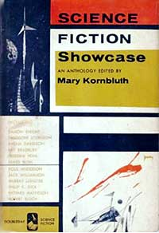

<!-- translated by Yandex Translate -->

# Путь к блогам будущего

Фредерик Пол

## Мэри Корнблат, часть 3: Антология

После [кремации Сирила](/fred-pohl/2010-12-16-mary-kornbluth-part-2-the-death-of-cyril/) я задержался еще на день или два, потому что была еще пара вещей, которые я мог сделать для Корнблатов.  Сирил оставил несколько непродаваемых и незаконченных фрагментов, которые Мэри вытащила для меня.  Я мог видеть, где он разочаровался в них, но я был более изобретательным заговорщиком, чем Сирил.  Кроме того, большинство из них обладали тем замечательным полным владением медиумом, которое Сирил начал развивать.

Я сказал Мэри, что мог бы найти способы превратить большинство из них в реальные истории, и, если бы она захотела, я бы сделал это и продал их, и мы разделили бы деньги.  Она сказала, что ей понравилось, и я отнес их домой. (Один из них, “[Встреча](https://web.archive.org/web/20150920042402/http://www.amazon.com/gp/product/0671656201?ie=UTF8&tag=twtfb-20&linkCode=as2&camp=1789&creative=390957&creativeASIN=0671656201)”, был удостоен премии Хьюго, единственной премии Хьюго, которую когда-либо получал Сирил.)

Но у меня была другая, несколько более масштабная идея. “Как, - спросил я Мэри, - ты хотела бы начать новую карьеру в качестве составителя антологий?”

Этот ей очень понравился.  Это было то, в чем она, возможно, была действительно хороша, потому что она много читала и, казалось, имела определенное мнение — все, что вам нужно, чтобы стать успешным составителем антологий, при условии, что вы сможете найти издателя, который купит вашу книгу.

Но это была моя работа.  Я нанес визит самому достойному из редакторов, Уолтеру И. Брэдбери из Doubleday.  “У него должен получиться довольно хороший снимок", - сказал я ему. “Все рецензенты знают ее имя, и каждому из них понравилась работа ее мужа. Должна быть, по крайней мере, какая—то акция сочувствия и...” Но на этом я замолчала, потому что Брэд на самом деле говорил “да” и “хорошо”, как только услышал это имя.

Презентация книги "[Витрина научной фантастики](https://web.archive.org/web/20150920042402/http://www.amazon.com/gp/product/B000GJZCW6?ie=UTF8&tag=twtfb-20&linkCode=as2&camp=1789&creative=390957&creativeASIN=B000GJZCW6)" прошла так, как и планировалось.  Мэри сделала свой выбор, я помог ей оформить права.  Она вышла в свет в 1959 году.  Было продано несколько экземпляров.  И она исчезла в раю старых антологий, потому что в ней не было достаточно индивидуальности, чтобы заставить читателей захотеть большего.  Мне следовало поработать над этим с Мэри. Но я этого не сделал.

Возникло одно неожиданное осложнение.  Я планировал попросить авторов пожертвовать свои истории бесплатно, чтобы она могла оставить себе большую часть аванса.  Однако Мэри этого не допустила: “Никакой благотворительности.  Я заплачу столько, сколько платит любой другой издатель антологий”.  Так оно и было.

Она разослала чеки всем жертвователям или их агентам.  Поскольку большая часть понравившихся ей историй поступила из моего агентства, она прислала мне чек на самую крупную сумму.  Я надеюсь, у меня хватило порядочности отказаться от комиссионных, когда я отдал сценаристам их долю.

Большинство наиболее опасных лесных пожаров, окружавших Корнблат, теперь благополучно потушены, я вернулся к себе домой, к своей работе и к долгому пути.

* (И, да, долгий путь - это то, что будет дальше, после того, как я это напишу.)*

**Связанные должности:**

- ** Мэри Корнблат,** [** Часть 1**](/fred-pohl/2010-12-09-mary-byers-kornbluth-part-1-a-fan-is-born/), [** Часть 2**](/fred-pohl/2010-12-16-mary-kornbluth-part-2-the-death-of-cyril/)
- [** Кирилл**](/fred-pohl/2009-04-20-cyril/)

### Один комментарий

- [Билл Гудвин](https://web.archive.org/web/20150920042402/http://771715/) говорит:
И еще хорошая обложка с Ричардом Пауэрсом.  Мне нужно найти это для моей коллекции!
[**19 декабря 2010, 12:42 вечера**](/fred-pohl/2010-12-18-mary-kornbluth-part-3-anthologist/)

[WordPress](https://web.archive.org/web/20150920042402/http://wordpress.org/)
[TWTFB2](https://web.archive.org/web/20150920042402/http://dicksmithsoftware.com/)