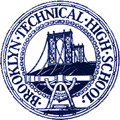

# The Way the Future Blogs

Frederik Pohl

## Early Days at Brooklyn Tech

By Frederik Pohl (’09)

In the spring of 1932, when I was 12 years old, my homeroom teacher explained to us that as we were going to start high school as soon as we came back from summer vacation, we needed to choose the high school we wanted to attend.  I took the list home to study.  As I had no clue in the world what I wanted to do with my life, studying didn’t help much, though there were some hints in the name of one school.  It contained the word *technical, which implied something sort of science-y; and that reverberated well with science fiction.*  (Which had begun to interest me quite a lot.)

And, a consideration not to be sneezed at, it was new, and this was 1932.   The Great Depression was biting hard and all of New York’s existing schools were getting a bit tacky from postponed maintenance.  So I applied, and passed the test.  Summer came and went; and I was a [**Techie**](/posts/2009-08-28-when-i-graduated-from-high-school-after-73-years/).

My parents and family friends were unanimous in letting me know that I had reached an important rung in that long ladder-climb to adulthood.  Indeed there were detectable changes, but I couldn’t consider all of them to be improvements.  As an eighth-grader, I had been able to walk to and from school, maybe twenty minutes each way.  As a high-school freshman, it not only took more than twice as long, it required taking two different El lines in each direction with a change of trains at a station somewhere in Queens even whose name I had never before heard.  (With a fifteen-minute walk to the first subway line.)

Not only that, but the building on Kosciusko Street where Brooklyn Tech’s freshman classes were held was almost indistinguishable from P.S. 9, where I had just left my eighth  grade behind, or indeed from any other 20th-century New York City public school, all built from the same one-design-fits-all  master plan.

The New Building?  Oh, yes, there definitely was a New Building.  They had pictures to prove it — a seven- or eight-story skyscraping giant structure, with a screened-in athletic field on the roof and who knew what wonders of laboratories  and high-tech pedagogical hardware within.  Only thing was, it wasn’t quite finished yet.  It was pretty close.  Indeed a few senior classes were moving in already.  And they showed us pictures of them, too.

As for our own moving-in day?  Next year, they said.  Probably.  Or at least maybe.

So much for the physical environment.  Academically, the Kosciusko Street (pronounced “Kos-Key-Osco,” because hardly any of us were fluent in Polish, or in American history) annex was a little more challenging.  The math was a little harder than it had been.  Shop was only woodworking, but with lathes and drill-presses and other power tools.  And one or two of the subjects were totally unfamiliar — what was Industrial Processes, for instance, and who was the Samuel Mersereau who  not only taught it but was the  author  of  the only [textbook](https://web.archive.org/web/20150915020927/http://books.google.com/books?id=ImwXAAAAYAAJ&ots=Kfpk28YoiM&dq=Samuel%20Mersereau&pg=PP1#v=onepage&q&f=false) for the course?

But then I read the book and discovered that ‘industrial processes’  meant the way things worked — how that black, tarry stuff they pumped out of the ground in Texas became the gasoline that went into the tank of my father’s Buick, how a television receiver, when such a thing might emerge from the pages of Popular Mechanics (remember, this was in 1933), could pluck radio waves from the air and convert them into actual pictures for us to look at.   There were, in short, answers that I wanted to have to questions I had actually asked, and if I had known this book existed I would have begged it from someone long since.

*To be continued.*

**Related posts:**

- [**Let There Be Fandom, Part 2: School Days**](/posts/2009-09-28-let-there-be-fandom-part-2-school-days/)
- [**When I Graduated from High School (After 73 Years)**](/posts/2009-08-28-when-i-graduated-from-high-school-after-73-years/)

### 2 Comments

- Orin says:
I went to a Kosciusko Primary in Australia (Kosciusko also being the continent’s tallest mountain) – pronounced here Kozzie-Ozko
[**December 21, 2010, 7:05 am**](/posts/2010-12-21-early-days-at-brooklyn-tech/)
- Dwight Decker says:
I have a facsimile reprint of the pulp magazine MIRACLE SCIENCE & FANTASY STORIES #2 from 1931, and there’s a full-page ad for the Coyne Electrical School in Chicago. Even then, Coyne was offering instruction in not only electrical and radio but television technology as well. The ad shows a photo captioned, “Student working on television transmitter in Coyne Radio Shop” and there’s an optimistic blurb: “And now Television is here!” I know TV research was going on in the ’20s, but it’s a little astonishing to see things were that far along as early as 1931. Who knew it would take more than fifteen years after that for TV to even begin to penetrate the mass market…?
[**December 21, 2010, 8:38 pm**](/posts/2010-12-21-early-days-at-brooklyn-tech/)

[WordPress](https://web.archive.org/web/20150915020927/http://wordpress.org/)
[TWTFB2](https://web.archive.org/web/20150915020927/http://dicksmithsoftware.com/)