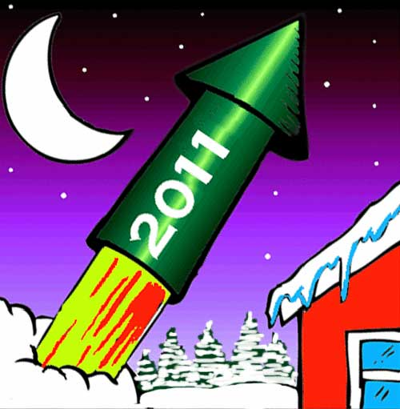

# The Way the Future Blogs

Frederik Pohl

## Happy New Year!

  

### 5 Comments

- [Jerry](https://web.archive.org/web/20170718044807/http://triplanetary.blogspot.com/) says:
Happy new year, Fred.
[**January 1, 2011, 7:18 am**](/fred-pohl/2011-01-01-happy-new-year/)
- Stefan Jones says:
Charlie Stross posted an interesting essay on his blog:
[Reasons to be Cheerful.](https://web.archive.org/web/20170718044807/http://www.antipope.org/charlie/blog-static/2010/12/reasons-to-be-cheerful.html#more)
[**January 1, 2011, 8:26 am**](/fred-pohl/2011-01-01-happy-new-year/)
- Mike Goldberg says:
Happy new year!
[**January 2, 2011, 7:36 am**](/fred-pohl/2011-01-01-happy-new-year/)
- JohnArmstrong says:
Tardy but nonetheless sincere New Year’s wishes, Fred
[**January 5, 2011, 11:55 pm**](/fred-pohl/2011-01-01-happy-new-year/)
- [Dusk Peterson](https://web.archive.org/web/20170718044807/http://duskpeterson.com/) says:
I first read “The Way the Future Was” when I was a teenager in the 1970s, as well as “The Early Pohl” and undoubtedly other books by you that I unaccountably failed to buy (unlike the first two titles). I bought your memoirs new, which is a measure of my devotion to them, since I rarely bought new books when I was a teenager. “The Way the Future Was” currently has a bookmark stuck in it, because I’ve been rereading it this winter, as I do every few years. It and “The Early Pohl” were among my introductions to SF fandom, which helped to steer me in the direction of becoming a fantasy writer. (Not to mention that your “four pages a day” rule was one of the most useful bits of authorship advice I ever read.)
So you can imagine my delight, sir, when I stumbled across this blog today. This gives me the excuse I need to track down your other books to read, which would have been difficult in the pre-Internet days.
[**January 20, 2011, 8:37 am**](/fred-pohl/2011-01-01-happy-new-year/)

[WordPress](https://web.archive.org/web/20170718044807/http://wordpress.org/)
[TWTFB2](https://web.archive.org/web/20170718044807/http://dicksmithsoftware.com/)