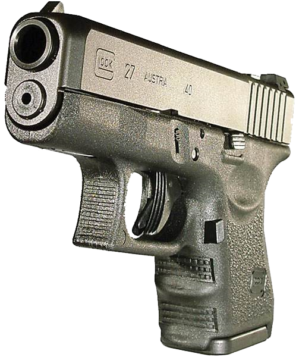

<!-- translated by Yandex Translate -->

# Путь к блогам будущего

Фредерик Пол

## Массовое убийство любезно предоставлено NRA

Каждая газета в Америке, если не во всем мире, освещала расстрел представителя США Габриэль Гиффордс и убийство полудюжины других людей подонком по имени Джаред Лоугнер на первой странице.  Однако. специфический инструмент, который Лоугнер использовал для своей работы по убийству. было менее широко освещено.

Он уложил их всех — и ранил еще дюжину — из своего 9-миллиметрового "Глока".

Что такое "Глок" и для чего он предназначен?  Это скорострельное оружие, вмещающее обойму на 30 пуль, и у него есть только одно реальное применение.  Это очень мало ценно для охоты или для того, чтобы бабушка держала его под подушкой, чтобы отпугивать грабителей.  Для чего это хорошо, так это для убийства групп людей одним стрелком, и ни для чего другого.

По этой причине он был объявлен федеральным законом вне закона до 2004 года, когда срок действия этого закона истек, и наш Конгресс, трусливый, как всегда, когда дело доходит до оскорбления Национальной стрелковой ассоциации, не смог продлить его действие.

Поскольку ни одна обычная винтовка или пистолет не смогли бы убить так много людей так быстро, большая часть нынешних жертв мертва исключительно благодаря работе Национальной стрелковой ассоциации.

Я думаю, самоочевидно, что Джаред Лоунер не особенно хотел убивать, например, Кристину Тейлор Грин.  В конце концов, ей было всего девять лет, и она мало что могла сделать, чтобы обидеть его.  Единственная причина, по которой она оказалась в группе, в которую уволил Лоугнер, заключалась в том, что ее только что избрали в ученический совет третьего класса.  Она хотела посмотреть, как действуют политики.

Я не знаю, сколько читателей этого блога принадлежат к NRA, но если кто-то из них сейчас присутствует, я хотел бы задать вопрос:

Гордитесь ли вы собой сегодня?

### 56 Комментариев

- вайгит говорит:
А?
У меня есть 9-миллиметровый Glock 17 уже почти 20 лет. Я купил его подержанным на стрельбище, где раньше стрелял.  

Когда они были запрещены федеральным законом?  

Я не знаю, почему бабушке менее полезно хранить его под подушкой, чем любой другой пистолет, и чем он отличается от “обычного пистолета или винтовки” своей способностью убивать так много людей так быстро.  

Он стреляет не более быстро, чем любой другой полуавтоматический пистолет.
О чем, черт возьми, ты говоришь?.
[**13 января 2011, 15:05**](/fred-pohl/2011-01-13-mass-murder-courtesy-of-the-nra/)
- [Стефан Джонс](https://web.archive.org/web/20170707103137/http://home.comcast.net/~stefan_jones/tan_jacket_lo.jpg) говорит:
О, чувак, ты только что помочился на третий рельс американской политики!
Ничто и никогда не убедит члена NRA в том, что *любое регулирование любого* огнестрельного оружия, аксессуаров или боеприпасов оправдано.
Бесполезные, бессмысленные массовые убийства рассматриваются только как оправдание для того, чтобы все больше людей носили оружие... везде и постоянно.
Я говорю это не как сторонник NRA, просто как человек, который видел бесчисленные наблюдения, подобные приведенным выше, — неважно, насколько умеренными или разумными они были, — встреченный лавиной язвительных комментариев оппозиции. Совершенно предсказуемые комментарии, которые, учитывая, что это блог, связанный с НФ, будут включать в себя что-то о том, что вооруженные общества являются вежливыми обществами, и что-то вроде * неужели вы ничему не научились в оружейных магазинах Ишера?*
[**13 января 2011, 15:06**](/fred-pohl/2011-01-13-mass-murder-courtesy-of-the-nra/)
- вайгит говорит:
Но, пожалуйста, поскольку я никогда раньше здесь не публиковался, позвольте мне также сказать, что мне нравятся ваши работы с тех пор, как я начал читать научную фантастику в 60-х годах. 
“Человек Плюс(Man Plus)” до сих пор остается одним из моих любимых романов всех времен.
[**13 января 2011, 15:28**](/fred-pohl/2011-01-13-mass-murder-courtesy-of-the-nra/)
- Грего говорит:
Я горжусь своим правом гражданина США хранить и носить оружие.  Я горжусь нашей Конституцией и Биллем о правах, по крайней мере теми, которые остались.  Я горжусь тем, что могу не обращать внимания на недавнюю трагедию, чтобы поддержать то, что, по моему мнению, является высшим благом.  И все же я не являюсь членом NRA.
[**13 января 2011, 15:38 вечера**](/fred-pohl/2011-01-13-mass-murder-courtesy-of-the-nra/)
- [Поль Робишо](https://web.archive.org/web/20170707103137/http://www.robichaux.net/blog) говорит:
Позвольте мне внести ясность: стрельба в Тасконе была бессовестной. Я опечален и испытываю отвращение к потере жизни и здоровья столь многих людей от рук, в буквальном смысле этого слова, сумасшедшего.
Сказав это, я боюсь, что в этом посте содержится ужасное количество дезинформации.
Единственным пистолетом Glock, который способен вести скорострельную стрельбу, то есть выпускать более одной пули за одно нажатие на спусковой крючок, является Glock 18. Он редок; в США он нелегален, и его детали не взаимозаменяемы с деталями его собратьев, Glock 17 и 19.
Glock 18 запрещен Законом о защите владельцев огнестрельного оружия (FOPA) 1986 года, который внес поправки в Закон о контроле над огнестрельным оружием 1968 года. Конечным результатом этих двух законопроектов является запрет частной собственности на любое полностью автоматическое оружие, произведенное после 1986 года, и жесткое регулирование частной собственности на полностью автоматическое оружие, произведенное до этой даты. 
Отмена в 2004 году так называемого запрета на штурмовое оружие не имела никакого отношения к этому делу, поскольку Glock 18 вообще не был запрещен запретом на штурмовое оружие 1994 года.
Оружие, использованное аризонским стрелком, в буквальном смысле ничем не отличается от оружия, которое носят десятки тысяч полицейских США и которым владеют сотни тысяч (если не миллионы) законопослушных частных граждан. 
Вместо того чтобы ругать NRA, вы вполне могли бы спросить, почему никто – родители, чиновники общественного колледжа Пима, сотрудники правоохранительных органов, которые, по–видимому, неоднократно контактировали со стрелком, - не предпринял никаких действий, когда стало ясно, что он психически болен. Вот в чем настоящий скандал: бездействие тех, кто знал его лучше всех и мог вмешаться до того, как произошла эта трагедия.
[**13 января 2011, 15:44**](/fred-pohl/2011-01-13-mass-murder-courtesy-of-the-nra/)
- Уолт говорит:
"Глоки" - популярное полицейское оружие, и обычно они стреляют в людей только по одному за раз.
[**13 января 2011, 17:19 вечера**](/fred-pohl/2011-01-13-mass-murder-courtesy-of-the-nra/)
- Броуди говорит:
Оружие не убивает людей, люди убивают людей.
Но без оружия это гораздо труднее.  Оружие, подобное "Глоку", не должно быть доступно никому без уважительной причины.
Никому не нужен такой пистолет для повседневной жизни, и доступность такого оружия делает вашу страну менее безопасной, а не более защищенной.
Преступления с применением огнестрельного оружия будут существовать всегда, но вы можете уменьшить их количество, сократив количество оружия.
Сумасшедшая работа гораздо менее опасна без оружия.
[**13 января 2011, 18:13 вечера**](/fred-pohl/2011-01-13-mass-murder-courtesy-of-the-nra/)
- Крис говорит:
Знаете ли вы, что практически в любом пистолете, заряженном магазином, можно использовать удлиненную обойму и что они существуют для большинства из них?  Сам по себе пистолет не является чем-то особенным, просто стандартный пистолет.  Ваше использование термина "Глок" в качестве конкретного пистолета демонстрирует довольно основательное невежество.  Это все равно что сказать, что кого-то сбил "Форд". Ваше использование фразы “Обычная винтовка или пистолет” совершенно бесполезно, потому что вы можете изменить определение понятия "Обычная", чтобы оно означало именно то, что соответствует вашим требованиям.
[**13 января 2011, 18:32 вечера**](/fred-pohl/2011-01-13-mass-murder-courtesy-of-the-nra/)
- [Джмур](https://web.archive.org/web/20170707103137/http://www.ricketyclick.com/blog) говорит:
Несколько моментов:
“Быстрый огонь” в значительной степени бессмысленен. Глоки - это полуавтоматические пистолеты, или самозарядные устройства, что просто означает, что вы производите один выстрел при каждом нажатии на спусковой крючок, в отличие от полностью автоматических пистолетов или пулеметов, которые стреляют непрерывно, пока вы не отпустите спусковой крючок. Медленной альтернативой является затвор или дульный заряд, которые требуют вручную досылать по одному патрону в патронник для каждого произведенного выстрела. 
Любой полуавтоматический пистолет или револьвер выстрелит так же быстро, как вы нажмете на спусковой крючок.
"Глок" не был запрещен федеральным законом. Были магазины большой емкости. 
Замена магазина может быть выполнена за секунду. Я научился делать это менее чем за шесть часов беспорядочной практики в течение недели или двух, и я далек от грациозности или спортивного телосложения.
Посмотрите несколько видеороликов Джерри Микулика; он продемонстрировал, как стреляет из револьвера шестью патронами, перезаряжает и выпускает еще шесть пуль в цель чуть менее чем за три секунды.  
Магазины с большими капсюлями - небольшое удобство, но они не сильно увеличивают убойную способность пистолета, что бы это, черт возьми, ни значило.
Теперь давайте посмотрим на самую важную вещь - на людей.
NRA не финансируется производителями оружия. Он финансируется за счет членских взносов и пожертвований законопослушных владельцев оружия. (Я не один из них.)
В США десятки миллионов законопослушных владельцев оружия, и мы владеем сотнями миллионов единиц огнестрельного оружия. Называть число тех из нас, кто никогда не стрелял в другого человека, “подавляющим большинством” - значит сильно преувеличивать; на самом деле это делают всего несколько сотых процента. Иметь оружие в своем доме безопаснее, чем в плавательном бассейне. По сравнению со смертями, вызванными автомобилями (и исключая болезни и старость), все остальное в значительной степени уступает по уровню шума. Ознакомьтесь с онлайн-базой данных WISQARS Центров по контролю заболеваний.
Владельцы скрытого ношения имеют лучшие показатели безопасности, чем сотрудники полиции; они могут больше потерять из-за ошибки.
Увеличение числа штатов, выдающих лицензии на скрытое ношение оружия за последние двадцать лет, совпало со снижением числа насильственных преступлений. Существует (очень приблизительная) положительная корреляция между строгостью законов об оружии в данной юрисдикции США и уровнем насильственных преступлений. Невозможно предположить причину и следствие, но, по крайней мере, вооружение граждан не приведет к кровавой бойне в Додж-Сити, чему всегда предсказывали, но никогда не сбывалось.
Я собираюсь дать вам одну ссылку: [Вооруженный гражданин](https://web.archive.org/web/20170707103137/http://thearmedcitizen.com/wp/). Этот проект сканирует новостные репортажи на предмет сообщений о вооруженной самообороне граждан. За этим стоит понаблюдать в течение недели или двух. Обычно их бывает три или четыре каждый чертов день. Оружие защищает законопослушных. Это инструменты, а не талисманы зла.
Теперь перейдем к деталям перестрелки с Лоунером. Я скажу только две вещи:
У одного из парней, убивших Лоугнера, было разрешение на скрытое ношение оружия. В тот день он был вооружен. Когда другие люди убежали, этот парень двинулся на звук выстрела. Он оставался достаточно хладнокровным, чтобы не выхватывать оружие и не стрелять в толпе, но его оружие придавало ему уверенности в действиях, зная, что он сможет воспользоваться им, если понадобится.
Отец Кристины Грин, девушки, убитой Лоугнером, сказал в нескольких разных интервью, что подобные поступки являются неизбежной платой за жизнь в свободном обществе, но что он предпочитает это альтернативе. Прочтите это еще раз: он предпочитает убийство своей любимой дочери сумасшедшим, чем воспитывать ее в условиях тирании.
Пожалуйста, не стесняйтесь обвинять любую другую семью в Америке в укрывательстве пособников преступлений Лоугнера, хотя большинство из нас сами никогда не совершали насильственных преступлений, хотя, если позволяет закон и требуют обстоятельства, мы бы использовали наше оружие, чтобы защитить таких людей, как вы, которые работают над тем, чтобы оставить всех нас беззащитными перед преступностью и тирания. Но, пожалуйста, делайте это, основываясь на фактах, а не на слепых невежественных предрассудках. 
И будьте любезны обвинять нас в лицо, а не через бумажные маски, как NRA.
Ладно, возвращаюсь к тебе, Фред.
[**13 января 2011, 18:41 вечера**](/fred-pohl/2011-01-13-mass-murder-courtesy-of-the-nra/)
- [Джмур](https://web.archive.org/web/20170707103137/http://www.ricketyclick.com/blog) говорит:
Да, и, кстати:
Да, я горжусь тем, что являюсь вооруженным американцем. Я считаю это своим долгом так же, как и правом.
[**13 января 2011, 18:46 вечера**](/fred-pohl/2011-01-13-mass-murder-courtesy-of-the-nra/)
- Крис говорит:
Привет, Фред,
Я не владелец оружия и вообще большой фэн вашего блога, но большинство ваших аргументов в этом посте кажутся довольно слабыми.
Во-первых, оружие, которое лучше всего подходит для убийства людей, - это именно то оружие, которое лучше всего подходит для самообороны.  Вот почему так много полицейских и специалистов по безопасности носят именно такой вид оружия.  Какой пистолет лучше было бы держать в руках бабушке, если бы на нее напали захватчики дома?

Во-вторых, перекладывать вину за то, что сделал Лоунер, на кого-либо другого просто нечестно.  Есть много ответственных владельцев оружия, и легализовать для них владение оружием по своему выбору - это не то же самое, что убивать людей.  Если бы политик отменил гипотетический запрет на кухонные ножи, понес бы он тогда ответственность за то, что один из них был использован при убийстве?  Ответственны ли те, кто отменил сухой закон, за каждую смерть от чрезмерного употребления алкоголя или цирроза печени?
[**13 января 2011, 19:01 вечера**](/fred-pohl/2011-01-13-mass-murder-courtesy-of-the-nra/)
- Джей Эллисон говорит:
Да, конечно, виноват инструмент.  Есть исламская поговорка о том, что бегущий человек может перерезать тысячу глоток за ночь. Должны ли мы также объявить вне закона ножи Victorinox?  
Не могли бы вы дать определение "обычной’ винтовке или пистолету, пока вы этим занимаетесь?
“Я думаю, самоочевидно, что Джаред Лоугнер не особенно хотел убивать, например, Кристину Тейлор Грин”.
  *Я* думаю, самоочевидно, что этот неудачник не особенно хотел убивать, например, никого из людей, которых он убил, за исключением, возможно, конгрессвумен, но он действительно хотел убить. &lt;- это точка. 
Он пошел туда убивать людей, а она - человек.  По-моему, с вашей стороны это звучит как непоследовательность.  
Мистер Пол, чем больше я узнаю о вас изнутри, тем больше сомневаюсь в том, что до сих пор с удовольствием тратил деньги королевства на потребление вашего продукта.  Возможно, мне пора остановиться.
[**13 января 2011, 10:08 вечера**](/fred-pohl/2011-01-13-mass-murder-courtesy-of-the-nra/)
- волкодлак говорит:
К сожалению, мистер Пол, ваши знания об огнестрельном оружии немного не соответствуют фактам.  
“Это очень мало ценно для охоты или для того, чтобы бабушка держала его под подушкой, чтобы отпугивать грабителей”. 
На самом деле, "что-нибудь для бабушки, чтобы она держала у своей кровати для домашней обороны" - это то, для чего вполне подходит среднестатистический 9-миллиметровый пистолет.  9-миллиметровый патрон, пожалуй, самый распространенный пистолетный патрон в мире, поскольку доступны десятки, если не сотни моделей 9-миллиметровых пистолетов.  Glock 19, который использовался рассматриваемым бешеным червем, мало чем отличается от любого другого.  Он не стреляет ни быстрее, ни точнее, и при попадании не становится более смертоносным.  
“По этой причине это было запрещено федеральным законом до 2004 года”.
Нет, это было не так.  Запрет на "штурмовое оружие" 1994 года не объявлял Glock 19 вне закона.  Закон действительно запрещал производство новых магазинов большой емкости для полуавтоматических пистолетов, но магазины "до запрета" все еще были легкодоступны, хотя и немного дороже.  
Пожалуйста, найдите минутку, чтобы провести небольшое исследование в оригиналах документов.  Вы обнаружите, что вышесказанное вполне точно.
[**13 января 2011, 10:17 вечера**](/fred-pohl/2011-01-13-mass-murder-courtesy-of-the-nra/)
- Крис говорит:
Я люблю вас, вашу писательскую деятельность и, по большей части, вашу политику. Я считаю себя в значительной степени умеренным леваком (однако некоторым умеренным не нравится моя довольно радикальная антикорпоративная позиция, и, если честно, я сторонник оружия). Однако здесь вы допускаете пару фактических ошибок, одна из которых влияет на вашу аргументацию. Я предполагаю, что этот предмет вас не очень интересует, и на данный момент у вас не было возможности изучить его, чтобы исправить это.
"Глок" и подобные ему полуавтоматические пистолеты никогда не были запрещены законом в США. Вы путаете пистолет с так называемым запретом на “штурмовую винтовку”, срок действия которого истек, но который не действовал на пистолеты, когда он был в силе.
Если говорить более тривиально, то емкость магазина пистолетов Glock колеблется от 6 (для .45 Glock 36) до 33 (для 9-мм Glock 18; этот патрон потенциально может быть увеличен до 35 патронов, но это очень необычно), но чаще от 13 до 17, в основном калибра 9 мм. Все модели также оснащены магазинами емкостью 10 патронов или меньше для тех штатов, где действуют законодательные ограничения на емкость магазина.
[** 14 января 2011 года, 12:20 утра**](/fred-pohl/2011-01-13-mass-murder-courtesy-of-the-nra/)
- [Крис Таус](https://web.archive.org/web/20170707103137/http://www.squidoo.com/getting-into-the-yoga-community) говорит:
Обвинение, нарушение или осквернение Конституции - это не выход. Тщательно расследуйте этот вопрос, прежде чем принимать какие-либо меры… не наказывайте многих за действия немногих.
[** 14 января 2011 года, 1:43 утра**](/fred-pohl/2011-01-13-mass-murder-courtesy-of-the-nra/)
- нурблз говорит:
Этот комментарий относится только к комментарию “так много, так быстро” выше…
Я не состою в NRA, но мне любопытно, чем же "Глок" такой особенный.  Возможно, это “отличный” пистолет, но я считаю, что "магнумы" калибра 9 мм и .357 уже давно существуют с магазинами, вмещающими до 20 патронов.  И если бы у парня было всего 6 или 7 патронов, он мог бы просто взять с собой два пистолета, по одному в каждую руку.  В такой плотной толпе, в какой он стрелял, было трудно промахнуться.
И не то чтобы это ей помогло, но у застреленной конгрессвумен, как сообщается, тоже был "Глок".  Очевидно, все демократические политики не против подобных вещей.
[**14 января 2011 года, 5:52 утра**](/fred-pohl/2011-01-13-mass-murder-courtesy-of-the-nra/)
- [Роберт Новолл](https://web.archive.org/web/20170707103137/http://www.robertnowall.com/) говорит:
Почему “решения” “проблемы оружия” всегда предполагают изъятие оружия из рук законопослушных граждан?
[** 14 января 2011 года, 10:42 утра**](/fred-pohl/2011-01-13-mass-murder-courtesy-of-the-nra/)
- Вальдемар говорит:
Фред, твои аргументы кажутся мне совершенно логичными. К сожалению, я британец. Другие западные страны признают, что нельзя вести безумную, воспаленную политическую риторику и предоставлять оружие в распоряжение каждого психа. Американцы, похоже, живут в раю для дураков в этом вопросе. Идея о том, что больше оружия = больше безопасности, абсурдна. Посмотрите на все страны Третьего мира, где уровень убийств ужасающий – они наводнены оружием. США идут тем же путем. 
Отцы-основатели вашей республики, очевидно, думали о праве носить оружие, из которого можно сделать максимум два выстрела перед перезарядкой. Принимать рациональные меры 18-го века и интерпретировать это как священный долг каждой семьи иметь автоматическое оружие не имеет смысла. Но я знаю, что все это просто болтовня на ветру. Ты прав, но в этом тебе не победить. 
Мне действительно нравится этот блог, и ваша художественная литература превосходна. Спасибо вам.
[** 14 января 2011 года, 11:18 утра**](/fred-pohl/2011-01-13-mass-murder-courtesy-of-the-nra/)
- [Джек Ди Стивен](https://web.archive.org/web/20170707103137/http://jackdeighton.co.uk/) говорит:
Говоря как человек, живущий в стране, где владение оружием довольно строго регулируется (и перестрелки происходят не каждый день) – и которой, кстати, не так заметно управляют тираны, – концепция “проблемы с оружием” кажется странной. По определению, любой, кто носит оружие на улице – скрытое или нет – не был бы законопослушным.  
”Очевидно, все демократические политики не против подобных вещей". Это предложение в письменном виде означает: “Очевидно, ни один демократический политик не выступает против подобных вещей”.
[**14 января 2011, 14:07 вечера**](/fred-pohl/2011-01-13-mass-murder-courtesy-of-the-nra/)
- Ларс говорит:
"...он предпочитает убийство своей любимой дочери сумасшедшим, чем воспитывать ее в условиях тирании".
Я хотел бы услышать объяснение того, почему мистер Грин почувствовал, что стоит перед таким суровым выбором. Возможно, кто-нибудь из тех, кто размещал здесь посты, сможет объяснить, почему нет золотой середины между тем, чтобы оказаться под пятой диктатора, и ежедневным риском быть застреленным за не более серьезное преступление, чем нахождение в неподходящем месте в неподходящее время.
[**14 января 2011, 15:49**](/fred-pohl/2011-01-13-mass-murder-courtesy-of-the-nra/)
- Кен говорит:
Я не владелец оружия и не в курсе последних законов, но если оружейный магазин, который продал ему пистолет, счел, что он ведет себя странно, даже несмотря на то, что проверка его биографии была чистой, почему они должны были продать ему пистолет? Разве они не могли позвонить в полицию и сказать, что этому парню нужна оценка психического здоровья, прежде чем мы продадим ему ее? Кроме того, правда ли, что на оружейных выставках любой желающий может купить любое оружие прямо на месте, вообще без чека? Если так, то это должно прекратиться. У меня нет проблем с тем, что законопослушные граждане владеют оружием и носят его при себе, но еще несколько блокпостов и контрольно-пропускных пунктов между оружием и психами, похоже, не проблема.
[**14 января 2011, 16:32**](/fred-pohl/2011-01-13-mass-murder-courtesy-of-the-nra/)
- [Чак Кукер](https://web.archive.org/web/20170707103137/http://www.ckent.org/) говорит:
Фред, я прочитал многие из твоих работ, и они мне очень понравились. Мне грустно говорить это.
Я являюсь пожизненным членом NRA и торговцем оружием. Я продаю подобные инструменты людям, которые проходят федеральную проверку и проверку штата. В Висконсине я также должен заплатить штату 13 долларов за звонок на их “Горячую линию по оружию”, которая дублирует систему электронной проверки ФБР, и заставить моего клиента ждать 48 часов, прежде чем забрать свой инструмент свободы.
В своем первом абзаце вы совершаете ошибку, обвиняя неодушевленный предмет в действиях сумасшедшего.
Пистолет - это инструмент. Если бы этот подонок, которого слишком часто называли по имени, использовал для своей расправы отбойный молоток, вы бы призвали к “контролю над молотком”? Конечно, нет.
"Глок" - надежный инструмент для самообороны. Вторая поправка не касается охоты – такой умный человек, как вы, должен быть в состоянии это понять.
У меня есть два "Глока", 10-миллиметровая модель 20 и 9-миллиметровая модель 19. Когда Висконсин присоединится к другим штатам, которые незаконно не запрещают своим гражданам скрытое ношение оружия, 9-миллиметровый пистолет станет моим любимым. 10-миллиметровый лежит рядом с моей подушкой, готовый на тот маловероятный случай, если в мой дом вторгнутся.
Ни одно оружие никогда не приглашало меня отправиться на охоту за убийствами. 
Вы действительно хотите жить в мире, где вам нужно доказывать свое здравомыслие, чтобы защитить себя? 
Вам действительно следует проверить свои факты, прежде чем делать подобные заявления о предмете, который вы, очевидно, не исследовали.

Любая хорошая охотничья винтовка могла убить людей так быстро и окончательно, как может любой магазинной подачей патронов пистолет из когда-либо созданных. Глок-это пугало, потому что некоторые плохо информированных законодателей еще в 1980-х решили, что это был “пластмассовый пистолет”, что “не может быть найден с помощью металлоискателей” – оба неправы заявления, которые похитили путем либеральных СМИ как звуковой фрагмент будет повторяться объявление-Инфинитум. Этот размер пистолета были созданы, чтобы позволить людям, чтобы соответствовать новому скрытого ношения законы то принимаются через вменяемой части Америки.
Свобода имеет свою цену – часть той цене, надо признать, что в мире есть злые люди в нем, что никогда не может быть защищен от мира без разрушения этого свободу. Если вы хотите жить в государстве, которое запрещает всякую опасность, я рекомендую вам попробовать Великобритании – они ушли так далеко, чтобы запретить самооборону, чтобы преступник не пострадал.
[**Январь 14, 2011, 4:44 часа дня**](/fred-pohl/2011-01-13-mass-murder-courtesy-of-the-nra/)
- [Charolette Neizer](https://web.archive.org/web/20170707103137/http://guncleaningkit.us/how_do_i_clean_my_firearm.htm) говорит:
Для каждого человека, который спорит дополнительные инвазивные пистолет законов в свете трагедии в Тусоне, я мог бы продлить этот скудный лакомый кусок: если оружие убивает людей, тогда карандаши неправильно пишут слова, автомобили ездят пьяные, а ложки делают людей толстая ! Помните: вид лица, ответственного за свои поступки, а не неодушевленные objectthey решают злоупотребить.
[**Январь 14, 2011, 5:06 часов**](/fred-pohl/2011-01-13-mass-murder-courtesy-of-the-nra/)
- Кэт говорит, что:
Вы знаете, есть Кеннесо, штат Джорджия, где это запрещено законом не владею оружием.  У них было только одно убийство в этом городе, так как закон миновал, и этот человек был бродягой.
[**Январь 14, 2011, 6:06 часов**](/fred-pohl/2011-01-13-mass-murder-courtesy-of-the-nra/)
- Стив говорит Oerkfitz:
Похоже, вы открыли банку с червями. Многие люди просто любят своих орудий. Позволяет законопослушным гражданам иметь оружие, чтобы менять не собираюсь. Независимо от того, сколько Пэйлин и ее илк изрыгать об этом. Ни администрация собирается предпринять по этому вопросу. Недостатком является то, что это делает его легче для преступников, чтобы получить оружие. Большинство орудий, используемых преступниками получены от взлома приложений и кражи из законным владельцам. Была даже группа на восточном побережье, которые были следующие автомобили с НРА наклейки на бампер, чтобы выяснить, где они жили. Ждала, пока никого не было дома и проник в дом. Выгоднее и проще, чем телевизоры и музыкальные центры.
[**Январь 14, 2011, 7:02 часов**](/fred-pohl/2011-01-13-mass-murder-courtesy-of-the-nra/)
- Майлз Арчер говорит::
Если я правильно помню, обсуждение этого пистолета было то, что он был в основном из пластика и поэтому не может вызвать металлоискателей. Нет ничего более смертоносного о пистолете, чем любые другие. Множество мелких орудий, как .22, было бы более смертоносным для бедных конгрессмен убит выстрелом в голову.
[**Январь 14, 2011, 7:21 вечера**](/fred-pohl/2011-01-13-mass-murder-courtesy-of-the-nra/)
- Чарли Мартин говорит:
Конечно, ребята.  Заработай стать причиной шизофрении.
[**Январь 14, 2011, 9:22 часов**](/fred-pohl/2011-01-13-mass-murder-courtesy-of-the-nra/)
- Говорит Перри :
Понятие, что запрет на оружие волшебным образом снизить уровень преступности является одним из тех “простые, очевидные, и неправильных” идей, которые, кажется, распространено в нашем обществе. Как и понятие, что запрет спиртных напитков позволит снизить социальные проблемы (см. запрещение), идея о том, что запрет на наркотики позволит снизить социальные проблемы (см. лекарства запрет), идея о том, что “алчный спекулянт” может быть прекращена путем навязывания регулирование цен (что всегда вызывает перебои и т. д.), идею о запрете оружия-это нечто простое и очевидное решение, что десятилетний ребенок мог бы придумать и еще что бы только вызвать проблемы гораздо хуже чем у нас.
Опять же, очень многие из нас попадаются на такие понятия, что интересно, за судьбы человечества. Самое простое и очевидное “если люди бедны, почему мы не можем просто взять деньги у богатых людей и дать им это?” привели к гибели почти 100 миллионов человек в 20-м веке, и все же, что и десятки других неудачных экспериментов не удалось столкнуть людей с поверхностным, неполным и “очевидные” решения для человечества бед…
[**Январь 14, 2011 9:57 вечера**](/fred-pohl/2011-01-13-mass-murder-courtesy-of-the-nra/)
- Джим Фланаган говорит:
Ну, Фред, ты сделал это. Вы узнали, почему никто не может противостоять НРА и оружейное лобби. Ваше утверждение не является юридически обязательным документом и имеет кубиками, и рассеченные. Они выскочили из ниоткуда и сделал все, но ответить на ваши основные вопросы: 
Почему 30 обойм права (я знаю, они не ответят, они скажут, что это не клип или он содержит 31 или 29 патронов)
И они горды собой ( опять же, они скажут, что они защищают Конституцию, или это было потому, что НРА, что-то псих не убил 40 человек, или всему виной закон, или Хичи получилось)
Есть несколько причин для людей, чтобы владеть огнестрельным оружием. Я не завидую многие из моих соседей, которые охотятся, в некоторых случаях как важную часть их рациона. Сосед и друг-оружейника, который сможет построить кремневое ружье с нуля. Я также понимаю, почему люди должны иметь возможность держать оружие в доме или магазине для защиты. Владение полуавтоматическим пистолетом с 30 снят клип, это просто глупо.
[**Январь 14, 2011, 10:16 часов**](/fred-pohl/2011-01-13-mass-murder-courtesy-of-the-nra/)
- [Chookie](https://web.archive.org/web/20170707103137/http://chookiesbackyard.blogspot.com/) говорит:
Австралийский Конституции и основополагающих мифов отличаются от таковых в США, и у нас всегда был жесткий контроль на пистолеты (следствие из колонии осужденного).  Тем не менее наше общество базируется на Пионерском мифы и иммиграции, а также британский колониальный период, так что мы не совсем непохожи.  
После страшной резни в 1996 году премьер-министр от Консервативной партии принесли более строгие законы по контролю над оружием.  У нас не было резни пор.  Кроме того наши орудия убийства и даже самоубийства ставки снизились (см. [http://www.crikey.com.au/2008/09/09/what-john-howard-could-teach-the-us-about-gun-control/](https://web.archive.org/web/20170707103137/http://www.crikey.com.au/2008/09/09/what-john-howard-could-teach-the-us-about-gun-control/), написанной уважаемым исследователем от одного из лучших наших университетов).  И не знаем мы, кстати, живем под тиранией здесь.
Теперь я не думаю, что твой отвратительный смертности пистолет будет решена ** полностью за счет более разумного подхода к владению оружием.  Но дурацкими замечаниями типа “не оружие убивает людей, людей убивают люди” должны быть обжаловано: что делает ваш смертность пистолет 104 раз у нас?  Если это не тот легкий доступ к огнестрельному оружию, то у вас есть какое-то огромное моральное поражение происходит.  Что это?
[**Январь 15, 2011, 3:07 утра**](/fred-pohl/2011-01-13-mass-murder-courtesy-of-the-nra/)
- Джозеф Крокетт рассказывает:
Уважаемый Г-Н Пол,
Я полностью согласен с мнением вашего поста. И меры в ответ довольно типичный пример того, что я видел по всему интернету, начиная от аргументировано ядовитые.
Раньше я довольно стойко анти-пистолет (я всегда поддерживал свободное владение оружием для спортсменов). Мое мнение поменялось в администрации Буша, как Machavellian происки Чейни сделал меня опасаются, что правительство впервые в моей жизни. Я разработал немного здоровой паранойи.
Это, как говорится, есть ограничения, которые я вижу, как здравый смысл. Никакого оружия для преступников, период ожидания и проверок, кажется, нет-это точно. Я также не вижу необходимости в частное владение автоматами и полностью автоматическое оружие или все, что хранится более десяти выстрелов. Я не думаю, что это зашло слишком далеко, чтобы ожидать рук пистолет, чтобы продемонстрировать, что они могут спокойно обращаться с оружием, что они владеют, т. е. попадаешь туда, куда они целятся и хранить его безопасно.
Я также должен сказать, что открыть выполнять законы, мне становится очень неуютно (я никогда, никогда не пойдет в бар в Теннесси!) и я не чувствовал бы себя безопаснее, видя частное лицо разгуливает вооруженный на публичном мероприятии. Пару лет назад, Пенсильвания футбол мама с скрывали разрешение отличился, открыто носить пистолет для игры с ее сыном. Она была застрелена мужем спустя год.
Но трагедий, как это сделать, дают возможность изучить нашу систему и выяснить, как это удалось. Его недостаточным сказать, что такое просто случается или что их стоимость “Свобода”. Мы должны знать, как кто-то так явно неустойчив был в состоянии получить свои руки на оружие, и с такими последствиями devasting.
Нам обязательно нужен 2-ой поправка, на мой взгляд, чтобы защитить нас от нашего правительства (государственные и федеральные), больше, чем друг друга. Создатели включены 2-я поправка (с упорядоченной формулировка милиции) для защиты государства от удаленного федеральное государственное которым они не доверяют; в основном из-за их опыта с англичанами. Они, конечно, не мог представить себе мир, где даже один человек может потенциально убить сотни с одним оружием.
Я понимаю концепцию скользкий путь. Но правда заключается в том, что мы делаем ограничить свободу слова и вероисповедания. Ты не можешь пойти на городскую площадь и начать кричать, что мы должны убить всех богатых людей и отбирать у них вещи; есть ли у вас намерение или нет. Если твоя религия проповедует многоженство или секс с несовершеннолетними ты не можешь сделать что либо. Эти “ограничения прав” были по праву отстоял в судах, без конституционных изменений.
По сути, у нас есть все права, вплоть до момента, когда они начинают ущемлять права других людей. Конституция обеспечивает “внутренний покой” и Декларацию независимости, которая является одним из четырех документов, которые образуют органические законы США гарантирует “жизнь, свободу и стремление к счастью”. Это невозможно, если мы можем ходить по улице без страха быть расстрелянным.

Я не думаю, что большинство владельцев оружия считают, что разгуливать с М-16 и обрезами по барам, школам и городским улицам - это хорошая идея или фундаментальное право. Я не думаю, что это та страна, которую они представляют для себя и своих детей. Я знаю, это кажется гиперболичным, но я говорю это, чтобы подчеркнуть тот факт, что нам нужно обсудить этот сложный вопрос и отбросить абсолютистские концепции. Ответственные ВЛАДЕЛЬЦЫ оружия (а не NRA, которая является инструментом производителей оружия, а не низовой организацией, заинтересованной в защите прав граждан) должны найти решения, позволяющие предотвратить повторение подобных вещей.
С уважением,
Джозеф Крокетт
[** 15 января 2011 года, 5:06 утра**](/fred-pohl/2011-01-13-mass-murder-courtesy-of-the-nra/)
- Пэт говорит:
Роберт Новолл, считаете ли вы, что американцы просто от природы в четыре раза более склонны к убийствам, чем граждане Великобритании, Нидерландов, Норвегии, Германии и Ирландии?
[** 15 января 2011 года, 5:11 утра**](/fred-pohl/2011-01-13-mass-murder-courtesy-of-the-nra/)
- [Билл Гудвин](https://web.archive.org/web/20170707103137/http://771715/) говорит:
Несмотря на точность, кажется, что о деревьях ведется много споров, и очень мало - о лесу, если вы понимаете, что я имею в виду.
Непроверенных предположений предостаточно с обеих сторон этого разговора. Ты не можешь убежать от that...it это Теория Геделя поднимает свою уродливую голову.  Но мы часто продолжаем кричать даже после того, как становится ясно, что мы на разных страницах.
Одно из наиболее распространенных непроверенных предположений заключается в том, что существует четкое различие между законопослушными гражданами и “преступниками”. Другое дело, что статистика - это итог.
Но каков же итог?  Смысл в том, чтобы сделать нас более безопасными или здравомыслящими? Когда мы потворствуем беспрепятственному обмену орудиями убийства между “хорошими” людьми, можем ли мы создать атмосферу, в которой убийство с большей вероятностью придет в голову “плохим” людям?
С другой стороны, если мы ограничим свободы, возможно, мы сделаем людей более раздражительными и агрессивными.
С другой стороны – может быть, люди, которые так сильно возражают против контроля над оружием, просто параноики, которым мы не хотим владеть оружием.
И так далее.  Не то чтобы на это был ответ.  Если глобальное потепление представляет собой существенную угрозу благополучию будущих поколений, то, возможно, самое гуманное - это раздать каждому гражданину бесплатное оружие в возрасте десяти лет и установить автоматы с боеприпасами на каждом углу улицы.  Население резко сокращается, и планета излечивается.  Одно можно сказать наверняка: вам потребовалось бы чертовски много времени, чтобы вернуть себе такие свободы.
Мое мнение?  Что ж, я уверен, что было бы плохой идеей вооружать того шимпанзе, который покалечил друга своего хозяина…поэтому я вынужден немного отказаться от идеи побудить 300 миллионов его ближайших родственников подойти к прилавку и купить.
И было бы довольно абсурдно сказать: “Если вы объявите изнасилование незаконным, то насильниками будут только преступники”, так почему же мы продолжаем слышать это об оружии?
[** 15 января 2011 года, 6:02 утра**](/fred-pohl/2011-01-13-mass-murder-courtesy-of-the-nra/)
- волкодлак говорит:
спросил Джим Фланаган:
“Почему 30 обойм для патронов легальны?”
Почему бы и нет?  Не то чтобы это что-то изменило, если бы это было не так.  
Стандартный магазин для Glock 19 вмещает 15 патронов.  Таким образом, 1 магазин “большой емкости” равен 2 стандартным магазинам.  Знаете ли вы, как быстро опытный стрелок может менять магазины, особенно если он не заботится о том, чтобы поймать пустой?  
“И гордятся ли они собой?”
О паразитах, которые незаконно перевозили и убили 6 и ранили 13 человек в результате спланированного, преднамеренного нападения?  Нет.  Пусть он сгниет в тюрьме, а потом сгорит в аду.  
О вооруженном гражданине, который имел при себе оружие на законных основаниях и побежал посмотреть, может ли он помочь остановить стрелка, и (как большинство обученных стрелков) не вытащил свое оружие, потому что еще не был уверен, нужно ли это делать... Да, я горжусь им.  Браво, Зулу, сэр.
[** 15 января 2011 года, 7:28 утра**](/fred-pohl/2011-01-13-mass-murder-courtesy-of-the-nra/)
- [Райк Э. Спур](https://web.archive.org/web/20170707103137/http://www.grandcentralarena.com/) говорит:
Что ж, мистер Пол, я не являюсь членом NRA (хотя я знаю многих таких, учитывая многие круги моего общения), и я не буду ни подтверждать, ни отрицать, что у меня на территории есть какое-либо огнестрельное оружие.
Однако (А) оружие, используемое в этих перестрелках, является не более “скорострельным”, чем любое другое. (Б) Стрелявший был сумасшедшим; сумасшедшие убили много людей из другого оружия. (C) Несмотря на все желание обвинить оружие в стольких убийствах, факт заключается в том, что оружие также является единственным практическим средством уравнивания для маленького, слабого человека с большим, сильным человеком. Двухметровый хулиган с пистолетом ненамного опаснее полутораметровой бабушки с таким же пистолетом. Одна из известных мне восторженных обладательниц оружия - очень милая мать троих детей, довольно маленькая рыжеволосая женщина, которая не смогла бы отбиться даже от мужчины среднего роста в физическом противостоянии; у нее есть лицензия на скрытое ношение оружия, и она делает это, потому что тогда она может пройти довольно много везде, где она захочет, не беспокоясь о том, что не сможет защитить себя. 
NRA, насколько мне известно, не поддерживает и не потворствует неправомерному использованию огнестрельного оружия; по статистике, те, кто имеет законную лицензию на огнестрельное оружие и должным образом обучен обращению с ним, менее склонны к совершению преступлений с его использованием, чем население в целом, поэтому, как организация, занимающаяся законным использованием огнестрельного оружия, она казалось бы, они уже выполняют какую-то профилактическую функцию. Но, как частная организация, не имеющая полномочий правоохранительных органов (слава Богу), она не может нести ответственность за действия других людей, особенно психов. 
Я прекрасно понимаю, что те, кто находится по другую сторону пруда, считают все эти дебаты глупыми или пугающими, но в США это часть наших фундаментальных основ и свобод; мы много раз спорим, как интерпретировать эту свободу, но у меня нет терпения к подстрекательской риторике ЛЮБОЙ из сторон. Правительство вряд ли решит, что всех нас нужно полностью разоружить в рамках подготовки к введению военного положения (во что могут поверить самые крайние помешанные на оружии); в то же время владение оружием не превращает кроткого выродка в ненасытного убийцу, выжидающего момента, когда он может нажать на спусковой крючок посреди торгового центра, как любят притворяться фанатики, выступающие против огнестрельного оружия.
Факт в том, что в США почти наверняка БОЛЬШЕ ОРУЖИЯ, чем ЛЮДЕЙ. Если бы владение оружием было по своей сути опасным, если бы те, у кого было оружие, с гораздо большей вероятностью убивали людей, у нас было бы гораздо меньше населения. Вместо этого люди, убитые из огнестрельного оружия, являются ИСКЛЮЧЕНИЕМ — РЕДКИМ исключением — из правил. Мы слышим о такого рода событиях, потому что они, на самом деле, редки и заслуживают внимания (а в данном случае, поскольку общественный деятель и несколько других, включая ребенка, были убиты одновременно, это еще более примечательно). Вы не услышите историй о человеке, которого кто-то пытался ограбить и, просто показав огнестрельное оружие, заставил другого отступить; вы не услышите о человеке, который владел оружием и стрелял по мишеням в течение 50 лет, а затем тихо умер в своем доме; вы не услышите, короче говоря, примерно в миллионах случаев из пистолета не стреляют и не используют его для убийства человека, потому что это нормальное состояние; вы берете свой пистолет, надеваете его и думаете об этом не больше, чем о своем мобильном телефоне, и пользуетесь им гораздо чаще. меньше — на самом деле, вы будете совершенно счастливы, если вообще никогда не будете использовать его вне практики.
Но для таких людей, как несколько моих друзей — маленькая женщина, мой знакомый инвалид (например, вынужден пользоваться инвалидной коляской или, возможно, ходунками), владелец оружия и т.д. — наличие этого оружия является ключом к ощущению такой же безопасности, как у меня, когда я хожу вниз по улице. Мне не нужно носить оружие, чтобы чувствовать себя в достаточной безопасности; я взрослый мужчина разумных размеров, у меня нет очевидных уязвимостей, я не похож на потенциальную добычу преступника. Другие люди не находятся в таком удачном положении.
[** 15 января 2011 года, 8:15 утра**](/fred-pohl/2011-01-13-mass-murder-courtesy-of-the-nra/)
- [Роберт Новолл](https://web.archive.org/web/20170707103137/http://www.robertnowall.com/) говорит:
...Роберт Новолл, считаете ли вы, что американцы просто от природы в четыре раза более склонны к убийствам, чем граждане Великобритании, Нидерландов, Норвегии, Германии и Ирландии?…
Я бы должен был проверить, но я думаю, что американцев по меньшей мере в четыре раза больше, чем граждан Великобритании, Нидерландов, Норвегии, Германии и Ирландии.
Как насчет уровня убийств в Швейцарии, где все разгуливают вооруженными до зубов?
[** 15 января 2011 года, 8:42 утра**](/fred-pohl/2011-01-13-mass-murder-courtesy-of-the-nra/)
- Брюс говорит:
Интересно, что сенатор-республиканец от штата Флорида Джо Негрон хвастается представлением законопроекта, разработанного в консультации с NRA. Это запретило бы вносить местные изменения в законы штата об оружии до такой степени, что “законопроект также будет направлен на отстранение от должности тех, кто пытается ввести ограничения, выходящие за рамки действующих законов Флориды об оружии, и запретит использование государственных денег для защиты тех же людей и советов директоров”.
[http://www.orlandosentinel.com/news/politics/fl-negron-gun-laws-20110114 ,0,6846885.история](https://web.archive.org/web/20170707103137/http://www.orlandosentinel.com/news/politics/fl-negron-gun-laws-20110114,0,6846885.story)
[** 15 января 2011 года, 10:23 утра**](/fred-pohl/2011-01-13-mass-murder-courtesy-of-the-nra/)
- Марк говорит:
Как все уже отмечали, "Глок" не является и не был незаконным.  Я полагаю, что Пол имеет в виду именно магазины большой емкости.  В любом случае, в них-то и суть.
NRA и яростные защитники прав на оружие могут выражать возмущение сколько угодно, но простая истина заключается в том, что магазины меньшего размера ограничили бы ущерб от этой стрельбы.
Я говорю как владелец оружия и обладатель разрешений на ношение скрытого оружия в двух штатах.  В какой-то момент я носил его с собой много лет, включая "Глок".
Хотя я могу понять, зачем вам может понадобиться пистолет для самообороны, я не понимаю огромного количества боеприпасов, которые люди хотят иметь право носить с собой.  

Почему именно кому-то нужно носить с собой больше, чем один-два магазина патронов?  И зачем вам понадобилось более 60 патронов?  Я бы хотел, чтобы NRA просмотрела свои обширные записи в "Вооруженном гражданине" и извлекла две статистические данные:
1) случаи, когда вооруженный гражданин был вынужден перезарядить свое оружие и продолжать стрелять.  

2) случаи, когда ситуация разрешалась одним выстрелом или без него.
Я бы ожидал, что они найдут очень, очень мало законных примеров первого и огромное количество (90% или более) второго.
“Любое хорошее охотничье ружье могло бы убивать людей так же быстро и так же окончательно, как и любой когда-либо произведенный пистолет с магазинным питанием”.  

О, да ладно тебе!  ЧУШЬ СОБАЧЬЯ!  По закону охотничьим ружьям запрещено иметь более 5 патронов.  Многие из них работают на болтах или рычагах.  Это утверждение нелепо.
Давайте устроим конкурс: дайте одному человеку обычное охотничье ружье, а другому полуавтоматический пистолет с магазинами на 30 патронов.  Кто может сделать больше выстрелов?  Я готов поспорить на крупную сумму, что человек с пистолетом, вероятно, расстреляет 3 полных магазина по 30 патронов, прежде чем в охотничьем ружье закончится магазин.
Если бы у Джареда было охотничье ружье, он никогда бы не подобрался так близко.  Если бы он стрелял издалека, то мог бы подстрелить одного или двух, прежде чем все побежали бы в укрытие.  Если бы у него был пистолет с магазином на 10 патронов, он сделал бы всего 10 выстрелов (а не 31), прежде чем был бы ошеломлен и выведен из строя.
[**15 января 2011, 14:49**](/fred-pohl/2011-01-13-mass-murder-courtesy-of-the-nra/)
- [Крис](https://web.archive.org/web/20170707103137/http://www.lahatte.blogspot.com/) говорит:
В Новой Зеландии этот человек не смог бы купить оружие. Хотя нет ничего невозможного в том, чтобы купить пистолет нелегально, количество случаев, когда такое оружие попадало в руки невменяемых, настолько мало, что я не могу вспомнить, когда это происходило в последний раз. Мы не свободны от смертей от огнестрельного оружия, и некоторые решительные люди все еще получают его нелегально. Но для подавляющего большинства нет необходимости иметь оружие для защиты, потому что мы не придерживаемся конституционного положения 18-го века, разрешающего людям иметь оружие. Итак, большинство людей здесь услышали новость и задались вопросом, какое здравомыслящее общество позволит кому-то слишком психически больному, чтобы вступить в армию, но психически здоровому, чтобы купить оружие, пригодное только для эффективного убийства. Я знаю о приведенных выше аргументах. Но в Новой Зеландии мы отвергаем уровень насилия, который связан с легкостью владения оружием, и очень немногие люди погибают от огнестрельного оружия в результате преступного деяния или от рук психически больного человека. Доказательства и логика неопровержимы.
[**15 января 2011, 15:41 вечера**](/fred-pohl/2011-01-13-mass-murder-courtesy-of-the-nra/)
- [Тодд Мейсон](https://web.archive.org/web/20170707103137/http://www.socialistjazz.blogspot.com/) говорит:
Что мне, по крайней мере, немного интересно в откликах на стрельбу, в отличие от приведенных выше комментариев к посту Фредерика Пола, так это то, в частности, какая тенденция прослеживается в WASHINGTON POST (и в недавних статьях Джека Шейфера, бывшего редактора городской газеты DC CITY PAPER, ныне колумниста для принадлежащий The POST SLATE), чтобы каким-то образом связать действия психа с его предполагаемой любовью к Филиппу К. Дик.  Конечно, то, что он слушал ракурсы Шэрон в недавней сцене, наверняка не могло иметь ничего общего с экшеном, когда, возможно, можно обвинить старую деббильскую чушь с безумными глазами... В конце концов, республиканцы и другие профессиональные политики входят в число лучших друзей The POST group, я только вчера обедал с ними…
[**15 января 2011 г., 11:12 вечера**](/fred-pohl/2011-01-13-mass-murder-courtesy-of-the-nra/)
- Энди Кей говорит:
Уважаемый мистер Пол, Вы задали ключевые вопросы, на которые не даны стандартные ответы.  Люди с оружием убивают людей, которых они знают (это четко и последовательно демонстрируется статистикой США). Если ты хочешь убивать людей, которых знаешь, возьми пистолет.  Если ты хочешь убивать незнакомцев, возьми пистолет.  Так печально, что люди не могут осознать простые истины и прячутся за тезисами.  Злоупотребление Конституцией должно прекратиться – ее создатели не имели в виду, что кто-либо должен владеть ядерным оружием и другими видами вооружений, поэтому существуют некоторые ограничения.  Спор идет только о разумных пределах.  NRA стала экстремистской в своих аргументах и сегодня должна гордиться этим.
[**15 января 2011, 11:26 вечера**](/fred-pohl/2011-01-13-mass-murder-courtesy-of-the-nra/)
- [Джон Боланд](https://web.archive.org/web/20170707103137/http://www.johncboland.com/) говорит:
Я знаю, что лучше не предлагать факты в противовес устоявшимся убеждениям, но какого черта?
Основные усилия NRA заключались не в легализации журналов большой емкости, а в том, чтобы добиться на государственном уровне права на ношение законов. В этом они добились огромного успеха. (Совершенно не связанный с усилиями NRA, в течение многих лет самым либеральным штатом с правом ношения оружия был Вермонт: разрешение не требовалось; тем не менее, это место довольно цивилизованное.)
Я живу в Мэриленде, где действуют одни из самых строгих правил ношения оружия и громоздкие правила покупки пистолетов в стране. В то время как истерия фэн раздувалась из-за необычного эпизода в Тусоне, в округе Прайс-Джордж в Мэриленде, который граничит с округом Колумбия, где действует ограничение на ношение оружия, тринадцать человек были убиты за первые тринадцать дней 2011 года. В Балтиморе политическая тусовка давала "пять", потому что общее количество убийств в 2010 году сократилось примерно до 225 (я не помню точное число). Но 2011 год начался с нескольких убийств за день, а на прошлой неделе четверо обезумевших копов всадили около 20 пуль в одного из своих, который был в штатском во время беспорядков у черного клуба.
Теперь, по сути, вы можете легально носить оружие в Мэриленде только с разрешением, выданным полицией штата. Что касается гражданских лиц, то эти разрешения выдаются в основном людям, которые перевозят крупные суммы наличных денег, а также людям, играющим политическую роль или имеющим связи. Но это чрезвычайно жестокий штат и город, где многие осторожные люди ограничивают свои передвижения после наступления темноты. Большинство преступлений с применением огнестрельного оружия совершается с использованием незаконно принадлежащего оружия несовершеннолетними и ранее судимыми преступниками. Им не нужны магазины на 30 патронов.
Такова реальность повседневной жизни. Выбросы, подобные Тусону, по определению, не более важны, чем удары молнии. А магазины на 30 патронов - это сноска к статистике lightning.
Срок моего членства в NRA истек пять или более лет назад. Возможно, мне следует начать заново.
[** 16 января 2011 года, 10:50 утра**](/fred-pohl/2011-01-13-mass-murder-courtesy-of-the-nra/)
- Джером говорит:
Мистер Пол, мне действительно нравится ваш блог, это было долгожданное знакомство с вашими книгами.
Я происхожу из серьезных либеральных / социалистических кругов, я голосовал за Обаму, и у меня было множество видов огнестрельного оружия.
Я всецело за то, чтобы держать оружие подальше от сумасшедших людей. Жалобы на магазины большой емкости просто выдают недостаток знаний об огнестрельном оружии. Любой, кто хочет попрактиковаться, может перезарядить оружие за считанные секунды. 
В 1994 году в США было зарегистрировано 32 426 смертей от огнестрельного оружия. В том же году в Руанде число убитых приблизилось к 100 000 человек. Что интересно, так это то, что убийства в Руанде были совершены не с применением огнестрельного оружия; они были убиты мачете.  Людям, выступающим против оружия, наплевать на этих людей. Англия хвастается низким уровнем преступности с применением огнестрельного оружия, но они никогда не упоминают о стремительном росте числа убийств без применения огнестрельного оружия. 
Стрелок из Аризоны мог бы с такой же легкостью врезаться на своей машине в толпу и нанести гораздо больший ущерб. Проблема начинается и заканчивается Джаредом Лоугнером, а не Национальной полицией, не маркой огнестрельного оружия, которое он использовал.
[** 16 января 2011 года, 11:22 утра**](/fred-pohl/2011-01-13-mass-murder-courtesy-of-the-nra/)
- Пэт говорит:
Роберт Новолл, вы предполагаете, что размер страны напрямую связан с уровнем убийств в ней? Я, конечно, сравнивал показатели убийств на душу населения. С моей стороны было бы идиотизмом сравнивать общие цифры. Возможно, вы думаете, что наличие большего количества земли на человека также вызывает больше импульсов к убийству?
Могу я предложить вам ознакомиться с разделом “Ношение оружия” на этой странице Википедии [http://en.wikipedia.org/wiki/Gun_politics_in_Switzerland](https://web.archive.org/web/20170707103137/http://en.wikipedia.org/wiki/Gun_politics_in_Switzerland) ? Вы заметите некоторые существенные отличия от американской практики.
В Швейцарии есть эффективная полиция, которая все хочет найти настоящего преступника, а не любого подозрительного прохожего, которого они могут подставить. Осознание того, что вы, скорее всего, будете пойманы и привлечены к суду системой, которая сохраняет уважение своих граждан, должно оказывать довольно сдерживающий эффект.
[**16 января 2011, 14:22**](/fred-pohl/2011-01-13-mass-murder-courtesy-of-the-nra/)
- grs1961 говорит:
Перри сказал: “Представление о том, что запрет на оружие волшебным образом снизит преступность, является одной из тех “простых, очевидных и неправильных” идей, которые, похоже, распространяются в нашем обществе”.
Забавно, что в Австралии, которая в любом случае не была большой страной, владеющей оружием, и где личное владение ручным оружием широкой общественностью *никогда* не разрешалось, очень много оружия было запрещено после особенно неприятного инцидента со стрельбой в Порт–Артуре, Тасмания, а впоследствии и количество смертей а количество травм в результате перестрелок*и* ВООРУЖЕННЫХ ОГРАБЛЕНИЙ, КОГДА ПРЕСТУПНИКИ ИМЕЛИ ПРИ СЕБЕ ОГНЕСТРЕЛЬНОЕ ОРУЖИЕ ЛЮБОГО ВИДА, уменьшилось.
Вставьте это в свою трубку “если оружие будет объявлено вне закона, только у преступников будет оружие” и выкурите ее.
[**16 января 2011, 18:27 вечера**](/fred-pohl/2011-01-13-mass-murder-courtesy-of-the-nra/)
- Зонкон говорит:
grs1961 – что вы должны понять, так это то, что люди, против которых вы выступаете, думают, что такие люди, как австралийцы, которые не носят оружия и не видят необходимости в нем, по сути, нецивилизованные люди из грязи. Они верят, что мы живем в обществе, полном насилия, где насилуют наших дочерей, ущемляют наши свободы и наше общество приближается к краху. Вы не можете возразить против этого. С их точки зрения, мы - кучка промытых мозгов, социализированных медиков, использующих дикарей. Что здравомыслящие среди нас хотят сбежать из адских дыр Сиднея, Мельбурна, Хобарта, Аделаиды, Перта, Брисбена, Дарвина и Канберры на безопасные улицы Далласа, Остина или Хьюстона.
grs1961 – все становится намного понятнее, если учесть, что среднестатистический американец, смотрящий FOX News, считает, что такие места, как Австралия, Новая Зеландия и Соединенное Королевство, находятся на одном уровне с такими местами, как Северная Корея, когда речь заходит о цивилизации.
Вы не можете спорить с замкнутым народом, который ничего не знает о мире за пределами своих границ. То, что большинство из нас живет в безопасном гражданском обществе, для них явно ложь. Идея безопасного гражданского общества без владения оружием имеет столько же смысла, сколько мороженое из брюссельской капусты. Конечно, те из нас, кто находится за пределами аквариума, знают из аналитического наблюдения за американскими СМИ, что ложь заключается в том, что Соединенные Штаты являются безопасным гражданским обществом.
[** 17 января 2011 года, 6:01 утра**](/fred-pohl/2011-01-13-mass-murder-courtesy-of-the-nra/)
- [Роберт Новолл](https://web.archive.org/web/20170707103137/http://www.robertnowall.com/) говорит:
...Роберт Новолл, вы предполагаете, что размер страны напрямую связан с уровнем убийств в ней?…

Конечно, вы сравниваете уровень убийств в Соединенных Штатах с доступностью оружия…давайте сравним показатели стран, где оружие доступно, с теми, где его нет…давайте также сравним показатели в пределах территории Соединенных Штатов, где существует жесткий неконституционный контроль, и где его нет…
Позвольте мне добавить еще одну статистику об уровне преступности в Соединенном Королевстве с течением времени.  В начале 20-го века случаи “взломов и проникновений” были редкостью... затем оружие было изъято из рук законопослушных граждан... и количество случаев “взломов и проникновений” резко возросло.  Могло ли быть так, что преступники осмелели, зная, что их не застрелят, когда они ворвутся в дом со взломом?
[** 17 января 2011 года, 6:21 утра**](/fred-pohl/2011-01-13-mass-murder-courtesy-of-the-nra/)
- [А.Р.Ингве](https://web.archive.org/web/20170707103137/http://aryngve.com/) говорит:
Как шведский сторонний наблюдатель американской культуры, я могу сказать только одно об американцах и их одержимости оружием:
Страстная любовь к оружию почти не имеет ничего общего с рациональностью (“Нам нужен пистолет X, потому что Y”) и почти полностью связана с национальной мифологией (например, Вооруженный поселенец/ковбой, укрощающий границу).
Пистолеты были теми инструментами, с помощью которых Северная Америка была отобрана у предыдущих арендаторов. Тогда естественно, что народ, который завоевывал с помощью оружия, сохранил свое оружие из-за глубоко укоренившегося страха, что когда-нибудь какой-нибудь другой народ может прийти и украсть нашу Землю.
Конечно, было бы уморительно иронично, если бы когда-нибудь это действительно произошло: “Подвиньтесь, земляне! В резервацию! Это явная судьба, что мы, Xorg, укрощаем эту дикую Америку — и у нас есть дезинтеграторы! Проваливай!”
[** 17 января 2011 года, 7:12 утра**](/fred-pohl/2011-01-13-mass-murder-courtesy-of-the-nra/)
- [Д.Н. Сейкерс](https://web.archive.org/web/20170707103137/http://www.scatteredworlds.com/) говорит:
Спасибо вам за то, что написали это эссе и задали вопрос, который вы задали.
Если когда-нибудь наступит момент, когда мы с вами расстанемся во мнениях по какому-либо моральному вопросу, я немедленно серьезно подумаю о пересмотре своей позиции.
[** 18 января 2011 года, 12:40 вечера**](/fred-pohl/2011-01-13-mass-murder-courtesy-of-the-nra/)
- pst314 говорит:
Мистер Пол, какой, по вашему мнению, максимально приемлемый размер журнала?
[**19 января 2011, 10:07 вечера**](/fred-pohl/2011-01-13-mass-murder-courtesy-of-the-nra/)
- алкс говорит:
США нужны более строгие законы о контроле над оружием, и точка. Аргументы о том, был ли Фредерик Пол неправ, назвав пистолет, использованный в Аризоне, “оружием массового убийства”, или способен ли “глок” вести скорострельный огонь, или "люди, а не оружие убивают людей", - эти аргументы настолько очевидно глупы, поверхностны и риторичны, что я не буду их приводить. даже потрудитесь ответить на них.
Но я потрудюсь упомянуть несколько фактов, таких как тот, что серьезно неуравновешенный молодой человек с большой легкостью приобрел пистолет и убил из него 6 человек, включая 9-летнего ребенка, в течение нескольких минут — не новое явление в Америке, стране Колумбайна и Вирджинского технологического института. массовые убийства, перестрелки в Бингемтоне, Нью-Йорк, и убийства в Клифтонской церкви, и страна, где трое полицейских были застрелены одним жителем Питтсбурга по простому вызову о бытовых беспорядках (посмотрите их, когда-то они были “большой новостью”).  

И вот еще один факт: остается фактом, что в Соединенных Штатах “самый высокий уровень смертности от огнестрельного оружия среди 25 стран с высоким уровнем дохода”, включая сомнительную честь того, что общий уровень смертности от огнестрельного оружия среди детей в возрасте до 15 лет в двенадцать (12) раз выше, чем среди детей в 25 странах с высоким уровнем дохода. другие промышленно развитые страны вместе взятые (зайдите на веб-сайты C.D.C. или W.H.O. и для разнообразия получите представление о происходящем; здесь тоже неплохо: [http://www.lcav.org/statistics-polling/gun_violence_statistics.asp#13](https://web.archive.org/web/20170707103137/http://www.lcav.org/statistics-polling/gun_violence_statistics.asp#13) ).
Так что слава Америке! Продолжайте жить с твердо посаженной головой там, где не светит солнце, и продолжайте облекать себя в свои глупые незрелые аргументы, такие как “гордость” за то, что этот поистине Amazing, живой документ, которым является Конституция США, позволяет вам владеть оружием, в котором вы абсолютно не нуждаетесь; Я думаю, вы также гордились бы своей -по-вашему-мнению-священной-неизменной Конституцией, когда она разрешала рабство, запрещала женщинам голосовать и позволяла президентам США избираться более чем на два срока.
[** 20 января 2011 года, 8:27 утра**](/fred-pohl/2011-01-13-mass-murder-courtesy-of-the-nra/)
- pst314 говорит:
"Как шведский сторонний наблюдатель американской культуры, я могу сказать только одно об американцах и их одержимости оружием".
Вы недостаточно знаете об американцах или американской истории, чтобы комментировать это. То, что вы написали, имеет крайне мало общего с американской историей и в значительной степени связано с поверхностными стереотипами, с которыми растут так много шведов.
[**21 января 2011, 18:19 вечера**](/fred-pohl/2011-01-13-mass-murder-courtesy-of-the-nra/)
- волкодлак говорит:
Эй, Зонкон: знаете ли вы, что некоторые из самых ярых защитников прав на оружие в Америке - <i>иммигранты</i>?  
Это верно.  Люди, которые раньше жили в этих прекрасных местах, где не было оружия … и видели себя, свою семью или друзей жертвами насильственных преступлений — преступлений, которые можно было бы предотвратить, если бы у жертвы было оружие.  
Затем они приехали сюда, в Соединенные Штаты, и обнаружили место, где ношение оружия для самообороны не является незаконным.  Где вам действительно позволено дать отпор, вместо того, чтобы слышать "о, просто ляг на спину, раздвинь ноги и наслаждайся этим" от самодовольных придурков, которым никогда не приходилось беспокоиться о том, что их ограбят или подвергнут нападению, из-за их вооруженных телохранителей.
[**21 января 2011, 20:23 вечера**](/fred-pohl/2011-01-13-mass-murder-courtesy-of-the-nra/)
- [Крис Кенелль](https://web.archive.org/web/20170707103137/http://quenelle.org/unix/) говорит:
У меня тоже есть свое мнение.    Я согласен с мнением мистера Пола.  Свобода и безопасность всегда будут компромиссом, и в данном случае я бы подвел черту под гораздо более строгим контролем за огнестрельным оружием в целом.  Самое лучшее, что может быть у бабушки под подушкой, - это сотовый телефон с 911 на быстром наборе.  Ничто, кроме оружия, не убивает так много людей, которые этого не выбирают.  Плавательные бассейны, автомобили, самолеты и так далее, и тому подобное.  Я выбираю эти риски.  Я также предпочитаю делать покупки в супермаркетах и не собираюсь рисковать своей жизнью.  Я бы ожидал, что контроль над оружием окажет гораздо большее влияние на психов, чем на преступников.  Если только у 4 из 10 психов есть оружие вместо 7 из 10, это большой шаг вперед с точки зрения массовых расстрелов в общественных местах.
[**21 января 2011, 10:07 вечера**](/fred-pohl/2011-01-13-mass-murder-courtesy-of-the-nra/)
- [Крис Кенелль](https://web.archive.org/web/20170707103137/http://quenelle.org/unix/) говорит:
Под “подведем черту” я имел в виду “хотелось бы увидеть, но не более”.
[**21 января 2011, 10:09 вечера**](/fred-pohl/2011-01-13-mass-murder-courtesy-of-the-nra/)
- Зеф говорит:
Политические споры, похоже, ни к чему не приводят. Круг за кругом. Но это похоже на голосование, так что я подниму руку.
Цель пистолета - это защита. Защита себя - это не то, от чего вы можете морально отказаться. Зависеть от того, что кто-то другой сделает это за вас, неэффективно и печально.
Тем не менее, я немного удивлен, что люди все еще считают NRA человеком-буги. Они выступают не столько за оружие, сколько за законы о контроле над ним. Их не было последние, ммм... 50 лет?
[** 22 января 2011 года, 2:05 ночи**](/fred-pohl/2011-01-13-mass-murder-courtesy-of-the-nra/)

[WordPress](https://web.archive.org/web/20170707103137/http://wordpress.org/)
[TWTFB2](https://web.archive.org/web/20170707103137/http://dicksmithsoftware.com/)