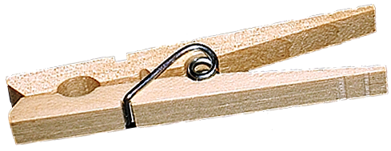

# The Way the Future Blogs

Frederik Pohl

## Clothespin, Farewell

In  Montpelier, Vermont, the factory of the company called National Clothespin closed its doors for good in 2009.  This is a pity, because it was the last of its kind.  Now no one in America makes wooden-spring [clothespins](https://web.archive.org/web/20170707032049/http://www.americanheritage.com/articles/magazine/it/2006/2/2006_2_38.shtml). So Americans must buy imported ones (if they can find them) or, alternatively, go to the home electric tumble-dryer or to the local Laundromat.

But, of course, you know that already, because, according to [New Scientist](https://web.archive.org/web/20170707032049/http://www.newscientist.com/article/mg20427325.700-right-to-dry-could-wean-americans-off-consumption.html), 80 percent of Americans already own a dryer, and most of the others keep Laundromats in business.

There are two troubles with that.  The first is that doing laundry with electric help costs 10 percent more than the clothespin kind and adds the same amount to a household’s energy use.  If we returned to the clothespin we could retire a few coal-burning power plants. And an electric dryer is one of the most dangerous appliances you can admit into your house, causing 15,000 household fires every year.

Progress is a wonderful thing.  But sometimes what looks like progress ain’t.

### 27 Comments

- David B. Williams says:
The electric drier is one of the many forms of progress that is not actually necessary but is of enormous utility. (You might have also mentioned the washing machine, not essential since clothes could still be pounded on rocks down by the stream.) I\’m old enough to remember Mom hanging out the laundry. On sunny summer days it was great. But in the winter, wet clothes had to be hung on lines in the basement and took a lot longer to dry.
On the other hand, clothespins were also one of those devices that could be used for a variety of incidental purposes. Whenever you needed to clip something to something, there was always a supply of clothespins handy.
[**February 7, 2011, 9:21 am**](/fred-pohl/2011-02-07-clothespin-farewell/)
- [GinBerlin](https://web.archive.org/web/20170707032049/http://bigappletobigbear.blogspot.com/) says:
To be fair, here in damp Berlin I hang 90% of my clothes to dry (the sheets would cover the apartment, so I use a dryer for them) and I don’t use clothespins at all: I hang them on a standard large Ikea drying rack and there’s no wind in my apartment, so pins are unnecessary.
[**February 7, 2011, 9:32 am**](/fred-pohl/2011-02-07-clothespin-farewell/)
- [Juan D Gomez V](https://web.archive.org/web/20170707032049/http://www.cienciaficcion-sciencefiction.blogspot.com/) says:
“(if they can find them)”: Imports from China, I think they can look for them in the small China Town markets. Here in Colombia all the Clothespins you find are Chinese imports, made of plastic or wood. There are even tiny clothespins you use for decorative purposes.  

Not many dryers down here, even those of us who can afford them prefer the traditional ways.
[**February 7, 2011, 9:40 am**](/fred-pohl/2011-02-07-clothespin-farewell/)
- [Stefan Jones](https://web.archive.org/web/20170707032049/http://home.comcast.net/~stefan_jones/tan_jacket_lo.jpg) says:
My current apartment has its own washer and dryer, which is a wonderful convenience. But whenever I can, I unfold two racks on my balcony and let Mr. Sun do his work. 
I’ve noticed that recently purchased undershirts and underpants — Chinese or other-asian-nation imports — tend to fall apart in the dryer. Name brand gear, but terribly shabby. I feel like finding the address of the factory and sending it bales of dryer lint for re-use.
[**February 7, 2011, 1:01 pm**](/fred-pohl/2011-02-07-clothespin-farewell/)
- Jay Borcherding says:
The decline of manufacturing in the United States is distressing–how can we remain prosperous in the long-term if we aren’t making things?  Selling services, imported goods, and health care to one another is insufficient.  Having said that, I’ll concede that clothespins are low-tech and low value, so losing that particular segment to the Chinese is less important than losing, say, major appliance manufacturing (like washers and dryers).
The house-fires statistic is quite surprising–I wonder if those are caused by dirty lint traps?  Or are they mainly caused by wiring or electrical defects, perhaps in older machines?  Despite that statistic, and the electricity consumed, I do feel a need to defend the large amounts of time saved by the convenience of modern washers and dryers.  Doing laundry (the modern way) has always been a favorite chore of mine.  Folding aside, it is nearly instantaneous and labor-free, which has occasionally struck me as nearly magical.  The few times I’ve dried clothes outside, I was struck by how time-consuming it was to hang up and pin each individual item of clothing.  Ahh, modernity, and its conveniences, we really do have it pretty good these days–if we have a decent job with health care benefits, at least.
[**February 7, 2011, 1:13 pm**](/fred-pohl/2011-02-07-clothespin-farewell/)
- [Russ Gray](https://web.archive.org/web/20170707032049/http://grayacre.blogspot.com/) says:
Here is the USA, many people confuse convenience with progress.  That said, I seldom hang my clothes to dry.  There are places around here where hanging laundry outside can lead to citations and fines.
[**February 7, 2011, 1:46 pm**](/fred-pohl/2011-02-07-clothespin-farewell/)
- [Robert Nowall](https://web.archive.org/web/20170707032049/http://www.robertnowall.com/) says:
I’ll have to get a bag of clothespins to stash next to my stash of Edison light bulbs…
[**February 7, 2011, 2:29 pm**](/fred-pohl/2011-02-07-clothespin-farewell/)
- [Bill Higgins-- Beam Jockey](https://web.archive.org/web/20170707032049/http://beamjockey.livejournal.com/) says:
I need to go out and buy up clothespins.  They will be valuable collector’s items one day, mark my words!
[**February 7, 2011, 5:29 pm**](/fred-pohl/2011-02-07-clothespin-farewell/)
- Jennie says:
OK, so I read this earlier today then later went grocery shopping where I ended up with spring-loaded clothespins at eye-level.  So I wrote down the contact info from the back of the package to look up when I got home.  Apparently, not the last.  From West Paris, Maine: [http://www.thepenleycorp.com/products/clothespins.html](https://web.archive.org/web/20170707032049/http://www.thepenleycorp.com/products/clothespins.html)
[**February 7, 2011, 6:04 pm**](/fred-pohl/2011-02-07-clothespin-farewell/)
- [Greg](https://web.archive.org/web/20170707032049/http://playthisthing.com/) says:
I stayed in an apartment in Aarhus, Denmark a few years ago, and learned (after my laundry stubbornly refused to get dry) that the “dryer” was, in fact, just a spin-dryer, and I had to take it out and hang it up to get it dry.
And I’m pretty used to, on business trips, hanging clothes over radiators to dry.
I’m not too young to remember seeing laundry lines stretching across tenement courtyards in New York.
The energy involved is trivial by comparison to that spent driving motor vehicles about; better we worry about our cities, and the way they structure transport. And I just did a load of laundry, in the dryer, today, since my apartment building offers no alternative. But as the cost of energy increases, as it will, it is doubtless worthwhile thinking about alternatives. Clotheslines are, in a sense, the original solar energy.
[**February 7, 2011, 11:07 pm**](/fred-pohl/2011-02-07-clothespin-farewell/)
- [Bill Goodwin](https://web.archive.org/web/20170707032049/http://771715/) says:
What?  No clothespins?  Losing the Constellation program was bad enough, now I’m REALLY mad.  I’ve never owned a dryer in my life! They shrink things. Bathtowels ought to make a crunchy noise when you fold them–they work better that way–and dryers make tee-shirt collars all wiggly.  Now I’ve got to machine my own clothespins?  It’s the flippin’ Dark Ages…
[**February 8, 2011, 12:46 am**](/fred-pohl/2011-02-07-clothespin-farewell/)
- [the blog team](https://web.archive.org/web/20170707032049/http://thewaythefutureblogs.com/) says:
The blogger’s amanuensis politely wonders how long it has been since the esteemed author last did his own laundry … and what the female members of his household think of his ecologically worthy but hardly labor-saving opinion on progress in housework. 
Jennie — from the site you linked: “Unfortunately, in 2003 the economic shifts of a globalized economy forced the Penley Corporation to shut down its mill operations, and downsize its operations.” I suspect that somewhere in the small print on the packaging you will find that Penley clothespins are now manufactured in China.
[**February 8, 2011, 4:42 am**](/fred-pohl/2011-02-07-clothespin-farewell/)
- Don says:
As I write this, it’s about 12 degrees F outside.  I really doubt that *anyone* would be interested in hanging clothes outside to dry in this weather.  I guess that we could hang them inside the house, but with a large family living in a moderate size house that becomes impractical.  Though I guess that we could move into a bigger house, and in turn use more energy to heat it.
Also, it’s incorrect to assume that all clothes dryers are electric.  Ours is heated by natural gas, and works great.
[**February 8, 2011, 8:38 am**](/fred-pohl/2011-02-07-clothespin-farewell/)
- Owl says:
Fortunately, wooden spring clothes pins last virtually forever.  I’m still using pins that my grandmother bought before her death in 1975. Doubtless my son will use them after me!
[**February 8, 2011, 9:28 pm**](/fred-pohl/2011-02-07-clothespin-farewell/)
- grs1961 says:
> The blogger’s amanuensis politely wonders how long it has been since the esteemed author last did his own laundry
Well, I’m not the esteemed author, but *I* do most of the laundry in our nuclear family, and I’m a bloke – and I do it because I am better at it than SWMBO (not to mention being better at ironing and sewing, but I will give her the advantage when it comes to knitting).  Of course, I was brought up by a grandmother who was born in 1890 and believed that *everybody* should know how to cook/clean/sew/skin an eel/etcetera, regardless of gender.  (Her eldest son had to teach his wife to cook – and she became a bloody good cook, too.)
Of course, I am not a USian, I’m from Oz, and even though we do have a tumble dryer, we prefer to put stuff out on the line to dry – the tumbler gets used during winter (i.e. not at the moment), or when it is raining, or in winter when the air is too cold and still to dry clothes.
What *I* miss, in relation to hanging clothes on lines (having long ago adapted to Chinese production of basic goods) is the special little widget that goes over the line with a little hole in it for putting a clothes hanger through so that your shirts don’t blow off the line in a gale – the half-a-dozen I have left are carefully protected!!
[**February 8, 2011, 10:14 pm**](/fred-pohl/2011-02-07-clothespin-farewell/)
- [the blog team](https://web.archive.org/web/20170707032049/http://thewaythefutureblogs.com/) says:
Don — Gas-heated dryers still use electricity.
grs1961 — Yes, many men do laundry and other household chores, often quite well. We are just wondering how many decades it’s been since this *particular* man hung any laundry out on a line.
[**February 9, 2011, 3:52 am**](/fred-pohl/2011-02-07-clothespin-farewell/)
- [GinBerlin](https://web.archive.org/web/20170707032049/http://bigappletobigbear.blogspot.com/) says:
Yes, gas dryers use 1/2 the electricity of electric dryers, acto the government.  

But Don- I live in an apartment- most people in cities hang wash inside to dry. Which is why we don’t use clothespins. I’m sorry to be part of the reason for the decline of the industry:-(
[**February 9, 2011, 6:18 am**](/fred-pohl/2011-02-07-clothespin-farewell/)
- mark says:
You can have my dryer when you pry it from my warm, soft, dry hands!
Clotheslines might be wonderful in warm climates, but here in the Pacific Northwest, we get about two weeks of sun that could dry clothes…and that’s spread out over the 6 months from March to September.  Hanging them inside is just asking for moisture and mold problems, not to mention not all of us have large rooms with open ceilings to hang clothes in.
I would like to see the stats for fires, and compare them to other large, high-voltage appliances, such as ranges, ovens, etc.  I’d guess most problems are with wiring, which isn’t the fault of dryers.
The other cause isn’t their fault: lint traps.  Every idiot out there tries to do something to block lint.  My parents used panty hose on the output pipe!  My house came with carefully constructed cages that allowed it to accumulate and block up.  People, you don’t do ANYTHING to obstruct the lint.  Blow it the hell out of your house.  The birds will love it.
That said, I am absolutely for clotheslines for those who live in places that they are suitable.  I also think it should be illegal for housing associations to block residents from having a clothesline on their own property.
[**February 10, 2011, 3:55 pm**](/fred-pohl/2011-02-07-clothespin-farewell/)
- Cissa says:
I, too, wonder how long it’s been since the original author did his own laundry.
Hanging laundry outside has many virtues. However, if it only takes 10% more energy to shove it in a drier, that may well be extremely cost-efficient compared to the extra TIME it take to hang things out- when the weather co-operates; I remember hanging, bringing them in when it started to rain; pinning them out again when the rain stopped, repeat, repeat, repeat.
On lovely warm sunny days, it’s a one-time thing; in every other kind of weather, it’s a COMMITMENT. And one I frankly do not care to make regularly; I think the 10% increased utility cost is more than covered by the value of my time. (Plus, my neighborhood in theory has a no-clotheslines policy, although no one seems to be respecting the other rules…)
[**February 10, 2011, 5:55 pm**](/fred-pohl/2011-02-07-clothespin-farewell/)
- Dave Jenkins says:
Sorry, completely off topic, but you’ve been given a screenplay credit for a fictional 1950s X-Men movie!  

[http://hartter.blogspot.com/2011/02/george-pals-x-men.html](https://web.archive.org/web/20170707032049/http://hartter.blogspot.com/2011/02/george-pals-x-men.html)
[**February 11, 2011, 4:20 am**](/fred-pohl/2011-02-07-clothespin-farewell/)
- SM says:
The other problem with air drying is allergies (let my underclothes soak up pollen for a few hours before I put them on?).  Drying clothes over heaters can be a fire hazard or expose the clothes to dust, mould, and leaded paint chips.  And if you work away from home and live alone somewhere it rains, then you can only air dry clothes on weekends. So there are definitely situations where electric drying makes a lot of sense.
[**February 17, 2011, 9:44 am**](/fred-pohl/2011-02-07-clothespin-farewell/)
- Paula Helm Murray says:
I’m holding on to the good clothspins and trashing the bad ones.  I got quite a lot from a free source but about half of them were crap–the springs were bad.
We mostly use them for bag closure, the thing that otherwise people spend lots of money on fancy plastic thingies for.
We are very much in Urbia, and clothing on a line would get dirt on it sprinkling down from the sky.  When we lived in the suburbs, we hung laundry until the neighbors complained to our homeowner’s association.  Most houses did have clotheslines in their backyards, but i guess it was Not Done to actually use them.
[**February 17, 2011, 9:16 pm**](/fred-pohl/2011-02-07-clothespin-farewell/)
- Michael Mays says:
I’ve never not been in a household in China from Dailin to Shenzhen which didn’t use clothespins and which did not have a dryer. Drying clothes without a clothes dryer is still the norm for a lot if not most of the world. Still the first thing I do (am doing) when I return home is to wash that ‘sweet’ smell of Beijing out of my clothes and dry them in my dryer. 
But let’s not get too excited over a 10% reduction in energy when there are +1 billion people on the planet living in abject poverty consuming less than 5% of the energy we do here in the States. If those people ever leave their poverty stricken lives they will be consuming much more energy. If they only use 25% of what we use (less than the amount of the average non impoverished person) we will have increased the world’s energy consumption (CO2 production) by the amount the United States consumes today. Even with a 70% cut in energy usages, the planet’s energy consumption would be increasing. 
As to the 15K fires, those folks never cleaned their lint filter and/or removed/altered their lint filters or removed one or both of the temperature sensors which are set to below the combustion temperature of clothes. If we want to save money and lives there are a lot of other things we could do which would be a lot more effective than throwing away our clothes dryers.
[**February 21, 2011, 10:04 am**](/fred-pohl/2011-02-07-clothespin-farewell/)
- [Chookie](https://web.archive.org/web/20170707032049/http://chookiesbackyard.blogspot.com/) says:
From what I understand, the cause of the house fires is the use of “dryer sheets”, which are unknown here.  They’re impregnated with wax to make the clothes feel soft, but the residue, mixed with lint, clogs your dryer vent until either cleaned or combusted.
[**February 23, 2011, 5:20 am**](/fred-pohl/2011-02-07-clothespin-farewell/)
- [Aaron Singleton](https://web.archive.org/web/20170707032049/http://usefulphrases.yuku.com/) says:
When I was growing up, my mother always hung our clothes out to dry, then put them in the dryer for just a couple minutes to “soften” them.  My wife and I do the same in warm weather, and in cold, too.  She bought a contraption that looks sort of like an umbrella, sans the vinyl, to hang wet clothes on.  It will hold a medium-size load of laundry.  Cost: $19.99. Since we started using this method we cut our dryer usage by %75 and have saved about $25.00 monthly on our electricity bill.  A simple way to save some money… It all counts!
[**March 4, 2011, 9:21 am**](/fred-pohl/2011-02-07-clothespin-farewell/)
- Stacy B says:
The thing that I remember most about wood clothespins is stealing them off my mom’s ( or neighbors ) clothes lines and making them into match stick guns.  2 clothespins and a generous amount of electrical tape earned me endless hours of fun especially if you could get your hands on some of dad’s wood matches.  ( Never a bad fire started but not for lack of trying. )  I had to go out on the internet to find out how to make them again. ( instructables.com/id/Clothespin-Match-Gun/ )  I might have to look for some in the store next time I am there so that my 10 year old can know the joy of it (sans matches).
[**March 17, 2011, 4:41 pm**](/fred-pohl/2011-02-07-clothespin-farewell/)
- jc sheffield says:
I use Clothespins frequently, for a variety of tasks but haven’t had a clothesline since I lived with my parents.   As a child I remember my mother hanging clothes on a line.   They were just as likely to pick up odors from the nearby factory (among other things) as smell fresh.
With all the money out nation spends on corporate welfare, I hate to hear when we completely loose the ability to produce something.  We will miss these industries once energy costs get higher.
[**September 6, 2012, 10:32 pm**](/fred-pohl/2011-02-07-clothespin-farewell/)

[WordPress](https://web.archive.org/web/20170707032049/http://wordpress.org/)
[TWTFB2](https://web.archive.org/web/20170707032049/http://dicksmithsoftware.com/)