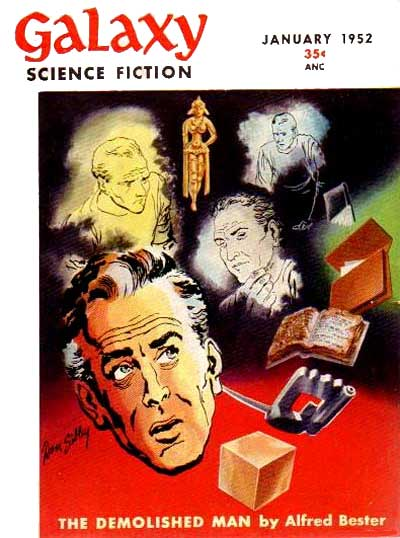

<!-- translated by Yandex Translate -->

# Путь к блогам будущего

Фредерик Пол

## Альфи, часть 2: Когда Бестер был лучшим

[Разрушенный Человек (The Demolished Man](https://web.archive.org/web/20170707075607/http://www.amazon.com/gp/product/B0000CIPKD?ie=UTF8&tag=twtfb-20&linkCode=as2&camp=1789&creative=390957&creativeASIN=B0000CIPKD)) стоил всех редакторских нареканий [Хораса Голда](https://web.archive.org/web/20170707075607/http://www.iblist.com/author2749.htm).  * Разрушенный Человек (The Demolished Man)* был свеж, полон приключений и прекрасно написан, и это началось примерно через пять лет, в течение которых [*Альфред Бестер**](/fred-pohl/2011-03-08-alfie/) создавал то, что, возможно, было одним из лучших произведений в области НФ, вплоть до его второго великого романа "Тигры! Тигр! ([The Stars My Destination](https://web.archive.org/web/20170707075607/http://www.amazon.com/gp/product/B0007F8VOU?ie=UTF8&tag=twtfb-20&linkCode=as2&camp=17a89&creative=390957&creativeASIN=B0007F8VOU)), иногда его называют *Тигром! Тигр!* в 1956 году.

Но что касается великих НФ-романов, то на этом все и заканчивалось.  Примерно в то время Альфи действительно написал несколько первоклассных [рассказов](https://web.archive.org/web/20170707075607/http://www.amazon.com/gp/product/0679767835?ie=UTF8&tag=twtfb-20&linkCode=as2&camp=1789&creative=390957&creativeASIN=0679767835) и новелл - “С любовью по Фаренгейту”, “5 279 009” и мой личный фаворит, “Исчезновение”, например, — и позже он написал еще несколько романов, но я не думаю, что кто—либо когда-либо утверждал, что они появились в результате соответствует стандартам тех первых двух потрясающих книг.  Может быть, Альфи действительно нуждался в придирках Горация, чтобы сделать их великими.

И, на самом деле, научная фантастика во многом утратила свой интерес к Альфи Бестеру.

Альфи не перестал писать о деньгах.  Он вернулся к научной фантастике, потому что с деньгами стало лучше — после Второй мировой войны количество слов в журналах утроилось, и теперь книгоиздатели покупали рассказы за еще большие деньги.  А Альфи только что получил значительные голливудские деньги (за фильм, который, конечно, так и не был снят), что дало ему и [Ролли](https://web.archive.org/web/20170707075607/http://www.enotes.com/topic/Rolly_Bester) возможность некоторое время пожить в Европе.

Это навело его на мысль попробовать немного написать о путешествиях в научной литературе для журнала "Холидей", который, как он обнаружил, писать было так же безболезненно, как и все остальное, при условии, что вы Альфред Бестер.  За это платили довольно хорошо.  На самом деле редакторам журнала так понравились его работы, что они предложили ему редакторскую работу с вполне приличной зарплатой, и у Альфи внезапно появился новый дом.

То есть в течение восьми или девяти лет он так и делал, вплоть до того времени, когда журнал, как это обычно бывает с журналами, обанкротился.

А потом, после того как они с Ролли прожили в счастливом браке сорок восемь лет, Ролли умер.  И он начал терять зрение.  И дела, которые у Альфи Бестера шли довольно хорошо, начинали становиться менее идиллическими.

Какое—то время я почти не видел Альфи - ни когда он жил в Европе, ни когда работал в "Холидей".  Когда я работал редактором НФ в Bantam Books, мы действительно говорили о книге, которая показалась мне несколько многообещающей, но мы так и не подписали контракт.  Однако в некоторых отношениях его жизнь несколько улучшилась.  Он снова публиковал больше НФ, и у него наконец-то появилась новая подруга.  (Я буду называть ее “Джейн” — должен признаться, я забыл ее имя.)

Затем [Всемирная НФ](https://web.archive.org/web/20170707075607/http://www.worldsf.org/) провела свое ежегодное собрание в Дублине, Ирландия, и я был там, и Альфи тоже.

Всемирная НФ была организацией, основанной [Брайаном Олдиссом](https://web.archive.org/web/20170707075607/http://www.brianwaldiss.org/) (Англия), [Гарри Харрисоном](https://web.archive.org/web/20170707075607/http://harryharrison.com/) (Ирландия), [Сэмом Лундваллом](https://web.archive.org/web/20170707075607/http://www.discogs.com/artist/Sam+J.+Lundwall) (Швеция) и мной (США). Мы начали это в основном потому, что хотели дать передышку людям из НФ в СССР, Китае и других странах, где вам не разрешалось выезжать за границу, если ваше правительство не давало вам специального разрешения, в чем чаще всего они отказывались.  Визы для этой цели было немного легче получить, если у вас было письменное приглашение от какой-либо профессиональной организации.

Итак, мы вчетвером основали Всемирную НФ, членство в которой было доступно любому человеку в любой точке мира, у которого были профессиональные связи, любого рода профессиональные связи с НФ.  Мы распечатали кое-какие канцелярские принадлежности и разослали письменные приглашения всем, кто их хотел, и вскоре после этого наши ежегодные встречи по всему миру стали становиться довольно интересными.

Впервые в 1978 году я приехал в Дублин немного раньше и в тот первый день решил немного осмотреть город самостоятельно.  И вот я прогуливался по одной из его главных улиц, когда увидел Альфи, идущего мне навстречу.

“ Привет, - сказал я, как только он оказался в пределах слышимости.  Он не ответил.  Он взглянул на меня, но ничего не сказал и прошел прямо мимо меня.

Я был застигнут врасплох.  Неужели я чем-то обидел его?  Если да, то что?  Я ничего не мог придумать, и в тот вечер, вернувшись в отель, я застал его в вестибюле болтающим с некоторыми людьми из НФ "Другого мира".  Он весело поздоровался со мной, и тогда я спросил его, почему он подрезал меня насмерть на дублинской улице.

Альфи был весь в извинениях.  “Наверное, я тебя не расслышал”, - сказал он.  - Я определенно не видел тебя, Фред.  Я думаю, ты не знаешь, что сейчас я почти слеп.  Я могу прогуляться, но не могу отличить одно лицо от другого.”

И вот, все снова было в порядке.  Мы все хорошо провели время на встрече.  Джейн была с ним, и они оба, казалось, были счастливы в этом мире,

После того, как все закончилось, нас с Альфи пригласили выступить с совместным докладом в английском городе Ньюкасл-апон-Тайн.  Мы с Бетти Энн уже взяли напрокат машину и немного осмотрели достопримечательности и навестили друзей, так что собирались переправиться на пароме в Англию, доехать до Ньюкасла, а затем провести там еще неделю или около того.   Под влиянием момента мы пригласили Джейн и Альфи присоединиться к нам, и они сказали, что были бы рады.

Совместная беседа прошла довольно хорошо (и если вы сомневаетесь во мне, я могу предложить вам прочитать ее самостоятельно, потому что кто-то наткнулся на древнюю магнитофонную запись с того допотопного мероприятия и перепечатал ее, и я вскоре опубликую ее в блоге).

Но по самому случаю все было не так радостно.  Альфи был остер и забавен на сцене кинотеатра "Тайнсайд", но когда мы возвращались в свои комнаты, он был молчаливее обычного.  В отеле он отказался от возможности пропустить стаканчик на ночь в лобби-баре.

- Лучше не надо, - сказал он.  - Я действительно устала.  Думаю, мне лучше хорошенько выспаться, тем более что утром мы отправляемся к Римской стене.”

В этом был смысл.  Мы приняли пример Альфи близко к сердцу, но когда на следующее утро мы все собрались за завтраком, у Альфи были ввалившиеся глаза и он очень плохо спал.

Джейн вздохнула.  - Боюсь, Альфи не справится с этим, но мы не хотим задерживать вас двоих.  Так что ты продолжай...”

Но Бетти Энн уже качала головой.  - Не будь смешным.  Нам всем не помешал бы дополнительный день отдыха, так почему бы нам не взять выходной, чтобы побродить по окрестностям и посмотреть, как все будет выглядеть завтра?”

Но когда наступило завтра, все выглядело ничуть не лучше.  Бетти Энн и я отправились в наше путешествие.  Джейн и Альфи остались позади.

И я больше никогда не видел ни одного из них.

Альфи прожил еще несколько лет, но у него ухудшалось здоровье и уменьшалась общительность.  [Американская ассоциация писателей-фантастов](https://web.archive.org/web/20170707075607/http://www.sfwa.org/)(SFWA) хотела вручить ему свою [премию "Гроссмейстер](https://web.archive.org/web/20170707075607/http://www.sfwa.org/archive/awards/grand.htm)", но была вынуждена договориться о ее досрочном вручении, поскольку ожидалось, что он не доживет до обычной даты вручения.

Однако он это сделал.  Он прожил до конца сентября 1987 года, а затем умер, по-видимому, в одиночестве.   Все свое состояние он оставил своему бармену Джо Судеру.  Никто другой не был упомянут в его завещании.

* Стенограмма “Альфред Бестер и Фредерик Пол — Беседа”, которая начнется в ближайшее время.*

**Связанные должности:**

- ** Альфи,** [** Часть 1**](/fred-pohl/2011-03-08-alfie/)
- ** Я и Альфи,** [** Часть 1**](/fred-pohl/2011-03-25-me-and-alfie/), [** Часть 2**](/fred-pohl/2011-03-28-me-and-alfie-part-2-gateway-and-the-art-of-writing/), [** Часть 3**](/fred-pohl/2011-03-30-me-and-alfie-part-3-ideas-and-the-demolished-man/), [** Часть 4**](/fred-pohl/2011-04-01-me-and-alfie-part-4-rejection/), [** Часть 5**](/fred-pohl/2011-04-04-me-and-alfie-part-5-collaboration-and-the-futurians/), [** Часть 6**](/fred-pohl/2011-04-06-me-and-alfie-part-6-john-w-campbell-and-dianetics/), [**Часть 7**](/fred-pohl/2011-04-08-me-and-alfie-part-7-cyclothymia/), [**Часть 8**](/fred-pohl/2011-04-11-me-and-alfie-part-8-hollywood-and-the-name-game/)

### 11 Комментариев

- [Билл Хиггинс - жокей на бревне](https://web.archive.org/web/20170707075607/http://beamjockey.livejournal.com/) говорит:
Интересно, будут ли статьи Бестера о "Празднике" достаточно интересными, чтобы их можно было собрать в книгу?
В 1966 году он опубликовал научно-популярную книгу "Жизнь и смерть спутника" об орбитальной астрономической обсерватории.
[**10 марта 2011, 14:22**](/fred-pohl/2011-03-10-alfie-part-2-when-bester-was-the-best/)
- [Стефан Джонс](https://web.archive.org/web/20170707075607/http://home.comcast.net/~stefan_jones/tan_jacket_lo.jpg) говорит:
Я встретил Бестера однажды, на небольшом съезде (Эмпирикон?) на Манхэттене. Это было в 1981 или 82 году, на одном из первых съездов НФ, на который я попал. В то время он, казалось, был в довольно хорошем расположении духа. Я помню отличные, большие очки с толстыми стеклами; никакой густой бороды, а волос больше и темнее, чем мы видим на картинке выше.
Я от души посмеялся над ним из-за какой-то шутки, которую я отпустил в адрес аудитории дискуссии, в которой он участвовал. (Ага... Я связал закон Старджона с трюизмом о том, что мы используем только 10% нашего мозга.)
[**10 марта 2011, 14:37 вечера**](/fred-pohl/2011-03-10-alfie-part-2-when-bester-was-the-best/)
- Малкольм Эдвардс говорит:
Я был на том съезде в Дублине.  Я помню, что банкет совпал с финалом чемпионата мира в Буэнос-Айресе (Аргентина обыграла Голландию).  В то время как остальные из нас пропустили финал, чтобы присутствовать на банкете, Альфи пропустил банкет, чтобы посмотреть футбол.  Учитывая то, что вы говорите о том, насколько плохим было его зрение, это заставляет задуматься.
Он также, конечно, должен был быть почетным гостем на Ворлдконе 1987 года, но отказался от участия из-за плохого самочувствия... и очень скоро после этого умер.
[**10 марта 2011, 14:51**](/fred-pohl/2011-03-10-alfie-part-2-when-bester-was-the-best/)
- готтакук говорит:
Заранее приношу извинения за придирки, но если Бестер овдовел где-то до 1978 года, когда он был в Дублине с Джейн, как он мог быть женат на Ролли в течение 48 лет? Он родился в 1913 году, и здесь подразумевается некоторый промежуток времени между овдовением и встречей с Джейн; даже если предположить, что прошел всего один год, в этом случае он женился бы в возрасте 16 лет, что кажется маловероятным.
Я давний поклонник Фэн, с тех пор, открывая Тигр! Тигр! (the Stars my Destination) в конце двухтомника казну Великого научная фантастика предлагается как научная фантастика выбора книжного клуба в начале 1970-х годов. (С тех пор я взял оригинальную серийную версию в Galaxy; история появилась в мире примерно в то же время, что и я. Между всеми опубликованными версиями есть несколько интересных отличий.) 
Мы с друзьями по колледжу в середине 1970-х однажды чуть было не позвонили ему, а позже пожалели об этом; мы зашли так далеко, что заглянули в телефонную книгу Манхэттена, и там он был указан как Бестер Альфи.
[**10 марта 2011, 16:18 вечера**](/fred-pohl/2011-03-10-alfie-part-2-when-bester-was-the-best/)
- Джей Джей Брэннон говорит:
Я познакомился с Альфи в сентябре 1977 года на презентации журнала Unearth "Жаркое Харлана Эллисона", проходившей в банкетном зале китайского ресторана в Бостоне.  Он был больше похож на более тяжелую, слегка лысоватую версию вашей ранее опубликованной фотографии, чем на ту, что была в этом сегменте, Фред.
Он также был весел, назвав Харлана необъявленным ребенком любви - если мне не изменяет память — Эмброуза Бирса и Дороти Паркер.
JJB
[**10 марта 2011, 19:13 вечера**](/fred-pohl/2011-03-10-alfie-part-2-when-bester-was-the-best/)
- Нармитай говорит:
Согласно Википедии, они поженились в 1936 году, и Ролли умер только в 1984 году.
[**11 марта 2011, 18:19 вечера**](/fred-pohl/2011-03-10-alfie-part-2-when-bester-was-the-best/)
- Дуайт Декер говорит:
Некоторые эссе из научно-популярного сборника Артура Кларка "Отчет о третьей планете" первоначально были опубликованы в журнале "Дневной свет" в период с 1953 по 1958 год. Во вступлениях Кларка к отдельным эссе мало что говорится о том, как они появились, за исключением того, что одно из них упоминается как “заказанное”. Может ли здесь быть связь с Альфи, например, использование его контактов в НФ для приобретения статей? Те, кто знает об этих вещах больше, чем, вероятно, знаю я.
[**12 марта 2011, 14:18 вечера**](/fred-pohl/2011-03-10-alfie-part-2-when-bester-was-the-best/)
- [Гэри Фарбер](https://web.archive.org/web/20170707075607/http://amygdalagf.blogspot.com/) говорит:
Он выступал на региональном съезде НФ в Сиэтле, Норвегия, в 1980 году, и мое самое яркое воспоминание о нем было связано с тем, что однажды вечером, когда он из-за чего-то вышел из-под контроля, он бросил стул с балкона внутреннего атриума второго этажа в нижнем вестибюле, едва не задев пару человек. нас примерно на два фута.  
Два его великих романа - одни из величайших, которые когда-либо видел филд. Лучшие из его короткометражных произведений остаются и всегда будут оставаться чрезвычайно недооцененными, потому что их невозможно переоценить.
Нежно по Фаренгейту. 
Люди, Которые убили Мохаммеда.
Частный детектив.
Это лишь некоторые из них.  Некоторые из них легально доступны в Интернете.
[**14 марта 2011, 19:37 вечера**](/fred-pohl/2011-03-10-alfie-part-2-when-bester-was-the-best/)
- Бад Вебстер говорит:
Фред, есть ли у тебя (или у кого-нибудь еще здесь) контактная информация Судера, предполагая, что он все еще литературный наследник Бестера?  Я работаю над проектом с SFWA по составлению всеобъемлющей базы данных об имуществе авторов для использования редакторами и издателями, и мне бы очень хотелось добавить сюда Alfie.
[** 18 марта 2011, 15:33**](/fred-pohl/2011-03-10-alfie-part-2-when-bester-was-the-best/)
- готтакук говорит:
Писатель Чарльз Платт, возможно, что-то знает. Несколько лет назад он очень любезно поделился со мной некрологом Бестера, который он написал, подробно описывая свой последний визит к Бестеру в округ Бакс, штат Пенсильвания, в середине 1980-х; он отправил его в Locus, но Чарльз Браун отклонил его, потому что “он предпочел теплые слова благодарности мрачным описаниям отчаяния”.
[** 21 марта 2011, 16:06 вечера**](/fred-pohl/2011-03-10-alfie-part-2-when-bester-was-the-best/)
- [Гордон Ван Гелдер](https://web.archive.org/web/20170707075607/http://www.fandsf.com/) говорит:
Была ли женщина, которую вы окрестили “Джейн”, Джудит Маккуон?
— Гордон В.Г. [
** 30 марта 2011 г., 19:55 вечера**](/fred-pohl/2011-03-10-alfie-part-2-when-bester-was-the-best/)

[WordPress](https://web.archive.org/web/20170707075607/http://wordpress.org/)
[TWTFB2](https://web.archive.org/web/20170707075607/http://dicksmithsoftware.com/)