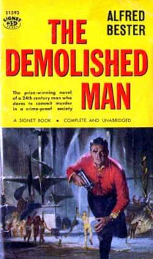

<!-- translated by Yandex Translate -->

# Путь к блогам будущего

Фредерик Пол

## Я и Альфи, часть 3: Идеи и разрушенный человек

* Часть 3 “Альфред Бестер и Фредерик Пол — беседа”, записанная 26 июня 1978 года в кинотеатре "Тайнсайд", Ньюкасл-апон-Тайн, Великобритания.*

Пол: Теперь, возвращаясь к тому, откуда берутся идеи, я хотел бы услышать твое мнение, Альфи. Я хочу знать, откуда вы берете свои идеи. В частности, я хочу знать, откуда вы берете идеи для чего-то вроде Разрушенного Человека([The Demolished Man](https://web.archive.org/web/20170619223452/http://www.amazon.com/gp/product/B0000CIPKD?ie=UTF8&tag=twtfb-20&linkCode=as2&camp=1789&creative=390957&creativeASIN=B0000CIPKD)). Что убедило вас написать это в первую очередь?

Бестер: [Хорас Голд](https://web.archive.org/web/20170619223452/http://www.gcwillick.com/Spacelight/gold_hl.html)! Я вроде как смутно помню эту историю. Я писал сценарий для "[Шоу Ника Картера](https://web.archive.org/web/20170619223452/http://www.freeotrshows.com/otr/n/Nick_Carter_Master_Detective.html)", и у меня были трудные времена. У меня были проблемы с его агентом. У меня были самые разные проблемы. Это было трудное шоу для написания, но это был хороший чек, так что вы не жалуетесь на это.

Хорас Голд только что основал Galaxy, и он позвонил мне. Я знал Горация много лет. Он сказал: “Альфи, я хочу, чтобы ты написал для меня”, а я сказала: “О, Гораций, давай, ладно? Я так увлечен этим шоу, что оно отнимает у меня все время”.

Он сказал: “Нет, я хочу, чтобы ты написал для меня”, а я сказал: “Да ладно, у тебя есть великие, у тебя есть Фред Пол, у тебя есть [** Хайнлайн**](/fred-pohl/2010-05-03-working-with-robert-a-heinlein/), у тебя есть [Тед Старджон](https://web.archive.org/web/20170619223452/http://www.gcwillick.com/Spacelight/sturgeon.html), а я не из их класса”.

Он говорил: “Нет, нет, нет, перестань”, и продолжал приставать ко мне неделю за неделей. Мы разговаривали по телефону и все такое, и в конце концов я сказал: “Хорошо, Гораций”. Я должен отвязаться от него, я представлю несколько идей. Сейчас я представил четыре или пять идей — я не могу вспомнить их все, это было так давно.

Сначала я должен объяснить, что меня учили писать детективы, приключения, комиксы и так далее - всегда делать это трудным путем. Вы делаете это трудным путем, если вы хотите, чтобы A добрался до Z, он просто не может туда добраться, он должен попасть в конфликт B, который перерастает в конфликт C, D, E, F, G и так далее. Что вы делаете, так это создаете невозможную для вас как писателя ситуацию, а затем решаете ее, и из этого получается история. Поэтому я создаю несколько невозможных ситуаций.

Это было очень рано в написании текстов для радио и телевидения, и я практически изобрел для себя технику открытого рассказа. Техника закрытого сюжета - это детектив в стиле [Агаты Кристи](https://web.archive.org/web/20170619223452/http://www.amazon.com/gp/redirect.html?ie=UTF8&location=http%3A%2F%2Fwww.amazon.com%2Fgp%2Fentity%2FAgatha-Christie%2FB000APENBC&tag=twtfb-20&linkCode=ur2&camp=1789&creative=390957), в котором совершено убийство, и кто бы ни был детективом, он ходит вокруг да около, собирая улики у разных людей. Ты не знаешь, что, черт возьми, происходит, и в самом конце тебя ждет большой сюрприз, и он, дворецкий, кто угодно, черт возьми. Это закрытая тайна.

В то время я уже порядком устал от этого. У меня было слишком много шоу и я крал свои собственные сценарии у самого себя, и, просматривая свою папку со сценариями, я нашел один, который, как мне казалось, я мог бы использовать для другого шоу, и, прочитав его, я подумал: “Господи Иисусе, я написал все неправильные сцены. Я не описал действие так, как оно произошло — я описал результат действия и недоумение детектива в отношении того, как интерпретировать результат действия”.

Поэтому я сказал себе: “Почему бы тебе не написать сценарий, в котором ты сам напишешь действие и позволишь детективу озадачиться? И мы будем наблюдать за ними обоими. Это совсем другая история.”

Конечно, сейчас это клише; они делают это постоянно. Но это было много лет назад — тогда все было совершенно новым. Я подумал, что сделаю открытую историю для Горация, так что я подготовлю что-нибудь действительно грубое.

Итак, одно из моих предложений было таким: “Гораций, что, если у нас будет полиция, оснащенная машинами времени? Таким образом, если совершено преступление, они могут вернуться во времени к самому началу преступления и разыскать преступника. И как парень может обойти их, выйти сухим из воды?”

Такова была идея. Вторая идея была связана с экстрасенсорным восприятием, чтением мыслей, а также были третья и четвертая, каждую из которых я немного развил, просто чтобы дать ему представление о том, что это такое.

И он воспринял эти идеи, перезвонил мне и сказал: “Эй, Альф, а теперь давай! Машины времени! Это старая шляпа! ОСОБЕННО! Это тоже старая знакомая! Но почему бы нам не объединить идею полиции и преступника не с машиной времени, а с чтением мыслей?”

Я сказал: “Звучит интересно, Гораций”.

Итак, мы начали говорить об этом. Помню, я как-то сказал ему по телефону: “Послушай, Хорас, у меня не может быть главного героя детектива, который умеет читать мысли. Это несправедливо, это делает его особенным. Мне не нужен специальный детектив; он должен быть обычным парнем”.

Гораций сказал: “Альф, что ты должен сделать, так это построить целое общество, в котором есть люди, которые являются экстрасенсами, которые могут читать мысли, и люди, которые этого не могут. Вот что ты должен сделать!”

И так книга развивалась и совершенствовалась. Долгие месяцы разговоров взад и вперед, прежде чем я начал это писать. В конце концов мы решили, что я экстраполирую общество — скорее похожее на черно—белое общество, - в котором существуют различные этнические группы. Одна этническая группа - это группа, умеющая читать мысли, другая - группа, не умеющая читать мысли, и из-за этого возникает социальный конфликт, и так строится все это.

Эта чертова книга готовилась шесть месяцев, прежде чем я действительно начал ее писать. И вот так появился *Разрушенный Человек(The Demolished Man).

Но, возвращаясь к тому, как генерируются идеи, одной из моих любимых была история под названием “С [любовью по Фаренгейту](https://web.archive.org/web/20170619223452/http://www.amazon.com/gp/product/1568492499?ie=UTF8&tag=twtfb-20&linkCode=as2&camp=1789&creative=390957&creativeASIN=1568492499)”. Я собираюсь рассказать вам о происхождении этой истории. Я помню это живо, пункт за пунктом.

Я читал ["](/fred-pohl/2010-09-04-mark-twain-and-the-law-of-the-raft/)Жизнь на Миссисипи[" Марка Твена.](https://web.archive.org/web/20170619223452/http://manybooks.net/titles/twainmaretext95lmiss12.html) Он упомянул, что в Миссури был казнен раб-негр за растление, преступное нападение и убийство молодой девушки. Его повесили за это, и Твен продолжал говорить, что этот раб-негр совершил такое же преступление в Вирджинии, и его владелец выслал его из Вирджинии в Миссисипи, потому что раб был слишком ценным, чтобы его уничтожать.

И я подумал: “В этом есть какая-то адская история, я не знаю, что это такое, но это адская история”. Поэтому я очень тщательно перечислил это в своей [книге “Трюки”](https://web.archive.org/web/20170619223452/http://dmznyc.com/html/gimmick%20books.html), и на этом все закончилось.

В этой книге с трюками у меня есть сотни и сотни фрагментов идей, которые я хранил всю свою писательскую жизнь. И я все время листаю книгу, выискивая разные вещи. Я наткнулся на это несколько месяцев спустя, просмотрел, и в то время я был открыт, поэтому начал писать рассказ. Я досмотрел первую сцену или около того, а потом повесил трубку.

Я знал, что не смог бы написать это как антиамериканскую историю до нашей Гражданской войны, потому что я ничего не знал об этом периоде - так что на самом деле это не могло быть случаем настоящего рабства. Я не мог написать это в настоящем, потому что у нас нет рабства движимого имущества; сегодня у нас экономическое рабство.

Поэтому мне пришлось перенести эту историю в будущее. Вместо человека я сделал раба андроидом, химическим человеческим существом. И я написал первые пять или шесть страниц и полностью остановился. Моя проблема заключалась в следующем: “Итак, хорошо, этот андроид-раб совершает убийства, и мы его ловим. Конец.” Это не так уж сложно, чувак! Это вообще ничего не значит, поэтому я убрал его и забыл о нем.

Много позже я просматривал свои записи и подумал: “Альфи, ты не ответил на вопрос: "Почему андроид убивает?” Теоретически, если изготовить и обучить техническое существо, оно будет приучено никогда не причинять вреда ни одному человеческому существу, никогда ничего не вредить и не разрушать. Почему он нарушает свою обусловленность?” Я подумал об этом, сделал еще несколько заметок и снова убрал его.

Год спустя, снова просматривая свою книгу о хитростях, я кое на что наткнулся — на небольшую заметку о том, что в США, в Нью-Йорке, летом, когда погода становится очень жаркой, уровень убийств резко возрастает.  И тут внезапно меня осенило. Я подумал: “Ах, вот почему андроид совершает убийство — когда температура становится слишком высокой”.

Я вернулся к заметкам и тому, что я набросал, и начал все сначала с точки зрения температуры, та же история, но теперь мы варьируемся между различными планетами в Galaxy, некоторые из которых холодные, а некоторые горячие. На холодных планетах он ведет себя хорошо; на горячих планетах он впадает в неистовство. Я начал пробегать его глазами и обрисовывать в общих чертах, и снова подошел к этому блоку. “Хорошо, итак, они узнают, что при высокой температуре это убивает, но это разочарование, это не самый трудный путь, Альфи, должно быть что-то большее”. Я не мог этого понять, но должно было быть что-то еще.

Я снова убрала его и вспомнила, что была в офисе "Холидей", расхаживала взад-вперед по коридору, беспокоясь о какой-то статье или еще о чем-то, не имеющем отношения к сюжету, как вдруг из ниоткуда на меня обрушилась эта штука. Очевидно, это просачивалось, готовилось на задворках моего сознания. - Ах! Это не андроид безумен, это хозяин безумен, и он проецирует свое безумие на это существо!” И, конечно, на тот момент у меня была своя история.

Я пошел домой и написал это за пару дней. Люди спрашивают меня: “Сколько времени тебе потребовалось, чтобы написать "С любовью по Фаренгейту”?"

“ Господи Иисусе! Два года!” Поэтому я пытаюсь обойти это, говоря: “Ну, у меня ушло два дня на то, чтобы напечатать”.

Идеи приходят отовсюду, и, как сказал Фред о своем романе, получившем премию, вы складываете кусочки воедино. Это может занять семь недель, семь месяцев, семь лет, вы не знаете. Единственный момент заключается в том, что вы всегда должны быть широко открыты для всего, что к вам приходит. Если вы услышите обрывок разговора на улице, и это просто вызовет у вас интерес, запомните его — возможно, вы не воспользуетесь им сейчас, но когда-нибудь в будущем оно вам пригодится. Мы - стайные крысы, мы - сороки.

Пол: Да, мы берем все, что к нам приходит. “Откуда берутся ваши идеи?” Они приходят отовсюду. То, что вы читаете, то, что говорят люди.

Поскольку в научной фантастике есть слово "наука", оно часто имеет какое-то отношение к тому, что происходит в науке. Некоторые из моих идей исходят из науки, но не в организованном виде. Я не говорю себе: “Боже, я бы с удовольствием написал рассказ о путешествиях во времени, давай посмотрим, что мы можем узнать о путешествиях во времени”.

Но я в некотором роде фэн науки — Чемпионат мира для меня ничего не значит. Я бы предпочел, чтобы этого вообще не показывали по телевизору. Но наука - это величайший зрелищный вид спорта в мире. Я имею в виду, что мне нравится наблюдать за тем, что делают эти люди; они запускают эти многомиллионные ракеты просто для того, чтобы развлечь меня. Они отправляют людей на Луну и присылают фотографии, и я ценю это!

Бестер: Я написал [книгу о космической программе](https://web.archive.org/web/20170619223452/http://www.amazon.com/gp/product/B000JVTRMM/ref=as_li_ss_tl?ie=UTF8&tag=twtfb-20&linkCode=as2&camp=1789&creative=390957&creativeASIN=B000JVTRMM) — научные спутники. Я был в [Годдарде](https://web.archive.org/web/20170619223452/http://www.nasa.gov/centers/goddard/home/index.html), и один из инженеров, у которого я брал интервью, рассказал эту очаровательную и правдивую историю. Он сказал, что у него возникла проблема с одним из конкретных спутников, которые он проектировал. Это вывело его из себя на несколько недель, и он не мог понять, как решить эту проблему. Наконец, отчаявшись, он сдался. Он вернулся домой и решил взять выходной, поэтому в ту субботу взял своего ребенка на рыбалку.

Он сказал: “Хотите верьте, хотите нет, но мой мальчик сделал свой первый заброс, и я посмотрел на его удилище и катушку” — у него была катушка с [равномерным намоткой, которая наматывает](https://web.archive.org/web/20170619223452/http://www.youtube.com/watch?v=NpHQb-vmUds) леску взад и вперед по мере наматывания - “и, — сказал он, - это решило мою проблему!”

И он сразу же вернулся к Годдарду и использовал принцип ровного ветра для решения своей инженерной задачи.

Таким образом, идеи приходят отовсюду, если вы открыты для них.

*Продолжение следует.*

**Связанные должности:**

- ** Альфи,** [** Часть 1**](/fred-pohl/2011-03-08-alfie/), [** Часть 2**](/fred-pohl/2011-03-10-alfie-part-2-when-bester-was-the-best/)
- ** Я и Альфи,** [** Часть 1**](/fred-pohl/2011-03-25-me-and-alfie/), [**Часть 2**](/fred-pohl/2011-03-28-me-and-alfie-part-2-gateway-and-the-art-of-writing/), [** Часть 4**](/fred-pohl/2011-04-01-me-and-alfie-part-4-rejection/), [** Часть 5**](/fred-pohl/2011-04-04-me-and-alfie-part-5-collaboration-and-the-futurians/), [** Часть 6**](/fred-pohl/2011-04-06-me-and-alfie-part-6-john-w-campbell-and-dianetics/), [** Часть 7**](/fred-pohl/2011-04-08-me-and-alfie-part-7-cyclothymia/), [**Часть 8**](/fred-pohl/2011-04-11-me-and-alfie-part-8-hollywood-and-the-name-game/)

### 6 Комментариев

- Стивен Би говорит:
Увлекательный материал от Бестера.
Мне нравится этот блог.
Спасибо!
[** 30 марта 2011 года, 8:00 утра**](/fred-pohl/2011-03-30-me-and-alfie-part-3-ideas-and-the-demolished-man/)
- sm говорит:
Это одна из лучших вещей, которые вы опубликовали в блоге — переписка между вами и Бестером великолепна!
[**30 марта 2011, 12:39 вечера**](/fred-pohl/2011-03-30-me-and-alfie-part-3-ideas-and-the-demolished-man/)
- Его превосходительство Пармер говорит:
Прошло, наверное, больше 30 лет с тех пор, как я в последний раз читал “С любовью по Фаренгейту”, но — хотя мне немного стыдно признаться, что я не помнил, что автором был Альфи, — это произвело достаточное впечатление, чтобы мгновенно вспомнить сюжет.
Спасибо, что поделились этим замечательным пониманием того, как работает великий писатель.
[**30 марта 2011, 17:43 вечера**](/fred-pohl/2011-03-30-me-and-alfie-part-3-ideas-and-the-demolished-man/)
- [А.Л. Сироа](https://web.archive.org/web/20170619223452/http://www.alsirois.com/) говорит:
Я перечитал “С любовью по Фаренгейту” всего несколько дней назад, в первом томе Зала славы научной фантастики, так что этот пост появился в замечательное для меня время. Это всегда была одна из моих любимых НФ-историй, не говоря уже об одной из моих любимых историй Бестера. Я встречался с Бестером всего один раз, в "Лунаконе" в 70-х годах. Он был обаятельным человеком, очень доступным и добродушным. Насколько я помню, он прочитал информативную и забавную лекцию, но я не помню тему.
[** 31 марта 2011 года, 8:32 утра**](/fred-pohl/2011-03-30-me-and-alfie-part-3-ideas-and-the-demolished-man/)
- готтакук говорит:
Рад читать все больше и больше из этого разговора 1978 года, но следует отметить, что бестеровский сборник “Звездный свет: Великая короткометражка Альфреда Бестера” 1976 года включает эссе о написании "С любовью по Фаренгейту", в котором затрагиваются многие из тех же моментов, которые он высказывает в этой расшифровке.
(“Звездный свет” – это сборник Бестера, который должен найти любой фэн из–за очень занимательных заметок к истории - особенно о влиянии дианетики на Джона В. Кэмпбелла-младшего и о том, как это повлияло на его отношение к рассказу Бестера "Одди и Ид", - но ему не следовало переписывать свой рассказ конца 50-х годов “Человек-Пи” для этой коллекции; даже имена двух названных персонажей были изменены, и не в лучшую сторону.)
[**31 марта 2011, 16:08**](/fred-pohl/2011-03-30-me-and-alfie-part-3-ideas-and-the-demolished-man/)
- [Чуки](https://web.archive.org/web/20170619223452/http://chookiesbackyard.blogspot.com/) говорит:
Чудесная история!
[**2 апреля 2011 года, 9:18 вечера**](/fred-pohl/2011-03-30-me-and-alfie-part-3-ideas-and-the-demolished-man/)

[WordPress](https://web.archive.org/web/20170619223452/http://wordpress.org/)
[TWTFB2](https://web.archive.org/web/20170619223452/http://dicksmithsoftware.com/)