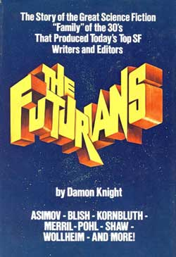

<!-- translated by Yandex Translate -->

# Путь к блогам будущего

Фредерик Пол

## Я и Альфи, часть 5: Сотрудничество и Футурианцы

* Часть 5 “Альфред Бестер и Фредерик Пол — беседа”, записанная 26 июня 1978 года в кинотеатре "Тайнсайд", Ньюкасл-апон-Тайн, Великобритания.*

Аудитория: Не могли бы вы подробнее рассказать о том, как вы пишете в соавторстве с кем-то?

Пол: С [**Сирилом Корнблатом**](/posts/2009-04-20-cyril/)? Что ж, с разными людьми все по-разному. Это все равно что быть женатым! Кстати, Альфи, ты когда-нибудь сотрудничал с художественной литературой?

Бестер: Никогда. Я никогда в жизни не сотрудничал. Я всегда был абсолютным одиночкой.

Пол: Боюсь, я был гораздо более неразборчивым в связях, чем ты!

Бестер: Мне тоже любопытно, Фред. Каково было работать с Сирилом?

Пол: Ну, мы с Сирилом Корнблатом выросли вместе. Мы начали писать вместе, когда мне было лет 18 или 19, а Сирилу, может быть, 15. Мы принадлежали к организации под названием ["Футурианцы";](/posts/2009-05-08-the-quadrumvirate/) это был клуб фэнов научной фантастики в Нью-Йорке в конце 30-х и начале 40-х. Есть книга [Деймона Найта](https://web.archive.org/web/20170619231008/http://www.gcwillick.com/Spacelight/DKnight.html) под названием "[Футурианцы](https://web.archive.org/web/20170619231008/http://www.amazon.com/gp/product/B0006COUA8?ie=UTF8&tag=twtfb-20&linkCode=as2&camp=1789&creative=390957&creativeASIN=B0006COUA8)", которая, я думаю, сейчас печатается здесь, полная всевозможных клеветнических сплетен обо всех нас. Многое из этого правда, но ему все равно не следовало этого говорить! Такие люди, как [** Айзек Азимов**](/posts/2010-01-25-isaac-part-1-of-i-don-t-know-how-many/), [Дон Уоллхейм](https://web.archive.org/web/20170619231008/http://www.gcwillick.com/Spacelight/wollheim.html) и другие, хорошо заплатили бы ему за то, чтобы он не публиковал эту книгу.

Но мы все принадлежали к этому клубу, и мы все хотели писать, и мы все старались. Мы с Сирилом начали работать вместе, и поскольку мы только начинали писать, то переняли многие писательские привычки друг друга. Мы начинали почти одинаково, мы привыкли друг к другу. А потом началась война. Он пошел в одну сторону, а я - в другую. А потом мы снова собрались вместе на Торговцах Космосом([The Space Merchants](https://web.archive.org/web/20170619231008/http://www.amazon.com/gp/product/0312749511?ie=UTF8&tag=7159-20&linkCode=as2&camp=1789&creative=390957&creativeASIN=0312749511)). А с Сирилом, поскольку у нас был общий опыт и общие взгляды, написание большей части того, что мы писали, проходило почти безболезненно. Всего мы опубликовали, по-моему, семь романов и, может быть, 30 или 40 коротких рассказов.

Бестер: Вы сотрудничали построчно?

Пол: В основном мы просто некоторое время разговаривали друг с другом. Он приходил ко мне домой в Ред-Бэнк, где мы сняли для него комнату с его собственной пишущей машинкой, и мы какое-то время сидели и выпивали, а когда выпивка заканчивалась, начинали серьезно обсуждать, какую книгу мы планируем написать. И мы обдумывали ситуацию и говорили о нескольких персонажах и о том, что с ними может случиться, и пока разговор шел своим чередом, мы продолжали говорить. Мы ничего не записывали на бумаге.

А потом, когда мы начинали сдаваться и казалось, что все готово к написанию, мы подбрасывали монетку, и проигравший поднимался на третий этаж — пишущая машинка Сирила стояла там в одной комнате, а моя — в другой - и он писал первые четыре страницы. А потом, в конце этих четырех страниц, которые иногда обрывались на середине строки или слова, он спускался вниз или я спускался вниз и говорил: “Ты в деле”.

Мы назвали это “Системой горячей печатной машинки” - просто продолжайте работать днем и ночью, — и на самом деле мы обычно работали без сбоев.

Бестер: Теперь ты в деле, верно?  Ты поднимаешься наверх и читаешь первые четыре страницы. Итак, случалось ли когда-нибудь, чтобы вы пришли и сказали: “Сирил, ты не в своем уме? Они не могут сделать это таким образом?”

Пол: Ни разу. Пару раз, когда мы приближались к концу романа и у нас немного кружилась голова, мы подшучивали друг над другом. В конце одного романа была сцена, когда внизу последней страницы я попросил кого-то посмотреть в микроскоп, и следующая строка была: “Что он увидел?”, и я сказал, что это был Чарли Чаплин в шляпе-котелке. Тогда я спустился вниз и сказал: “Продолжай в том же духе”.

Но он одурачил меня — он просто перечеркнул эту черту. Обычно мы даже не зачеркивали линию, а просто проезжали от линии к линии. Страницы с 5 по 8 будут принадлежать Сирилу, а страницы с 9 по 12 - мои; мы просто продолжали читать, пока не дошли до конца книги. Это был черновой вариант, и он всегда переписывался от начала до конца кем-нибудь из нас, почти всегда мной, за исключением одного романа, "[Волчья](https://web.archive.org/web/20170619231008/http://www.amazon.com/gp/product/0575071354?ie=UTF8&tag=twtfb-20&linkCode=as2&camp=1789&creative=390957&creativeASIN=0575071354) Напасть(Wolfbane)", который был последним, написанным Сирилом перед смертью, и в процессе переписывания было довольно много правок. Но в принципе, когда мы заканчивали, роман был готов, и иногда на написание целого романа уходило всего пять или шесть дней, потому что мы работали над ним по 24 часа в сутки.

Бестер: У меня есть еще один вопрос! С точки зрения времени, иногда на четыре страницы уходило четыре минуты, четыре часа, четыре дня, сколько?

Пол: Ну, есть отличный стимул ускориться, когда ты знаешь, что другой парень там, внизу, отлично проводит время, и ты хочешь покончить с этим как можно быстрее, так что обычно это занимало всего пару часов. Ты знаешь, что другой парень ждет, и если ты не спустишься туда в ближайшее время, он отправится в какой-нибудь бар. Так что мы сработали довольно быстро. Это хороший способ написать книгу с участием двух людей, которые достаточно близки по своим способам работы, чтобы не убивать друг друга.

Однажды я написал роман с [** Лестером дель Реем**](/posts/2009-11-03-lester-and-judy-lynn-del-rey/), и мы чуть не убили друг друга. До этого момента он был одним из моих самых близких друзей. Теперь мы никогда больше не напишем вместе ни слова.

Бестер: Почему с ним было трудно?

Пол: Способ работы Лестера полностью отличается от моего. Мне не нравится знать заранее, как все будет. Лестер настаивает на этом — он не может написать роман, если к тому времени, когда у него будет первая строка на бумаге, он не будет знать, какой будет последняя строка.

Лестер, предоставленный самому себе, будет сидеть за пишущей машинкой и печатать первые строчки около недели. Вставляет листок бумаги, набирает первую строку, выбрасывает его. Начинается сначала. Как только он добирается до второй или третьей строчки, роман сменяет друг друга, как ночь день, и он знает все.

Я не могу этого сделать. Мне нравится удивляться по ходу дела. Два или три раза в своей жизни я был близок к тому, чтобы убить кого-то, и одним из них был Лестер, когда мы писали этот роман. Так что у разных людей все по-разному.

Я написал, по-моему, семь романов с [** Джеком Уильямсоном**](/posts/2010-08-12-jack-the-wonderful-williamson-part-1-of-many/), и они совершенно разные.

Бестер: Как с ним было работать?

Пол: С Джеком просто чудесно работать. Он нежный, терпеливый, понимающий, терпимый человек, иначе мы бы этого не делали. Мы проводим много времени в переписке, поскольку он живет в Нью-Мексико, а я в Нью-Джерси, которые находятся на расстоянии 2000 миль друг от друга. Время от времени мы встречаемся и разговариваем. Мы обмениваемся письмами, и иногда переписка оказывается толще романа. Затем он пишет полный первый черновик, из которого я выбрасываю большие части, добавляю новые и переписываю то, что осталось, и то, что из этого получается, обычно публикуется. С последующим некоторым переписыванием/полировкой. Но это не самый трудоемкий метод.

У нас с Сирилом это было трудоемко. Мы могли бы написать все книги в Британском музее, если бы захотели. Я думаю, что мы работали около шести лет, когда он умер, и за это время мы написали семь романов и еще кое-какие мелочи. Если бы он был жив, я думаю, мы бы уже написали сотню романов.

Бестер: Что он был за парень? Я никогда с ним не встречался.

Пол: Сирил Корнблат был одним из самых блестящих людей, которых я когда-либо знал в своей жизни. Остроумный, язвительный, сардонический, быстрый. Он был толстым и низкорослым — физически он был похож на пельмень. У него был глубокий отцовский голос. У него был такой акцент, который присущ жителям Срединно-Атлантического хребта. Это был своего рода акцент радиодиктора. По этому вы ничего не смогли бы определить. У него был красивый разговорный голос и хорошее пение.

Во время войны он участвовал в [битве в Арденнах](https://web.archive.org/web/20170619231008/http://www.pbs.org/wgbh/amex/bulge), неся пулемет 50-го калибра по снегу и льду в Арденнском лесу. Он повредил себе сердце и в конечном счете умер от этого 10 лет спустя. Он заметил, что у него что-то не в порядке с сердцем, потому что время от времени он продолжал падать. Он пошел к своему врачу, который сказал: “Хорошо, мистер Корнблат, я могу сказать вам, в чем ваша проблема. У вас эссенциальная злокачественная гипертензия, и вы умрете в течение года, если не прекратите курить, пить, употреблять соль, перец и любые другие специи, и если вы не начнете регулярно спать по 10 часов в сутки”, и многое другое.

Около трех недель Сирил добросовестно старался делать то, что сказал врач. Он также должен был принимать ранние транквилизаторы, Раувольфию, резерпин или что-то в этом роде. В результате он превратился в какой-то овощ. Этот очень быстрый ум становился медлительным и неуклюжим, и вы спрашивали его о чем-то, а он не был уверен, знает он или нет. Из одного из самых умных и расторопных людей, которых я когда-либо встречал, он превратился в своего рода комическую фигуру. Вы знаете, У.К. Филдс в своих самых неуклюжих проявлениях всегда был быстрее Сирила в то время.

Поэтому он принял сознательное решение и сказал: “Что ж, я вернусь к своим злым путям, и если я умру в течение года, то, по крайней мере, я проживу год!” И он это сделал, и умер примерно через год.

Бестер: Какой была [**его жена**](/posts/2010-12-09-mary-byers-kornbluth-part-1-a-fan-is-born/)?

Пол: Они познакомились, когда она была юной фэн. У них двое детей. Она все еще живет на севере штата Нью-Йорк.

Бестер: Причина, по которой я так очарован Сирилом, заключается в том, что я прочитал эту ужасную книгу Деймона Найта под названием "Футурианцы". Фред абсолютно прав. Это никогда не должно было быть написано. И хотя меня нет в книге, я бы лично убил Деймона за то, что он собрал все это воедино. Это возмутительно, это просто полный безвкусный скандал. Видеть людей в их худшем проявлении.

Существует правило: вы никогда не должны возвращаться в гримерную актера, если вам понравилось выступление актера на сцене. Есть несколько исключений — их немного, и Фред, конечно, одно из них — из числа писателей, которые являются тем, что они пишут. Но они очень редки. Очень часто парень мог бы написать блестящую историю, блестящий сценарий, блестящий роман или что-то еще, а вы встречаете его, и он оказывается тупицей номер один в мире. Не ждите, что писатель будет таким, каким он пишет.

В связи с чем возникает очень интересный вопрос: где же реальность? Пишет ли писатель то, что он делает, от разочарования? Является ли он тупицей в реальной жизни, потому что боится делать то, что он делает на своей работе? Я не знаю.

Я помню, как однажды я читал лекцию в Чикаго, и меня водили по какому-то парку, и мой гид срезал путь через лужайку, перепрыгнув через знак с надписью “Не наступать на траву”, и я наотрез отказался. Я сказал: “Я пройдусь по кругу на прогулке, я не собираюсь этого делать”.

И он посмотрел на меня с удивлением. “Боже мой!“ - сказал он, "Бестер, ты нарушаешь все правила в мире в своих сочинениях и подчиняешься знаку ”Не наступать на траву"?"

* Скоро будет продолжение этого увлекательного выступления.*

**Связанные должности:**

- ** Альфи,** [** Часть 1**](/posts/2011-03-08-alfie/), [** Часть 2**](/posts/2011-03-10-alfie-part-2-when-bester-was-the-best/)
- ** Я и Альфи,** [** Часть 1**](/posts/2011-03-25-me-and-alfie/), [** Часть 2**](/posts/2011-03-28-me-and-alfie-part-2-gateway-and-the-art-of-writing/), [** Часть 3**](/posts/2011-03-30-me-and-alfie-part-3-ideas-and-the-demolished-man/), [** Часть 4**](/posts/2011-04-01-me-and-alfie-part-4-rejection/), [** Часть 6**](/posts/2011-04-06-me-and-alfie-part-6-john-w-campbell-and-dianetics/), [** Часть 7**](/posts/2011-04-08-me-and-alfie-part-7-cyclothymia/), [**Часть 8**](/posts/2011-04-11-me-and-alfie-part-8-hollywood-and-the-name-game/)
- ** Дистиллированная писательская мудрость Фреда **, [** Сотрудничество **](/posts/2010-04-27-fred-s-distilled-writing-wisdom-part-2-collaboration/), [** Что делает другой парень **](/posts/2010-10-06-fred-s-distilled-writing-wisdom-part-3/)

### 4 Комментария

- Дэвид Голдфарб говорит:
Мне вспоминается цитата из Флобера: “Будьте регулярны и упорядоченны в своей жизни, чтобы вы могли быть жестокими и оригинальными в своей работе”.
[** 4 апреля 2011 года, 1:00 утра**](/posts/2011-04-04-me-and-alfie-part-5-collaboration-and-the-futurians/)
- [Стив Бойко](https://web.archive.org/web/20170619231008/http://www.traingeek.ca/) говорит:
Мне действительно нравится эта серия ... спасибо, что поделились ею!
[**4 апреля 2011 года, 9:45 утра**](/posts/2011-04-04-me-and-alfie-part-5-collaboration-and-the-futurians/)
- Дэвид Б. Уильямс говорит:
Не спешите искать экземпляр "Футурианцев" только ради обещанного зловещего контента. Я прочитал ее, когда она вышла, и еще раз пару лет назад, и ничто не показалось мне особенно возмутительным. Реальные люди, конечно, и довольно интересные.
[**4 апреля 2011 года, 11:49 утра**](/posts/2011-04-04-me-and-alfie-part-5-collaboration-and-the-futurians/)
- Форрест Лисон говорит:
Я безумно любил Футурианцев, особенно стенгазеты.
[**5 мая 2011 года, 12:10 вечера**](/posts/2011-04-04-me-and-alfie-part-5-collaboration-and-the-futurians/)

[WordPress](https://web.archive.org/web/20170619231008/http://wordpress.org/)
[TWTFB2](https://web.archive.org/web/20170619231008/http://dicksmithsoftware.com/)