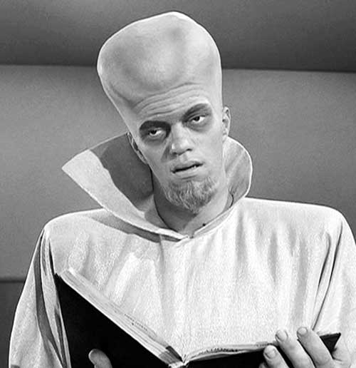

# The Way the Future Blogs

Frederik Pohl

## Are Bigger Brains Better?

Remember those good old science-fiction stories, those scientifically impeccably accurate ones that pointed out that. as the human brain has been getting bigger and bigger ever since Lucy. it must be going to keep on getting bigger still?  So those great [Frank R. Paul](https://web.archive.org/web/20170620003127/http://www.frankwu.com/paul1.html)-ish illustrations showed the man of the future with a torso the size of a chimpanzee’s and a bald skull as big as a watermelon?

Turns out they weren’t really scientifically probable.  Human brains have been getting bigger, all right, but that’s mostly because human beings themselves are getting bigger all over.  And as far as bigger brains making us smarter is concerned, there are other ways to look at the matter.  In [New Scientist](https://web.archive.org/web/20170620003127/http://www.newscientist.com/article/mg20727711.300-size-isnt-everything-the-big-brain-myth.html) a while ago the magazine drew up some interesting comparisons for us to look at showing, in order of size, smallest first, the brains of—

1, mouse, 2, cat, 3, chimpanzee, 4, human, 5, dolphin and 6, elephant1, mouse, 2, cat, 3, elephant, 4, chimpanzee, 5, dolphin and 6, human.

That’s a bit more flattering to us genus homo people, but then they spoil it all by offering a third display, this one displaying brain weight as a percentage of body mass.  This cuts us right down to size:

1, elephant, 2, chimpanzee, 3, dolphin, 4, cat, 5, human, and 6, mouse

—with the mouse display in these terms towering over all the others, its relative mass greater than all five of the others combined.  (The mass of a mouse’s brain amounts to 10 percent of its body weight, while that of the human is a measly 2 percent and that for the other animals trailing down to as little as 0.1 percent for the once dominant elephant.)

But if you want a really humiliating brain size comparison forget about those vertebrates and compare our brain with, say, a honeybee’s. The bee’s intelligence is generally equal to, say, a two-week-old human baby’s — with a brain mass differential by a factor of something over 100,000.

It’s a good thing computers came along when they did.  We can use all the help we can get.

### 6 Comments

- Mark Pontin says:
More grist for your counter-intuitive mill: 
current science strongly indicates thatour brains have in fact been decreasing in size in recent millenia. A modern human’s brain is on average smaller than a cro magnon human’s. See here —  

[http://discovermagazine.com/2010/sep/25-modern-humans-smart-why-brain-shrinking](https://web.archive.org/web/20170620003127/http://discovermagazine.com/2010/sep/25-modern-humans-smart-why-brain-shrinking)  

[http://johnhawks.net/weblog/mailbag/teacher-who-doubted-the-shrinking-brain-2010.html](https://web.archive.org/web/20170620003127/http://johnhawks.net/weblog/mailbag/teacher-who-doubted-the-shrinking-brain-2010.html)
It’s not clear yet whether this shrinking is because our brains are becoming more efficient or, alternatively, we are taking the route that your late partner, C.M. Kornbluth, suggested in one of his most famous stories.
[**May 9, 2011, 4:52 pm**](/posts/2011-05-09-are-bigger-brains-better/)
- Jim Worrad says:
There maybe something to Douglas Adams’ super intelligent mice afterall…
[**May 9, 2011, 7:59 pm**](/posts/2011-05-09-are-bigger-brains-better/)
- [Lisa Osman](https://web.archive.org/web/20170620003127/http://hermitism.com/) says:
Very interesting comparisons. I wonder if it’s partly because bees fly. And I do remember reading old science fiction stories about how the human race evolves into giant brains in the future. However, in my anthropology class, we were taught that human brains have been shrinking for the past 20,000 years. What’s more, the surface of the brain is becoming more complex. I tried to find an article I could link to that would talk about both, but so far all I’m coming up with is [speculations about the shrinkage](https://web.archive.org/web/20170620003127/http://discovermagazine.com/2010/sep/25-modern-humans-smart-why-brain-shrinking). Although that one claims that our brain size is starting to rise again.
[**May 10, 2011, 12:17 am**](/posts/2011-05-09-are-bigger-brains-better/)
- Dwight Decker says:
A large brain would correlate in general with increased intelligence, just on account of there being more to work with. But there’s also the matter of what part of the brain is large. For intelligence of the sort people usually think of in this connection, you’d want to look at the frontal lobe or the cerebral cortex. I’ve heard the thing about shrinking human brains, too, but I wonder if again, people are thinking absolute brain size = X amount of intelligence. The question is what part of the brain has shrunk. Our ancestors could probably identify far more odors than we can, since we still carry a great many dead or inactive OR genes (Olfactory Receptor) in our genome. (See the discussion in the book WHY EVOLUTION IS TRUE by Jerry Coyne, page 69-71). If we’ve lost the ability to identify roughly half the odors our ancestors could and no longer live in a sensory world based on smell, that would mean a lot of olfactory processing space in our brains would no longer be needed — maybe that was what was lost, not intelligence per se.
[**May 11, 2011, 12:18 pm**](/posts/2011-05-09-are-bigger-brains-better/)
- [Bill Goodwin](https://web.archive.org/web/20170620003127/http://771715/) says:
The brain is also a radiator.  A more convoluted surface increases it’s efficiency in this respect, meaning that it can shrink in volume.
[**May 13, 2011, 3:07 am**](/posts/2011-05-09-are-bigger-brains-better/)
- [Adam](https://web.archive.org/web/20170620003127/http://icarusinterstellar.org/) says:
A correction to this little comparison is the fact that different mammals pack different numbers of neurons into the same volume of brain. Rodents have a much lower neuron density compared to primates. But, as primates, human brains are about the right rize for the number of neurons. We really do have scaled-up monkey brains in our skulls. So next time some criticizes Darwinism as meaning we have monkeys as relatives remind them of that little datum.
[**June 20, 2011, 7:30 pm**](/posts/2011-05-09-are-bigger-brains-better/)

[WordPress](https://web.archive.org/web/20170620003127/http://wordpress.org/)
[TWTFB2](https://web.archive.org/web/20170620003127/http://dicksmithsoftware.com/)