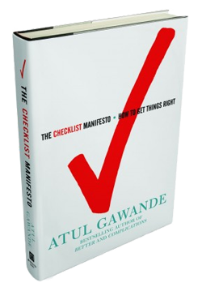

# The Way the Future Blogs

Frederik Pohl

## How Boeing Almost Went Broke

A new book worth a look

Back in 1935, The Boeing Company was proudly getting ready to show off its brand-new four engine bomber, not yet named either [B-17 or Flying Fortress](https://web.archive.org/web/20170707095421/http://www.boeing.com/history/boeing/b17.html).  It had a few problems.  Little ones like the fact that its control surfaces, rudders and elevators, were of a size and flexibility that could be damaged by even gentle wind gusts when the aircraft was parked.  The engineers fixed that right away with an automatic high-tech locking mechanism, and the plane was readied for a demonstration flight.

That didn’t go well, though.  The pilots lost control.  The plane crashed and burned, and it looked like this new plane, on the development of which Boeing had sunk big chunks of its capital, would lead the company into bankruptcy.  The engineers began developing foolproof devices to do the job —

Until somebody showed up and told them to sell all those automatic devices for scrap.  What he offered instead was a typewritten list of every last setting of dial and turn of switch that had to be properly done before the big ship could be allowed to lumber onto its takeoff strip to get airborne.

“The co-pilot,”  he said.  “will just read this list to the pilot, who will check every item to see that it is in compliance before they set the brakes and build up the speed for takeoff.”  And so the co-pilot on that next test flight of one of those four-engine monsters did, and so has done every co-pilot who sat down at a B-17’s controls since.  That is, he read the checklist for every pilot ever since, and not one of those 13,000 B-17s that were then built and sold crashed because someone forgot a step on that checklist, as they came to be called.

Since then checklists have been developed for surgical operations, running a restaurant kitchen, building a skyscraper and many other complex tasks.  See how great real simple ideas can be?

([The Checklist Manifesto: How to Get Things Right](https://web.archive.org/web/20170707095421/http://www.amazon.com/gp/product/0805091742/ref=as_li_ss_tl?ie=UTF8&tag=twtfb-20&linkCode=as2&camp=217145&creative=399349&creativeASIN=0805091742) by Atul Gawande, Henry Holt,  $24.50 US.)

[WordPress](https://web.archive.org/web/20170707095421/http://wordpress.org/)
[TWTFB2](https://web.archive.org/web/20170707095421/http://dicksmithsoftware.com/)