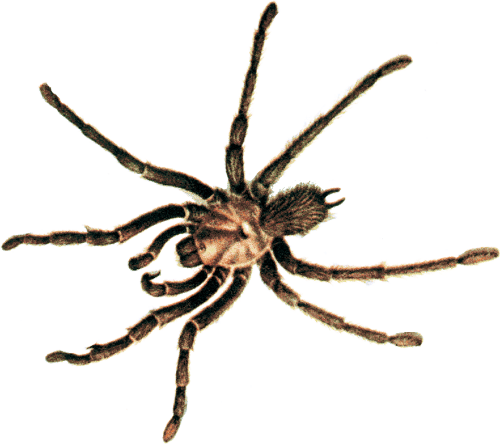

<!-- translated by Yandex Translate -->

# Путь к блогам будущего

Фредерик Пол

## Пауки-ловушки

[Кит П. Грэм](https://web.archive.org/web/20170619203141/http://www.cthreepo.com/) спрашивает, не напишу ли я статью о The Trap Door Spiders, нью-йоркском клубе для писателей НФ и подобных им людей, но я вынужден взять самоотвод.  Хотя Википедия, похоже, считает, что я был ее участником, я никогда им не был.

TDS была основана [** Флетчером Праттом**](/posts/2010-12-07-fletcher-pratt/) в 1945 году, в то время, когда мы с ним были не более чем недавними знакомыми. Википедия утверждает, что клуб был создан потому, что Флетчер и другие друзья-мужчины [Джона Д. “Дока” Кларка](https://web.archive.org/web/20170619203141/http://spec.lib.vt.edu/aerosp/aerospgd/clarkj.htm) терпеть не могли новую жену Дока, Милдред, и им пришла в голову идея создать клуб для ланчей только для мужчин, чтобы они могли проводить время с Доком без Милдред.

Это звучит правдоподобно.  Я не очень хорошо знал Милдред, но ей, очевидно, было не очень-то по душе прежнее пьянство Дока. приятели. Двое из приверженцев TDS были моими самыми близкими друзьями, [** Лестер дель Рей**](/posts/2009-11-03-lester-and-judy-lynn-del-rey/) и [** Айзек Азимов**](/posts/2010-01-25-isaac-part-1-of-i-don-t-know-how-many/), но ни они, ни кто-либо другой никогда не приглашали меня присоединиться.  Возможно, тот факт, что я публично сказал, что подобные вещи меня не интересуют, как-то связан с этим.  А может быть, и нет; я не знаю.

Айзек написал [кучу детективов](https://web.archive.org/web/20170619203141/http://www.amazon.com/gp/product/B0021YJ24I/ref=as_li_ss_tl?ie=UTF8&tag=twtfb-20&linkCode=as2&camp=217145&creative=399373&creativeASIN=B0021YJ24I) о клубе, созданном по образцу TDS, которые, я думаю, дают хорошее представление о том, на что это было похоже.

### 3 Комментария

- Дэвид Голдфарб говорит:
Теперь я отредактировал соответствующие записи в Википедии; они больше не утверждают, что вы были участником.
[** 23 июня 2011 года, 1:08 утра**](/posts/2011-06-23-the-trap-door-spiders/)
- [Билл Хиггинс - жокей на бревне](https://web.archive.org/web/20170619203141/http://beamjockey.livejournal.com/) говорит:
* Кит П. Грэм спрашивает, сделаю ли я пост о пауках-ловушках, [...] но я вынужден взять самоотвод.*
Если бы вы хотели дешево посмеяться, вы могли бы написать: “Я вынужден замкнуться в себе”.
[** 28 июня 2011 года, 14:10 вечера**](/posts/2011-06-23-the-trap-door-spiders/)
- Келли говорит:
Забавно, Билл, именно так я прочитал это в первый раз!
[**11 июля 2011, 10:42 вечера**](/posts/2011-06-23-the-trap-door-spiders/)