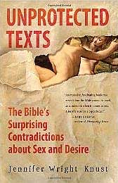

<!-- translated by Yandex Translate -->

# Путь к блогам будущего

Фредерик Пол

## Насколько хорошо Вы знаете свою Библию?

Ну, может быть, это не совсем ваша Библия, потому что в наши дни мир многонационален, но, вероятно, вы знаете, о какой Библии мы говорим.  Или, во всяком случае, о чем говорит преподобная Дженнифер Райт Кнуст, потому что мы позаимствовали несколько выдержек из ее новой книги "[Незащищенные тексты](https://web.archive.org/web/20170707044927/http://www.amazon.com/gp/product/0061725587/ref=as_li_ss_tl?ie=UTF8&tag=twtfb-20&linkCode=as2&camp=217145&creative=399373&creativeASIN=0061725587)".

Итак, вот вам четыре вопроса, все с несколькими вариантами ответов, чтобы упростить задачу, потому что по закону средних чисел вы должны ответить правильно хотя бы на один:

- Библия говорит о гомосексуальности: Левит описывает мужское половое спаривание как мерзость.Лесбиянку следует побить камнями на пороге дома ее отца.Здесь много двусмысленности и нет никаких указаний на физическую близость, но некоторые читатели указывают на подозрительно близкую любовь Руфи и Наоми или на заявление царя Давида Ионафану: “Твоя любовь ко мне была чудесной, превосходящей любовь женщин".  (11 Царств 1:23-26)
- В Библии эротические тексты запрещены Второзаконием как “прелюбодеяние сердца”. Примером может служить “Песнь песней”, в которой прославляется секс сам по себе.Не упомянуто.
- Среди запрещенных видов сексуального поведения: супружеская измена, инцест.Секс с ангелами.
- Жители Содома были осуждены главным образом за гомосексуальность.Богохульство.Отсутствие сострадания к бедным и нуждающимся.

Ладно, отложите карандаши, но подождите ответов до следующей недели, когда они, вероятно, появятся в этом разделе,

### 5 Комментариев

- Маргарет говорит:
О, вау!  Мне кажется, я страстно желаю эту книгу.  Спасибо за подсказку.
[** 24 июня 2011 года, 8:50 утра**](/fred-pohl/2011-06-24-how-well-do-you-know-your-bible/)
- [Шакатани](https://web.archive.org/web/20170707044927/http://shakatany.livejournal.com/) говорит:
Мне кажется, я довольно хорошо знаю Библию, хотя я атеист. Я посмотрю, насколько хорошо я справился на следующей неделе.
[** 24 июня 2011 года, 10:10 утра**](/fred-pohl/2011-06-24-how-well-do-you-know-your-bible/)
- [Кен Хоутон](https://web.archive.org/web/20170707044927/http://www.angrybearblog.com/) говорит:
Можно ли с уверенностью предположить, что “все вышеперечисленное” или, по крайней мере, несколько ответов могут быть правильным ответом?
Единственный, на который, я готов поклясться, есть только один ответ - 4. (Ответ, мягко говоря, предсказательный.)
[**25 июня 2011, 19:02 вечера**](/fred-pohl/2011-06-24-how-well-do-you-know-your-bible/)
- Его превосходительство Пармер говорит:
“Большинство людей читают Библию в достаточно малых дозах, чтобы обезопасить себя от ее смысла”. [
** 26 июня 2011 г., 10:56 вечера**](/fred-pohl/2011-06-24-how-well-do-you-know-your-bible/)
- Джо из Бруклина говорит:
1. Все вышеперечисленное.  И не забывайте о сомнительной одержимости Святого Павла крайней плотью юного святого Тимофея!
2. С. 
3. С.  

“секс с ангелами” - это деф. выход — никакой двусмысленности здесь нет. Все остальное разрешено или позволено известными персонажами.
4. Б. Если бы я был Богом, богохульство было бы единственным грехом, на который мне было бы наплевать.
[**27 июня 2011 года, 18:40 вечера**](/fred-pohl/2011-06-24-how-well-do-you-know-your-bible/)

[WordPress](https://web.archive.org/web/20170707044927/http://wordpress.org/)
[TWTFB2](https://web.archive.org/web/20170707044927/http://dicksmithsoftware.com/)