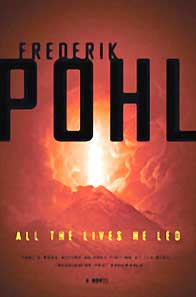

# The Way the Future Blogs

Frederik Pohl

## Top 10 SF/Fantasy: 2011

Oh, and by the way, have you noticed that [Booklist Online’s](https://web.archive.org/web/20170717164549/http://www.booklistonline.com/) latest list of the [ten best science-fiction and fantasy books](https://web.archive.org/web/20170717164549/http://copperqueenlibrary2.blogspot.com/2011/05/booklists-top-10-sffantasy-2011.html) of the year and, oh, my goodness, Number One on the list is [All the Lives He Led](https://web.archive.org/web/20170717164549/http://www.amazon.com/gp/product/0765321769/ie=UTF8&tag=twtfw-20&linkCode=as2&camp=1789&creative=390957&creativeASIN=0765321769) by You Know Who.  (Number Two is old friend [Larry Niven’s](https://web.archive.org/web/20170717164549/http://www.larryniven.org/larry.shtml) [The Best of Larry Niven](https://web.archive.org/web/20170717164549/http://www.amazon.com/gp/product/1596063319/ref=as_li_ss_tl?ie=UTF8&tag=twtfb-20&linkCode=as2&camp=217145&creative=399369&creativeASIN=1596063319)  and the third begins with a D, but let’s not hear any loose talk about alphabetizing lists of titles around here.)

### 2 Comments

- [Tucker](https://web.archive.org/web/20170717164549/http://jazzfish.dreamwidth.org/) says:
heh. Congratulations, in any case!
“Well, you know, _Tristram Shandy_ was ranked number 5 in a recent list of the world’s best novels.”  

“Yes… well… that list was chronological, wasn’t it?”  

–_A Cock And Bull Story_
[**June 25, 2011, 6:49 am**](/fred-pohl/2011-06-25-top-10-sf-fantasy-2011/)
- Chris says:
I’m delighted to see that the novel is finally available for Kindle–I’ll be buying it today! I look forward to reading it just as I’ve looked forward to every Pohl novel for the past 30 years.
[**June 26, 2011, 6:51 am**](/fred-pohl/2011-06-25-top-10-sf-fantasy-2011/)

[WordPress](https://web.archive.org/web/20170717164549/http://wordpress.org/)
[TWTFB2](https://web.archive.org/web/20170717164549/http://dicksmithsoftware.com/)