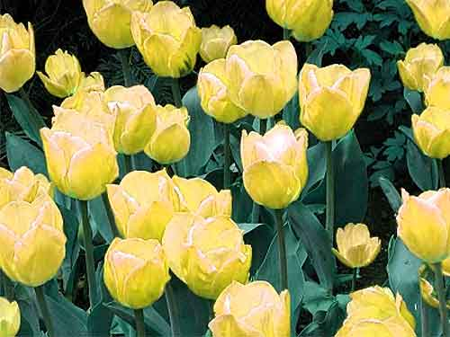

<!-- translated by Yandex Translate -->

# Путь к блогам будущего

Фредерик Пол

## Несколько приятных вещей, которые мы можем сделать для борьбы с глобальным потеплением

*Часть первая:*
  
  

Все любят цветы, верно?  Но некоторые люди любят их больше, чем другие.  Возьмем, к примеру, голландцев.  Они выращивают их по метрической тонне каждый год и прилагают немало усилий, чтобы заставить их расти быстрее, чем обычно, чтобы убедить цветы выращивать дополнительный урожай каждый год, потому что каждый месяц - хороший месяц для продажи цветов голландцам, поскольку они продают их все примерно в течение года.

Так как же они заставляют их расти быстрее?  Один из способов - это своего рода принудительное кормление их, предоставляя им больше химических веществ, которые в результате их фотосинтетического метаболизма превращаются в растения и, следовательно, в цветы.  И что это за химическое вещество, которое растения поглощают с такой жадностью?  Ведь это не что иное, как наш старый друг — или враг — углекислый газ.  Так что один из их голландских трюков в торговле заключается в сжигании небольшого количества природного газа в теплицах.

Сжигаемый газ на одном конце их маленьких печей выделяется в виде углекислого газа на другом. “Вкуснятина!” - говорят растения, растущие быстрее, чем когда-либо.  “Ка-цзин!”  скажем, голландские кассовые аппараты, поскольку их заводы расположены по всему миру.  И все счастливы.

Но они могут стать еще счастливее, о чем мы расскажем во второй части этой серии, которая выйдет примерно через неделю.

### 4 Комментария

- [Филлип Хелбиг](https://web.archive.org/web/20170718091007/http://www.astro.multivax.de:8000/helbig/helbig.html) говорит:
Не уверен, что это должно быть шуткой.
Во-первых, углерод из природного газа - это углерод, который в противном случае не выделялся бы, поэтому они не потребляют CO2, который где-то вызывает проблему.  Во-вторых, цветы скоро разлагаются, выделяя в атмосферу CO2, которого в противном случае там не было бы.
Установка эквивалентна сжиганию природного газа.  Чем больше мы сжигаем, тем больший вклад вносим в глобальное потепление.
[**3 августа 2011 года, 11:53 утра**](/fred-pohl/2011-08-03-some-nice-things-we-can-do-about-global-warming/)
- Пэт говорит:
У меня были восхитительно вкусные помидоры, выращенные в промышленных масштабах в теплицах на острове Уайт с использованием отработанного CO2 с электростанции. Я бы предположил, что вторая часть будет примерно такой – наберись терпения, Филипп.
Я надеюсь, Филлип, ты компостируешь свои мертвые цветы, не позволяя им разлагаться только до CO2 и воды.
[**6 августа 2011 года, 11:44 утра**](/fred-pohl/2011-08-03-some-nice-things-we-can-do-about-global-warming/)
- [Филлип Хелбиг](https://web.archive.org/web/20170718091007/http://www.astro.multivax.de:8000/helbig/helbig.html) говорит:
Это сработает только в том случае, если CO2 попадет на растения, которые остаются нетронутыми в течение длительного времени: десятилетий или столетий.  Если их съедят, то вы выдыхаете углекислый газ!
Выброс CO2 с электростанции, по крайней мере, не увеличивает уже сжигаемое количество.  Однако сжигать что-либо можно было бы только для теплицы.
[**9 августа 2011 года, 4:19 утра**](/fred-pohl/2011-08-03-some-nice-things-we-can-do-about-global-warming/)
- Пэт говорит:
Филипп, сколько помидорных листьев и кореньев ты съедаешь? 
Возможно, вам стоит дождаться части 2.
[**11 августа 2011 года, 17:53 вечера**](/fred-pohl/2011-08-03-some-nice-things-we-can-do-about-global-warming/)

[WordPress](https://web.archive.org/web/20170718091007/http://wordpress.org/)
[TWTFB2](https://web.archive.org/web/20170718091007/http://dicksmithsoftware.com/)