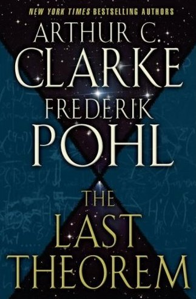

<!-- translated by Yandex Translate -->

# Путь к блогам будущего

Фредерик Пол

## Шри-Ланка, война и сотрудничество

Когда я писал Последнюю теорему([The Last Theorem](https://web.archive.org/web/20170619213153/http://www.amazon.com/gp/product/0345470214?ie=UTF8&tag=7159-20&linkCode=as2&camp=1789&creative=9325&creativeASIN=0345470214)) с сэром [** Артуром Кларком**](/fred-pohl/2009-01-05-sir-arthur-and-i/), я счел необходимым в сюжетных целях, чтобы герой, Ранджит Субраманьян, провел длительный период в тюрьме, в одиночной камере.

Очевидным способом добиться этого было втянуть Ранджита в [гражданскую войну в Шри-Ланке](https://web.archive.org/web/20170619213153/http://www.globalsecurity.org/military/world/para/ltte.htm) между правящими сингальцами, у которых была привычка сохранять все властные посты за собой, и мятежными тамильскими тиграми, которые хотели участвовать в управлении.  (И сингальцы, и тамилы были незваными иммигрантами из Индии.  Сингальцы, однако, прибыли раньше.)

Война была продолжительной и кровопролитной, и это прекрасно вписывалось в мои общие планы относительно романа, поэтому я с радостью написал около десяти или двадцати тысяч слов, воплощающих этот материал. Я продвинулся в рассказе еще на несколько страниц, отсылая куски по двадцать-тридцать страниц Артуру по мере того, как заканчивал их, для его комментариев, предложений и одобрения.

К тому времени Артур начал болеть.  Он по-прежнему все читал и оставлял мне отзывы, но это заняло у него больше времени.  Я опережал его чтение на пятьдесят-семьдесят пять страниц, но я не волновался, поскольку знал, что то, что я пишу, было довольно хорошим материалом.

Однако это был не тот довольно хороший материал.

Следующее письмо Артура было длиннее обычного и гораздо более встревоженным.  Неужели я забыл (спросил он), что он был гостем в стране Шри-Ланка, и его разрешение на постоянное проживание может быть отозвано в любой момент, когда правительство сочтет его позорным?

Ну, на самом деле я забыл, и не потому, что мне не сказали.  Еще в 1950—х годах, когда мы вместе гастролировали по Японии — может быть, даже раньше, - Артур дал мне понять, насколько ненадежным, по его мнению, было его место жительства.  Никогда не было и намека на то, что правительство Шри-Ланки выступало с какими-либо угрозами или предупреждениями.  Если что-то подобное когда-либо и случалось, Артур мне об этом не упоминал.  Насколько я мог судить, проблема заключалась в том, что Артур любил Шри-Ланку, сделал ее своей постоянной родиной и с тревогой осознавал, что пара бюрократов в Коломбо могут вышвырнуть его из страны, которую он любил, в любой момент, по любой причине или вообще без причины.

Если я не придавал этому того значения, которое придал Артур, если я позволил себе забыть об этом при написании черновика романа, то это не значит, что я действительно забыл.  Просто я не мог поверить, что правительство Шри-Ланки когда-либо подумает о том, чтобы противодействовать человеку, который, благодаря своим книгам, был лучшим пресс-агентом и послом, какого только может себе представить любая страна Третьего мира, испытывающая трудности.

С другой стороны, я мог бы с готовностью поверить, что правительства как класс слишком склонны стрелять себе в ногу, совершая глупые поступки, наносящие вред самому себе.  Рассуждения, основанные на принципах разума и здравого смысла, не приносили пользы, когда речь шла о правительствах.  И в любом случае, именно Артуру предстояло забодать быка, и, следовательно, решение принимать ему, а не мне.

Итак, не без слез, я выбросил около двадцати тысяч слов совершенно хорошего текста о гражданской войне в Шри-Ланке и заменил его (как я теперь полагаю) несколькими на самом деле гораздо лучшими словами о пиратстве в открытом море 21-го века и американских обычаях (особенно во время катастрофического правления Америкихудший президент в истории - Джордж У. Буш) фермеров, которых вы хотели заставить исчезнуть в пенитенциарных системах стран, испытывающих трудности с демократией.

Вот как работает сотрудничество, дети мои.  Вы получаете возможность использовать литературные навыки и таланты вашего сотрудника, работающего на вас, что очень полезно.  Но иногда вы также неожиданно попадаете в засаду из-за его (или ее) зависаний. Это может быть серьезной болью в тех местах, где вы не хотите боли.  Но иногда все может обернуться к лучшему.

### 4 Комментария

- BTS говорит:
Истории еще предстоит решить, действительно ли Буш был худшим президентом в истории. Прямо сейчас я бы сказал, что он был чертовски хорош собой, чем нынешний обитатель Белого дома, который не смог бы завести Голд-рыбку в аквариум. Но мы еще посмотрим.
[**8 августа 2011 года, 9:08 утра**](/fred-pohl/2011-08-08-sri-lanka-war-and-collaboration/)
- Дэвид Б. Уильямс говорит:
Худший? Вы действительно хотите, чтобы Буш занимал почетное первое место в каком-либо списке? А как насчет Эндрю Джонсона?
[**8 августа 2011 года, 9:11 утра**](/fred-pohl/2011-08-08-sri-lanka-war-and-collaboration/)
- Джеймс Дэвис Николл говорит:
Джеймса Бьюкенена приходится оценивать хуже, чем Буша; он позволил США развалиться на глазах. Любой другой президент на сегодняшний день, даже малыш Буш, может сказать: “Ну, по крайней мере, я не развязал следующему парню гражданскую войну, как это сделал Джеймс Бьюкенен”.
Он также был гением, ответственным за войну в Юте.
[**9 августа 2011 года, 12:18 утра**](/fred-pohl/2011-08-08-sri-lanka-war-and-collaboration/)
- [Роберт Новолл](https://web.archive.org/web/20170619213153/http://www.robertnowall.com/) говорит:
Я вроде как подумал, что наши комментарии могут свести к нулю этот единственный комментарий.  Я мог бы оспорить это — на самом деле я это делаю — или подробно рассказать о недостатках нескольких других лиц, занимающих президентский пост.
У меня есть идея получше.  Мы видели, как вы выбрали “худшего президента в истории”.  Как насчет “лучшего президента в истории”?  Не забудьте обосновать это примерами…
Кроме того, несмотря на комментарий, мне понравился комментарий о Артуре Кларке…
[** 11 августа 2011 года, 8:33 утра**](/fred-pohl/2011-08-08-sri-lanka-war-and-collaboration/)

[WordPress](https://web.archive.org/web/20170619213153/http://wordpress.org/)
[TWTFB2](https://web.archive.org/web/20170619213153/http://dicksmithsoftware.com/)