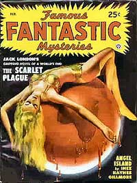

<!-- translated by Yandex Translate -->

# Путь к блогам будущего

Фредерик Пол

## Популярные публикации, часть 5: Туда и обратно

Я не работал в [** Популярных изданиях**](/posts/2011-05-26-rolling-back-the-years-popular-publications/) в течение пяти или шести месяцев, в течение которых я не искал другую работу.  Вместо этого я решил посвятить полный рабочий день писательству, но когда этот период закончился - когда я получил телеграмму от [Эла Нортона](https://web.archive.org/web/20170619223221/http://www.isfdb.org/cgi-bin/ea.cgi?Alden_H._Norton) с просьбой вернуться в качестве его помощника, почти вдвое больше, чем я зарабатывал как редактор двух моих собственных журналов, — я сказал "конечно".

Все, что я написал за этот период, продавалось, причем некоторые из них со скоростью, вдвое превышающей мою самую высокую до этого, при общем доходе за неделю работы, который на самом деле был немного выше, чем я получал от редакторской зарплаты плюс мое писательское время в свободное от работы. Однако не все продавалось сразу, и в целом этот опыт подтвердил то, о чем я уже давно говорил: фриланс оплачивался довольно хорошо, но чеки приходили тогда, когда они приходили, и ни минутой раньше.  Это было не то, на что можно было бы профинансировать брак.

И, так уж случилось, что моя девушка [Дорис](https://web.archive.org/web/20170619223221/http://wiki.feministsf.net/index.php?title=Doris_Baumgardt) примерно в то время изрядно устала быть девушкой.  Она предпочитала почтительное обращение “жена”.  Но мы вернемся к этому чуть позже.

Несмотря на то, что я отсутствовал в офисе всего несколько месяцев, уже произошли некоторые большие перемены, и их предстояло еще больше.  Журнальная империя Фрэнка А. Манси, состоящая в основном из еженедельника [Argosy](https://web.archive.org/web/20170619223221/http://www.philsp.com/mags/argosy.html) и нескольких других изданий, некоторое время выставлялась на продажу, и когда цена снизилась настолько, что стала выгодной, [Гарри Стигер](https://web.archive.org/web/20170619223221/http://homepage.mac.com/cdkalb/spider/legend/steeger.html) и Гарольд С. Голдсмит купили конюшню Манси.

Единственным журналом, который они продолжали практически без изменений, был "[Знаменитые фантастические тайны](https://web.archive.org/web/20170619223221/http://www.philsp.com/mags/famous_fantastic_mysteries.html)" вместе с его редактором Мэри Гнедингер, дружелюбной и способной женщиной чуть старше меня, которая поселилась в помещении, которое когда-то было моим офисом.  У Стигера были большие планы на Аргоси.  Он подумывал о том, чтобы сделать его мужским журналом, возможно, немного похожим на Esquire, но не торопился с этим.

Моим самым большим сюрпризом было то, что [Джейн Литтел](/posts/2011-06-03-popular-publications-part-3-the-people-who-made-the-pulps/) исчезла, а мужчина средних лет, спасенный из зарплаты Манси, редактировал "Любовную кашу".  Я никогда не встречался с ним, но он вызвал у меня небольшое раздражение. Он нашел мое стихотворение в описи и, поскольку ему не сказали, что оно предназначено для использования под псевдонимом, пошел дальше и опубликовал его как написанное Фредериком Полом.

Я не утверждаю, что мои опубликованные стихи вызвали бы зависть у [Фроста](https://web.archive.org/web/20170619223221/http://www.poets.org/poet.php/prmPID/192) или [Элиота](https://web.archive.org/web/20170619223221/http://www.poets.org/poet.php/prmPID/18), но я не хотел, чтобы меня запомнили за мои сочные излияния по 25 центов за строчку. Оказалось, что это не имеет значения, поскольку, по-видимому, никто из читателей "любовной мякоти" все равно никогда обо мне не слышал.

["Обезьянья клетка" Рога Террилла](https://web.archive.org/web/20170619223221/http://books.google.com/books?id=Oy8_5S8hMjAC&lpg=PA46&ots=7W4KxMolBW&dq=Rogers%20Terrill&pg=PA46#v=onepage&q=Rogers%20Terrill&f=false), состоящая из молодых редакторов-мужчин, была истощена из-за проекта, и помощники Эла Нортона тоже ушли, все до единого.  Я никогда не знал никого из заменителей Роджера достаточно хорошо, чтобы запомнить их имена..  Эл, потеряв всех своих, начал заменять их двумя молодыми женщинами.  Одну из них звали Ольга Мэй Куадленд, она была дружелюбной, способной и хорошо владела обязательными навыками правописания, грамматики и пунктуации.  Другой была очень симпатичная недавно разведенная женщина из Сан-Диего, впервые в жизни оказавшаяся в Нью-Йорке, и, собственно, та, которая оказалась моей [второй женой](https://web.archive.org/web/20170619223221/http://books.google.com/books?id=ZoNDebTvUnsC&lpg=PA390&dq=dorothy%20lestina%20pohl&pg=PA390#v=onepage&q=dorothy%20lestina%20pohl&f=false).

Но это уже другая история, к которой мы еще не подошли.

*Продолжение следует. . . .*

**Связанные должности:**

- ** Популярные публикации**, [** Часть 1**](/posts/2011-05-26-rolling-back-the-years-popular-publications/), [** Часть 2**](/posts/2011-05-31-popular-publications-part-2/), [** Часть 3**](/posts/2011-06-03-popular-publications-part-3-the-people-who-made-the-pulps/), [** Часть 4**](/posts/2011-06-09-popular-publications-part-4-continuing-down-the-corridor/), [** Часть 6**](/posts/2011-08-18-popular-publications-part-6-deadlines/), [**Часть 7**](/posts/2011-08-31-popular-publications-part-7-the-beginning-of-the-end/)

[WordPress](https://web.archive.org/web/20170619223221/http://wordpress.org/)
[TWTFB2](https://web.archive.org/web/20170619223221/http://dicksmithsoftware.com/)