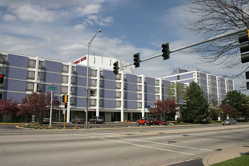

<!-- translated by Yandex Translate -->

# Путь к блогам будущего

Фредерик Пол

## Вакансии

  

“Пурпурный Хаятт”, некогда ставший домом для чикагских ["](https://web.archive.org/web/20170718040004/http://capricon.org/)Каприконс" и других собраний фэнов, вскоре может превратиться просто в лавандовое воспоминание. Юридические и финансовые маневры до сих пор сохраняли жизнь зданию, но деревня Линкольнвуд имела законное право [снести его](https://web.archive.org/web/20170718040004/http://www.suntimes.com/business/roeder/7102998-452/sssss.html) с 1 августа. Оно все еще стоит, пустует, но вряд ли когда-нибудь там снова кто-нибудь будет жить из-за его многочисленных нарушений.

И теперь у него есть отель-партнер, также иногда используемый для встреч фэнов, в том числе Capricon: бывший отель Arlington Park Hilton, расположенный рядом с Арлингтонским ипподромом в Арлингтон-Хайтс. Опустошенный и запертый более года назад, он находится в лучшем состоянии, чем Фиолетовый, но такой же пустой и с таким же [неясным будущим](https://web.archive.org/web/20170718040004/http://dhbusinessledger.com/main.asp?SubSectionID=29&ArticleID=2772&SectionID=4).

### Один комментарий

- [Роберт Новолл](https://web.archive.org/web/20170718040004/http://www.robertnowall.com/) говорит:
Америка просто усеяна подобными зданиями... супермаркетами, сети которых либо прекратили свое существование, либо построили магазины побольше и качественнее в будущем... школами, которые обслуживали поколение бэби-бума и стали не нужны позже... торговыми центрами, которые потеряли бизнес (и фирмы) в пользу новых в будущем.
Иногда вы видите, как эти здания перепрофилируют — время от времени я прохожу мимо старого кинотеатра с двумя экранами, который был передан церкви, - но многие из них просто стоят там, закрытые, ни у кого нет сил или срочной необходимости их сносить…
[** 24 августа 2011 года, 8:54 утра**](/posts/2011-08-23-vacancies/)

[WordPress](https://web.archive.org/web/20170718040004/http://wordpress.org/)
[TWTFB2](https://web.archive.org/web/20170718040004/http://dicksmithsoftware.com/)