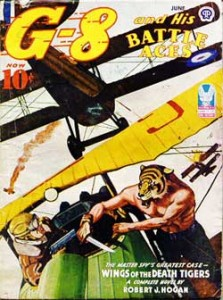

# The Way the Future Blogs

Frederik Pohl

## Popular Publications, Part 7: The Beginning of the End

As best I remember, [Al Norton](https://web.archive.org/web/20111005025920/http://www.isfdb.org/cgi-bin/ea.cgi?Alden_H._Norton) was in charge of:

- 2 air-wars
- 3 Westerns
- 2 sports
- 2 crime
- 1 sf ([Super Science Stories](https://web.archive.org/web/20111005025920/http://www.philsp.com/data/data373.html#SUPERSCIENCESTORIES))
- 1 superhero ([G-8 and His Battle Aces](https://web.archive.org/web/20111005025920/http://www.philsp.com/data/data035.html#BATTLEACES))

At some time during my furlough, [Astonishing Stories](https://web.archive.org/web/20111005025920/http://www.philsp.com/data/data029.html#ASTONISHINGSTORIES1940) had breathed its last, done in by the 10¢ cover price.  We didn’t have any horror or love pulps — happily, because we all would have hated them.  We also didn’t have any of  the titles Popular was acquiring in its purchase of the venerable Frank A. Munsey’s company.

As far as I recall, Popular kept only two of the Munsey titles alive:  [Argosy](https://web.archive.org/web/20111005025920/http://www.philsp.com/mags/argosy.html) and the fantasy-reprint magazine edited by Mary Gnaedinger, [Famous Fantastic Mysteries](https://web.archive.org/web/20111005025920/http://www.philsp.com/mags/famous_fantastic_mysteries.html).  Mary herself came with the deal — also happily, because I occasionally thus had somebody to talk science fiction with.

All of the titles we worked on were pretty much your basic pulp.  The air-wars were the least interesting to work on, partly because every last word of them was written by a single author under contract, [David Goodis](https://web.archive.org/web/20111005025920/http://www.davidgoodis.com/), who was not without talent — he published better things elsewhere — but didn’t waste any of it on our pulps, which were uniformly one dogfight after another, with the Spitfires and the P-40s triumphing over the Messerschmitts and the Heinkels.

Possibly the pulpiest of our get was our one superhero: [The Master American Flying Spy Known as G-8](https://web.archive.org/web/20111005025920/http://www.vintagelibrary.com/pulpfiction/characters/G-8-and-his-Battle-Aces.php).  Their main difference from the air-war titles was that G-8 was fighting in World War I, and his victories were even more improbable.

G-8 was written by a very nice man named [Robert J. Hogan](https://web.archive.org/web/20111005025920/http://www.ageofaces.net/authors-artists/robert-j-hogan/), and (like Goodis) he wrote the entire editorial contents of each issue, including the “readers’ letters” by and to himself.  But he was — forgive me if you’re still around, Bob — by all odds the pulpiest writer we had the misfortune to edit, and when the G-8 mag got swept away by wartime stresses we all condoled with him.

He looked at us with mournful eyes, thought the matter over for a while and then said,  “Well, I’ve always wanted to try magazines like [The Saturday Evening Post](https://web.archive.org/web/20111005025920/http://www.saturdayeveningpost.com/). So I guess I’ll see if I can get any of those big slick checks.”

We were all too well brought up to hurt his feelings, so none of us laughed until he was out the door.  We didn’t see him for about a month, until he stopped in on the way to the bank, so he could show us the check he had just received.  For a short story.  From — of course — The Saturday Evening Post.

**Related posts:**

- **Popular Publications**, [**Part 1**](/posts/2011-05-26-rolling-back-the-years-popular-publications/), [**Part 2**](/posts/2011-05-31-popular-publications-part-2/), [**Part 3**](/posts/2011-06-03-popular-publications-part-3-the-people-who-made-the-pulps/), [**Part 4**](/posts/2011-06-09-popular-publications-part-4-continuing-down-the-corridor/), [**Part 5**](/posts/2011-08-16-popular-publications-part-5-there-and-back-again/), [**Part 6**](/posts/2011-08-18-popular-publications-part-6-deadlines/)

### 2 Comments

- David B. Williams says:
I marvel that any publisher would rely on one writer to produce all the copy in each issue of a magazine. Talk about all your eggs in one basket. One stray lightning bolt and your magazine in kaput.
But I’m glad they maintained FFM. I fondly recall myself as a young teen in the early 1960s, reading fantasy classics in tattered, funky copies of FFM from the late ’40s. The Ship of Ishtar!
[**August 31, 2011, 1:17 pm**](/posts/2011-08-31-popular-publications-part-7-the-beginning-of-the-end/)
- [Stefan Jones](https://web.archive.org/web/20111005025920/http://home.comcast.net/~stefan_jones/dead_ray.jpg) says:
David:
After reading about the pulp industry in Frederik’s posts . . . I bet management would promote an especially bright mail boy to editor before the smell of ozone had cleared up!
[**August 31, 2011, 9:50 pm**](/posts/2011-08-31-popular-publications-part-7-the-beginning-of-the-end/)

[WordPress](https://web.archive.org/web/20111005025920/http://wordpress.org/)
[TWTFB](https://web.archive.org/web/20111005025920/http://dicksmithsoftware.com/)