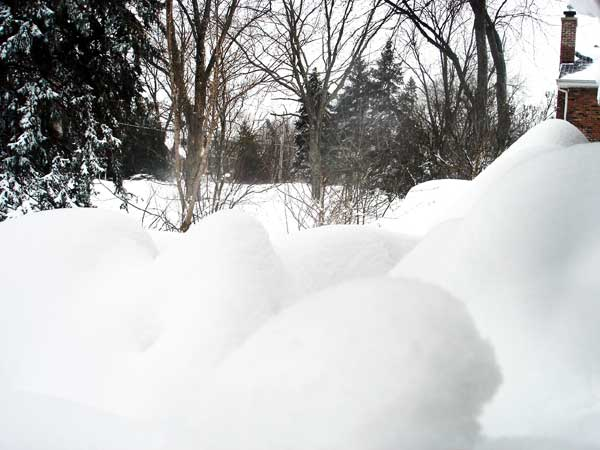

# The Way the Future Blogs

Frederik Pohl

## Declining Immortality Twice

[**Mike Darwin’s response**](/fred-pohl/2011-07-31-the-cryonics-institute-s-106th-patient-robert-c-w-ettinger/) to [**my piece**](/fred-pohl/2011-07-31-the-cryonics-institute-s-106th-patient-robert-c-w-ettinger/) on the loss of that very good man, Bob Ettinger, caught me completely unaware.  I am grateful to you for repeating the offer of a free freeze, Mike, just as I am grateful to the people who sometimes tell me that they’re going to pray for me.  Even though I can’t accept your offer, it’s a kind thought.

Let me quote from a poem that was written long ago by [John Dryden](https://web.archive.org/web/20111004145605/http://www.poets.org/poet.php/prmPID/333), in an attempt to sum up the teachings on this subject of the even longer ago Roman philosopher [Lucretius](https://web.archive.org/web/20111004145605/http://www.iep.utm.edu/lucretiu/).  The last six lines say it all, but I’ll give you the whole thing.  It goes like this:


Though earth in seas, and seas in heaven were lost
We should not move, we should only be toss’d.
Nay, e’en suppose when we have suffer’d fate
The soul should feel in her divided state,
What’s that to us? For we are only we
While souls and bodies in one frame agree.

Nay, though our atoms should revolve by chance,
And matter leap into the former dance,
Though time our life and motion should restore.
And make our bodies what they were before,
What gain to us would all this bustle bring?
The new-made man would be another thing.


But I do appreciate the offer.

### 9 Comments

- [Chookie Inthebackyard](https://web.archive.org/web/20111004145605/http://chookiesbackyard.blogspot.com/) says:
I’ll pray for you 
[**September 9, 2011, 4:09 am**](/fred-pohl/2011-09-09-declining-immortality-twice/)
- [Bill Higgins-- Beam Jockey](https://web.archive.org/web/20111004145605/http://beamjockey.livejournal.com/) says:
John Dryden (1631-1700) liked to talk about atoms?  Who knew?
Atoms, of course, are an idea that come to us from Democritus and other Greeks– Aristotle didn’t like atoms– but science ignored them until around 1800.  So I have practically no knowledge about how people regarded atoms in the 17th century.  A topic for further research…
One of the 19th century chemists who shaped atomic theory  was named William Higgins, which has piqued my interest in atoms.  Most of my own work is concerned with smashing them.
[**September 9, 2011, 12:31 pm**](/fred-pohl/2011-09-09-declining-immortality-twice/)
- JohnArmstrong says:
Can you imagine the chillblains a few decades in the freezer would give you?
On another subject, I juts found a copy of Sin in Space at a local bookstore and remembered the name Cyril Judd as being that used by Cyril Kornbluth and Judith Merrill for collaborations. I had never heard of this one, or Beacon Books
Now that I’ve looked up this title and others published by Beacon, I’d love to hear what you have to say about the line. (They took original stories published in Galaxy, sexed them up, changed the title if they thought it not salacious enough, and commissioned some racy cover art - space porn.)
Hope you’re well
Best,  

John
[**September 9, 2011, 7:05 pm**](/fred-pohl/2011-09-09-declining-immortality-twice/)
- [Gregory Benford](https://web.archive.org/web/20111004145605/http://gregorybenford.com/) says:
But Fred, a revived frozen self will be you…
[**September 10, 2011, 1:05 am**](/fred-pohl/2011-09-09-declining-immortality-twice/)
- Jay Borcherding says:
Lovely poem.  And I agree with your decision–cryonics strikes me as a peculiar and amusing choice, one part vanity, another part egotism, a third part fear, a fourth part greed.  
Even having said that, if a person is otherwise young and healthy but is struck by a cataclysmic illness, I can barely see the logic and justice of cryonics:  they were deprived of a normal lifespan, and need only a successful freezing and defrosting, as well as a cure to a single malady, to have the possibility of decades of healthy life.  
Alas, as you are acutely aware, dear Fred, those are not your circumstances.  Much more dignified and wise to decline Mr. Darwin’s generous but misguided offer.  
Mr. Darwin’s enthusiasm is apparent, but it does make me question his motives.  The economics of keeping corpses frozen for centuries has always puzzled me, and cryonics  surely is the least-green thing imaginable to do to a body.  It must be desperately difficult to market and sell cryonics services, especially in this economy, and especially with increasing acceptance of man-made climate change.  I know I’d feel guilty about sucking down electricity for decades after my demise.
[**September 10, 2011, 3:46 am**](/fred-pohl/2011-09-09-declining-immortality-twice/)
- [Denis Drew](https://web.archive.org/web/20111004145605/http://www.ontodayspage.blogspot..com/) says:
In the last chapter of Richard Feynman’s last autobiography he noted that half the sulfur atoms in your brain were gone in two weeks.  Ditto for our bones which take seven years to turn over all their molecules.
What atoms survive cryogenics may not be “you.”  Whatever “you” are may survive your atoms.  I’ll pray.  
[**September 12, 2011, 1:12 pm**](/fred-pohl/2011-09-09-declining-immortality-twice/)
- [Hilary](https://web.archive.org/web/20111004145605/http://www.positiveletters.com/) says:
Hi Mr Kohl .. I came over from Susan Kaye Quinn’s blog - you kindly signed a number of your books that she had owned since childhood .. 
.. and I had a fascinated glance through your blog and this post with the poem by Dryden .. so interesting to read .. 
You must have lived through so much history as well as recorded some of it here .. I bet you’d love to be in Brooklyn on the 18th .. but c’est la vie - we cannot do it all .. sadly.
Cheers for now - lovely to meet you - Hilary
[**September 13, 2011, 12:42 pm**](/fred-pohl/2011-09-09-declining-immortality-twice/)
- [Susan Kaye Quinn](https://web.archive.org/web/20111004145605/http://www.susankayequinn.com/) says:
It was such a pleasure to meet you over the weekend (at the library). Thanks for being so gracious about signing all those books! 
As for becoming a frozen dead person, we had one of those in our tiny mountain town of Nederland, CO. He was a tourist attraction; certainly not what I hope to be known for after I’ve departed this world! I’ll take what life I have, and if I’m very lucky, I’ll be mindful of living every moment to the fullest.
[**September 13, 2011, 12:57 pm**](/fred-pohl/2011-09-09-declining-immortality-twice/)
- Dan Gollub says:
Freezing would provide raw material for a clone.
[**September 13, 2011, 6:18 pm**](/fred-pohl/2011-09-09-declining-immortality-twice/)

[WordPress](https://web.archive.org/web/20111004145605/http://wordpress.org/)
[TWTFB](https://web.archive.org/web/20111004145605/http://dicksmithsoftware.com/)