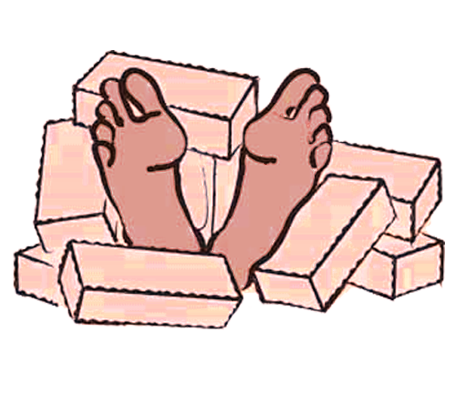

<!-- translated by Yandex Translate -->

# Путь к блогам будущего

Фредерик Пол

## Большие мысли


—
Роджер Билхэм
(Университет Колорадо)
и
Николас Амбразейс
(Имперский колледж Лондона).


Очевидно, что есть и другие факторы — бедность, с одной стороны, близость к океану, чреватому цунами, и находящиеся под угрозой атомные станции, с другой, как и в Японии в 2011 году.  Но политическая коррупция — и, следовательно, неадекватные требования к инспекции и строительству зданий — это фактор, с которым люди могут что-то сделать.

### 6 Комментариев

- монополь говорит:
Но инспекция зданий - это регулирование и, следовательно, абсолютное зло. Например, инспекция пищевых продуктов, инспекция мостов и санитарная инспекция…
Знаете ли вы какие-нибудь очень ветхие здания, в которых либертарианцы могли бы провести свой следующий съезд?
[** 17 сентября 2011 года, 10:01 утра**](/fred-pohl/2011-09-16-big-thinks/)
- [Роберт Новолл](https://web.archive.org/web/20111004145600/http://www.robertnowall.com/) говорит:
Подумайте “Новый Орлеан”.
[** 17 сентября 2011 года, 10:14 утра**](/fred-pohl/2011-09-16-big-thinks/)
- Джей Борчердинг говорит:
Высокие показатели коррупции, вообще говоря, связаны с бедностью, поэтому прямые проблемы, на которые вы ссылаетесь, обычно сопровождаются сетью косвенных факторов, способствующих высокому числу погибших при землетрясениях.   
Возьмем, к примеру, Гаити.  Трущобы – неофициально построенные трущобы – являются смертельными ловушками во время землетрясения и представляют собой крайнюю версию "неадекватных требований к осмотру и строительству зданий".  
Отсутствие электричества или денег на оплату электроэнергии приводит к приготовлению пищи на огне, что приводит к вырубке лесов и эрозии, что приводит к оползням, которые могут быть катастрофическими во время землетрясений.  
Неэффективен из-за несуществующих возможностей реагирования на чрезвычайные ситуации и запасов либо со стороны местных органов власти, либо со стороны местных НПО.  
Неэффективная из-за несуществующей в обычное время инфраструктуры – такой, как приличные дороги, канализация и клиники – становится намного хуже в результате стихийного бедствия, такого как землетрясение.  Отсутствие доступа к чистой питьевой воде может иметь особенно катастрофические последствия для общественного здравоохранения после землетрясения.   
Устраните политическую коррупцию (и коррупцию на более низких ступенях иерархии, например, среди бюрократии и полиции), и некоторые из этих проблем будут решены.  Но более широкие проблемы бедности останутся – даже если коррупция фактически сведена к нулю, у бедной страны будет меньше возможностей справиться с бедствием, чем у богатой страны. 
Ничто из сказанного не говорит и не подразумевает, что ничего не следует делать – я просто указываю на то, что проблемы коррупции связаны с более широкими и масштабными проблемами бедности.
[**17 сентября 2011, 16:49 вечера**](/fred-pohl/2011-09-16-big-thinks/)
- ЭдС говорит:
Принимая во внимание комментарий Пола о том, что существуют и другие факторы, такие как бедность, и вы также должны понимать, что с бедностью вы, как правило, сталкиваетесь с плохой системой образования. Очень трудно внедрять строительные стандарты, если люди не умеют читать. И если эти люди одинаково бедны, то они не могут позволить себе должным образом построить здания, которые могли бы лучше противостоять землетрясениям.  Итак, возникает вопрос: в стране третьего мира, где широко распространены как коррупция, так и бедность, можете ли вы снизить смертность от обрушения зданий исключительно за счет избавления от коррупции или исключительно за счет избавления от бедности, или вам нужно избавиться и от того, и от другого, чтобы оказать какое-либо влияние?
[**17 сентября 2011, 11:38 вечера**](/fred-pohl/2011-09-16-big-thinks/)
- [CCBC](https://web.archive.org/web/20111004145600/http://shrineodreams.wordpress.com/) говорит:
Я не знаю, следует ли вам освобождать Японию от ответственности. Недавняя катастрофа произошла на атомной станции, которая была признана инспекторами небезопасной несколько лет назад. И катастрофа, вызванная землетрясением в Кобе, казалось, разрушила огромное количество зданий, которые предположительно были построены с целью кодирования, хотя тогдашнее правительство некоторое время делало вид, что это не так — они были глубоко смущены рядом вещей, связанных с этим землетрясением.
[**19 сентября 2011, 16:14 вечера**](/fred-pohl/2011-09-16-big-thinks/)
- Эндрю Пол Вуд говорит:
Моя страна, Новая Зеландия, славится низким уровнем коррупции, и все же в городе Крайстчерч, в котором я живу, обрушилось несколько зданий со смертельным исходом, когда он неоднократно подвергался землетрясениям в сентябре 2010 года и феврале 2011 года. Землетрясения достаточно непредсказуемы по своим последствиям, чтобы не втягивать в них коррупцию.
[** 2 октября 2011 года, 5:05 утра**](/fred-pohl/2011-09-16-big-thinks/)

[WordPress](https://web.archive.org/web/20111004145600/http://wordpress.org/)
[TWTFB](https://web.archive.org/web/20111004145600/http://dicksmithsoftware.com/)