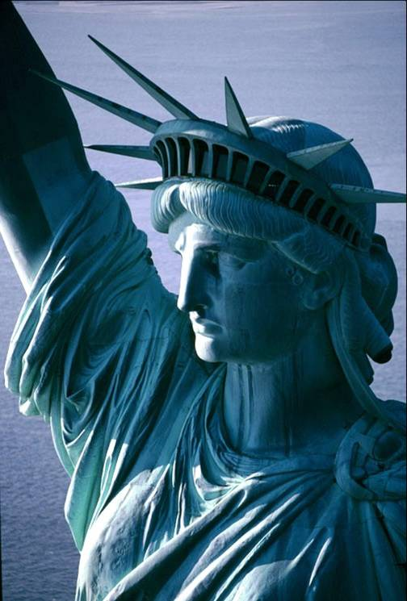

<!-- translated by Yandex Translate -->

# Путь к блогам будущего

Фредерик Пол

## Об иммиграции

Это не совсем политика, это больше касается морали.  Ну, политическая мораль, в частности, наша политика в отношении иммиграции.

Что я хотел бы добавить к обсуждению, так это стихотворение, или, во всяком случае, часть стихотворения, женщины по имени [Эмма Лазарус](https://web.archive.org/web/20111005004616/http://www.jewishvirtuallibrary.org/jsource/biography/lazarus.html).  Она была написана для церемонии посвящения Статуе Свободы, и ее копия выгравирована на мемориальной доске у основания статуи.  Его название - “Новый Колосс”, и та его часть, которая, на мой взгляд, имеет отношение к делу, звучит примерно так:


Отдай мне свою усталую, свою бедную
Ваши сбившиеся в кучу массы жаждут вздохнуть свободно,
Жалкие отбросы вашего изобилующего берега.
Пришлите их, бездомных, мне в "Темпест-тост",
Я поднимаю лампу рядом с золотой дверью.


Если это не наша политика, то какие же мы лицемеры?

### 11 Комментариев

- Джон Трейлор говорит:
Какие прекрасные слова. Как бы я хотел, чтобы мы могли соответствовать им, но, увы, судя по моему чтению американской истории, это в значительной степени пустые слова. Сначала английские поселенцы не слишком любили немцев, потом ни тем, ни другим не понравились ирландцы, и, похоже, так оно и есть.
[**20 сентября 2011 года, 6:26 утра**](/fred-pohl/2011-09-20-on-immigration/)
- Пи Джей говорит:
Я тоже задавался этим вопросом раньше… зачем у нас вообще существует иммиграционная политика?  Пусть тот, кто хочет появиться, делает это, и как только они установят место жительства, относитесь к ним как к гражданам. Возможно, пропорционально увеличат какие-либо налоговые льготы на дату их проживания. Почему бы и нет?
[** 20 сентября 2011 года, 8:39 утра**](/fred-pohl/2011-09-20-on-immigration/)
- Дэвид Б. Уильямс говорит:
Обычный сорт, я полагаю. Но сейчас 2011 год, а не 1811-й. Я всецело за продолжение иммиграции, но необходим какой-то контроль, иначе мы получали бы 30 миллионов в год в дополнение к нашим собственным, которые сейчас кишат несчастными и беднотой.
[** 20 сентября 2011 года, 9:30 утра**](/fred-pohl/2011-09-20-on-immigration/)
- Уолт Джи говорит:
Кто-то стучит в дверь  

Кто-то звонит в колокольчик  

Кто-то стучит в дверь  

Кто-то звонит в колокольчик  

Сделай мне одолжение,  

Открой дверь и впусти их
[**20 сентября 2011 года, 9:39 утра**](/fred-pohl/2011-09-20-on-immigration/)
- [А.Р.Ингве](https://web.archive.org/web/20111005004616/http://aryngve.com/) говорит:
Справедливости ради, ксенофобия - это всеобщий грех.  

В моей стране Швеции я услышал, как один парень разглагольствовал против иммигрантов, и тогда я спросил его: “Откуда родом *твой* отец?” Он немедленно ответил “Италия”, но, казалось, не признавал и не чувствовал никакого лицемерия…
Билл Брайсон сказал в своей замечательной книге "СДЕЛАНО В АМЕРИКЕ":
“Если можно сказать, что одно отношение характеризует отношение Америки к иммиграции за последние двести лет, то это убеждение в том, что, хотя иммиграция была мудрым и дальновидным поступком в случае чьих-либо родителей, бабушек и дедушек с дедушками, это действительно должно прекратиться сейчас.  

Последующие поколения американцев убедили себя в том, что страна столкнулась с неизбежными социальными потрясениями и, в конечном счете, с разорением от рук алчных иностранных орд, хлынувших в порты или пересекших ее границы.”
Плюс изменение ca…
[** 20 сентября 2011 года, 11:00 утра**](/fred-pohl/2011-09-20-on-immigration/)
- [Дон Сейкерс](https://web.archive.org/web/20111005004616/http://www.scatteredworlds.com/) говорит:
Возможно, консерваторы интерпретируют “Золотую дверь” как означающую “те, у кого достаточно Голда, могут войти в эту дверь”.
[**20 сентября 2011, 12:29 вечера**](/fred-pohl/2011-09-20-on-immigration/)
- Его превосходительство Пармер говорит:
Позаимствовав фразу из администрации Никсона, “это заявление больше не действует”.
Если это вообще когда-либо было. Безусловно, существовали правильные и неправильные классы сбившихся в кучу масс, “правильными” были белые, западноевропейцы и протестанты, а “неправильными” были практически все остальные. 
Кроме того, открытые границы - это просто 20-й век: добро пожаловать в Дивный Новый мир с 20% безработицей и крепостью Америка.
[**20 сентября 2011, 15:14 вечера**](/fred-pohl/2011-09-20-on-immigration/)
- [Стефан Джонс](https://web.archive.org/web/20111005004616/http://home.comcast.net/~stefan_jones/tan_jacket_lo.jpg) говорит:
Выбрасывание за борт американских традиций терпимости, великодушия и социального прогресса, по-видимому, и есть новый режим.
Кипеть в котле негодования, подозрительности и страха намного проще. И политически полезен.
[**20 сентября 2011 года, 17:10 вечера**](/fred-pohl/2011-09-20-on-immigration/)
- Инди говорит:
У нас по-прежнему одна из самых либеральных иммиграционных политик на планете, не так ли? Даже обойти официальный процесс по-прежнему довольно легко. Я не могу представить себе другую страну, где просто родившись там, вы автоматически становитесь гражданином. Забудьте о политике и фанатизме, лицо этой страны всегда менялось и всегда будет меняться.
[** 24 сентября 2011 года, 1:40 утра**](/fred-pohl/2011-09-20-on-immigration/)
- Джей Борчердинг говорит:
Справедливости ради, более рациональная иммиграционная политика имеет смысл.  Наша нынешняя система переоценивает воссоединение семей - один легальный иммигрант может по цепочке переселить десятки тетушек, дядюшек и двоюродных братьев, ни у кого из которых нет высшего образования, – в то время как человек по студенческой визе с новоиспеченной степенью доктора технических наук может быть вынужден вернуться домой.
Иммиграция имеет моральный и этический компонент, и я поддерживаю щедрую политику предоставления убежища беженцам.  Пакистанские атеисты, например, имеют веские основания полагать, что их убеждения подвергают их смертельной опасности.  Но в целом наша иммиграционная политика должна основываться на наших национальных интересах.  Если это означает предпочтение высокообразованных людей перед "сбитыми в кучу массами", я не вижу причин стыдиться – такие страны, как Канада и Австралия, таким образом уравновешивают свою иммиграционную политику, и мы должны делать то же самое.
[** 28 сентября 2011 года, 5:12 утра**](/fred-pohl/2011-09-20-on-immigration/)
- Брюс говорит:
Ни один порядочный человек не стал бы возражать против импорта полулегального класса илотов с целью снижения преобладающей заработной платы (привет республиканцам) и обеспечения подопечных клиентами (привет демократам). Особенно когда этот результат не является домыслом, а наблюдается с 1986 года.
[**30 сентября 2011, 16:31**](/fred-pohl/2011-09-20-on-immigration/)

[WordPress](https://web.archive.org/web/20111005004616/http://wordpress.org/)
[TWTFB](https://web.archive.org/web/20111005004616/http://dicksmithsoftware.com/)