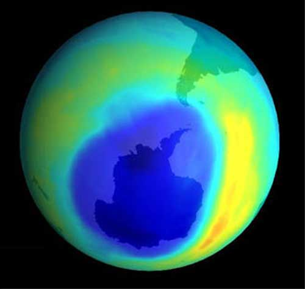

<!-- translated by Yandex Translate -->

# Путь к блогам будущего

Фредерик Пол

## Планета Земля: Может быть, почти хорошие новости

Помните [озоновую дыру](https://web.archive.org/web/20111216174455/http://www.theozonehole.com/)?  Дыра в озоновом слое атмосферы над Антарктидой, которая позволила опасному солнечному излучению проникать на поверхность Земли с потенциально смертельными последствиями для жизни там.

Начиная с 1989 года, международные соглашения начали ограничивать, а затем и снижать процентное содержание разрушающих озон газов, выделяющихся при использовании определенных хладагентов и пропеллентов, и ученые по всему миру начали проверять состояние озонового зала в конце каждой антарктической зимы.  В этом году метеоролог [Мюррей Салби](https://web.archive.org/web/20111216174455/http://www.envsci.mq.edu.au/staff/ms/index.html) из Университета Маккуори в Сиднее, Австралия, объявил о [первых признаках заживления](https://web.archive.org/web/20111216174455/http://www.sciencenews.org/view/generic/id/74280/title/Ozone_hole_on_the_mend) дыры.  По общему признанию, изменения в озоновой дыре незначительны и несколько неоднозначны, но они указывают на то, что международное сотрудничество многих стран действительно может привести к успеху в совместной работе по преодолению экологического кризиса

Теперь, если бы мы только могли все вместе разработать программу замедления... затем остановки... затем обращения вспять потока соединений углерода в атмосферу, тогда у нас была бы хоть какая-то надежда на то, что у наших внуков, возможно, будет довольно приличный мир для жизни!

**Но, тем временем —**

Регулярный выпуск новостей о хронической плохой погоде все еще с нами.  Лето в Восточной Европе было самым жарким более чем за 500 лет.  В России произошло более 55 000 смертей, связанных с аномальной жарой.  Четверть посевов погибла, произошли обширные лесные пожары, а метеорологические модели предполагают, что в течение следующих 40 лет будут наблюдаться несколько менее экстремальные периоды жары.

### 7 Комментариев

- [Шакатани](https://web.archive.org/web/20111216174455/http://shakatany.livejournal.com/) говорит:
Конечно, теперь такой есть и в Арктике. Кажется, мы никак не можем передохнуть, и, вероятно, это наша вина.
[**13 октября 2011, 14:28 вечера**](/fred-pohl/2011-10-13-planet-earth-almost-good-news-maybe/)
- Дэвид Голдфарб говорит:
И... есть некоторые сообщения о том, что аналогичная озоновая дыра может образоваться над *северным* полюсом.
[**13 октября 2011, 15:38 вечера**](/fred-pohl/2011-10-13-planet-earth-almost-good-news-maybe/)
- [ТЭД](https://web.archive.org/web/20111216174455/http://www.tadsbackupplan.blogspot.com/) говорит:
Как вы думаете, почему первое место, где я узнаю обо всем этом, находится в вашем блоге? Мне нравится думать, что я достаточно хорошо информирован.... Но СМИ, похоже, определенно не волнует, что происходит слишком далеко за пределами США, и они перестают ждать, когда такого рода информация будет упомянута на CNN.... Есть ли какой-нибудь магазин, который вы бы порекомендовали для получения более подробной информации? Спасибо за сенсацию....
[**13 октября 2011, 16:39 вечера**](/fred-pohl/2011-10-13-planet-earth-almost-good-news-maybe/)
- Джей Борчердинг говорит:
Я не ученый, но разве фраза “затем прекращение... затем обращение вспять потока углеродистых соединений в атмосферу” не должна включать фразу “увеличение”?  Означает ли это, что целью различных попыток сократить выбросы парниковых газов в домах является не их устранение, что непрактично, а скорее сокращение и ограничение выбросов примерно до уровня 1980 года?
Я имею в виду, например, метан, гораздо более мощный парниковый газ, чем углекислый газ, выбросы которого, вызванные деятельностью человека, никогда не будут устранены, пока крупный рогатый скот переваривает траву. 
Спасибо вам за этот пост, с направленностью которого я всецело согласен, и приношу извинения за мое непрофессиональное придирчивое отношение.
[**13 октября 2011, 19:47 вечера**](/fred-pohl/2011-10-13-planet-earth-almost-good-news-maybe/)
- Юггот говорит:
Хммм... итак, в 80-е и 90-е годы, в период очень высокой солнечной активности, наблюдалась растущая дыра в озоновом слое над Антарктидой.  Затем, после 00-х годов, периода снижения солнечной активности, она начинает сокращаться.  Может быть, здесь есть какая-то связь?
Внезапный порыв избавиться от некоторых хладагентов был скорее результатом истечения срока действия патентов, чем чего-либо еще.
[** 14 октября 2011 года, 8:23 утра**](/fred-pohl/2011-10-13-planet-earth-almost-good-news-maybe/)
- Пэт говорит:
Джей Борчердинг, различные соединения углерода ответственны за разрушение озонового слоя и парниковый эффект.
[http://en.wikipedia.org/wiki/Ozone_depletion](https://web.archive.org/web/20111216174455/http://en.wikipedia.org/wiki/Ozone_depletion)
[http://en.wikipedia.org/wiki/Global_warming](https://web.archive.org/web/20111216174455/http://en.wikipedia.org/wiki/Global_warming)
Юггот, возможно, ты захочешь добавить эти данные к своей гипотезе:
[http://www.bbc.co.uk/news/science-environment-15105747](https://web.archive.org/web/20111216174455/http://www.bbc.co.uk/news/science-environment-15105747)
[** 15 октября 2011 года, 9:51 утра**](/fred-pohl/2011-10-13-planet-earth-almost-good-news-maybe/)
- Джон Миллер говорит:
Что ж, тогда работа выполнена.
Поддерживайте наши выбросы "углеродных соединений" постоянными, и теперь мы можем спать спокойно.
[**20 октября 2011, 14:34**](/fred-pohl/2011-10-13-planet-earth-almost-good-news-maybe/)

[WordPress](https://web.archive.org/web/20111216174455/http://wordpress.org/)
[TWTFB](https://web.archive.org/web/20111216174455/http://dicksmithsoftware.com/)