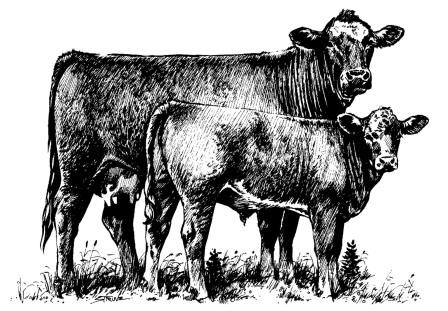

<!-- translated by Yandex Translate -->

# Путь к блогам будущего

Фредерик Пол

## Нравится ли вам есть жертву пыток?

Одним из моих любимых итальянских блюд был "скалоппине аль лимоне" - обжаренный кусок телятины с лимонным соком.  Вторым любимым блюдом был бы любой другой скалоппин, но прошло уже пару лет с тех пор, как я его пробовала.  Видите ли, проблема в том, что они готовятся из телятины, а способ приготовления самой телятины лишает ее всякого удовольствия.

Если вы слишком много думаете о том, через какие испытания проходят все ваши мясные блюда по пути к вашему столу, это никак не повлияет на ваше удовольствие даже от жареной курицы или свиной отбивной.  Но в случае с большинством видов мяса животное, по крайней мере, получает какое-то подобие жизни перед отбивной.  Теленок ничего не получает.  При рождении его помещают в деревянный ящик, слишком маленький, чтобы в нем можно было повернуться.  Он никогда не пробует молоко своей матери.  Его откачивают для продажи, в то время как ребенку дают смесь, в которую обильно добавляют стрептомицин, пенициллин и четыре или пять других антибиотиков, чтобы он быстрее рос.  Их вторичный эффект заключается в том, что они также вызывают у него постоянный понос, который никто не убирает, поэтому теленок лежит в нем большую часть своей жизни.

О, и у них есть еще один эффект.  Они вносят свой вклад в контролируемую селекцию, которой фермеры мира занимаются уже несколько поколений, в ходе которой их антибиотики убивают все более слабые бактерии, оставляя более сильные — и лучше способные противостоять всем известным антибиотикам — в каждом поколении доминирующими сортами.  Это, в свою очередь, имеет свои собственные последствия, одним из которых является то, что мои личные бактерии—резиденты теперь невосприимчивы ко всем известным антибиотикам, за исключением тех немногих, которые почти так же токсичны для крупных млекопитающих — таких, как я, например, - как и для бактерий, с которыми они предназначены бороться.

Это, конечно, означает, что, если и когда я подхвачу в будущем какую-либо серьезную инфекцию, моим врачам придется гадать, перевешивают ли антибактериальные свойства одного из них его токсичность.  Или, с другой стороны, будет ли эффект от инъекции мне этого вещества напоминать эффект от заражения стрихнином.

Но хватит обо мне.

Итак, скажите мне: вы все еще действительно любите телятину?  Или, если взглянуть на проблему под другим углом, должны ли мы и дальше позволять производителям телятины выращивать маленьких телят в полной нищете, когда они могли бы, по крайней мере, давать им чистые ящики?

### 14 Комментариев

- Мо говорит:
Ящики с телятиной были запрещены в Великобритании более 20 лет, а в Европейском союзе в целом - в течение четырех лет. Я думаю, что несколько штатов США ввели запреты, хотя я не знаю, действительно ли это где-либо вступило в силу.
[** 29 октября 2011 года, 6:31 утра**](/posts/2011-10-29-do-you-enjoy-eating-a-victim-of-torture/)
- Джон Трейлор говорит:
Поскольку я живу в округе, где много ферм, многие из которых принадлежат амишам или меннонитам, я давным-давно своими глазами увидел, как обрабатывают телят, и много лет назад потерял всякий вкус к телятине.  

 Очень хороший пост, мистер Пол.
[** 29 октября 2011 года, 8:01 утра**](/posts/2011-10-29-do-you-enjoy-eating-a-victim-of-torture/)
- [Шакатани](https://web.archive.org/web/20120101205726/http://shakatany.livejournal.com/) говорит:
Несколько лет назад я провела кое-какие исследования для моей подруги Эми Хаткофф, которая писала свою книгу “Внутренний мир сельскохозяйственных животных” с историями об интеллекте и личностях животных, которые вынуждены страдать на огромных фермах перед тем, как их забьют. Я не отказалась от мяса полностью, но теперь я вегетарианка на полставки.
[** 29 октября 2011 года, 9:07 утра**](/posts/2011-10-29-do-you-enjoy-eating-a-victim-of-torture/)
- Кен Марабл говорит:
Я с вами согласен и не ел телятину с тех пор, как впервые узнал, что это такое. К счастью, я услышала правду, когда мне было всего около 12 лет, так что я десятилетиями и близко не подходила к телятине и с первого дня рассказывала своим детям, насколько это ужасно.
[** 29 октября 2011 года, 10:33 утра**](/posts/2011-10-29-do-you-enjoy-eating-a-victim-of-torture/)
- пиджкамп говорит:
Не ел телятину уже 30 лет. Я избегаю всех продуктов с промышленных ферм.
[** 30 октября 2011 года, 12:43 утра**](/posts/2011-10-29-do-you-enjoy-eating-a-victim-of-torture/)
- доктор ллойд11 говорит:
Привет,
Честно говоря, это меня ни в малейшей степени не беспокоит.  Я говорю это не для того, чтобы быть воинственным, или потому что так сказал какой-то придурок с правого радио.  Я просто не испытываю по этому поводу никакого сочувствия.
  А теперь, пожалуйста, прежде чем прозвучат такие слова, как “социопат”, я не веду себя так с людьми или даже домашними животными.   Черт возьми, я не могу выбрать “путь зла” в ролевых играх (например, в играх Bioware).  Но в моем сознании не срабатывает ни один переключатель, который заставлял бы меня чувствовать себя хотя бы немного плохо.  Я имею в виду это буквально, в самом простом смысле.  

   Я могу залезть на какую-нибудь мыльницу или что-то в этом роде и разъяснить это, но я привожу эту информацию, чтобы объяснить, что  

1) Есть люди, которым будет представлена информация о том, как что-то, что им нравится или чем они пользуются, оказывает негативное влияние на других, и им просто будет все равно.  

2) Это может быть много чего: сигареты, айподы, автомобили, порнография или те дешевые рубашки в wal mart.  

3) Некоторые люди, которые чувствуют себя подобным образом, могут защищаться или выдумывать какую-нибудь теорию заговора о том, что то, что им говорят, неправда, но эти люди просто обманывают самих себя.  

4) На самом деле мне очень не нравится идея о том, что существо когда-либо страдает, но кто-то, кто не принимает во внимание это.
Итак, я представляю себя как образец домашнего-разумного-плотоядного-без-совести-едока. Человек, который по какой-либо причине просто ничего не чувствует по этому поводу, но не является психопатом или чем-то подобным.  

  В любом случае, я надеюсь, что люди ответят на это, если они не согласны.
[** 30 октября 2011 года, 7:00 утра**](/posts/2011-10-29-do-you-enjoy-eating-a-victim-of-torture/)
- Смит говорит:
Может быть, вы можете заказать телятину из страны с чуть более цивилизованными методами ведения сельского хозяйства?
[http://www.google.co.nz/search ?q=новая+Зеландия+телятина+фермерство&amp;ie=utf-8&amp;oe=utf-8&amp;aq=t&amp;rls=org.mozilla:en-GB:официальный&amp;клиент=firefox-a](https://web.archive.org/web/20120101205726/http://www.google.co.nz/search?q=new+zealand+veal+farming&ie=utf-8&oe=utf-8&aq=t&rls=org.mozilla:en-GB:official&client=firefox-a)
[** 31 октября 2011 года, 2:18 ночи**](/posts/2011-10-29-do-you-enjoy-eating-a-victim-of-torture/)
- Джонатан К. Стивенс говорит:
Привет,
Да, извините, мистер П., в этом вопросе я согласен с drlloyd11.  
Я не собираюсь вдаваться в подробности по этому поводу.  Хотя я морально против очевидной ненужной жестокости по отношению к животным, полагая, что такие действия свидетельствуют об опасной неуравновешенности ума, я всеяден и ем мясо.  Мне нравится телятина, и я без всяких колебаний ем ее.  
В раннем возрасте мне объяснили, что, в конечном счете, это животные, и их единственная функция - быть съеденными, очень похоже на точку зрения львов, охотящихся на молодых зебр в Африке.  
Я предпочитаю верить, что большинство фермеров - достаточно этичные люди, качество продукции которых зависит от того, действуют ли они разумно этичным образом.  Я уверен, что где-то есть пара тухлых яиц, но я верю, что в конце концов они будут отсеяны.  Это, конечно, одна из целей наличия законов.  
Читая это, я сразу вспомнил цитату одного из ваших старых приятелей, РЕХ, и я привожу ее, чтобы проиллюстрировать свою точку зрения.
“Существуют скрытые противоречия в умах людей, которые "любят природу" и в то же время сожалеют об "искусственности", которой "Человек испортил" Природу.’ Очевидное противоречие заключается в выборе ими слов, которые подразумевают, что человек и его артефакты не являются частью "природы", в отличие от бобров и их плотин. Но противоречия уходят глубже, чем этот кажущийся на первый взгляд абсурд. Заявляя о своей любви к бобровой плотине (возведенной бобрами для бобровых целей) и своей ненависти к плотинам, возведенным людьми (для целей людей), натурист раскрывает свою ненависть к собственной расе — то есть свою ненависть к самому себе.”
Всего наилучшего,
Джейкс
[**2 ноября 2011, 10:58 вечера**](/posts/2011-10-29-do-you-enjoy-eating-a-victim-of-torture/)
- Джоэл говорит:
Практически все производство мяса в США — не только телятины — ужасающе жестоко. Если вы не можете есть телятину, вы не должны есть говядину, свинину или курицу, произведенные крупным дистрибьютором. Молочные продукты тоже.
Это звучит экстремально, но такова реальность промышленного фермерства. Если не думать об этом, страдания всех этих животных не прекратятся.
[**3 ноября 2011, 16:56**](/posts/2011-10-29-do-you-enjoy-eating-a-victim-of-torture/)
- Джей Борчердинг говорит:
У меня есть склонность к животным вообще и млекопитающим в частности, и я осуждаю жестокость.  Сказав это, я также с удовольствием ем некоторых животных.  
До тех пор, пока моему всеядному образу жизни ничего принципиально не угрожает, я считаю, что будет разумно и справедливое обращение с существами, которым суждено стать пищей для людей, настолько доброжелательным, насколько это возможно.  
Активные пытки, которые описывает Фред, достойны сожаления и должны быть запрещены.  Это облегчение, что я редко ел телятину – я предпочитаю вкус взрослого крупного рогатого скота, – но меня огорчает, что такие жестокие методы ведения сельского хозяйства продолжают применяться в США.
[** 4 ноября 2011 года, 20:15 вечера**](/posts/2011-10-29-do-you-enjoy-eating-a-victim-of-torture/)
- Джей [Джей Брэннон](https://web.archive.org/web/20120101205726/http://www.youtube.com/watch?v=xPgZeOsG8sk) говорит:
Я согласен с доктором Ллойдом.  Прежде чем отправиться с родителями на Аляску, чтобы начать свое формальное образование, я жил на ферме.  У меня была свинья, которую мы назвали Пинки, и я кормила ее помоями, напевая ей и почесывая щетину у нее между ушами.
Потом, когда она хорошенько откормилась, мы ее съели.
Это, кстати, история, которую я рассказал студентам колледжа, сунувшим мне в руки брошюры о запрете телятины на Саут-стрит в Филадельфии, когда я прогуливался там со своим XSO в 1988 году, прежде чем я вернул брошюру обратно в руки их неопытного лидера с оговоркой: “Убедитесь, что прежде чем вы нагло начнете навязывать кому-то свою пропаганду, скажите, что этот человек не из тех, кто думает, что его питомец детства приготовил самые вкусные свиные отбивные, которые он когда-либо ел.”
Они побледнели до светло-сине-зеленоватого оттенка и делали все, что угодно, только не осеняли меня Крестным знамением, поспешно отступая.
Мой папа, взяв меня на буксир, тоже обычно стрелял в Бэмби и отвозил тушу на бойню, чтобы завернуть ее во фритюрницу в виде вкусных кусков оленины.
Фред, ты один из самых любезных авторов, с которыми я имел удовольствие познакомиться, но, как и в случае с рассказом о ферме раков и креветок ранее, некоторым из нас не внушали, что нужно очеловечивать нашу еду, и они не могут согласиться с твоей позицией.  Мы можем согласиться с тем, что вы имеете право на свои собственные чувства по этому вопросу, но это совершенно неубедительно.
За последние несколько лет я прочитал интересную статью, в которой обсуждалась этика / мораль, в которой рассматривался гипотетический случай, когда семья съела свою собственную собаку, которая погибла в результате несчастного случая, и как это соотносится с консерватизмом и либерализмом.
JJB
[**4 ноября 2011 года, 9:21 вечера**](/posts/2011-10-29-do-you-enjoy-eating-a-victim-of-torture/)
- Джей [Джей Брэннон](https://web.archive.org/web/20120101205726/http://www.youtube.com/watch?v=xPgZeOsG8sk) говорит:
Ладно, я забыл добавить ссылку на статью:
[http://www.edge.org/3rd_culture/haidt08/haidt08_index.html](https://web.archive.org/web/20120101205726/http://www.edge.org/3rd_culture/haidt08/haidt08_index.html)
JJB
[**4 ноября 2011 года, 9:24 вечера**](/posts/2011-10-29-do-you-enjoy-eating-a-victim-of-torture/)
- Екатерина Николаевна говорит:
Я нашел местную телятину, выращенную по-человечески.  Это потрясающе.   Я стараюсь не есть мясо, выращенное на фабрике, но ем как можно больше местного...
Я действительно думаю, что крупные сельскохозяйственные компании перестарались, обращаясь с животными как с компонентами заводской системы переработки.   Лучший способ бороться с этим - употреблять в пищу животных из небольших местных местечек, во многом напоминающих CSA, когда вы покупаете долю в урожае местной фермы.
Я просто верю, что мы можем есть животных, но мы должны есть животных, выращенных так, как задумала природа, с любовью и хорошим обращением.   И убили гуманно.  И я делаю для этого все, что в моих силах.  
Посмотрите, сможете ли вы найти местную ферму, где по-человечески выращивают собственную телятину…
[**9 ноября 2011 года, 9:51 утра**](/posts/2011-10-29-do-you-enjoy-eating-a-victim-of-torture/)
- Скиннер говорит:
Раньше я ел телятину, но когда моя девушка (ныне невеста) попросила меня просто немного подумать о тех ужасах, через которые проходит теленок, я решил, что лучше не буду есть ее в будущем. А теперь я не ем телятину. Ваше здоровье.
[**10 ноября 2011 года, 5:43 утра**](/posts/2011-10-29-do-you-enjoy-eating-a-victim-of-torture/)

[WordPress](https://web.archive.org/web/20120101205726/http://wordpress.org/)
[TWTFB](https://web.archive.org/web/20120101205726/http://dicksmithsoftware.com/)