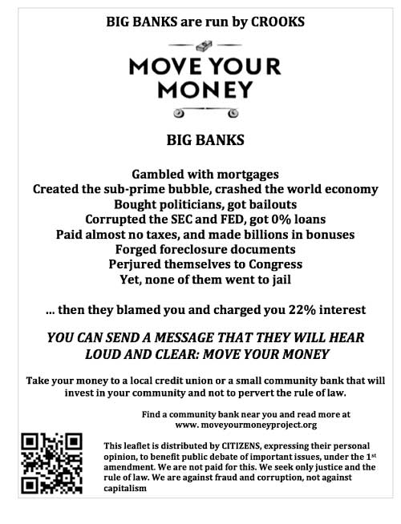

<!-- translated by Yandex Translate -->

# Путь к блогам будущего

Фредерик Пол

## "Он имеет право говорить", - сказал полицейский банкиру

Моя подруга Шерри Готлиб, которая раньше управляла последним уцелевшим книжным магазином научной фантастики в Лос-Анджелесе, пока просто не смогла справиться с растущей арендной платой, прислала мне [историю, стоящую за этим флаером](https://web.archive.org/web/20111121083259/http://www.dailykos.com/story/2011/11/02/1032624/-He-has-a-right-to-speak,-said-the-cop-to-the-banker).  Мне это нравится.  Я горжусь тем, что я американец.  Я надеюсь, что ты такой же.

["Он имеет право говорить", - сказал полицейский банкиру
из Марвинборга](https://web.archive.org/web/20111121083259/http://www.dailykos.com/story/2011/11/02/1032624/-He-has-a-right-to-speak,-said-the-cop-to-the-banker)
&gt; Как и большинство хулиганов, банки - трусы. Они говорят о большой игре, но, столкнувшись лицом к лицу с их преступлениями, они убегают в укрытие и начинают ныть “мамочке”.

&gt; Сегодня я прогуливался взад-вперед по тротуару перед филиалами Chase и BofA. В обеденный перерыв я раздал около 250 листовок.

&gt; Они запаниковали и вызвали своих сотрудников частной охраны, затем еще одну частную охрану и, наконец, полицию. Именно тогда они обнаружили, что им не на что опереться.

&gt; Следуйте за мной после перерыва, чтобы послушать [восхитительную историю](https://web.archive.org/web/20111121083259/http://www.dailykos.com/story/2011/11/02/1032624/-He-has-a-right-to-speak,-said-the-cop-to-the-banker) …

### 6 Комментариев

- лок говорит:
Чертовски хорошая история!  Я почти жалею, что два года назад я *уже* перевел свои деньги из крупного банка в местный кредитный союз как раз по вышеуказанным причинам.  Очевидно, я протестующий авангардист.
[** 15 ноября 2011 года, 7:39 утра**](/posts/2011-11-15-he-has-a-right-to-speak-said-the-cop-to-the-banker/)
- [Кристина](https://web.archive.org/web/20111121083259/http://www.cristinawilliams.com/) говорит:
ваше здоровье! я уже читал о полицейском и банкире и нахожусь в процессе перевода своих денег. спасибо, что распространили информацию. немного пугающе, но не удивительно видеть, что банки уже прибегают к "частным силам безопасности", чтобы "разобраться’ с протестующими. но такое облегчение от того, что так много людей на самом деле ведут себя как информированные граждане и напоминают Властной машине, где находится настоящая власть.
[**15 ноября 2011 года, 9:52 утра**](/posts/2011-11-15-he-has-a-right-to-speak-said-the-cop-to-the-banker/)
- [Стивен](https://web.archive.org/web/20111121083259/http://www.mcneese.edu/) говорит:
Переехал ко мне 20 лет назад. Я ни капельки не пожалел об этом. Однако интересный момент. Банки в течение многих лет пытались ограничить услуги, предлагаемые кредитными союзами, на том основании, что это недобросовестная конкуренция. Да, все они за свободу выбора (ха-ха!), до тех пор, пока это не влияет на их прибыль.
[**15 ноября 2011, 14:46 вечера**](/posts/2011-11-15-he-has-a-right-to-speak-said-the-cop-to-the-banker/)
- [Стефан Джонс](https://web.archive.org/web/20111121083259/http://home.comcast.net/~stefan_jones/tan_jacket_lo.jpg) говорит:
Отличная история.
У меня был сберегательный счет в кредитном союзе и текущий счет с 1987 года.
[**15 ноября 2011, 14:58**](/posts/2011-11-15-he-has-a-right-to-speak-said-the-cop-to-the-banker/)
- Чак говорит:
Я перевел не только свой банковский счет, но и кредитные карты, за исключением одной, из гигантских нью-йоркских банков в уважаемый региональный банк в моем собственном штате.  Мне даже удалось отобрать мою ипотеку у одного из гигантов, который выкупил ее путем рефинансирования.  Я был очень рад уйти от них.
[**15 ноября 2011 года, 18:25 вечера**](/posts/2011-11-15-he-has-a-right-to-speak-said-the-cop-to-the-banker/)
- Джим Фланаган говорит:
Я только что получил документы на перевод наших автоматических депозитов из банка в кредитный союз. Надеюсь, к следующему месяцу мы завершим переезд.
[**15 ноября 2011, 18:34 вечера**](/posts/2011-11-15-he-has-a-right-to-speak-said-the-cop-to-the-banker/)

[WordPress](https://web.archive.org/web/20111121083259/http://wordpress.org/)
[TWTFB](https://web.archive.org/web/20111121083259/http://dicksmithsoftware.com/)