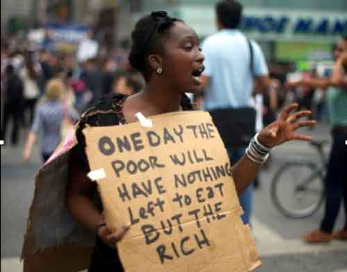

<!-- translated by Yandex Translate -->

# Путь к блогам будущего

Фредерик Пол

## Самые бедные установили новый рекорд за все время!

Думаете, вы бедны только потому, что ваш годовой доход ниже уровня бедности? А как насчет людей, у которых меньше половины этого?  Да ведь это самый [быстрорастущий класс](https://web.archive.org/web/20170717164420/http://www.theatlanticwire.com/national/2011/11/there-are-more-poorer-americans-nows/44487/) в Америке, охватывающий около 20,5 миллионов человек, или 6,7 процента всех американцев.

Это рекорд за все время.  Но продолжайте, Республиканская палата представителей и Верховный суд.  Вы можете увеличить это число!

### 11 Комментариев

- [Роберт Новолл](https://web.archive.org/web/20170717164420/http://www.robertnowall.com/) говорит:
Поскольку я слышал статистику о том, что треть тех, кого относят к категории бедных, также страдают ожирением, я с подозрением отношусь к этой классификации.
[** 20 декабря 2011 года, 4:54 утра**](/posts/2011-12-20-the-poorest-set-a-new-all-time-record/)
- [Дон Сейкерс](https://web.archive.org/web/20170717164420/http://www.scatteredworlds.com/) говорит:
Мистер Пол, я знаю, что вы жили во время Великой депрессии и провели значительные исследования и размышления об экономике, и я, безусловно, доверяю вам больше, чем любому из экспертов и приверженцев средств массовой информации.
Мне кажется, что сейчас действительно темные и безнадежные времена, но у меня нет вашего опыта или знаний. Мне интересно, не могли бы вы поделиться какими-либо мыслями или мнениями, которые у вас есть по поводу нынешнего бардака, в котором мы находимся, по сравнению с прошлым. Уместны ли сравнения с депрессией 1930-х годов или вводят в заблуждение? Обречены ли мы повторять ошибки 30-х годов, или сегодня ситуация иная?
Спасибо вам за то, что вы вложили свое имя и свои мысли в дело сострадания и симпатии ко всем. Если бы наши политики были хотя бы наполовину такими сострадательными и на одну десятую такими умными, как вы, мы были бы в отличной форме!
[** 20 декабря 2011 года, 9:51 утра**](/posts/2011-12-20-the-poorest-set-a-new-all-time-record/)
- Джей Борчердинг говорит:
Забота о бедных (едва ли) приемлема, но только во время сезона отпусков.  В любое другое время года такое причудливое проявление сострадания было бы крайне неамериканским и антихристианским.  
И намек на то, что создатели ценных и хрупких рабочих мест кровно заинтересованы в опасностях крайнего неравенства (по крайней мере, в снижении риска быть расколотыми на части и съеденными), - это не что иное, как классовая борьба между коммунистами и пинко.  
Боюсь, Фред, если ты будешь упорствовать в своих рассуждениях, твоему имени суждено попасть в список террористов "Фокс Ньюс".
[**20 декабря 2011, 17:06 вечера**](/posts/2011-12-20-the-poorest-set-a-new-all-time-record/)
- Сью Маккормик говорит:
Об ожирении: они часто страдают ожирением. Наименее дорогими продуктами на рынке являются углеводы: такие продукты, как рис, макароны, картофель, овсяная мука и другие горячие каши. Если это основная часть вашего рациона, у вас будет избыточный вес и слабость, потому что в вашем доступном рационе не так много белка, а также не так много природных витаминов и минералов.
[**20 декабря 2011 года, 17:50 вечера**](/posts/2011-12-20-the-poorest-set-a-new-all-time-record/)
- [Роберт Новолл](https://web.archive.org/web/20170717164420/http://www.robertnowall.com/) говорит:
Так кто же я такой или вы, чтобы указывать бедным, что им можно есть, а что нельзя?
[** 21 декабря 2011 года, 6:32 утра**](/posts/2011-12-20-the-poorest-set-a-new-all-time-record/)
- Тони говорит:
@Роберт Новолл:  Я собирался ответить, что "дешевые" продукты являются худшими для вас с точки зрения питания – тем самым способствуя ожирению, а не здоровью, но Сью Маккормик опередила меня.
Вы, сэр, такой же, как и ваши тезки – новичок, который на самом деле знает очень мало.  Но продолжайте излагать тезисы RW.  Ваши Ls и Ms гордились бы вами, если бы им было не все равно.
[** 21 декабря 2011 года, 9:17 утра**](/posts/2011-12-20-the-poorest-set-a-new-all-time-record/)
- Джекдейтон говорит:
@Роберт Новолл.
Именно вы впервые упомянули людей, страдающих ожирением, и недвусмысленно намекнули, что ipso facto они не могут быть бедными. Так эффективно вы ** говорили им, что они могут есть, а что нет.  

Вам не приходило в голову, что их свобода питаться надлежащим образом ограничена их бедностью? В этом вопросе у них нет выбора. Они должны питаться дешево (и, следовательно, нездорово), иначе они умрут с голоду. Какой вариант вы для них предпочитаете?
[** 21 декабря 2011, 16:24**](/posts/2011-12-20-the-poorest-set-a-new-all-time-record/)
- Джей Борчердинг говорит:
@Sue, и в связи с замечанием мистера Новолла о том, что уровень ожирения высок среди американской бедноты: большая часть проблем с питанием для бедных заключается в нехватке свежих фруктов и овощей и чрезмерной зависимости от фаст-фуда и упакованных полуфабрикатов, таких как универсальные / магазинные гамбургеры helper.
Если вы с трудом сводите концы с концами и имеете две или три работы с неполной занятостью и минимальной заработной платой без каких-либо льгот, у вас нет ни времени, ни денег на постоянное приготовление здоровой пищи. 
Кулинарная роскошь для бедных взрослых и их детей - это долларовое меню ресторана быстрого питания.  Обычные блюда богаты такими продуктами, как макароны с сыром, возможно, дополненные парой нарезанных хот-догов.  Бедняки и их дети, как правило, получают много калорий, но получают слишком много углеводов и жиров с высокой степенью переработки и слишком много натрия.  Их белок будет поступать из болонской колбасы, поддельного сыра и тому подобного, и они редко едят достаточное количество свежих фруктов и овощей.  
Тот факт, что американские бедняки часто страдают ожирением, вовсе не означает, что их хорошо кормят.
[**21 декабря 2011, 18:19 вечера**](/posts/2011-12-20-the-poorest-set-a-new-all-time-record/)
- Пэт говорит:
Позволь им съесть пирог, а, Роберт?
[**21 декабря 2011, 20:19 вечера**](/posts/2011-12-20-the-poorest-set-a-new-all-time-record/)
- [Роберт Новолл](https://web.archive.org/web/20170717164420/http://www.robertnowall.com/) говорит:
Тони: Значит, ты не можешь ответить, все, что ты можешь сделать, это оскорбить.
[** 22 декабря 2011 года, 8:33 утра**](/posts/2011-12-20-the-poorest-set-a-new-all-time-record/)
- Джон Армстронг говорит:
Мистер Новолл, вы оставили себя совершенно открытым этим поверхностным, едва обдуманным умозаключением. Существует бесчисленное множество исследований, показывающих корреляцию между бедностью, неправильным питанием и ожирением. Менее чем пятиминутное исследование в Интернете развеяло бы ваши подозрения по поводу классификации, но поскольку это потребовало слишком больших усилий в поддержку вашего поста, вы пожинаете плоды бури.  

Это жестокий мир
[**27 декабря 2011, 15:15 вечера**](/posts/2011-12-20-the-poorest-set-a-new-all-time-record/)

[WordPress](https://web.archive.org/web/20170717164420/http://wordpress.org/)
[TWTFB2](https://web.archive.org/web/20170717164420/http://dicksmithsoftware.com/)