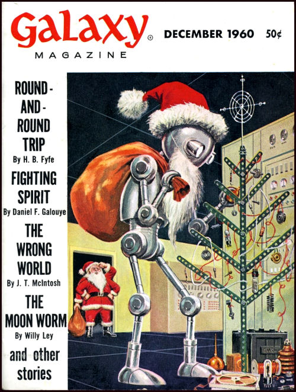

# The Way the Future Blogs

Frederik Pohl

## Seasons’ greetings from the blog team!

### 8 Comments

- jim flanagan says:
Merry Christmas to all of you and thanks for many years of enjoyment and thought provoking ideas.
[**December 25, 2011, 4:53 pm**](/posts/2011-12-25-seasons-greetings-from-the-blog-team/)
- SM says:
Merry Christmas and Happy Newton’s Birthday to you all.  I hope you are having a pleasant time with your loved ones.
[**December 26, 2011, 11:53 pm**](/posts/2011-12-25-seasons-greetings-from-the-blog-team/)
- JohnArmstrong says:
Merry Christmas to Fred and all the team – thanks for the all the enjoyment you’ve given us
[**December 27, 2011, 2:59 pm**](/posts/2011-12-25-seasons-greetings-from-the-blog-team/)
- [Robert Nowall](https://web.archive.org/web/20170707123742/http://www.robertnowall.com/) says:
Well, then, Merry Christmas greetings to the blog team, at least, ’cause I know from my readings into Mr. Pohl’s works that, owing to bad experience from his time as an agent, he doesn’t much care for certain aspects of the Christmas season…
[**December 28, 2011, 6:21 am**](/posts/2011-12-25-seasons-greetings-from-the-blog-team/)
- Carlos M. Federici says:
Dear Fred & Betty: Thanks a lot for your charming card! You never fail me! Unfortunally the sequels of a street accident (hit by a raging moto, damn it!) keeps me from going to the post office and send you a letter. Hope you get this e-greeting instead, wishing you both all sorts of happiness & bliss for 2012 (what a SF kind of date!…) and beyond! Hope you both have had your best Christmas yet!
Your friend from Deep South, C. M. Federici
[**December 28, 2011, 11:48 pm**](/posts/2011-12-25-seasons-greetings-from-the-blog-team/)
- [Bill Goodwin](https://web.archive.org/web/20170707123742/http://771715/) says:
December, 1960…I was born that month.  What a wonderful cover!  It’s Emshwiller, isn’t it?
[**December 29, 2011, 12:13 am**](/posts/2011-12-25-seasons-greetings-from-the-blog-team/)
- Robert Brown says:
Bill, yes, his “EMSH” is written on the battery.  Good old Galaxy.
I don’t do holidays, but I hope you’re all having a swell day, and that you live another loop around “ol’ bright eye” without too much grief.
[**December 30, 2011, 7:33 am**](/posts/2011-12-25-seasons-greetings-from-the-blog-team/)
- DimSkip says:
Happy Holidays of the season to the Pohls and many, many thanks for your career and the countless hours of pleasure you’ve given me via your writings, Mr. Pohl.
I thought perhaps you and your readers might be interested, or at least mildly curious, in this item (I TinyURL’d it for fear the link would be too cumbersome otherwise in its lengthy raw form) I stumbled across re Fritz Leiber’s granddaughter and her personal project in overcoming agoraphobia via her facebook friends (of which I’m NOT one, just to be clear on that point)…
[http://tinyurl.com/ArLynPresser](https://web.archive.org/web/20170707123742/http://tinyurl.com/ArLynPresser)
More info…
[http://www.kickstarter.com/projects/gophofilms/f2fb-face-to-facebook](https://web.archive.org/web/20170707123742/http://www.kickstarter.com/projects/gophofilms/f2fb-face-to-facebook)
May 2012 bring more good than bad, more light than dark, more truth than lies, more joy than sadness, and more tolerance, understanding, compassion, kindness, and maybe eventually love than hatred.
[**December 30, 2011, 4:43 pm**](/posts/2011-12-25-seasons-greetings-from-the-blog-team/)

[WordPress](https://web.archive.org/web/20170707123742/http://wordpress.org/)
[TWTFB2](https://web.archive.org/web/20170707123742/http://dicksmithsoftware.com/)