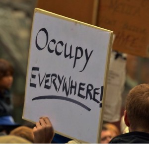

# The Way the Future Blogs

Frederik Pohl

## Here’s to the Occupiers!

A few months ago some fed-up Americans decided to let Wall Street know that they were a bunch of greedy, conscienceless pigs, and so they marched down that short, narrow — and crooked — street.  It made the papers, and the next day there were a few more of them … and then more still … and then other cities caught the fever, and where it will stop no one can say.  And I personally could not be more pleased.

Think it over.  When was the last time you saw a spontaneous mass movement in America?  We have seen plenty of the cooked-up kind, as where [two super-greedy billionaire brothers](https://web.archive.org/web/20120725104307/http://www.newyorker.com/reporting/2010/08/30/100830fa_fact_mayer) give in to their appetite and hire experts to start a mass movement to cut their taxes — or a [TV network beats the drums](https://web.archive.org/web/20120725104307/http://mediamatters.org/research/200904170011?f=h_latest) 24 hours a day for a “spontaneous” mass meeting.

This is the real thing.  It’s the real people, the 99 percent of us, whose incomes are faltering or falling — or gone! — while the richest 1 percent among us are bending the laws and brining our legislators to make them richer still.  Can that be called anything less than rapacious greed?  It is, in truth, class warfare, an unrelenting effort to take away what even the poorest among us have.

Does anyone leaving a job need a $126 million ([Gene Isenberg](https://web.archive.org/web/20120725104307/http://www.bloomberg.com/news/2011-10-31/nabors-s-isenberg-gets-100-million-in-cash-to-leave-ceo-post.html) at Nabors Industries) parting gift?  And he is by no means  the only one — [Eric Schmidt](https://web.archive.org/web/20120725104307/http://money.cnn.com/2011/01/24/technology/google_schmidt_payday/index.htm) at Google got $100 million, and at IBM, [Sam Palmisano](https://web.archive.org/web/20120725104307/http://www.usatoday.com/money/companies/management/story/2011-11-07/100-million-dollar-chairmen/51116304/1) stuffed his pockets with an unbelievable$170 million to ease the pain of leaving his job.

That isn’t just disgusting, it’s gross whole-hog piggery.  It is one of the many battles the 1 per cent’s class war against the rest of us wins day after day.

If there is one thing we’ve learned in the past few years, it is that the very rich don’t care what happens to the rest of us.  When Wall Street’s uncontrollable avarice came within a hair’s breadth of destroying the economy in one villainous spree in 2008 — selling people  securities that they knew to be worthless and mortgage loans that they could never in this world pay back, and then evicting them for those unpaid loans — our government gave them nearly a trillion dollars — that’s $1,000,000,000,000 — of your, the taxpayers’, money to save them from bankruptcy, ostensibly in order to help the home owners.  But the financial institutions didn’t help the home owners.  They took the money and kept it for themselves.

What else have they thought up to do?  Well, for a long time, American businesses have been [pretending to move](https://web.archive.org/web/20120725104307/http://www.bloomberg.com/news/2011-10-13/irs-auditing-how-google-shifted-profits-offshore-to-avoid-taxes.html) to another country in order to avoid paying what they owe America in income tax.  Now they’ve gone farther.  They’ve kept the vast profits of their deceitful offshore actions offshore.  They have all the profits of their activities in overseas banks, where the U.S. can’t tax them for what they owe. (That’s another trillion or so.)

### 7 Comments

- Ken Marable says:
Not much to add except that I wholeheartedly agree! There’s some deep systemic problems in this country that needs fixing. Whether I agree with specific proposals by any of the Occupiers, changing the conversation back to jobs and homeowners is definitely an admirable outcome.
[**December 29, 2011, 6:34 pm**](/fred-pohl/2011-12-29-here-s-to-the-occupiers/)
- [DimSkip](https://web.archive.org/web/20120725104307/http://www.latimes.com/news/opinion/la-oe-lear-occupy-the-new-year-20111230,0,1814372.story) says:
Norman Lear’s op-ed piece in the L.A. Times on ‘Fighting the Good Fight’…
[http://www.latimes.com/news/opinion/la-oe-lear-occupy-the-new-year-20111230,0,1814372.story](https://web.archive.org/web/20120725104307/http://www.latimes.com/news/opinion/la-oe-lear-occupy-the-new-year-20111230,0,1814372.story)
[**December 31, 2011, 4:17 pm**](/fred-pohl/2011-12-29-here-s-to-the-occupiers/)
- Lars says:
Happy New Year to all at The Way The Future Blogs!
[**December 31, 2011, 8:15 pm**](/fred-pohl/2011-12-29-here-s-to-the-occupiers/)
- [Alan Robson](https://web.archive.org/web/20120725104307/http://tyke.net.nz/) says:
Well said sir! Very well said!
–  

-Alan
[**January 1, 2012, 3:37 pm**](/fred-pohl/2011-12-29-here-s-to-the-occupiers/)
- H. E. Parmer says:
I don’t know about brining a legislator. I mean, it may have worked wonders for our Christmas turkey, but I sincerely doubt any treatment could make one of that breed the least bit less gamy and unpalatable. Not even if you serve them with fava beans!
(Sorry, Fred: I couldn’t pass up so golden an opportunity.)
Although Newt — if his bulk isn’t due to being literally as well as figuratively full of it — might be nicely marbled …
[**January 1, 2012, 10:15 pm**](/fred-pohl/2011-12-29-here-s-to-the-occupiers/)
- [A.R.Yngve](https://web.archive.org/web/20120725104307/http://aryngve.com/) says:
Terry Jones (the Monty Python one, not the nutty preacher) made the argument in his book BARBARIANS, that the Roman Empire was destroyed not by “barbarians”, but by the greed of its own wealthy landowning nobility. 
The Roman noblemen (who were also Senators — sounds familiar?) kept squeezing the commoners with taxes and kept reducing their liberties, until the “free men” were really nothing more than serfs — and finally the citizens had no choice but to “drop out” of the system just to survive. The Roman Empire ate itself.
There’s a lesson here, about unchecked greed.
[**January 2, 2012, 9:31 am**](/fred-pohl/2011-12-29-here-s-to-the-occupiers/)
- willie says:
I really appreciate the clear, logical thoughts.  I’ve been stewing myself more over the role of congress and the political system.  The corporate money-makers are just obeying instinct.  Someone has to control them.  But we’ve let them buy the system and set up their own rules.
Worked for a tech giant, where one year we worked with Indian outsourcing companies.  They obtained H1B visas, for software testing managers, sent over a couple of hundred of them, for 6 months, learned over the shoulders of the US staff, then went back and trained their own army of testers, so the company could outsource the work at 1/3 the labor rates.  So, we set up an immigration system that only helps outsource US-based labor to a non-US market (where those salaries will rebound around and around and stimulate the local economies).  Meanwhile, conservative politicians bemoan the attraction of foreign expertise into our local economies, by threatening to further tighten immigration.  My point, there are too many people who have no idea how economics works, acting as paid mouths for the global investor class.  Labor and local investors should have regulatory strength and should be tuning our trade and tax policies to stimulate local investment as a price for opportunity to sell in the local market.  
The hell with WTO and open markets.  The global conglomerates will use global free trade to pay salaries somewhere else so they can drain American consumers on the sales end.  The biggest question you’ve always asked, that matters more fundamentally than anything else, is what will all of the people do if we remove their means of participating in the mainstream economy?   The ability for the citizenry to competitively sell their labor, to fuel the production side of the economy, must be protected by market-shielding laws and regulations.   The global investment class and their global conglomerates have stacked the rules in their favor.  Between the Occupy movement and the simple fact that the US economy is breaking, the rules need to be rewritten.   Damn, sorry to rant.  Never stop telling us how it is.
[**January 2, 2012, 7:38 pm**](/fred-pohl/2011-12-29-here-s-to-the-occupiers/)

[WordPress](https://web.archive.org/web/20120725104307/http://wordpress.org/)
[TWTFB2](https://web.archive.org/web/20120725104307/http://dicksmithsoftware.com/)