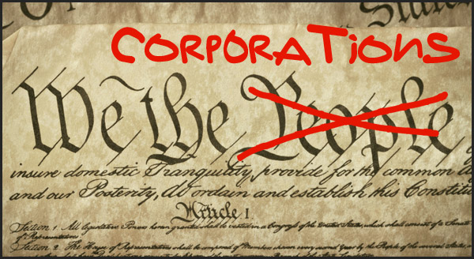

<!-- translated by Yandex Translate -->

# Путь к блогам будущего

Фредерик Пол

## Эй, оккупанты!  Ищете, чего бы потребовать?

Вот вопрос: какое самое глупое и предосудительное решение за все время, которое навязала нам Банда из пяти человек в тупоголовом республиканском Верховном суде?  Ответ:  Это должно быть так называемое решение “[Объединенных граждан](https://web.archive.org/web/20120307024003/http://www.salon.com/2012/01/21/the_hard_truth_of_citizens_united/)”.  Это то, из-за чего вера в то, что корпорации - это люди, стала предметом веры правых.

Конечно, это неправда.  Даже Банда пяти должна это знать.  Но есть люди, которые, похоже, думают, что это Евангелие.  Митт Ромни, например, потому что, когда он вступил в спор с избирателем на ярмарке штата Айова, он сказал: “Но корпорации - это люди, мой друг”, - и ушел, очевидно, думая, что выиграл спор.

Ну, на самом деле они не люди.   Каждый здравомыслящий человек старше шести лет знает, что это не так, и все же это нелепое решение имеет силу закона.  Среди прочего, это позволяет сверхбогатым брать деньги прямо из казначейств корпораций, которые они контролируют, и отдавать их в любом количестве на кампании любых политиков, которых они выберут.  Мы видим, что прямо сейчас происходит в основных битвах за то, кто сможет купить больше всего телевизионного времени.

Верховный суд настолько опьянен собственным величием, что считает себя действительно верховным.   Однако и в этом они ошибаются.  Решение Верховного суда может быть отменено.  Один из способов отменить такое постановление - отнестись к нему так, как если бы оно было частью Конституции, и принять поправку

Это означает вести борьбу в каждой палате представителей штата и законодательном собрании штата в стране до тех пор, пока достаточное количество штатов не согласится на это.  На этом этапе их решение больше не имеет никакой силы.

Очевидно, что это влечет за собой большую работу многих людей, но другой способ взглянуть на этот факт - принять во внимание тот факт, что вы ведете борьбу со всеми этими общенациональными политиками, предоставляя Occupy хороший способ заставить всех людей, которые контролируют законотворчество в стране, быть вынужденными займите твердую позицию.

И они должны сделать это, в то время как опросы показывают им, что значительное большинство избирателей округа хотят, чтобы поправка была принята.

Есть ли лучший способ позволить обычным людям учитывать свои пожелания таким образом, чтобы бюрократия не могла их игнорировать?

### 12 Комментариев

- [Шакатани](https://web.archive.org/web/20120307024003/http://shakatany.livejournal.com/) говорит:
Ну, конечно, все знают, что Линкольн сказал "правительство большого бизнеса", "от большого бизнеса", "для бизнеса" / сарказм
[**24 февраля 2012, 20:54 вечера**](/fred-pohl/2012-02-24-hey-occupiers-looking-for-something-to-demand/)
- Скип говорит:
Конечно, у корпораций есть права по первой поправке.   Потому что у людей, которые их составляют, есть права по первой поправке, от которых они не отказываются только потому, что решили воспользоваться своей конституционной свободой объединения.  Это даже близко не подходит для тех, кто верит в свободу.    Теперь я знаю, что это вас не поколеблет, потому что врожденное зло корпораций в целом и дело Citizens United в частности являются символами веры левых, но давайте просто посмотрим на последствия, если ваша точка зрения подтвердится.
“Ни одна газета не должна поддерживать какого-либо политического кандидата в течение 60 дней после выборов".   Конституционный в соответствии с вашей теорией, и туда уходит большая часть материалов "Нью–Йорк таймс" - у них почти ничего не осталось бы, кроме спортивных состязаний и рекламы. И, пожалуйста, обратите внимание, законы, которые "Граждане Юнайтед" отменили, специально исключали газеты, потому что они считали, что должны были это сделать.   Подобный закон не должен быть конституционным ни в одной стране, в которой я хотел бы жить.
[**24 февраля 2012, 19:21 вечера**](/fred-pohl/2012-02-24-hey-occupiers-looking-for-something-to-demand/)
- [Роберт Новолл](https://web.archive.org/web/20120307024003/http://www.robertnowall.com/) говорит:
Я никогда не слышал от консерваторов, что корпорация - это личность, это символ веры.  Скорее наоборот.
[** 25 февраля 2012 года, 9:26 утра**](/fred-pohl/2012-02-24-hey-occupiers-looking-for-something-to-demand/)
- Джон А. Хили говорит:
У меня с этим все в порядке.  Если, и только если, корпорации подчиняются всем законам, которые касаются меня.  Альтернативный минимальный налог, законопроект (можете ли вы сказать "расходы плюс"?), любые юридические требования в отношении судебной системы были бы для меня такими же, как и для Mr. Corp., за исключением обязанности присяжных заседателей (только для избирателей, пожалуйста.) В противном случае это должно быть отменено.
[** 25 февраля 2012 года, 11:23 утра**](/fred-pohl/2012-02-24-hey-occupiers-looking-for-something-to-demand/)
- Джей Борчердинг говорит:
Интересно, какой должна быть точная формулировка этой предлагаемой поправки?  Хотя я согласен с тем, что решение Citizens United было очень ошибочным, я с подозрением отношусь к тому, чтобы играть с защитой свободы слова, предусмотренной первой поправкой.  
Если мы ограничим политическую защиту свободы слова только отдельными лицами, это может иметь непреднамеренные последствия в виде увеличения власти состоятельных людей.  Если корпорациям, профсоюзам и организациям, таким как Торговая палата или AARP, можно заткнуть рот на их политической речи, то кто останется противодействовать власти богатых правых людей, кроме богатых левых людей?  И нет ли опасности скатиться по скользкому склону?  Ограничение политических высказываний не является безрисковым предприятием, вот почему точная формулировка такой поправки так важна.
[**25 февраля 2012, 12:43 вечера**](/fred-pohl/2012-02-24-hey-occupiers-looking-for-something-to-demand/)
- Ричард Молпус говорит:
“Мы, люди” - это утверждение корпоративного поведения; способность групп людей (в данном случае объединенных граждан нескольких государств) объединяться и действовать как "единое" целое. 
Утверждение о том, что только отдельные люди могут высказываться по политическим вопросам, разрушает намерение, цель и смысл выражения “Мы, народ”; группа людей может говорить в один голос, в унисон распространяя свои слова дальше, чем достигают их объединенные голоса.
Мистер Пол зарабатывал на жизнь, объединяясь с другими, чтобы говорить – как писатель, продающий слова издателям, и как редактор, отбирающий слова других авторов для распространения. Он был источником и отборщиком политических высказываний в своих редакционных подборках, а также когда был автором книги о практической политике.
Если корпорации не могут говорить сами за себя (что означает, что владельцы или менеджеры корпорации используют ее ресурсы в своих собственных целях), то как отдельный человек может использовать те же самые ресурсы для распространения своих слов? Запрещать одному человеку и в то же время позволять другому распространять свои слова, используя рыночные методы, - это признак уничтоженной свободы, независимости, раскрепощенности и отпечаток кулака тирана.
[** 26 февраля 2012 года, 4:05 утра**](/fred-pohl/2012-02-24-hey-occupiers-looking-for-something-to-demand/)
- джин говорит:
ФУУУ, когда Ромни сделал это глупое и некорректное заявление на ярмарке штата Айова, в ответ раздалось много улюлюканья и насмешек.  Айовцы не деревенщины, несмотря на поддержку республиканцами штата Айова Рика Санторума.
[**26 февраля 2012, 15:11 вечера**](/fred-pohl/2012-02-24-hey-occupiers-looking-for-something-to-demand/)
- Уиллоу говорит:
Я регулярно читаю ваш блог, и мне это просто нравится. Ваши мысли о политике и тому подобном во многом похожи на мои, разница в том, что у вас гораздо лучше получается облекать это в слова, чем у меня. Я всегда с нетерпением жду новых публикаций в этом блоге. Спасибо, что подарили мне еще одну вещь в жизни, на которую я могу рассчитывать регулярно.  
[**26 февраля 2012, 18:07 вечера**](/fred-pohl/2012-02-24-hey-occupiers-looking-for-something-to-demand/)
- Уолт Джи говорит:
Если бы Суд принял иное решение, это означало бы, что правительство могло бы подвергать цензуре фильмы из-за их политического содержания.
[**26 февраля 2012, 19:40 вечера**](/fred-pohl/2012-02-24-hey-occupiers-looking-for-something-to-demand/)
- [Тодд Мейсон](https://web.archive.org/web/20120307024003/http://socialistjazz.blogspot.com/) говорит:
К сожалению, хотя корпорации являются контрактами, в законодательстве США они рассматриваются как де-факто “лица” с тех пор, как в 1800-х годах было сформулировано заключение Верховного суда США, допускающее такое толкование. Решение Таможенного союза просто подтвердило это. Запрет на обращение с корпорациями как с личностями разрушает 1-ю поправку не больше, чем запрет на заключение браков третьим лицом наряду с партнерами (оставляя на мгновение в стороне браки более чем из двух человек).
[** 28 февраля 2012 года, 8:31 утра**](/fred-pohl/2012-02-24-hey-occupiers-looking-for-something-to-demand/)
- Рыжая Эмма говорит:
Что действительно возмущает меня в решении Citizens United, так это то, что корпорации на самом деле требуют представительства без налогообложения (например, “избавиться от корпоративного налога”).
[**29 февраля 2012, 14:59**](/fred-pohl/2012-02-24-hey-occupiers-looking-for-something-to-demand/)
- Джон Кавана говорит:
При всем моем уважении, мистер Пол, вам следует придерживаться обсуждения научной фантастики. Когда вы пишете о политике, вы говорите как не очень сообразительный первокурсник колледжа.
[**2 марта 2012 года, 3:48 утра**](/fred-pohl/2012-02-24-hey-occupiers-looking-for-something-to-demand/)

[WordPress](https://web.archive.org/web/20120307024003/http://wordpress.org/)
[TWTFB2](https://web.archive.org/web/20120307024003/http://dicksmithsoftware.com/)