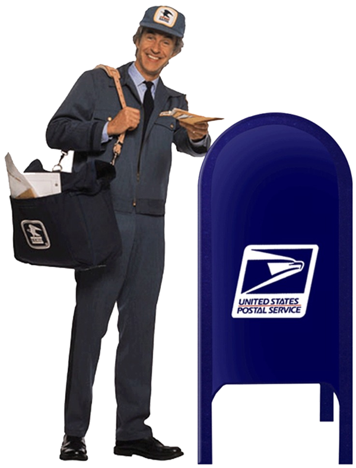

<!-- translated by Yandex Translate -->

# Путь к блогам будущего

Фредерик Пол

## Спасите почтальона

Он лучший государственный служащий, который у нас есть

Что такого такого, что республиканцы так сильно ненавидят в почтальоне?  Дело не в том, что он высасывает деньги налогоплательщиков: с 1971 года он не взял из них ни цента.  Правительство больше не выплачивает зарплату почтальонам.  Почтальоны платят им сами, из денег, которые они получают от продажи марок, которые вы наклеиваете на свои рождественские открытки, чтобы отправить их куда угодно, от Нью-Йорка до Нигерии.  Большинство американцев тоже считают почтальона хорошим парнем.  Вот почему в течение шести лет подряд он был назван самым надежным аспектом государственного управления.

Тем не менее, Республиканская партия в очередной раз требует сократить его, закрыть или, по крайней мере, приватизировать.  Зачем любому здравомыслящему человеку это делать, когда за последние четыре года общенациональной рецессии и физических потерь Почтовая служба не потеряла деньги, а вместо этого показала операционную прибыль в размере 700 миллионов долларов?  Правда, в их бюджетах это не отражается как прибыль.  Вместо этого они показывают убыток в размере 13 миллиардов долларов, и это потому, что бюджеты лгут.

Начиная с 1971 года, когда Закон Ричарда Никсона о реорганизации почтовой связи стал законом, и вплоть до 2006 года, когда Джордж У. Принятый Бушем Закон о почтовой подотчетности и правоприменении пересмотрел понятие “подотчетность” таким образом, какого никогда раньше не видели ни на суше, ни на море, республиканские администрации возложили на почтовую службу невыполнимые обязательства.

Обязательства вроде каких?

Ну, например, требовать от почтовой службы предварительной оплаты всех медицинских пособий, на которые имели бы право их сотрудники, когда они наконец выйдут на пенсию.  Другими словами, почтовой службе было приказано выплачивать из текущего дохода каждый доллар, который ей когда-либо придется заплатить за каждого сотрудника, который у нее когда-либо будет.  Просто чтобы было ясно, насколько нелепо любое подобное положение, это включало бы выплату пенсионных пособий будущим сотрудникам, которые еще даже не родились.

Это не финансовая предусмотрительность.  Это хладнокровное убийство.

Делайте свои собственные выводы, но я думаю, вы знаете, что я думаю.  Это означает, что на самом деле есть только один хороший способ предотвратить это и другие хладнокровные бесчинства, и это - вышвырнуть негодяев вон и избрать президента-демократа и Палату представителей, а также большее демократическое большинство в Сенате, чтобы отобрать у республиканцев кувалду флибустьера.  Только не говорите мне, что некоторые демократы так же плохи, как республиканцы.  Если вы говорите о морали, то это правда.  Но демократы голосуют по—своему, в то время как Республиканская партия — теперь это “Жадная старая партия” - превратилась в таран, у которого есть только одна главная цель: убедиться, что Барак Обама ничего не сможет добиться.

Итак, на этот раз зажмите нос и проголосуйте за солидный демократический билет.

### 13 Комментариев

- [Ричард](https://web.archive.org/web/20120508223027/http://estoreal.blogspot.com/) говорит:
Я вижу, что вы там сделали: ответ скрыт непосредственно перед вопросом.  “Что такого, что республиканцы так сильно ненавидят в почтальоне?  Он лучший государственный служащий, который у нас есть”.  Вот и все в двух словах.  Вы не можете утверждать, что правительство - это проблема, оно ничего не делает для людей и должно быть ликвидировано, если государственная служба пользуется огромным успехом и делает хорошие вещи для общества.  Итак, вы устраняете эту проблему, делая все, что в ваших силах, чтобы отключить этот сервис, чтобы он не мог выполнять свою работу и больше не работал ... и тогда вы можете сказать: “Видите? Правительство не работает!”
[** 30 апреля 2012 года, 1:22 утра**](/posts/2012-04-30-save-the-mailman/)
- Джей Денни говорит:
Я давний фэн, мистер Пол. Я измотал свою копию Врат(Gateway) многократными повторными прочтениями. И мне действительно нравится USPS, особенно радушный и расторопный почтальон на нашем маршруте. Мне очень не нравится Республиканская партия, и я считаю Дубью одним из наших худших президентов, уступающим только Бараку Обаме. Вместе Буш и Обама подвели Соединенные Штаты прямо к грани экономического вымирания. При растущем долге в 15 триллионов долларов мне кажется, что зажимать нос и голосовать за “твердый демократический билет” - самоубийство. Демократическая партия привержена несостоявшемуся кейнсианскому расточительству. Тем не менее, голосовать за Республиканскую партию также не имеет особого смысла, потому что Республиканская партия говорит о финансовой ответственности, но не применяет ее на практике. Похоже, мы обречены как общество, мистер Пол, и это гораздо более серьезная проблема, чем судьба USPS. Итак, мой вопрос к вам, сэр, при всем уважении, таков: ЧТО теперь?
[** 30 апреля 2012 года, 2:29 утра**](/posts/2012-04-30-save-the-mailman/)
- [ТЭД](https://web.archive.org/web/20120508223027/http://www.tadsbackupplan.blogspot.com/) говорит:
Абсолютно согласен. Почтовое отделение терпит поражение — и, за исключением пары счетов, которые они потеряли несколько лет назад, когда я переехал, абсолютно все, что когда—либо отправлялось через них, дошло до меня, включая пару ваших книг, которые я заказал. Раньше, когда я отправлял художественную литературу, почтовое отделение НИКОГДА ничего не теряло. Они мирятся с большим количеством мусора и таскают с собой много хлама, но они всегда хорошо относились ко мне. ...И, кроме того, республиканцы совершенно оторваны от дел. Я уверен, они бы взвыли, если бы их чеки с зарплатой или взносы на предвыборную кампанию “потерялись” по почте....
[** 30 апреля 2012 года, 4:21 утра**](/posts/2012-04-30-save-the-mailman/)
- Джон Трейлор говорит:
Хорошо сказано, мистер Пол. Одно время я действительно время от времени голосовал за республиканцев, в зависимости от кандидата. Теперь я скорее прострелю себе ногу, чем проголосую за любого республиканца (если подумать, это именно то, что я бы сделал). Что касается почтовой службы, то всякий раз, когда она жалуется на стоимость марок для отправки открыток нашим внукам, проживающим в Калифорнии, я говорю своей жене, что это выгодная сделка - отправить открытку через всю страну менее чем за полдоллара.
[**30 апреля 2012 года, 6:54 утра**](/posts/2012-04-30-save-the-mailman/)
- [Севестин](https://web.archive.org/web/20120508223027/http://www.sevesteen.com/) говорит:
Так почему бы не отделить почтовую службу, не превратить ее в настоящее частное предприятие, управляемое теми же людьми, у которых сейчас все так хорошо?  
Часть о выплате пособий сотрудникам, которые еще не приняты на работу, не имеет смысла – я даже не представляю, как это будет рассчитываться, поэтому я довольно сомневаюсь в этом утверждении.  С другой стороны, требование подотчетности за обещанные, но еще не выплаченные льготы имеет смысл.  Особенно, когда мы видим, что происходит, когда эти статьи не учитываются, когда работодатели обещают щедрые пенсионные выплаты, но полагаются на нереалистичный "рост" для их финансирования, вместо того чтобы на самом деле что-то откладывать.
[** 30 апреля 2012 года, 8:23 утра**](/posts/2012-04-30-save-the-mailman/)
- Рик Йорк говорит:
Кто-нибудь проверял, какой вклад внесли FedEx, UPS, DHL и т.д. в борьбу республиканцев против Демократы?
Цуй боно, ребята, цуй боно
[**30 апреля 2012, 16:12 вечера**](/posts/2012-04-30-save-the-mailman/)
- Кен говорит:
Как трудолюбивый почтальон с булочками, купленными в магазине, спасибо Фреду! Эй, Севестин, проведи небольшое исследование, и ты увидишь, что все, что сказал Фред, правда. Что касается приватизации, я уверен, вы будете плакать навзрыд, когда будете отчаянно писать Ромни электронное письмо с требованием объяснить, почему вам пришлось заплатить 5 долларов за доставку вашего социального чека.
[**30 апреля 2012, 19:08 вечера**](/posts/2012-04-30-save-the-mailman/)
- [Чуки на заднем дворе](https://web.archive.org/web/20120508223027/http://chookiesbackyard.blogspot.com/) говорит:
Я хотел бы указать Джею Денни, что причина, по которой моя страна находится в лучшем экономическом состоянии, чем у кого-либо другого, заключается в классических кейнсианских расходах.  Здесь он не потерпел неудачу.  (Конечно, я не знаю сути того, что планируют ваши демократы.)
[**1 мая 2012 года, 4:28 утра**](/posts/2012-04-30-save-the-mailman/)
- Джей Денни говорит:
P.S. к моему предыдущему ответу. Ладно, итак, мы голосуем за прямолинейную прогрессивную кейнсианскую демократию, мы спасаем USPS, но в конечном итоге хороним себя под триллионами и триллионами долларов суверенного долга и необеспеченных обязательств. Экономика придет в упадок. ЦИВИЛИЗАЦИЯ РУХНЕТ. Что хорошего в нашем любимом USPS после экономического апокалипсиса? Кто-нибудь, пожалуйста, скажите мне: что тогда? Есть какие-нибудь ответы? Мистер Пол? Кто-нибудь?
[**1 мая 2012 года, 4:59 утра**](/posts/2012-04-30-save-the-mailman/)
- [Роберт Новолл](https://web.archive.org/web/20120508223027/http://www.robertnowall.com/) говорит:
Я могу говорить и как почтовый служащий, и как член APWU — что бы ни говорило руководство, рядовые не думают, что республиканцы ненавидят нас больше, чем демократы, или что наши шансы были бы выше, если бы демократы были у власти.  Наш местный житель только что провел кампанию по спасению нашего почтового отделения от закрытия — я говорю “наш местный”, но, честно говоря, я был в основном сторонним наблюдателем — и скоординировал усилия как демократов, так и республиканцев, а также независимых, которые не хотят видеть потери обслуживания в этом районе.  (Возможно, это также привело к пожертвованию другим заводом, но мы бы предпочли, чтобы все они оставались открытыми.)
Теперь, что касается долгов — это правда, что пенсионное финансирование заменило нереалистичное бремя для USPS, вынудив финансировать выход на пенсию почтовых работников, которые еще не родились, а тем более не были наняты, — и финансирование осуществлялось за счет займов.  Но деньги идут в тот аморфный орган, который я здесь назову “Казначейство США”.  Это то же самое, что и “сейф социального страхования” — поступающие туда деньги тратятся на финансирование чрезмерно раздутого правительства и обслуживание долга, понесенного демократами, не оставляя ничего, кроме долговых расписок сомнительной ценности.  Я надеюсь вскоре получить немного пенсионных денег — мне пошел двадцать пятый год, - но я не знаю, сколько я смогу, э—э, получить.
Я готов пожертвовать собой, чтобы решить проблемы этого поколения... но, чувак, это будет трудно.
[**1 мая 2012 года, 5:47 утра**](/posts/2012-04-30-save-the-mailman/)
- Ламонт Крэнстон говорит:
Как и любая другая "реформа", они обыгрывают ее провал, чтобы потом кричать об этом и неэффективности правительства и, таким образом, приватизировать ее  

Фиксация была бы идеологической, что-то тихо пыхтящее, выполняющее свою работу без ошибок и потерь, или злое вмешательство правительства является анафемой для догмы, которую они продвигают  

Хорошим примером этого является их еще более масштабная целевая программа социального обеспечения, она работает, но это последнее, что они хотят, чтобы кто-то думал об этом
[**3 мая 2012 года, 8:42 утра**](/posts/2012-04-30-save-the-mailman/)
- Пол Лешке говорит:
Мое понимание экономики в лучшем случае зачаточно, но у меня складывается впечатление, что если бы все обязательства по предоплате почтовой службе были сняты, у нас была бы часть нашего правительства, пусть и небольшая, которая действительно могла бы сама за себя платить.  Снятие обязательств привело бы к экономии средств, верно?Отражает ли это каким-либо образом бюджетное предложение Палаты представителей?
[**3 мая 2012, 14:35 вечера**](/posts/2012-04-30-save-the-mailman/)
- Пола Хелм Мюррей говорит:
Мне нравится как ежедневная доставка почты, так и почтовый ящик, который я использую для своих профессиональных дел.  
Вся эта затея с бюджетом, которую мерзавцы проделали с почтовым отделением, - дерьмовое решение.  в Соединенных Штатах не было бы ни одного бизнеса, который мог бы продолжать нести это бремя.
[**3 мая 2012 года, 9:32 вечера**](/posts/2012-04-30-save-the-mailman/)

[WordPress](https://web.archive.org/web/20120508223027/http://wordpress.org/)
[TWTFB2](https://web.archive.org/web/20120508223027/http://dicksmithsoftware.com/)