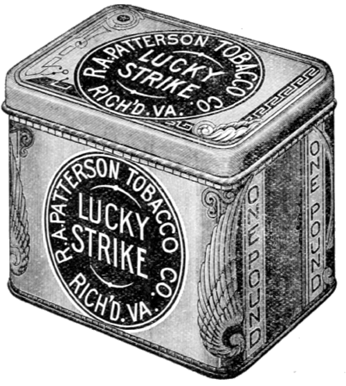

<!-- translated by Yandex Translate -->

# Путь к блогам будущего

Фредерик Пол

## А ты как думаешь?

Я не знаю, ребята, знаете вы это или нет, но вас довольно много — во всяком случае, достаточно, чтобы заинтересовать некоторых рекламодателей и заставить вас покупать их товары.  Прямо сейчас нам предложили контракт с выплатой денег за привилегию размещать их рекламу в блоге наряду с обычной болтовней, воспоминаниями и тому подобным.

Что неправильно в этой идее, так это то, что я думаю, что часть рекламы была бы посвящена таким вещам, как сигареты, которые доставляют некоторым из вас серьезные неприятности.  Как давний бывший курильщик, я уверен, что после более чем дюжины лет, в течение которых я ни разу не закурил, нет такой вещи, как реклама, которая заставила бы меня отступить.

Но меня беспокоит вопрос о том, чтобы подвергать искушению тех, кто этого не хочет.  Так что сделайте мне одолжение: если реклама для вас вообще важна, пожалуйста, прокомментируйте и скажите либо “мне все равно”, либо “мне это не нравится”. (Конечно, если мы будем снимать рекламу, все это будет показываться в дополнение ко всему остальному, что вы получали все это время.)

### 75 Комментариев

- Субрата Сиркар говорит:
Мне это не нравится.  Не то чтобы меня лично заботила реклама, но меня действительно волнует как то, что рекламируется, так и общая неряшливость, которая, похоже, сопутствует бизнесу.  (В частности, реклама табака, алкоголя и т.д. кажется мне тем, чего я бы не хотел здесь видеть.  Конечно, это ваш блог.)
С другой стороны, реклама для научно-фантастических журналов, издательств и т.д., скорее всего, получит больший процент просмотров и будет лучше соответствовать требованиям.
[**3 мая 2012 года, 12:51 утра**](/fred-pohl/2012-05-03-what-do-you-think/)
- [Мэтт Платт](https://web.archive.org/web/20120630152156/http://about.me/matthew.platte) говорит:
Мне все равно.  Если они станут слишком раздражающими, я придумаю, как их заблокировать, возможно, с помощью dotjs.
[**3 мая 2012 года, 12:53 утра**](/fred-pohl/2012-05-03-what-do-you-think/)
- Дэвид Голдфарб говорит:
Я бы сказал, что мне все равно.
[**3 мая 2012 года, 12:57 утра**](/fred-pohl/2012-05-03-what-do-you-think/)
- [Джошуа Цукер](https://web.archive.org/web/20120630152156/http://uncoverafew.wordpress.com/) говорит:
мне все равно.
Я имею в виду, если вы считаете, что они выглядят уродливо, загромождают пространство или мешают нам оценить ваш контент, тогда не запускайте их.  Если вы считаете, что деньги того стоят, тогда запустите их.  Лично я очень, очень ценю все замечательные истории, которые вы рассказали нам здесь, не взяв с нас ни цента.
Другим возможным подходом было бы посмотреть, какие деньги вы получаете, нажимая кнопку пожертвования без рекламы.  Я был бы рад пожертвовать стоимость книги в мягкой обложке за рассказы, которые вы нам здесь предоставили.  Возможно, достаточное количество читателей захотят это сделать, так что таким образом вы заработаете больше денег, чем на рекламе.  Или вы могли бы продавать электронную версию книги (или бумажную версию книги, или и то, и другое вместе) всего, что вы написали для блога.
[**3 мая 2012 года, 1:30 утра**](/fred-pohl/2012-05-03-what-do-you-think/)
- Майкл Бургун говорит:
Я ценю все ваши неоплачиваемые усилия и думаю, что вы получаете небольшой доход от нескольких объявлений, чтобы быть честным. В любом случае, для тех, кто действительно возражает, с их стороны потребуется небольшое усилие, чтобы отключить показ такой рекламы в своем браузере!
[**3 мая 2012 года, 1:56 утра**](/fred-pohl/2012-05-03-what-do-you-think/)
- Джим Фланаган говорит:
Я с Джошем. Но также не вижу никаких проблем с добавлениями.
[**3 мая 2012 года, 2:39 утра**](/fred-pohl/2012-05-03-what-do-you-think/)
- Майкл говорит:
*Меня* это особо не волнует. Я, вероятно, этого не увижу. Я обнаружил это, когда искал в Интернете подробную информацию об одном компьютерном оборудовании. Перейдя на сайт и уже собираясь уходить, я заметил окружающую рекламу. Они были порнографическими. Я не имею в виду, что они были для порнографии — они *были* откровенной порнографией (я не знаю, для чего они были — вероятно, это было для порнографии — я не стал утруждать себя выяснением. Я просто продолжил свой путь в несколько ошеломленном виде). Дело в том, что я буквально не видел рекламы. Я подозреваю, что я не одинок в своих навыках.
Что наводит меня на вопрос — кому здесь платят? В конечном счете, реклама полезна, если она связывает продавца с покупателем, но я подозреваю, что она связывает продавца клик-приманки только с неудачной отметкой, и поэтому никакой реальной ценности здесь нет. Или, по крайней мере, никакой ценности, с которой я хотел бы быть связанным.
[**3 мая 2012 года, 3:41 утра**](/fred-pohl/2012-05-03-what-do-you-think/)
- Джейн говорит:
Мне все равно. Воспользуйтесь возможностью выяснить, влияет ли реклама на ваших читателей. (Не передавайте эту информацию рекламодателям.)
[**3 мая 2012 года, 4:08 утра**](/fred-pohl/2012-05-03-what-do-you-think/)
- Мо говорит:
Я бы предпочел не видеть рекламу, потому что я думаю, что если бы вы эффективно монетизировали нас, это изменило бы характер диалога и дух сообщества. (Хотя, конечно, у вас может быть иной взгляд на эти вещи, чем у меня.)
Я купил несколько ваших книг с тех пор, как начал следить за этим блогом, так что в этом смысле вы уже получили от меня некоторое финансовое вознаграждение
[**3 мая 2012 года, 4:52 утра**](/fred-pohl/2012-05-03-what-do-you-think/)
- [букмол](https://web.archive.org/web/20120630152156/http://bookmole1.wordpress.com/) говорит:
Ммм. Наверняка вы можете сами решить, какая реклама будет размещаться на сайте? Тогда у меня вообще не было бы с этим проблем. Ваш сайт, ваше мнение.
Если бы это было не под вашим контролем, тогда я бы сказал, не делайте этого!
[**3 мая 2012 года, 5:52 утра**](/fred-pohl/2012-05-03-what-do-you-think/)
- Уильям Селигман говорит:
Для меня это не имеет значения. Я пользуюсь блокировщиком рекламы. Это третья величайшая вещь, когда-либо изобретенная Богиней, сразу после секса и сарказма.
[**3 мая 2012 года, 6:48 утра**](/fred-pohl/2012-05-03-what-do-you-think/)
- Лев Петр говорит:
Был ли этот контракт предложен по незапрашиваемой электронной почте? Если это было так, то, скорее всего, это мошенничество. Я бы посоветовал разместить рекламу в Google, если вы заинтересованы в рекламе.
[**3 мая 2012 года, 7:15 утра**](/fred-pohl/2012-05-03-what-do-you-think/)
- Дженнифер говорит:
Я с Джошуа. Меня не волнует реклама; содержание рекламы для меня бессмысленно. Но если показ рекламы имеет для вас финансовое значение и позволяет нам получать больше этих замечательных историй, дерзайте.
[**3 мая 2012 года, 7:27 утра**](/fred-pohl/2012-05-03-what-do-you-think/)
- Лерой Перл говорит:
Я не уверен, что когда-либо видел рекламу сигарет в Интернете. Я знаю, что в Канаде существуют жесткие ограничения на рекламу табака (прямой запрет на прямую рекламу, запрещение использования слов "сигарета" или "табак" на вывесках, упаковки, спрятанные за непрозрачными дверцами без декора в розничных магазинах).. Интересно, существует ли какой-то национальный интернет-фильтр для рекламы сигарет, поступающей из-за пределов Канады? Или если табачные компании воздержатся от размещения рекламы по всему Интернету, потому что они чувствуют (или знают), что это доставит им неприятности в США, Канаде, других странах, где реклама ограничена или запрещена?
В любом случае, что меня больше беспокоит, так это неэтичная реклама афер с потерей веса, порно, схем быстрого обогащения и так далее. Я говорю, что если ваши рекламодатели пользуются репутацией, дерзайте. И как это очень тактично с вашей стороны - спросить мнение ваших читателей, спасибо!
[**3 мая 2012 года, 8:03 утра**](/fred-pohl/2012-05-03-what-do-you-think/)
- Трейси Кэллисон говорит:
Неважно – они все равно не отображаются в моей RSS-ленте, если вы получаете за это фиксированную плату (и это привлекательно для вас), такие люди, как я, не будут иметь значения для конечного результата.  Однако в идее Джошуа есть некоторые достоинства – людям повезло с кнопками для пожертвований.  Стоит попробовать, прежде чем переходить на рекламу.
[**3 мая 2012 года, 8:33 утра**](/fred-pohl/2012-05-03-what-do-you-think/)
- Роберт Дженнингс говорит:
Мне это совсем не нравится!
Продавать яд, вызывающий привыкание, неправильно.  Почему бы не разместить свои объявления среди торговцев другими подобными товарами; например, продавцов героина, или, возможно, принять объявление фирмы, которая продает незарегистрированное оружие городским бандам.  Как насчет рекламы детского порно?  Пожалуйста, подведите черту.  Вы так отчаянно нуждаетесь в деньгах, что вынуждены принимать рекламу от компании, которая продает яд, вызывающий привыкание?
— Роберт Дженнингс  

Сказочные художественные книги
[**3 мая 2012 года, 8:42 утра**](/fred-pohl/2012-05-03-what-do-you-think/)
- Джефф Гондек говорит:
Фред (и ко), я думаю, ты можешь разделить ребенка, если хочешь. 
[https://www.projectwonderful.com /](https://web.archive.org/web/20120630152156/https://www.projectwonderful.com/)
Возможно, за меньшие деньги, чем у других, но в значительной степени вполне стильно.
[**3 мая 2012 года, 8:50 утра**](/fred-pohl/2012-05-03-what-do-you-think/)
- [Кит Грэм](https://web.archive.org/web/20120630152156/http://www.cthreepo.com/) говорит:
Я успешно запускаю рекламу Google Adsense примерно в дюжине блогов. Обычно вы зарабатываете от 1 до 10 долларов на каждой 1000 уникальных посетителях в месяц, в зависимости от тематики вашего блога. Объявления Google Adsense могут быть текстовыми (вы можете отказаться от показной графической рекламы). Объявления привязаны к содержимому страницы. Если вы говорите о сигаретах, то можете увидеть рекламу сигарет.  

Adsense - это, безусловно, ваш самый прибыльный вариант. Adsense позволяет вам указать, какие виды рекламы вы хотите видеть, и у вас есть полный контроль над всеми аспектами. Вы можете разместить объявление “Башня” в правой колонке. Вы можете размещать широкие тонкие объявления “таблицы лидеров” вверху или между постами. Объявления на доске лидеров - это просто ссылки на ключевые слова, они ненавязчивы и хорошо оплачиваются.  

Вы также можете включить adsense для поиска на своем сайте, чтобы любой, кто захочет выполнить поиск по какому-либо названию или теме на вашем сайте, также увидел несколько связанных объявлений сбоку. Существует даже adsense для мобильных устройств, так что люди, читающие ваш блог со своего смартфона, будут видеть соответствующую рекламу.
Если вы еще этого не делаете, ссылки на ваши книги справа должны проходить через Amazon Associates, чтобы вы получали дополнительные 4-6% при продаже книги на Amazon человеку, который купит книгу по ссылке. Amazon хорош тем, что он удаляет файл cookie, когда кто-то нажимает на ссылку Amazon Associates, и если человек не покупает вашу книгу, но покупает что-то еще в течение того же сеанса, вы все равно получаете свой процент. Этот небольшой процент зависит от цены и делает продажу вашей книги немного более прибыльной.
Еще одним способом монетизации блога было бы преобразовать любую из ваших книг, вышедших из печати, в формат Kindle и выпустить их на Amazon Kindle Direct. Конвертировать книги в Kindle в первый раз непросто, но когда вы сделаете это один раз, все будет не так уж плохо. Возможно, стоит заплатить кому-нибудь за конверсию. Amazon продает через Kindle столько же книг, сколько и бумажных.
Насколько я понимаю, реклама морально нейтральна. Это текущие расходы на публикацию. Очевидно, что вы ведете блог как способ продавать книги, даже если кажется, что вы действительно хорошо проводите время, занимаясь этим. Реклама для меня не проблема. Сайт стоит вам времени и денег, поэтому у меня нет проблем с тем, что вы прикарманите несколько баксов “денег на пиво” за одну-две рекламы.
Кит
[**3 мая 2012 года, 8:58 утра**](/fred-pohl/2012-05-03-what-do-you-think/)
- Дэвид Б. Уильямс говорит:
Если для поддержания сайта необходим доход, дерзайте. Но мне также нравится идея кнопки пожертвования.
[**3 мая 2012 года, 9:03 утра**](/fred-pohl/2012-05-03-what-do-you-think/)
- ДимСкип говорит:
Короткий ответ: Не нравится…
Возможно, это “один маленький шаг для человека, один гигантский скачок для рекламы”, который, наконец, перенесет нас в мир “Торговцев Космосом(The Space Merchants)”.  

__________
С другой стороны, как и первый комментатор здесь, я бы (вероятно) не очень возражал против чего-либо, связанного с наукой (фантастикой) и / или издательским делом.  Но табачные изделия?  Тьфу… Забудь об этом, имо.
Я не знаю, о каких деньгах вы говорите, поэтому признаю, что в конечном счете решать вам.  Я ценю проявление внимания к вашим читателям, даже задав этот вопрос.  Я подозреваю, что многие (большинство?) блоггеры просто пошли бы на это.  Есть ли какой-нибудь способ получить предварительное одобрение рекламы или выборочный отказ, если вам что-то конкретно не нравится или поступает слишком много жалоб?  Вероятно, нет или, вероятно, не стоит тратить на это ваше время и нервы.
[**3 мая 2012 года, 9:06 утра**](/fred-pohl/2012-05-03-what-do-you-think/)
[- Дэн'л Дэйнхи-Оукс](https://web.archive.org/web/20120630152156/http://sturgeonslawyer.livejournal.com/) говорит:
Мне не только все равно, я активно выступаю за то, чтобы ты заработал немного денег.
[**3 мая 2012 года, 9:31 утра**](/fred-pohl/2012-05-03-what-do-you-think/)
- Хосе Кабанильяс говорит:
На самом деле мне все равно.
[**3 мая 2012 года, 9:33 утра**](/fred-pohl/2012-05-03-what-do-you-think/)
- кэллин 18 говорит:
Мне все равно. На данный момент мой мозг автоматически отфильтровывает и игнорирует рекламу на веб-сайтах.
[**3 мая 2012 года, 9:37 утра**](/fred-pohl/2012-05-03-what-do-you-think/)
- [Карл Берри](https://web.archive.org/web/20120630152156/http://freefriends.org/~karl/) говорит:
мне это не нравится.  просто в общих чертах.
Что еще более важно: я видел "Джема" на полке в книжном магазине, когда он вышел, около 35 лет назад.  С тех пор я с нетерпением ждал каждой новой книги (и, думаю, нашел все старые тоже — "Практическая политика" 1972 года была последней, которая вышла в свет.  Огромное вам спасибо за все замечательное чтение на протяжении большей части моей грамотной жизни!
[**3 мая 2012 года, 9:40 утра**](/fred-pohl/2012-05-03-what-do-you-think/)
- Джеф говорит:
Мне все равно – до тех пор, пока они не будут из тех, что издают громкие звуки из моего динамика, когда я захожу на сайт.   

Хороший веб-хостинг стоит недешево, и если он помогает оплачивать счета, у вас появляется больше возможностей.
[**3 мая 2012 года, 10:15 утра**](/fred-pohl/2012-05-03-what-do-you-think/)
- Дэйв Дуплантис говорит:
Учитывая эти варианты, я проголосую “мне это не нравится". Я не возражаю против рекламы в целом, потому что, в конце концов, ничто не бывает бесплатным, и, конечно, есть способы не видеть рекламу, но я думаю, было бы лучше, если бы вы сказали, какая реклама может показываться, а какая нет. (Я предполагаю, что это будет сервис, который будет показывать рекламу нескольких компаний на вашем сайте.) 
Если бы за вами было последнее слово по каждому объявлению, то я бы проголосовал “все равно”.
[**3 мая 2012 года, 10:19 утра**](/fred-pohl/2012-05-03-what-do-you-think/)
- [Джек Уильям Белл](https://web.archive.org/web/20120630152156/http://jackwilliambell.com/) говорит:
С одной стороны, меня это не очень волнует, пока реклама ограничивается боковой панелью и не включает раздражающую "активную" рекламу, такую как видео, всплывающие окна и флэш-рекламу "ударь обезьяну".
С другой стороны, я подозреваю, что в первую очередь вы не очень много заработаете на рекламе. Единственными победителями в интернет-рекламе являются рекламные брокеры и сайты, способные продавать рекламу напрямую. Все остальные получают гроши в обмен на то, что делают свой сайт менее приятным местом для своих читателей.
С другой стороны, если бы вы ограничились текстовой рекламой (например, Google adsense) и / или изменили свою RSS-ленту, включив в нее полный текст сообщений (с необязательной текстовой рекламой внизу записей в ленте, например, Boing Boing), скорее всего, я бы даже не заметил.
[**3 мая 2012 года, 10:23 утра**](/fred-pohl/2012-05-03-what-do-you-think/)
- [Кен Хоутон](https://web.archive.org/web/20120630152156/http://www.angrybearblog.com/) говорит:
Люди, получающие доходы от рекламы, говорят мне, что вы можете сообщить провайдеру, что не хотите, чтобы конкретная реклама снова появлялась на вашем сайте (может быть заблокирована после первого появления).
Большинство рекламных ботов / алгоритмов, по-видимому, учитывают содержание блога, поэтому маловероятно, что вы получите рекламу против рака или что-то подобное, если только вы не опубликовали дань уважения Pall Malls или *Спасибо, что курите*.
Попробуйте; всегда можно вернуться, а сотрудники блога заслуживают того, чтобы их сохранили в бутербродах с сыром.
[**3 мая 2012 года, 10:31 утра**](/fred-pohl/2012-05-03-what-do-you-think/)
- [Крис Маккиттерик](https://web.archive.org/web/20120630152156/http://www.sff.net/people/mckitterick/) говорит:
Люди довольно привыкли видеть рекламу в Интернете. Было бы оптимально, если бы вы могли принимать рекламу только для того, что имеет отношение к вашим обсуждениям или к вашей аудитории, но если вы не можете это контролировать, неважно. Другое дело, конечно, рекламные серверы, которые используют раздражающую движущуюся рекламу. Реклама Google - это просто текст, который меньше всего мешает и всегда имеет отношение к тому, что находится на странице.
[**3 мая 2012 года, 10:41 утра**](/fred-pohl/2012-05-03-what-do-you-think/)
- Анант Мишра говорит:
Мне все равно.  

До тех пор, пока рекламодатели не посягнут на превосходное качество этого блога и ваши смелые высказывания.
[**3 мая 2012 года, 11:56 утра**](/fred-pohl/2012-05-03-what-do-you-think/)
- Чук говорит:
Мне все равно, есть реклама или ее нет. Было бы неплохо, если бы у вас было какое—то право вето - я бы предпочел не видеть (например) видеорекламу или обнаженную натуру в полный рост.
[**3 мая 2012, 12:26 вечера**](/fred-pohl/2012-05-03-what-do-you-think/)
- [Стефан Джонс](https://web.archive.org/web/20120630152156/http://home.comcast.net/~stefan_jones/tan_jacket_lo.jpg) говорит:
Реклама обтекает меня, как ветер палку.
Кроме того, мой браузер отображает худшее из этого... всплывающие окна и странных анимированных мопсов.
Итак, если реклама поможет оплатить серверные сборы, увольняйтесь.
[**3 мая 2012, 12:28 вечера**](/fred-pohl/2012-05-03-what-do-you-think/)
- Уолт Джи говорит:
До тех пор, пока они не вскочат и не заблокируют сайт, дерзайте.  

Мне приятно думать, что вы могли бы заработать немного денег и снять с себя немного чувства вины за то, что наслаждаетесь своим блогом, не платя вам.
[**3 мая 2012, 12:45 вечера**](/fred-pohl/2012-05-03-what-do-you-think/)
- [Поль Робишо](https://web.archive.org/web/20120630152156/http://paulrobichaux.wordpress.com/) говорит:
Мне все равно. Как сказал Мэтт, если они станут слишком неприятными, я просто отфильтрую их со своей стороны. Я рад видеть, что вам здесь платят за вашу работу, даже если это делается за счет рекламы.
[**3 мая 2012, 14:27 вечера**](/fred-pohl/2012-05-03-what-do-you-think/)
- Майлз Арчер говорит:
мне все равно
[**3 мая 2012, 14:28 вечера**](/fred-pohl/2012-05-03-what-do-you-think/)
- Джим Уошберн говорит:
Мне все равно, я все равно отключаю рекламу.  Как будто у тебя избирательный слух.
[**3 мая 2012, 14:59 вечера**](/fred-pohl/2012-05-03-what-do-you-think/)
- Дэниел Догхети говорит:
Мне все равно. 
За 14 лет, прошедших с тех пор, как я впервые вышел в Интернет, я ни разу по-настоящему не нажал на рекламу, и у меня довольно хорошо получается просто отключать ее. Я согласен со всем, что помогает покрыть ваши расходы и немного пополнить ваш карман (хотя, по-моему, я только что привел аргумент в пользу того, почему рекламодатель может потратить эти деньги впустую).
[**3 мая 2012, 14:06**](/fred-pohl/2012-05-03-what-do-you-think/)
- Лоуренс Уотт-Эванс говорит:
Мне все равно.  Если вам могут пригодиться деньги, дерзайте.
[**3 мая 2012, 15:25 вечера**](/fred-pohl/2012-05-03-what-do-you-think/)
- [Билл Хиггинс - жокей на бревне](https://web.archive.org/web/20120630152156/http://beamjockey.livejournal.com/) говорит:
Меня это не особо волнует.  
Но, пожалуйста, я настоятельно призываю вас не иметь дел с Fowler Schocken Associates.
[**3 мая 2012, 15:27**](/fred-pohl/2012-05-03-what-do-you-think/)
- Кен говорит:
Мне это не нравится, очень раздражает. Но бизнес есть бизнес, и я бы не перестал посещать его только из-за какой-то рекламы.
[**3 мая 2012, 16:38 вечера**](/fred-pohl/2012-05-03-what-do-you-think/)
- Крейг говорит:
Привет, Фред!  

 Запустите рекламу, если это поможет сайту. Я запускаю adblock, поэтому все равно не замечаю рекламы…
[**3 мая 2012, 17:57 вечера**](/fred-pohl/2012-05-03-what-do-you-think/)
- Клэр Серлинг говорит:
Я не возражаю против большинства объявлений, однако должен признать, что мне бы не понравилась реклама курения.  Хммм.  Есть много детей, которые читают Пола — многие из них по моей рекомендации!  

Я согласен с Subrata — реклама всего, что хотя бы отдаленно связано с “альтернативной” литературой, фэнтезийными играми, книжными магазинами, местами, где продаются гаджеты и техника, была бы совершенно уместна.
[**3 мая 2012, 18:28 вечера**](/fred-pohl/2012-05-03-what-do-you-think/)
- [Ричард](https://web.archive.org/web/20120630152156/http://estoreal.blogspot.com/) говорит:
Мне это не нравится.  Для меня вопрос не в том, что рекламируется, а в безумной вездесущности рекламы, появляющейся на каждой доступной поверхности.  Вы много писали об этом на протяжении многих лет; вы знаете, что они будут проецировать рекламу непосредственно на нашу сетчатку, как только это позволит технология.  Из ваших историй я научился замечать рекламный настрой и остерегаться его; было бы чертовски здорово, если бы ваш блог стал еще одним местом, где мы не смогли бы избавиться от этого менталитета. 
Теперь, если какой—нибудь предприимчивый издатель (НФ или кто—то другой) купил индивидуальную рекламу или иным образом спонсировал блог для продвижения своих собственных книг, журналов или веб-сайтов - как упоминает Субрата Сиркар выше - это может быть другое дело.  Это не принесет того уровня дохода, который обещает одна из этих рекламных фабрик... но это была бы гораздо лучшая альтернатива.
[**3 мая 2012 года, 19:40 вечера**](/fred-pohl/2012-05-03-what-do-you-think/)
- Брюс говорит:
Я никогда не видел рекламы сигарет в Интернете. Я не говорю, что их не существует, но я никогда их не видел, даже когда у меня не было блокировки рекламы.
[**3 мая 2012, 20:36 вечера**](/fred-pohl/2012-05-03-what-do-you-think/)
- Пола Хелм Мюррей говорит:
Мне все равно.  Я не начал курить в основном потому, что у бабушек и дедушек, которых я видел чаще всего, была привычка выкуривать по 4 пачки в день (у каждого) в расцвете сил, и в их доме было отвратительно накурено.  Я по-настоящему не замечал этого, пока мне не исполнилось 13 или 14 лет, это был мой возраст, когда я по-настоящему задумывался о вещах.
Там, где я сейчас работаю, когда я впервые вышел в атриум для курящих, чтобы поговорить с коллегой во время перекура, она посмотрела на меня и спросила: “У тебя нет аллергии?” Я: “Да, но не на сигареты. Мне все равно, просто я никогда не начинал.”  
Это глупая привычка.  это убило всех трех моих дядей, одна и та же странная мелкоклеточная карцинома забрала их всех.  Моя бабушка дожила до 90 лет и умерла из-за врачебной ошибки, моя мама умерла в 1960-х годах, и ей 87 лет.
У меня нет собаки на скачках.  На самом деле, мне действительно нравится запах, когда сигарета впервые раскуривается, особенно "Салемс" (перед моим мысленным взором сразу возникает образ моего дедушки Джона).
[**3 мая 2012, 19:28 вечера**](/fred-pohl/2012-05-03-what-do-you-think/)
- Эндрю Джонсон говорит:
Баннерная реклама меня не беспокоит, но реклама, которая выглядит как размещенный контент, довольно неприятна, ИМХО. У Boing-boing каждые несколько дней (возможно, еженедельно) появляются подобные посты от производителя часов, и их присутствие заставляет меня с недоверием относиться к некоторым другим их материалам на случай, если это тоже действительно скрытая реклама.
Спасибо, что спросили!
[**3 мая 2012, 19:33 вечера**](/fred-pohl/2012-05-03-what-do-you-think/)
- [Майкл Уолш](https://web.archive.org/web/20120630152156/http://www.oldearthbooks.com/) говорит:
Мне все равно, и я не курю.  Я обнаружил, что довольно легко игнорировать рекламу на веб-страницах.
[**3 мая 2012, 10:45 вечера**](/fred-pohl/2012-05-03-what-do-you-think/)
- Голджерп говорит:
Для меня это зависит от *вида* рекламы.  Мигающие анимированные объявления, которые начинают воспроизводить музыку или расширяются, если к ним приблизить курсор мыши?  Плохо.  Статичная текстовая реклама (или со вкусом подобранные картинки)?  Я не возражаю.
[**3 мая 2012, 10:48 вечера**](/fred-pohl/2012-05-03-what-do-you-think/)
- [ТЭД](https://web.archive.org/web/20120630152156/http://www.tadsbackupplan.blogspot.com/) говорит:
У меня нет никаких проблем с рекламой. Я полагаю, что умный издатель мог бы, по крайней мере, попытаться продать некоторые из ВАШИХ КНИГ в вашем блоге — но, похоже, это не та реклама, которую вы ожидаете увидеть...?
[**4 мая 2012 года, 4:39 утра**](/fred-pohl/2012-05-03-what-do-you-think/)
- Джейсон говорит:
Меня волнует не столько сама реклама, сколько сопутствующий ей интернет-багаж. Рекламный бизнес в Интернете связан с отслеживанием всех наших действий и интересов в Интернете. 
Однако в этом случае ваш сайт ничем не будет отличаться от любого другого сайта, на котором размещается реклама, и мне нравится идея, что вы могли бы получать доход с этого сайта.
[**4 мая 2012 года, 6:45 утра**](/fred-pohl/2012-05-03-what-do-you-think/)
- Джим Брейден говорит:
Мне все равно.
[**4 мая 2012 года, 7:45 утра**](/fred-pohl/2012-05-03-what-do-you-think/)
- [Скотт Свишер](https://web.archive.org/web/20120630152156/http://www.thewaythefutureblogs.com/) говорит:
Мне все равно, главное, чтобы они не вмешивались в содержание веб-сайта.
Реклама - это часть жизни, и вы заслуживаете небольшого дохода за свои усилия.
[**4 мая 2012 года, 8:05 утра**](/fred-pohl/2012-05-03-what-do-you-think/)
- Дейл говорит:
мне все равно
[**4 мая 2012 года, 8:36 утра**](/fred-pohl/2012-05-03-what-do-you-think/)
- Эрик говорит:
Мне все равно.
Я с Джошуа наверху.  Если вам нужны деньги и вы не думаете, что они уродуют сайт, действуйте.
Я не перестану читать в любом случае.
[**4 мая 2012 года, 8:41 утра**](/fred-pohl/2012-05-03-what-do-you-think/)
- Дэвид Стром говорит:
Мне все равно.
[**4 мая 2012 года, 9:15 утра**](/fred-pohl/2012-05-03-what-do-you-think/)
- Бела говорит:
Я довольно хорошо умею игнорировать рекламу, поэтому меня это не слишком волнует, если только она не из тех, что захватывают всю страницу, как только я начинаю читать, а затем заставляют меня искать кнопку, чтобы закрыть ее. В противном случае, я не думаю, что реклама могла бы отвлечь меня от ваших слов.
[**4 мая 2012 года, 9:34 утра**](/fred-pohl/2012-05-03-what-do-you-think/)
- Карл Хоммель говорит:
Бери деньги и беги.  Любой, кто не хочет видеть онлайн-рекламу, может заблокировать ее с помощью плагина для браузера.
[**4 мая 2012 года, 10:41 утра**](/fred-pohl/2012-05-03-what-do-you-think/)
- Майк Голдберг говорит:
Мне все равно. Я склонен игнорировать назойливую рекламу. Бери деньги и беги. Вы всегда можете пожертвовать его на благое дело. Просто продолжайте писать.
[**4 мая 2012 года, 11:22 утра**](/fred-pohl/2012-05-03-what-do-you-think/)
- Ларри Хедлунд говорит:
Я закоренелый потребитель. Я могу это вынести.  

Если это становится слишком похоже на Торговцев Космосом(The Space Merchants), всегда есть Венера.
[**4 мая 2012, 12:20 вечера**](/fred-pohl/2012-05-03-what-do-you-think/)
- [Ричард Р.](https://web.archive.org/web/20120630152156/http://www.brokenbullhorn.wordpress.com/) говорит:
Это не стоит денег, давайте наслаждаться блогом с рекламой, чем угодно.
[**4 мая 2012 года, 12:40 вечера**](/fred-pohl/2012-05-03-what-do-you-think/)
- Джон Миллер говорит:
Я совсем повзрослел.
Что бы вы ни рекламировали, это не убедит меня купить это.
Имейте в виду, никакой рекламы Николь Кидман, большое вам спасибо; я не хочу проверять эту теорию на прочность…
[**4 мая 2012 года, 14:20 вечера**](/fred-pohl/2012-05-03-what-do-you-think/)
- [Джокала](https://web.archive.org/web/20120630152156/http://jocala.com/) говорит:
Зарабатывай деньги, пока можешь. Баннерная реклама - это нормально, но, пожалуйста, никаких всплывающих окон, всплывающих подсказок или мешающих “полос”.
[**4 мая 2012, 14:50 вечера**](/fred-pohl/2012-05-03-what-do-you-think/)
- [Алан Робсон](https://web.archive.org/web/20120630152156/http://tyke.net.nz/) говорит:
Я категорически против рекламы. Они мешают…
–  

- Алан
[**4 мая 2012, 15:55 вечера**](/fred-pohl/2012-05-03-what-do-you-think/)
- Джей [Джей Брэннон](https://web.archive.org/web/20120630152156/http://www.youtube.com/watch?v=xPgZeOsG8sk) говорит:
Я сам предпочитаю кнопки для пожертвований.  Вы занимаетесь писательским бизнесом, и вы должны получить компенсацию в той же мере, в какой я до сих пор ценил бесплатную поездку.
Сайт Кристин Кэтрин Раш — сейчас его нет, потому что хакерская атака заразила хостинг — принимает пожертвования и предлагает / ссылается на электронные загрузки ее историй.
Пурнелл десятилетиями принимал пожертвования по подписке.
JJB
[**4 мая 2012 года, 20:00 вечера**](/fred-pohl/2012-05-03-what-do-you-think/)
- Джей Борчердинг говорит:
Мне все равно.  И если алкогольные или табачные компании хотят быть включенными, я по-прежнему говорю: сделайте это.
[**4 мая 2012 года, 9:16 вечера**](/fred-pohl/2012-05-03-what-do-you-think/)
- [Джей Джей Эс Бойс](https://web.archive.org/web/20120630152156/http://www.jjsboyce.ca/) говорит:
Если у вас есть шанс заработать немного денег на том, что вы здесь делаете, вы должны это сделать. Вы профессиональный писатель и заслуживаете того, чтобы вам платили за вашу работу, которая, безусловно, включает в себя отличное ведение блога, которым вы занимаетесь здесь.
Кроме того, читатели НФ, как правило, сообразительны. Мы не собираемся становиться зависимыми от сигарет из-за рекламы здесь или отправлять все наши деньги в сеть экстрасенсов.
[**4 мая 2012 года, 9:31 вечера**](/fred-pohl/2012-05-03-what-do-you-think/)
- [Роберт Новолл](https://web.archive.org/web/20120630152156/http://www.robertnowall.com/) говорит:
Ух ты, шестьдесят шесть комментариев, на момент этого просмотра... вы бы не подумали, что что-то настолько неполитическое по теме вызовет такой страстный отклик, и так много…
Я бы пошел на это, если бы вы могли осуществлять некоторый контроль над содержанием рекламы — например, над “сигаретами” — в конце концов, это деньги в кармане.  Кроме того, можно очень многому научиться, хотя бы взглянув на рекламу.  Некоторое время назад я просмотрел несколько переизданий НФ-журналов "палп" по запросу... реклама рассказала мне, в каком другом мире жили люди начала 1940-х.
Кроме того, время от времени появляется реклама чего-то такого, что, когда я это вижу, я понимаю, что действительно хочу…
[**5 мая 2012 года, 4:42 утра**](/fred-pohl/2012-05-03-what-do-you-think/)
- [Джон Армстронг](https://web.archive.org/web/20120630152156/http://from-ashes.com/) говорит:
Если деньги имеют значение, действуйте. Я не возражаю. Я бы тоже поддержал рекомендацию по рекламе Google. У меня хорошо работает сайт о диабете, который я написал
[**5 мая 2012 года, 11:29 утра**](/fred-pohl/2012-05-03-what-do-you-think/)
- Аарон говорит:
Мне все равно.  Если вы можете заработать на этом несколько долларов, во что бы то ни стало сделайте это.
[**5 мая 2012, 14:01 вечера**](/fred-pohl/2012-05-03-what-do-you-think/)
- Барри Голд говорит:
Идите вперед и делайте все, что вам удобно.  Если реклама табака вызывает у вас дискомфорт, я думаю, вы могли бы сказать тому, кто размещает рекламу: “все, что угодно, кроме табака (и всего остального, что беспокоит вас настолько, что вы не хотите видеть это в своем блоге)”.
Если они этого не сделают, возможно, есть более адаптивный сервис веб-рекламы.  И если никто этого не сделает, я думаю, вам просто придется выбирать между тем, чтобы вам платили за то, что доставляет вам дискомфорт, и тем, чтобы вам не платили.  Это то, с чем приходится сталкиваться многим работающим людям, в этом нет ничего уникального.
В конце концов, это твой выбор, и я бы не стал винить тебя, что бы ты ни решил.
[**5 мая 2012, 14:47 вечера**](/fred-pohl/2012-05-03-what-do-you-think/)
- Девка Энн Онимус говорит:
Мне это не нравится.
(Интересно” что культурным дефолтом, похоже, является “Монетаризировать *все*".  Также интересен тот факт, что реклама того, против чего вы выступаете, как правило, появляется рядом с вашим заявленным несогласием.)
[**6 мая 2012 года, 10:14 утра**](/fred-pohl/2012-05-03-what-do-you-think/)
- [Грегори Бенфорд](https://web.archive.org/web/20120630152156/http://gregorybenford.com/) говорит:
МНЕ ВСЕ РАВНО, Фред!
[**6 мая 2012, 17:37 вечера**](/fred-pohl/2012-05-03-what-do-you-think/)
- [Стив Бойко](https://web.archive.org/web/20120630152156/http://www.traingeek.ca/) говорит:
Мне все равно. Это твой блог, делай, что хочешь.  
[**6 мая 2012, 19:44 вечера**](/fred-pohl/2012-05-03-what-do-you-think/)
- [Кент Клайн](https://web.archive.org/web/20120630152156/http://carbonfish.wordpress.com/) говорит:
До тех пор, пока вы считаете, что они приносят больше пользы, чем ответственности, во что бы то ни стало размещайте рекламу.
[**12 мая 2012, 18:59 вечера**](/fred-pohl/2012-05-03-what-do-you-think/)
- Нил из Чикаго говорит:
не олет
Я чувствую себя в безопасности, предполагая, что вы знаете, почему и как читать контракт.
[**24 июня 2012, 17:37 вечера**](/fred-pohl/2012-05-03-what-do-you-think/)

[WordPress](https://web.archive.org/web/20120630152156/http://wordpress.org/)
[TWTFB2](https://web.archive.org/web/20120630152156/http://dicksmithsoftware.com/)