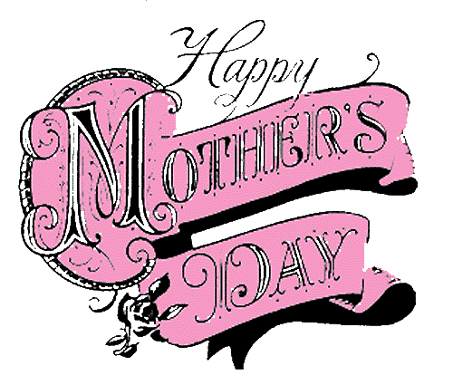

# The Way the Future Blogs

Frederik Pohl

## Happy Mother’s Day, LUCAWith love from us all — and I mean all!

Scientists have finally figured out where we all came from, and the answer isn’t pretty.  Three billion years ago, an organism named LUCA (Last Universal Common Ancestor) inhabited the Earth, and we all — that’s primates and platypuses, sponges and salamanders, diplodocuses and ducklings — every last one of us, of whatever species, are her (or his, or its) direct descendant.

How big was LUCA?  Oh, real big.  According to [Gustavo Caetano-Anolles](https://web.archive.org/web/20120719084744/http://cropsci.illinois.edu/directory/gca) of the University of Illinois, it lived in the ocean and filled all of Earth’s global ocean with its mass.  Then — after maybe a hundred million years or so — LUCA began to split up  One fraction became the ancestor to the bacteria.  Another gave rise to the archaea, and the final fraction gave rise to what, among other things, things like butterflies and jellyfish and termites, gave rise to you and me.

So we should all send her-him-it  a Mother’s Day card!  This address might not work, but it’s all we have:


LUCA
On Earth
Everywhere


— should reach her.

### 3 Comments

- [Chookie Inthebackyard](https://web.archive.org/web/20120719084744/http://chookiesbackyard.blogspot.com/) says:
“…I can trace my ancestry back to a protoplasmal primordial atomic globule. Consequently, my family pride is something inconceivable.” — Pooh-Bah, The Mikado.
[**May 13, 2012, 7:06 am**](/fred-pohl/2012-05-12-happy-mother-s-day-lucawith-love-from-us-all-and-i-mean-all/)
- H. E. Parmer says:
Looks like Huxley and his *Urschleim* get the last laugh, after all.
[**May 18, 2012, 10:55 pm**](/fred-pohl/2012-05-12-happy-mother-s-day-lucawith-love-from-us-all-and-i-mean-all/)
- [Bill Goodwin](https://web.archive.org/web/20120719084744/http://771715/) says:
Mairzy doats and dozy doats,  

But all three are eukaryotes,  

Bacteria and other clades  

Perform yet weirder promenades,  

But past all branching moms and dads  

Sits LUCA, exclaiming: “These kids and their fads!”
[**May 19, 2012, 6:16 am**](/fred-pohl/2012-05-12-happy-mother-s-day-lucawith-love-from-us-all-and-i-mean-all/)

[WordPress](https://web.archive.org/web/20120719084744/http://wordpress.org/)
[TWTFB2](https://web.archive.org/web/20120719084744/http://dicksmithsoftware.com/)