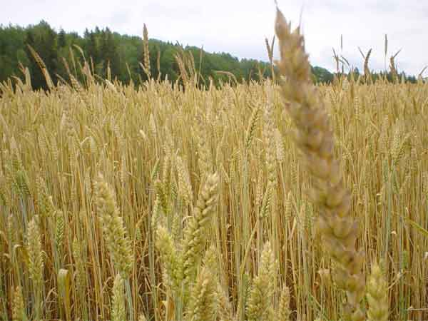

<!-- translated by Yandex Translate -->

# Путь к блогам будущего

Фредерик Пол

## О счете за ферму

Мистер Левая Рука, Познакомьтесь с мистером Правая Рука: Вам двоим следует поговорить

Даже когда речь заходит о еде, Конгресс по-прежнему любит говорить с двух сторон одновременно.  Конгресс выделил крупную сумму налоговых средств, чтобы побудить американцев есть больше здоровой пищи: их идеальная обеденная тарелка должна содержать 50 процентов фруктов и овощей, а остальные 50 процентов должны приходиться на мясо и крахмалы.

Но Конгресс прямо сейчас находится в середине работы над новым законопроектом о сельском хозяйстве, который позволит потратить подавляющее большинство своих ассигнований на субсидии для выращивания тех самых крахмалов — пшеницы, риса, кукурузы и так далее, — которых они призывают нас есть меньше.

Если вы почувствуете желание написать об этом своему конгрессмену, все, что вам нужно сказать, это “субсидируйте меньше крахмалов, способствующих ожирению, и больше зеленых овощей и фруктов”.  Если он вам нравится, вы можете добавить “пожалуйста”.

### 6 Комментариев

- [Лия А. Зельдес](https://web.archive.org/web/20160416230121/http://www.zeldes.comm/) говорит:
Еще большее беспокойство вызывают катастрофические сокращения продовольственных талонов, которые являются частью законопроекта. [http://www.nytimes.com/2012/06/13/opinion/food-stamps-and-the-farm-bill.html](https://web.archive.org/web/20160416230121/http://www.nytimes.com/2012/06/13/opinion/food-stamps-and-the-farm-bill.html)
[**15 июня 2012, 14:18 вечера**](/posts/2012-06-15-about-the-farm-bill/)
- [Ларри Сандерсон](https://web.archive.org/web/20160416230121/http://lsanderson.net/) говорит:
Эй! Мне нравятся субсидии на мою ферму! Кроме того, в Нодаке нельзя выращивать зелень…
[** 16 июня 2012 года, 9:40 утра**](/posts/2012-06-15-about-the-farm-bill/)
- Говард Брейзи говорит:
Законопроект о фермерстве касается не продовольствия, а крупного бизнеса, который покупает политиков. 
(Конкурируя с другим крупным бизнесом)
[** 18 июня 2012 года, 7:36 утра**](/posts/2012-06-15-about-the-farm-bill/)
- Джон говорит:
Можем ли мы просто покончить с этими чертовыми субсидиями?
[**19 июня 2012, 14:02**](/posts/2012-06-15-about-the-farm-bill/)
- Джон Бенкен говорит:
Отлично, мистер Пол.  Уже сделано.  

Мы могли бы также упомянуть, что большая часть выращиваемой кукурузы идет на корм коровам и выращивание их КРУПНЫМИ, что позволяет получать КРУПНУЮ говядину.   Мы должны позволить коровам есть траву, для чего они были рождены, и использовать несубсидируемую кукурузную промышленность, чтобы накормить людей.  Можно даже сказать, что субсидия на кукурузу на самом деле является субсидией на говядину. Но это слишком похоже на заговор.  
[** 21 июня 2012 года, 9:17 утра**](/posts/2012-06-15-about-the-farm-bill/)
- [Эрик](https://web.archive.org/web/20160416230121/http://orbitalmass.com/) говорит:
Я читаю ваши книги в попытке избежать мыслей об ужасном упадке американской политики. В краткосрочной перспективе это работает просто чудесно.
[**21 июля 2012, 12:41 вечера**](/posts/2012-06-15-about-the-farm-bill/)

[WordPress](https://web.archive.org/web/20160416230121/http://wordpress.org/)
[TWTFB2](https://web.archive.org/web/20160416230121/http://dicksmithsoftware.com/)