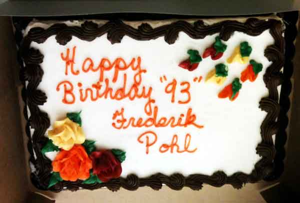

<!-- translated by Yandex Translate -->

# Путь к блогам будущего

Фредерик Пол

## С днем рождения меня!

Дорогие друзья и другие люди, разве это не адски красивый праздничный торт?  Он был доставлен в Windycon, подарок от Малкольма Файфера, и единственное, что в нем не совсем верно, так это то, что на самом деле мне исполнится 93 года только 26 числа этого месяца.  Но лучше рано, чем никогда, — вот что я всегда говорю, или, точнее, я никогда не говорил этого раньше, но сейчас, в знак благодарности за добрую мысль, я скажу это громко и ясно. Спасибо тебе, Малкольм!

На самом деле, я пойду дальше, чем, возможно, предполагал Малкольм или кто-либо другой в Windycon.  Я воспринимаю этот пирог как свидетельство того факта, что люди, которые живут долго и не теряют способности распознавать чушь, когда кто-то пытается им ее продать, заслуживают того, чтобы их время от времени слушали.

Я, например.

С помощью этого блога и всех других способов, которыми я могу выразить свое мнение, я призываю вас, ребята, понюхать то, что вам дают сотрудники "Братьев Кох", прежде чем проглатывать что-либо из этого.  Они тратили состояние за состоянием на телевизионную рекламу и нанимали “комментаторов”, чтобы попытаться заставить вас и остальной американский народ поверить, что снижение налогов равносильно процветанию.  Это неправда, и любой, кто пытался понять историю нашей страны, знает, что это неправда.

Один из самых процветающих периодов, которые когда-либо переживала наша страна, пришелся на годы сразу после Второй мировой войны.  Было много причин для такого процветания, но снижение налогов не было одной из них.  Наша самая высокая налоговая ставка сейчас составляет 30%.  Самая высокая налоговая ставка тогда была в три раза выше — 90%! — и процветание продолжалось.

Кто-нибудь действительно верит в такие выдумки, как то, что резкое снижение налогов для чрезвычайно богатых помогает кому угодно, кроме таких же чрезвычайно богатых?  Можете ли вы представить, что миссис Ромни, спотыкаясь, спустилась бы по лестнице Белого дома туда, где ее муж посмеивался над последним выпуском Wall Street Journal, и сказала: “О, дорогая, спасибо тебе за это новое снижение налогов.  Теперь я могу позволить себе этот четвертый ”кадиллак", и, может быть, вам не придется доводить Детройт до банкротства!"

Что ж, это дурной тон - пинать людей, когда они в отчаянии, хотя со всеми этими деньгами я не могу по-настоящему жалеть этого человека.  Это приятный вид спорта, но я собираюсь перейти к другим темам, включая несколько идей, которые я прокручивал в голове.

Например, есть несколько сотен людей, разбросанных по всему миру, которые каждое утро встают рано, чтобы попытаться спасти часть нашей дикой природы.  Они проверяют землю вокруг каждого небоскреба, чтобы забрать десятки, а иногда и сотни тел певчих птиц, которые покончили с собой ночью, влетев лоб в лоб в ряды невероятно ярких огней, направленных в небо почти в каждом высотном здании.  (Если искателям очень повезет, они могут найти несколько птиц, которых можно спасти.)

Так что же нам с этим делать?  Мы (1) вводим налог на уличное освещение выше определенной яркости, которое (2) с каждым годом становится дороже, тем самым давая арендодателям время внести изменения, чтобы снизить налог, в то же время (3) делая наши города менее опасными для дикой природы, а также (4) замедляя темпы роста. ежегодный рост сжигания нефти, угля и природного газа для выработки электроэнергии, который увеличивает углеродную нагрузку на атмосферу и в настоящее время ухудшается с каждым годом, и — о, да (5), дает нашим мэрам, губернаторам и президентам то, чего они все так отчаянно искали, что-то новое для налог.

Не за что,

* Фред*

### 20 Комментариев

- [Марта](https://web.archive.org/web/20130128063353/http://loganbooks.net/) говорит:
Будьте в хорошем настроении. Братьев Кох поймали на том, что они отправляли большие деньги на вмешательство в политику Калифорнии, и они делали это через пару подставных организаций. Что делает это отмыванием денег. Что делает это федеральным преступлением. У генерального прокурора Калифорнии (демократа, как и у всех других крупных калифорнийских чиновников) пар идет из ушей, и достаточно скоро остальные из нас смогут сидеть сложа руки и наблюдать, как взлетает шерсть.
[**14 ноября 2012, 19:28 вечера**](/fred-pohl/2012-11-14-happy-birthday-to-me/)
- Лерой Перл говорит:
С днем рождения тебя! Один мой друг некоторое время назад спросил меня, что случилось с теми добрыми старомодными авторами либеральной научной фантастики, которые действительно думали и писали о лучшем будущем. Я отправил ему ссылку сюда.
[**14 ноября 2012, 10:04 вечера**](/fred-pohl/2012-11-14-happy-birthday-to-me/)
- Пол Вулф говорит:
Уважаемый мистер Пол,
Я надеюсь, что это будет счастливый день (то есть твой день рождения)!  И спасибо за ваши мысли и наблюдения.
Пол
[**14 ноября 2012, 11:43 вечера**](/fred-pohl/2012-11-14-happy-birthday-to-me/)
- [Стефан Джонс](https://web.archive.org/web/20130128063353/http://home.comcast.net/~stefan_jones/kira_park_lo.jpg) говорит:
Заранее поздравляю с Днем рождения!
Настоящим победителем на этих выборах стало сообщество, основанное на реальности. Шок от проигрыша, похоже, сбил консервативный истеблишмент с толку.
Конечно, у нас есть Ромни, рассказывающий своим донорам, что Обама подкупом пробился к власти с помощью программ социальной помощи... и психи, подписывающие петиции о выходе своих штатов из состава... но невозмутимость Республиканской партии пошатнулась.
Черт возьми, Гровер Норквист на самом деле предположил, что налог на выбросы углекислого газа мог бы стать осуществимой и приемлемой заменой подоходного налога. Вы можете себе представить?
Я надеюсь, что руководство Палаты представителей ищет способ сохранить лицо.
[** 15 ноября 2012 года, 12:31 утра**](/fred-pohl/2012-11-14-happy-birthday-to-me/)
- [Грег Костикян](https://web.archive.org/web/20130128063353/http://playthisthing.com/) говорит:
Однажды нашли мертвую летучую мышь на тротуаре перед ВТЦ 7. Очевидно, до 11 сентября. Хотя это и печально.
[**15 ноября 2012 года, 3:08 утра**](/fred-pohl/2012-11-14-happy-birthday-to-me/)
- Этьен говорит:
С днем рождения, мистер Пол!
Ваша идея кажется очень интересной, я собираюсь проверить, нет ли у нас чего-то подобного во Франции, а если нет, я добавлю это в свой список предложений по сохранению дикой природы!
[**15 ноября 2012 года, 6:14 утра**](/fred-pohl/2012-11-14-happy-birthday-to-me/)
- [Стив Дэвидсон](https://web.archive.org/web/20130128063353/http://asmblog.amazingstoriesmag.com/) говорит:
С почти что днем рождения, Фред.
Между прочим, я слушаю вас по меньшей мере 40 лет. Получая как развлечение, так и понимание.
[**15 ноября 2012 года, 8:08 утра**](/fred-pohl/2012-11-14-happy-birthday-to-me/)
- Уолт Джи говорит:
С днем рождения, Фред Пол! Ты доставлял мне много радости на протяжении многих из этих лет.
[**15 ноября 2012, 14:32**](/fred-pohl/2012-11-14-happy-birthday-to-me/)
- Ларс говорит:
С днем рождения, Фред!
И нет ничего плохого в том, чтобы пнуть человека, когда он лежит, если это помогает удержать его на месте.
[**15 ноября 2012, 15:26 вечера**](/fred-pohl/2012-11-14-happy-birthday-to-me/)
- [Нестор](https://web.archive.org/web/20130128063353/http://www.krazykimchi.com/) говорит:
Заранее поздравляю с днем рождения, мистер Пол!
[**15 ноября 2012, 17:21**](/fred-pohl/2012-11-14-happy-birthday-to-me/)
- Джон Трейлор говорит:
С днем рождения, Фред, и продолжай вести хорошую борьбу.
[**15 ноября 2012 года, 9:20 вечера**](/fred-pohl/2012-11-14-happy-birthday-to-me/)
- Джим Фланаган говорит:
Фред
Для меня было честью и радостью разделить с вами кусочек вашего торта в субботу. С ранним Днем рождения.
Кроме того, спасибо вам за долгие годы увлекательного и поучительного чтения.
Джим
[** 16 ноября 2012 года, 12:18 утра**](/fred-pohl/2012-11-14-happy-birthday-to-me/)
- Его превосходительство Пармер говорит:
С почти-днем рождения, Фред!
Не волнуйтесь: когда дело доходит до этого парня с плаката забывчивой, высокомерной плутократии и его оооочень гениального помощника, я думаю, что небольшое злорадство вполне заслужено. 
Кроме того, никому не нужно сочувствовать Ромни. У него была своя кампания тщеславия; даже несмотря на то, что он был отвергнут всеми нами, бездельниками и паразитами, у него все еще есть эти 100 миллионов долларов и все остальное, что он припрятал в Стране часов с кукушкой и на Каймановых островах, чтобы утешить себя. (Остальные из нас должны были бы так страдать.) А Райан - это то, что в этих кругах считается интеллектуалом: всякий раз, когда его карьера в Конгрессе идет прахом, я уверен, что за ним на всю жизнь зарезервировано место у кормушки социального обеспечения правого крыла.
Однако я должен признать, что фестиваль обвинений также был отличным развлечением. Так что вперед, наслаждайтесь!
[** 16 ноября 2012 года, 2:17 утра**](/fred-pohl/2012-11-14-happy-birthday-to-me/)
- Уолтер говорит:
С днем рождения, Фред.
Спасибо вам за этот блог, за историю фанатов, за  

политическое понимание, наука, идеи и мелочи  

своего мнения.  Комфорта, силы и счастья вам и вашим близким.
[** 16 ноября 2012 года, 10:14 утра**](/fred-pohl/2012-11-14-happy-birthday-to-me/)
- [Дэн Голлаб](https://web.archive.org/web/20130128063353/http://dreampattern.com/) говорит:
Насколько близка технология, которая могла бы создавать голограммы соколов или других хищников, чтобы отпугивать птиц от зданий?  

Еще один способ помочь животным заключается в следующем. Светлячки, как правило, вымирают, когда их среда обитания разрушается, потому что они не ищут новую среду обитания. Возможно, можно было бы идентифицировать ген, который обеспечивал бы склонность к рассеянию, и, возможно, светлячки могли бы мутировать таким образом.
[**16 ноября 2012, 15:05**](/fred-pohl/2012-11-14-happy-birthday-to-me/)
- Скотт говорит:
С днем рождения, Фред. Ваше творчество было постоянным источником радости и мудрости на протяжении десятилетий.
[**16 ноября 2012, 15:33**](/fred-pohl/2012-11-14-happy-birthday-to-me/)
- Эйс Лайтнинг говорит:
С днем рождения, мистер Пол! Как я уже упоминал ранее, я читал ваши работы все, кроме первых двух лет своей жизни, и мне исполнится 65 лет через пару недель после вашего дня рождения. Желаю вам насладиться еще многими красивыми и вкусными праздничными тортами, а значит, и еще многими красивыми и вкусными днями рождения!  
Кстати, о налоге на яркое освещение небоскребов. Я сочувствую тем, кто ищет птиц для спасения… но лучи света в небе прекрасны и эффектны на вид. Возможно, есть другой способ создать визуальную привлекательность, который не сбивает птиц с толку до смерти (и не требует огромного количества электроэнергии), который можно было бы поощрить налоговым * кредитом*?
[**16 ноября 2012, 17:42 вечера**](/fred-pohl/2012-11-14-happy-birthday-to-me/)
- [Билл Хиггинс - жокей на бревне](https://web.archive.org/web/20130128063353/http://beamjockey.livejournal.com/) говорит:
Я должен сказать, что торт Малкольма Файфера был самым вкусным тортом на 93-й день рождения, который я когда-либо пробовал.
[**16 ноября 2012, 19:09 вечера**](/fred-pohl/2012-11-14-happy-birthday-to-me/)
- Ричард Хортон говорит:
[“Астрономы по всему миру обеспокоены исчезновением звезд на ночном небе из-за увеличения свечения неба из-за неконтролируемого городского освещения”.](https://web.archive.org/web/20130128063353/http://www.assa.org.au/lightpollution)
[**17 ноября 2012, 18:20 вечера**](/fred-pohl/2012-11-14-happy-birthday-to-me/)
- Мэри Роуз говорит:
С днем рождения, мистер Пол. Ты - настоящее сокровище. Вы и Джеймс Ганн - два моих героя! Будь здоров -
[**26 ноября 2012, 14:45**](/fred-pohl/2012-11-14-happy-birthday-to-me/)

[WordPress](https://web.archive.org/web/20130128063353/http://wordpress.org/)
[TWTFB2](https://web.archive.org/web/20130128063353/http://dicksmithsoftware.com/)