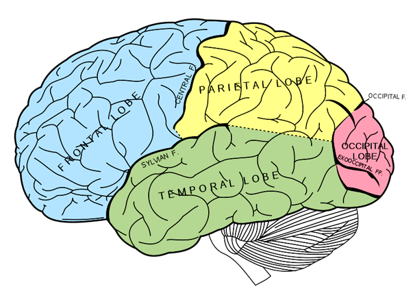

# The Way the Future Blogs

Frederik Pohl

## Here’s Some Good News — and (Sorry) Some Bad

If you’ve ever faced a final exam on subject matter you just haven’t been able to get your head around, you might like to know about a gene called [HMGA2](https://web.archive.org/web/20130128063223/http://www.sciencedaily.com/releases/2012/04/120415150123.htm), recently identified by a team of 207 researchers at UCLA.  The good part is that HMGA2 has reliably been shown to increase human IQ, leading some to think that the next step might be the mythical “smart pill” dreamed of by many a college student.

However —

The bad part is that the same study showed that the increase could be only something under 2%, or less than the difference between a D and a C+.  So hit those books!

### 3 Comments

- [Dan Gollub](https://web.archive.org/web/20130128063223/http://dreampattern.com/) says:
I’d be glad to take 50 of those pills to double my intelligence.
[**November 23, 2012, 7:11 am**](/fred-pohl/2012-11-23-here-s-some-good-news-and-sorry-some-bad/)
- [Nestor](https://web.archive.org/web/20130128063223/http://www.krazykimchi.com/) says:
I think I’m more on the market for brain deadening drugs right now…
[**November 26, 2012, 5:54 am**](/fred-pohl/2012-11-23-here-s-some-good-news-and-sorry-some-bad/)
- Dwight says:
Hi.  

In 2009, you posted a blog commentbabiutva Twilight Zone episode. In it, Astronaugts made utvto the end of the universe. They discovered they were in a glass bottle.
What episode were you referring to?  

I can’t find it any where.
[**December 9, 2012, 7:00 am**](/fred-pohl/2012-11-23-here-s-some-good-news-and-sorry-some-bad/)

[WordPress](https://web.archive.org/web/20130128063223/http://wordpress.org/)
[TWTFB2](https://web.archive.org/web/20130128063223/http://dicksmithsoftware.com/)