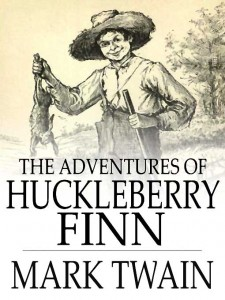

# The Way the Future Blogs

Frederik Pohl

## What’s Wrong with Age-Specific Books

When I was a child I read everything that came into the house.  The majority of these chance-met books that made up my available literary finds were the boys’ (and sometimes the girls’) series works, specifically delivered as gifts for me.  None of these made much of an impression on me, though.  I read them at maximum page-turning velocity and never looked at them a second time — with two exceptions that I’ll come to later.

I think I now know why these were so dull for me, or at least one of the reasons.  There was then, and still is with a few publishers, a truly fat-headed policy whose inflexible law was that children’s books should be “age-specific.”  That is, purged of any words not in the officially approved vocabulary of children of the specific age they were intended for.

That was a really, really bad idea.  The best way for children to enrich a vocabulary is to let them encounter unfamiliar new words and have to work out their meaning from context.  That’s about the way all children learn their native languages, and that is a time-tested system that has worked well since, roughly, the Stone Age.

So when I was six I preferred to read books that were marked as intended for twelve-year-olds, and at twelve I had patience only for declared “adult” works.  Which is perhaps why, out of the thousands of books I read before I was old enough to have an adult’s library card, only a handful were still given space in the bureau drawer that was my “bookcase”.

There were, in fact, exactly two books that I not only kept but read over and again, once a year or so, and as a matter of fact I have them still..  They are [**Mark Twain’s**](/fred-pohl/2010-09-04-mark-twain-and-the-law-of-the-raft/) [Huckleberry Finn](https://web.archive.org/web/20140912005544/http://manybooks.net/titles/twainmaretext93hfinn12.html) and Marcel Proust’s [Swann’s Way](https://web.archive.org/web/20140912005544/http://manybooks.net/titles/proustmaetext048swnn10.html) (now in its proper place as one episode in what I still think of as *Remembrance of Things Past*.)

Why those two and not almost any others?  I think  it had something to do with the fact that both of them had, on first reading, exposed me to a stable and self-contained foreign environment I had never encountered before — and that was not at all like the Park Slope, Brooklyn, neighborhood I lived in from the age of ten to almost twenty.  Most of all, they exposed me to words I didn’t know but sometimes could figure out from context.

Is there a better way to build a vocabulary?  I think not — and think as well that there certainly is no other way as pleasurable.

### One Comment

- [ejh](https://web.archive.org/web/20140912005544/http://thespanishdisaster.blogspot.com/) says:
I work in Spain, where children’s books often – indeed nearly always – come with age recommendations on the covers. Despite this, when selling books (I sell children’s books in English) I nearly always, on principle, refuse to answer customers’ questions about what age grup any given book is for. Understandable, though, that they should ask.
Among the books I sell is Huckleberry Finn. It does, however, contain some interesting and indeed controversial vocabulary!
[**January 20, 2013, 4:33 pm**](/fred-pohl/2013-01-18-what-s-wrong-with-age-specific-books/)

[WordPress](https://web.archive.org/web/20140912005544/http://wordpress.org/)
[TWTFB2](https://web.archive.org/web/20140912005544/http://dicksmithsoftware.com/)