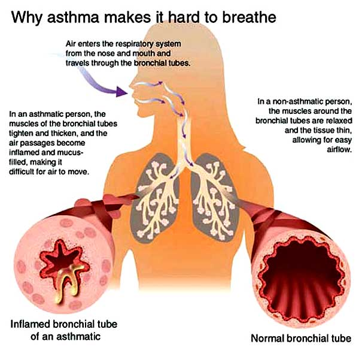

# The Way the Future Blogs

Frederik Pohl

## When the Bad News is Actually Pretty Good

A recent Pulse — the [Union of Concerned Scientists’](https://web.archive.org/web/20170718022754/http://www.ucsusa.org/) bulletin warning civilians about new threats to their life, liberty or good health — reports some alarming scientific findings about ground-level ozone pollution levels and what they are doing to our ability to breathe freely.  The numbers are scary.  By 2020, millions of people will develop smog-related asthma and other breathing illnesses, and thousands of them will be overloading our hospitals.

That’s really bad news, but —

It has at least one good aspect.  The same measures that will be essential to trying to save people from new breathing problems are the ones that will slow down the far worse consequences of unrestrained global warning.  If we can’t persuade the unbelievers that global warming is a certain deadly consequence of our enslavement to the burning of fossil fuels, maybe they’ll be willing to do what needs to be done for the survival of the human race as long as that is also what needs to be done for the ability to breathe easy.

### 7 Comments

- William Seligman says:
I wish I could believe that good aspect, Fred. Unfortunately, I’ve read too many of your books. Do you think that companies that have been spinning fairy tales to convince folks to ignore global warming will be any less skilled at telling folks that an asthma epidemic is not caused by air pollutants?
[**February 5, 2013, 6:09 pm**](/fred-pohl/2013-02-05-when-the-bad-news-is-actually-pretty-good/)
- [Denis Drew](https://web.archive.org/web/20170718022754/http://www.ontodayspage.blogspot..com/) says:
I was always skeptical about global warming until I viewed a recent Discovery Channel program on global dimming (indisputable and apparently slows global warming) — which suddenly made perfect sense of it all.
I never worried much about the dangers of global warming until I watched a recent History Channel show on how easily global warming could switch over to global freezing by melting fresh water icebergs which in turn could block the north Atlantic warm water current — a potential civilization breaking catastrophe.
I never realized until I read a 9/16/, NY Times article * by the authors of the book Freakanomics that Jane Fonda would be the chief culprit in bringing on global freezing, because of her 1979 movie “The China Syndrome” which frightened America away from switching from fossil fuel to nuclear power. 
* [http://www.nytimes.com/2007/09/16/magazine/16wwln-freakonomics-t.html?_r=0](https://web.archive.org/web/20170718022754/http://www.nytimes.com/2007/09/16/magazine/16wwln-freakonomics-t.html?_r=0)
[**February 6, 2013, 10:09 am**](/fred-pohl/2013-02-05-when-the-bad-news-is-actually-pretty-good/)
- Eddie Ever says:
hey shouldn’t believers in “certain deadly consequences” of “our enslavement to the burning fossil fuels” just stop burning fossil fuels?  
or should the unbelievers just meekly follow the moaning hypocrites who continue to enjoy the benefits that burning fossil fuels provides?
[**February 6, 2013, 1:15 pm**](/fred-pohl/2013-02-05-when-the-bad-news-is-actually-pretty-good/)
- [John C. Boland](https://web.archive.org/web/20170718022754/http://www.johncboland.com/) says:
Fred,
Just for the sport of it, could you describe a theory of global warming that would pass muster as a scientific theory–that is, that passes the demarcation of being falsifiable? For instance, somewhere in one of his books Dawkins relates the story of a fellow evolutionist being asked what would undercut his theory and responding, “Oh, rabbit bones in the precambrian.” To a global warmingist, what would equate with rabbit bones? (I don’t mind at all if you have the last word on your blog.)
I tried to describe your expertise as being in scientifiction and the sentience detector didn’t like that.
[**February 8, 2013, 3:42 pm**](/fred-pohl/2013-02-05-when-the-bad-news-is-actually-pretty-good/)
- [JJ Brannon](https://web.archive.org/web/20170718022754/http://www.youtube.com/watch?v=xPgZeOsG8sk) says:
I’m beginning to worry about Fred.
It’s been a long time between posts.
JJB
[**March 3, 2013, 5:14 pm**](/fred-pohl/2013-02-05-when-the-bad-news-is-actually-pretty-good/)
- [Dan Gollub](https://web.archive.org/web/20170718022754/http://dreampattern.com/) says:
If I were appointed to the post of Benevolent World Dictator, in addition to pursuing the reduction of CO2 and other villainous compounds into the atmosphere I would assign bright, motivated scientists to explore the various remediation attempts, one or more of which will probably prove necessary. (I hope I’m wrong.)
[**March 6, 2013, 4:22 pm**](/fred-pohl/2013-02-05-when-the-bad-news-is-actually-pretty-good/)
- Bruce says:
A bit disconcerting that the last post in over a month is health-related. Hope all is well in Pohl-land.
[**March 17, 2013, 11:35 am**](/fred-pohl/2013-02-05-when-the-bad-news-is-actually-pretty-good/)

[WordPress](https://web.archive.org/web/20170718022754/http://wordpress.org/)
[TWTFB2](https://web.archive.org/web/20170718022754/http://dicksmithsoftware.com/)