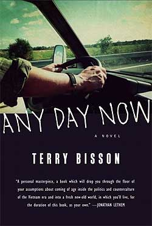

<!-- translated by Yandex Translate -->

# Путь к блогам будущего

Фредерик Пол

## Со дня на день Терри Биссон: Отзыв

Это своего рода рецензия от двух человек на роман [Терри Биссона](https://web.archive.org/web/20170718034818/http://www.terrybisson.com/) 2012 года "Со дня на [день](https://web.archive.org/web/20170718034818/http://www.amazon.com/gp/product/B00AZ8KT12/ref=as_li_ss_tl?ie=UTF8&camp=1789&creative=390957&creativeASIN=B00AZ8KT12&linkCode=as2&tag=twtfb-20)".

Один из рецензентов - блогер Олд Фред, который говорит, что был разочарован фильмом, потому что в начале была прекрасно проработанная история о маленьком мальчике и его мире, а затем она превратилась в фантазию о том, как все, кого вы считали мертвыми, снова оживают (за исключением, по какой-то причине, [**Артур Кларк**](/fred-pohl/2009-01-05-sir-arthur-and-i/)) и занимающийся красочными политическими делами с Америкой.  Мне нравился взрослеющий мальчик, не нравились бесконечные перестановки на политической сцене.

Другая - моя любимая [Элизабет Энн Халл](https://web.archive.org/web/20170718034818/http://www.thewaythefutureblogs.com/elizabeth-anne-hull/)

[Бетти](https://web.archive.org/web/20170718034818/http://www.nippon2007.us/participants/hulle_participant.php), бывшему президенту [Ассоциации исследователей научной фантастики](https://web.archive.org/web/20170718034818/http://sfra.org/sfra.html) и частому критику, которой понравилась книга.

Я был разочарован книгой, потому что она не дала мне того, чего я ожидал; Бетти она понравилась, потому что она не дала ей того, чего она ожидала.  Пойди разберись.
                                                    — ф.п.

### Один комментарий

- [ТЭД](https://web.archive.org/web/20170718034818/http://www.tadsbackupplan.blogspot.com/) говорит:
Фред: Не читал УЖЕ ни ДНЯ, но я дочитал до половины "ПИКАПЕРА" Биссона, в котором, как мне показалось, была ОТЛИЧНАЯ идея: Правительственный агент ходит повсюду, подбирая старые забытые произведения искусства, чтобы освободить место для НОВЫХ работ, которые будут оценены по достоинству ... но Биссон ничего с этим не сделал, все это было картонным, безвольной некомедией, будущее было плоским, в нем не было ДУШИ, и он тоже не шутил. Его рассказчик был больше озабочен судьбой своей собаки, чем чем-либо другим, и единственной женщиной-персонажем в книге была всего лишь пара огромных грудей с прикрепленным именем. Разочаровывает во многих отношениях....  

В целом Биссон разочаровал меня, за исключением одного рассказа о путешествии во времени, написанного несколько лет назад (возможно, под названием “Честь скаута”?), который показался мне довольно блестящим.  

Вам следует больше заниматься этим обзором — может быть, более подробно в следующий раз ...?
[**21 апреля 2013, 14:35**](/fred-pohl/2013-04-19-any-day-now-by-terry-bisson-a-review/)

[WordPress](https://web.archive.org/web/20170718034818/http://wordpress.org/)
[TWTFB2](https://web.archive.org/web/20170718034818/http://dicksmithsoftware.com/)