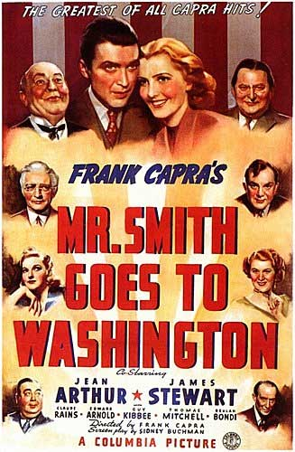

<!-- translated by Yandex Translate -->

# Путь к блогам будущего

Фредерик Пол

## Как парализовать Сенат

Помните тот замечательный старый черно-белый фильм "[Мистер Смит едет в Вашингтон](https://web.archive.org/web/20170620001820/http://www.amazon.com/gp/product/B00003L9CJ/ref=as_li_ss_tl?ie=UTF8&camp=1789&creative=390957&creativeASIN=B00003L9CJ&linkCode=as2&tag=twtfb-20)"?  Это был тот случай, когда Джимми Стюарт, лидер бойскаутов, случайно ставший сенатором, обнаруживает, какой бандой мошенников являются многие политики и флибустьеры, пока их злодеяния не разоблачаются.  Это отличный момент в фильме — к сожалению, не такой замечательный, когда флибустьер используется в реальной жизни, чтобы парализовать действие.

Например, вот что [сейчас происходит в Сенате](https://web.archive.org/web/20170620001820/http://www.washingtonpost.com/blogs/post-partisan/wp/2013/05/17/here-comes-the-filibuster-battle/).  Нескольким республиканцам в Сенате не нравится Бюро финансовой защиты потребителей, за принятие закона о котором Конгресс проголосовал вопреки их возражениям.  Теперь у них есть второй шанс нанести ему ущерб.

По Конституционному закону президент обязан назначить кого-либо на должность главы этого ведомства, а Сенат должен проголосовать "за" или "против" утверждения.   Когда президент сделал то, что требует Конституция, и передал имя своего кандидата в Сенат, он узнал, что один сенатор блокировал это из-за обмана.  Таким образом, безголовое бюро не может функционировать так хорошо, как должно, и “финансовая защита” для многих американцев по-прежнему остается всего лишь обещанием.

Горстка сенаторов проделала тот же трюк с десятками других кандидатов, особенно с судьями.  Сегодня почти сотня зданий федеральных судов пустует из-за того, что сенатор наложил вето на голосование за них.  Это вызвало некоторые реальные трудности, и не только для назначенных судей, которые иногда не могут устроиться на другую работу до слушаний по их утверждению (должны ли они подавать заявление на получение страховки по безработице?) но для многих лиц, предстанущих перед федеральным судом.  Конституция обещает им скорейшее слушание, поскольку “задержка правосудия означает отказ в правосудии”.  Но любой отдельно взятый сенатор может отложить судебный процесс на неопределенный срок.

Большинство сенаторов, как демократов, так и республиканцев, признают, что правило флибустьера необходимо исправить, поскольку оно столь же аморально, когда роли двух партий меняются местами, как это было во времена Буша.  Но это не мешает почти всем республиканцам упрекать президента в том, что он недостаточно сделал, даже когда их собственная партия делает все возможное, чтобы связать ему руки.

### 5 Комментариев

- [Роберт Новолл](https://web.archive.org/web/20170620001820/http://www.robertnowall.com/) говорит:
Президент всегда может назначить перерыв в работе Конгресса, когда он не заседает, что специально разрешено Конституцией — обструкция не упоминается, это просто правило Сената, в разделе "Как и почему они ведут свои дела".
Ах да, нынешний президент уже назначал перерывы в работе — когда Конгресс заседал — и до сих пор два суда постановили, что он действовал неконституционно.
[**17 мая 2013, 17:24 вечера**](/fred-pohl/2013-05-17-how-to-paralyze-the-senate/)
- химстер говорит:
Был ли конгресс на сессии, или это было “на сессии”?  Разве республиканцы не навязывали заседания “для проформы”, на которых на самом деле не проводилось никакой работы (и, конечно, не было кворума или каких-либо попыток заняться реальными делами), специально для того, чтобы *предотвратить* назначение перерыва?
[** 19 мая 2013 года, 7:41 утра**](/fred-pohl/2013-05-17-how-to-paralyze-the-senate/)
- Говорит [случайный тролль](https://web.archive.org/web/20170620001820/http://none/):
Первый комментарий - прекрасный пример того, что делают консерваторы: предлагают “решение”, а затем жалуются на точно такое же “решение”. 
Лично я знаю только об одном случае, когда Обаму вызвали в суд по поводу назначения перерыва, и даже тогда республиканцы. мы провернули аферу, чтобы сделать вид, что все еще проводим сессию.
Послушайте, люди, Обама, может быть, и придурок, но он все еще президент и, в отличие от Ромни и ему подобных, пытается помочь БОЛЬШИНСТВУ американцев.
[**19 мая 2013 года, 8:08 утра**](/fred-pohl/2013-05-17-how-to-paralyze-the-senate/)
- [Роберт Новолл](https://web.archive.org/web/20170620001820/http://www.robertnowall.com/) говорит:
Начиная с демократов, которые возражали против разрешенной Конституцией концепции назначений на перерыв, когда президент Джордж У. Буш сделал их, когда в Конгрессе фактически были каникулы... и поскольку демократы приняли и полюбили флибустьера, когда у них было большинство в Сенате... тогда демократов также можно обвинить в лицемерии за то, что они придерживаются противоположных мнений, когда речь идет о президенте-демократе.
Следует также отметить, что те, кто уважает Конституцию и законы, могут с неприязнью отнестись к утверждению любых назначений, произведенных администрацией, которая явно не проявляет такого уважения.
[** 21 мая 2013 года, 6:06 утра**](/fred-pohl/2013-05-17-how-to-paralyze-the-senate/)
- [Филлип Хелбиг](https://web.archive.org/web/20170620001820/http://www.astro.multivax.de:8000/helbig/helbig.html) говорит:
На практике обструкция означает, что для принятия решения требуется нечто большее, чем большинство.  Это нормально для изменения конституции, но не для нормального бизнеса.  Неудивительно, что большая часть остального мира смеется, когда США (также с двухпартийной системой) называют себя демократией.  Восточная Германия была Германской Демократической Республикой; если называть чью-либо страну демократией, это не делает ее таковой.
[** 29 мая 2013 года, 4:02 утра**](/fred-pohl/2013-05-17-how-to-paralyze-the-senate/)

[WordPress](https://web.archive.org/web/20170620001820/http://wordpress.org/)
[TWTFB2](https://web.archive.org/web/20170620001820/http://dicksmithsoftware.com/)