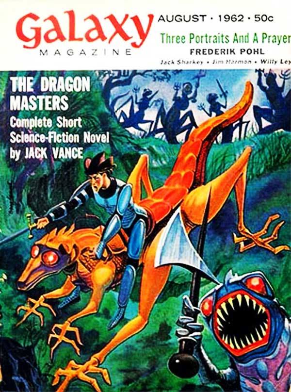

<!-- translated by Yandex Translate -->

# Путь к блогам будущего

Фредерик Пол

## Джек Вэнс: Замечательный писатель покинул нас.



Начиная со вчерашнего раннего утра, на моем компьютере начал звонить маленький предупреждающий звоночек.  Только по одному звонку каждый раз, потому что есть только одна новость, о которой он хочет, чтобы я знал: вчера умер [Джек Вэнс](https://web.archive.org/web/20170620010705/http://www.jackvance.com/home/).  Он был всего на три года старше меня.

Люди будут публиковать самые разные вещи о Джеке, и если что-то из них покажется стоящим того, возможно, я передам вам несколько комментариев.  Но есть только одно воспоминание, которое освещает все остальные в моей памяти, и это воспоминание об утре, когда я пришел в офис Galaxy на Гудзон-стрит и обнаружил ожидающий меня конверт из плотной бумаги от Джека. В нем была новелла под названием “Повелители Драконам([The Dragon Masters](https://web.archive.org/web/20170620010705/http://www.amazon.com/gp/product/0743474678/ref=as_li_ss_tl?ie=UTF8&camp=1789&creative=390957&creativeASIN=0743474678&linkCode=as2&tag=twtfb-20))”.

Я не уверен, что налил себе чашку кофе или закурил сигарету (ах, те беззаботные дни курения).  Я даже не уверен, что вообще сел.  В чем я уверен, так это в том, что после нескольких минут раздумий, когда я закончил, я поднял трубку телефона и позвонил [Джеку Гогану](https://web.archive.org/web/20170620010705/http://www.sf-encyclopedia.com/entry/gaughan_jack).

“Джек, - сказал я, - у меня есть новая история от Джека Вэнса, которая мне нравится.  Она называется "Повелители Драконов(The Dragon Masters)", и в ней рассказывается о расе драконоподобных существ с далекой планеты, которые находятся в состоянии войны с человеческой расой.  Драконы захватили в плен несколько людей, а люди захватили в плен несколько драконов, и оба они генетически модифицировали своих пленников, чтобы сражаться за них.  Всего существует около дюжины модифицированных рас, и мне нужен портрет каждой, плюс все остальное, что вы захотите нарисовать.  Я думаю, Хьюго будет рад этому, так что приходите за ms”.

И он сделал это, и [они сделали](https://web.archive.org/web/20170620010705/http://www.thehugoawards.org/hugo-history/1963-hugo-awards/). Вэнс в том году получил премию "Хьюго за короткометражную художественную литературу", а Гоган получил свою первую номинацию как профессиональный художник.

### 15 Комментариев

- SM говорит:
Спасибо вам, сэр.  Я не знаю, читал ли я что-нибудь у Вэнса, но мне придется кое-что разыскать.  Он повлиял на многих людей, в том числе вдохновил на создание магической системы в олдскульных "подземельях и драконах" …
Какой изумительный список людей раскрывает номинация на премию Хьюго!
[**30 мая 2013, 10:35 вечера**](/posts/2013-05-30-jack-vance-a-wonderful-writer-has-left-us/)
- [Б. Моррис Аллен](https://web.archive.org/web/20170620010705/http://www.bmorrisallen.com/) говорит:
@Фредерик Пол  

Я рад, что вы откликнулись на эту историю. Не столько из-за Повелителей Драконов(The Dragon Masters) как таковых, сколько из-за признания, которое это принесло Вэнсу, и всех великих историй, которые последовали за этим. Поистине уникальный и талантливый писатель. Я дважды покупал все, чем он владеет, и теперь, когда почти все его книги доступны в электронном виде, я буду покупать их снова. (jackvance.com )
@SM  

Как кто-то однажды сказал о Роджере Желязны: “Я завидую тем, кто впервые сталкивается с [Вэнсом]". Вы практически не можете ошибиться, но я бы начал с “Языков Пао”, или сборника рассказов “Новый Прайм” (один из лучших НФ-рассказов всех времен), или серии "Аластор", или …
[** 31 мая 2013 года, 9:05 утра**](/posts/2013-05-30-jack-vance-a-wonderful-writer-has-left-us/)
- Эрик Х. говорит:
Только что добавил издание Kindle в свой список пожеланий.  Мне придется пойти в библиотеку и найти печатную копию, чтобы увидеть это произведение искусства.
[** 31 мая 2013 года, 10:37 утра**](/posts/2013-05-30-jack-vance-a-wonderful-writer-has-left-us/)
- [Стефан Джонс](https://web.archive.org/web/20170620010705/http://home.comcast.net/~stefan_jones/tan_jacket_lo.jpg) говорит:
На каждой фотографии Джека Вэнса, которую я видел, он был изображен крепким, грубоватым старикашкой. Спасибо, что посмотрели на него, когда он был моложе!
“Повелители Драконов(The Dragon Masters)” вдохновили на создание небольшой настольной игры о враждующих племенах насекомых “Перепончатокрылые”. Давно вышедшей из печати.
СМ, тебе следует поискать “Умирающую землю” и/или “Глаза потустороннего мира". Помимо того, что они являются отличным введением в Вэнс, в них описывается “ванцианская” магия.
[** 31 мая 2013, 12:40 вечера**](/posts/2013-05-30-jack-vance-a-wonderful-writer-has-left-us/)
- Его превосходительство Пармер говорит:
СМ: Если вы никогда ничего не читали у Вэнса, вас ждет настоящее удовольствие. 
Со времени его последнего романа у меня было несколько лет, чтобы примириться с тем фактом, что этот голос замолк. Это просто ставит точку. Но это все равно печальная новость.
Счастливого пути, Джек.
[** 31 мая 2013, 14:43 вечера**](/posts/2013-05-30-jack-vance-a-wonderful-writer-has-left-us/)
- [Брюс Артурс](https://web.archive.org/web/20170620010705/http://undulantfever.blogspot.com/) говорит:
Мне всегда казалось, что цветные работы Джека Гогана получаются немного плосковатыми, но я обожал многие его работы пером и чернилами.  Это включало иллюстрации к “Повелителям драконов” и “Последнему Замку(The Last Castle)”, написанные Вэнсом, и особенно к рассказу под названием “Золотые зыбучие пески” (извините, забыл имя автора), который также появился в Galaxy.
Я был бы не прочь когда-нибудь увидеть коллекцию работ Гогана.
[** 31 мая 2013, 15:52**](/posts/2013-05-30-jack-vance-a-wonderful-writer-has-left-us/)
- Майк Леви говорит:
Привет. Вы, наверное, видели это, но Джек Вэнс рассказал следующую историю с вашим участием в [http://www.locusmag.com/Perspectives/2012/08/jack-vance-go-for-broke /](https://web.archive.org/web/20170620010705/http://www.locusmag.com/Perspectives/2012/08/jack-vance-go-for-broke/)
“Я помню, как однажды мы с Фредом Полом были на каком-то съезде в Рино. Я подошел к нему и сказал: "Привет, Фред!" Он посмотрел на меня и спросил: "Кто ты такой?", а я разозлился и сказал: "Иди к черту, я не собираюсь тебе говорить". Я отошел от него и стоял там на лестнице, а 15 минут спустя он подошел и сказал: ‘Джек Вэнс, ты сукин сын, ты". В то время он был редактором "Galaxy". Мой агент продал ему рассказ, но сначала он продал его еще кому-то, так что он получил деньги Galaxy и деньги другого парня тоже. Фред Пол не смог опубликовать эту историю. Он позвонил мне и разозлился на меня. В то время я был на Таити. Он сказал: "Верни мне эти деньги!", поэтому вместо этого я написал ему песню под названием "Последний Замок(The Last Castle)", чему он был рад”.
[** 31 мая 2013, 16:09**](/posts/2013-05-30-jack-vance-a-wonderful-writer-has-left-us/)
- [Уэйн Боран](https://web.archive.org/web/20170620010705/http://madhatter.ca/) говорит:
Джек Вэнс оказал на меня одно из главных влияний, хотя я пишу в основном ужасы и мрачное фэнтези. Мне нравился его стиль.
Уэйн
[**31 мая 2013, 10:18 вечера**](/posts/2013-05-30-jack-vance-a-wonderful-writer-has-left-us/)
- Эрик говорит:
Большое вам спасибо за то, что поделились этим. Если вы еще что-нибудь помните о Джеке Вэнсе, было бы интересно услышать об этом.
[**1 июня 2013 года, 10:50 вечера**](/posts/2013-05-30-jack-vance-a-wonderful-writer-has-left-us/)
- [Брюс Артурс](https://web.archive.org/web/20170620010705/http://undulantfever.blogspot.com/) говорит:
Следуя своему собственному комментарию, я обнаружил, что в 2010 году была опубликована коллекция работ Джека Гогана: [OUTERMOST](https://web.archive.org/web/20170620010705/http://www.barnesandnoble.com/w/outermost-luis-ortiz/1111925137).
Как-то пропустил это мимо ушей.  Теперь это в моем списке желаний.
[**2 июня 2013, 15:02**](/posts/2013-05-30-jack-vance-a-wonderful-writer-has-left-us/)
- Феофилакт говорит:
Мне нравились оба Джека. Я и не подозревал, что Гоган умер таким молодым; его обложки для Ace были запоминающимися, так же как и его работа для Galaxy.
[**2 июня 2013, 19:03 вечера**](/posts/2013-05-30-jack-vance-a-wonderful-writer-has-left-us/)
- Эрик М говорит:
Спасибо одному Великому мастеру за ваши мысли о другом.
[**3 июня 2013, 10:38 вечера**](/posts/2013-05-30-jack-vance-a-wonderful-writer-has-left-us/)
- [Крис Хайнц](https://web.archive.org/web/20170620010705/http://portraitofthedumbass.blogspot.com/) говорит:
Он был действительно великим писателем. Мне кажется, я прочитал все его материалы. 
Я написал рецензию на рассказ “Чун неизбежный” из “Умирающей земли” для второго курса английского в Массачусетском технологическом институте в 1969 или 1970 году. Профессору это не понравилось, но мне было все равно, мне это нравилось.
[**4 июня 2013 года, 10:26 утра**](/posts/2013-05-30-jack-vance-a-wonderful-writer-has-left-us/)
- [Дэн Голлаб](https://web.archive.org/web/20170620010705/http://www.dreampattern.com/) говорит:
Я начал читать рассказ Джека Вэнса, а затем задумался о воображении. Что помогает в воображении? Чувство любопытства, безусловно, играет определенную роль. Но что помогает справиться с чувством любопытства? Возможно, чувство общительности является полезным фактором. Чувство общительности может привести человека к воображению интересных ситуаций, предположительно с другими людьми, в которых он испытывает любопытство, и за этим может последовать последующее воображение. Возможно, мне следует добавить, что мне понравилось читать рассказ Джека Вэнса.
[**4 июня 2013 года, 10:47 утра**](/posts/2013-05-30-jack-vance-a-wonderful-writer-has-left-us/)
- аркейн говорит:
Мне всегда нравились рассказы Джека Вэнса о Магнусе Рудольфе, поэтому, услышав эту печальную новость, я решил посмотреть серию "Умирающая земля".  Я был поражен тем, насколько это было хорошо на самом деле.  
Более того, я пришел к пониманию того, что на многих авторов, которые мне сейчас действительно нравятся, явно повлияло чтение Вэнса.
Поистине Amazing автор научной фантастики.  Все, кто еще не читал его, идите вперед и больше не грешите.  Возьмите у него что-нибудь и попробуйте.
[**5 июня 2013 года, 11:19 утра**](/posts/2013-05-30-jack-vance-a-wonderful-writer-has-left-us/)

[WordPress](https://web.archive.org/web/20170620010705/http://wordpress.org/)
[TWTFB2](https://web.archive.org/web/20170620010705/http://dicksmithsoftware.com/)