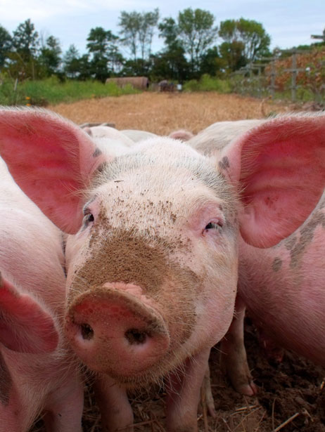

# The Way the Future Blogs

Frederik Pohl

## Where the Oinkers Go

Nobody likes to have a pig farm in his back yard, not even the people who grow them.  They relieve themselves of that pungent pig farm aroma by keeping the pigs a long way from their homes, or indeed from anyone’s.  The routine feeding and handling of the animals takes place largely in giant barns, fully automated and padlocked both to keep the pigs in and marauders out, preferably in states with plenty of open spaces, like, for instance, Minnesota.

That’s a system that has worked well for pig farmers, especially with the price of pork rising higher and higher.  Unfortunately for some of them, they weren’t the only ones who wanted to capitalize on those fat hog prices themselves.  For some of those would-be profiteers the fact that they didn’t happen to own any fat hogs to sell was a handicap, but one that was [easily corrected](https://web.archive.org/web/20170619233024/http://www.kare11.com/news/article/938964/14/150-pigs-stolen-from-farm-in-SE-Minn--).

All they had to do was to drive their trucks up to the unguarded barns, cut big holes in the screening that lets the air in to dilute the aroma, thus let the pigs out and manhandle them into their own trucks.

To the legal owners of those pigs, facing a loss of some $200 a pig, this was an outrage.  The pigs themselves, however, didn’t seem to care.

### 2 Comments

- ミケ says:
There’s a game about Viking raiders called Pig Wars, because pigs were one of the more valuable things in the Dark Ages. I’d like to imagine that these latter day barbarians kept the tradition alive by wearing plastic Viking helmets during their nefarious pignapping.
[**August 13, 2013, 3:25 pm**](/fred-pohl/2013-08-12-where-the-oinkers-go/)
- [Shakatany](https://web.archive.org/web/20170619233024/http://shakatany.livejournal.com/) says:
Well of course they don’t care the poor things end up dead either way.
[**August 14, 2013, 3:00 pm**](/fred-pohl/2013-08-12-where-the-oinkers-go/)