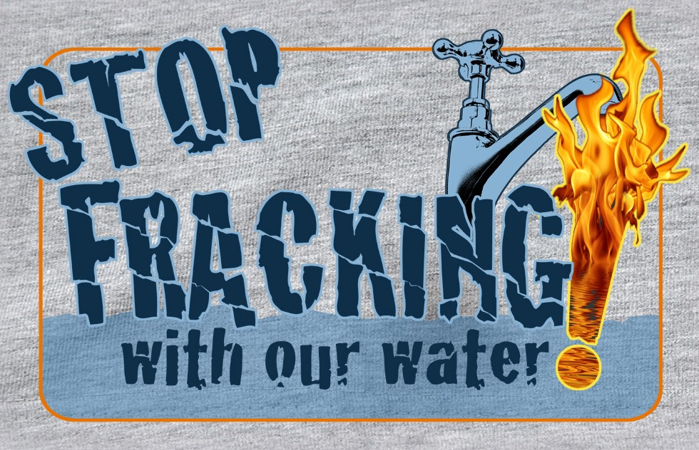

<!-- translated by Yandex Translate -->

# Путь к блогам будущего

Фредерик Пол

## Зачем прекращать гидроразрыв пласта

Гидроразрыв сланца, который содержит “неисчерпаемые” запасы углеводородов в Америке, разрушает наше величайшее сокровище - водоносные горизонты с чистой-пречистой водой, [отравляя](https://web.archive.org/web/20160416130605/http://ecowatch.com/2013/duke-study-gas-water-wells-marcellus-fracking/) ее смертоносными химикатами.

Мы все равно не осмеливаемся добывать, перерабатывать и использовать все это, потому что это привело бы к тому, что количество ужасных погодных катаклизмов превысило бы уровень выживания многих вещей, которыми мы дорожим.  Единственный способ, которым мы можем дать нашим внукам шанс на почти достойную жизнь, - это покончить с безрассудной и смертельно опасной привычкой добывать каждую молекулу углерода, которая может сгореть, и использовать ее для загрязнения и, в конечном счете, уничтожения мирового сокровища чистого воздуха и воды.

Мы уже обрекли на вымирание тысячи видов живых существ.  Вы хотите добавить человечество к этому ужасному списку?

### 3 Комментария

- Джон Армстронг говорит:
Честно говоря, я вижу, что мы не воспринимаем это всерьез, пока не стало слишком поздно, как тот человек, который спрыгнул с Эмпайр Стейт Билдинг … “Пока все хорошо”… наши дети будут проклинать нас
[**24 августа 2013, 18:54 вечера**](/posts/2013-08-22-why-stop-fracking/)
- Грег Си говорит:
Что ж, при всем уважении, я бы предположил, что необходимы дальнейшие исследования, прежде чем делать столь общее заявление. И поскольку Фред - человек, который исследовал НЛО до того, как пришел к выводу, что “это чушь собачья”, возможно, было бы целесообразно приложить те же усилия.
С отрицательной стороны:
Гидроразрыв пласта требует огромного количества воды. Это проблематично в таких районах, как Техас, где водоносные горизонты уже пересыхают. Это меньшая проблема, скажем, на Северо-востоке или Среднем Западе.
Гидроразрыв пласта действительно предполагает закачку нераскрытых химикатов — нераскрытых потому, что операторы рассматривают их конкретную смесь как коммерческую тайну, не желая уступать конкурентам. Это, несомненно, является основанием для дальнейшего регулирования, дальнейших исследований и ужесточения контроля.
Трещиноватые пласты, предположительно, могут вызывать подземные толчки, хотя, как геолог, я не думаю, что здесь есть большая проблема.
С положительной стороны:
Гидроразрыв пласта привел к огромному увеличению добычи газа в Северной Америке. Сжигание газа приводит к гораздо меньшим выбросам CO2, чем угля, и в результате производство энергии в Северной Америке переключилось с угля на газ. Это сильный позитив для всех, кто обеспокоен глобальным потеплением. И, да, возобновляемые источники энергии лучше, но мы должны двигаться от настоящего к будущему, и полагаться на газ в краткосрочной перспективе лучше, чем полагаться на уголь.
И вполне вероятно, что при надлежащем регулировании гидроразрыв пласта может стать надежным и достаточно безопасным методом добычи газа (и нефти).
Настоящая проблема:
Было проведено недостаточно исследований о том, как безопасно проводить гидроразрыв пласта. И страх его противников (разумно) раздувается непрозрачностью и оборонительной позицией промышленности.
Суть в том, что это многообещающая технология с некоторыми положительными преимуществами. Этому не следует ни противодействовать, ни бездумно поддерживать; его следует поддерживать, применяя разумные меры предосторожности.
Трудность заключается в том, что в нынешнем политическом климате почти невозможно делать то, что разумно; сторонники стремятся подавить любой вид контроля, противники стремятся подавить любую реализацию. Объективно, это безумие.
[**24 августа 2013, 19:05 вечера**](/posts/2013-08-22-why-stop-fracking/)
- [Джон К. Боланд](https://web.archive.org/web/20160416130605/http://www.perfectcrimebooks.com/) говорит:
Дорогой Фред,
Я собираюсь начать думать о тебе как о “Фреде Баптисте”.
Тем не менее, с наилучшими пожеланиями.
[**25 августа 2013, 17:11 вечера**](/posts/2013-08-22-why-stop-fracking/)

[WordPress](https://web.archive.org/web/20160416130605/http://wordpress.org/)
[TWTFB2](https://web.archive.org/web/20160416130605/http://dicksmithsoftware.com/)