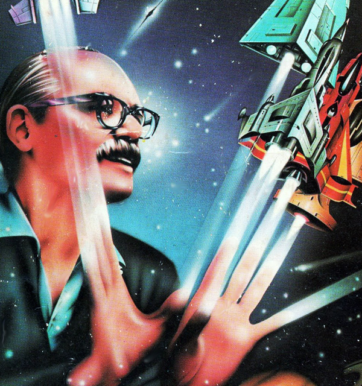

# The Way the Future Blogs

Frederik Pohl

## Obituaries and Tributes to Frederik Pohl

[**Fred’s death**](/fred-pohl/2013-09-04-frederik-pohl-nov-26-1919-sept-2-2013/) was reported and mourned all over the world. Here are excerpts from just a small selection of the remembrances from fans, friends and the media.

- “Grand master passes through the final Gateway.” —Simon Sharwood, [The Register](https://web.archive.org/web/20160416120829/http://www.theregister.co.uk/2013/09/02/science_fiction_titan_frederik_pohl_dies_aged_93/).
- “On Monday, September 2nd, 2013, one of the last remaining great figures in the science fiction genre passed away. Frederik Pohl was 93 years old, with a long and distinguished career writing, selling and editing science-fiction stories.” —Andrew Liptak, [Kirkus Reviews](https://web.archive.org/web/20160416120829/https://www.kirkusreviews.com/features/frederik-pohl-cm-kornbluth-space-merchants/).
- “Like some magnificent sequoia, he was both a vibrant, majestic, respirating presence and a token of a distant, almost unimaginable past. He was given a Grandmaster Award by the Science Fiction Writers of America twenty years ago, but that tribute hardly begins to do justice to his immense accomplishments.” —Paul Di Filippo, [Barnes and Noble Review](https://web.archive.org/web/20160416120829/http://bnreview.barnesandnoble.com/t5/In-the-Margin/A-Tribute-to-Frederik-Pohl/ba-p/11275).
- “Frederik George Pohl, Jr. (Nov. 26, 1919 – Sept. 2, 2013) was almost a living artifact of a bygone era in science fiction, as well as one of the genre’s most fertile and perennially refreshed talents. Born in the immediate aftermath of World War I, he died in the epoch of Google Glass and the Large Hadron Collider, without ever losing his imaginative spontaneity or intellectual curiosity, or his ability to upset and disturb the genre consensus.” —Paul St John Mackintosh, [TeleRead](https://web.archive.org/web/20160416120829/http://www.teleread.com/science-fiction-2/r-i-p-frederik-pohl-science-fictions-veteran-iconoclast/).
- “弗雷德里克·波尔是为数不多的可以担当起“科幻小说大师”头衔的科幻作家.” —[The Beijing News](https://web.archive.org/web/20160416120829/http://epaper.bjnews.com.cn/html/2013-09/07/content_463793.htm?div=-1).
- “Frederik Pohl was a science-fiction author of extraordinary longevity and accomplishment. In hundreds of stories between 1940 and 2010, and dozens of longer works from 1953, he became the sharpest and most precise satirist in the science-fiction world. Kurt Vonnegut may have created greater myths of the awfulness of America, and Philip K Dick may have had a profounder understanding of the human costs of living in a unreal world; but Pohl — from experience garnered in the field of advertising — knew exactly how to describe the consumerist world that began to come into being after the Second World War.” —John Clute, [The Independent](https://web.archive.org/web/20160416120829/http://www.independent.co.uk/news/obituaries/frederik-pohl-science-fiction-author-famed-for-the-sharp-and-precise-satire-of-his-writing-8798809.html) (UK).
- “In all, he published more than 60 novels. His most lauded effort was *Jem: The Making of a Utopia* (1979), which remains the only science fiction title to have won the National Book Award.” —[The Independent](https://web.archive.org/web/20160416120829/http://www.independent.ie/lifestyle/frederik-pohl-29674304.html) (Eire).
- “La ciencia ficción tiene nombres que cualquier que se diga fanático tiene que saber. Uno de ellos es Frederik Pohl, y si su nombre no te suena, en este artículo te contamos por qué este hombre que acaba de pasar a la inmortalidad a los 93 años contribuyó a que cientos de miles se hagan fanáticos de este género.” —Nico Varonas, [Neoteo](https://web.archive.org/web/20160416120829/http://www.neoteo.com/frederik-pohl-el-hombre-ciencia-ficcion/).
- “Described as prickly and stubborn (he was married five times and divorced four), Pohl resisted the Internet for years, according to family and friends, but in 2009 launched a blog called ‘The Way the Future Blogs.’ Like much of his writing throughout his life, it was funny, skeptical and perceptive and it won a Hugo Award.” —Ben Steelman, [Star News Online](https://web.archive.org/web/20160416120829/http://books.blogs.starnewsonline.com/18039/frederik-pohl-r-i-p/).
- “科幻黄金时代硕果仅存的科幻大师之一的Frederik Pohl于9月2日因呼吸困难(respiratory distress)去世，享年93岁。Frederik Pohl以科幻期刊编辑和作家的双重身份闻名，他在60年代作为科幻期刊的编辑连续多年获得雨果奖，之后又以作家身份获得了多次雨果奖和星云奖。” —[Chinese Writers Network](https://web.archive.org/web/20160416120829/http://www.chinawriter.com.cn/2013/2013-09-11/173999.html).
- “A stickler for detail, Pohl was determined to get as much science correct as possible in his books. His research took him all over the world and he was elected a fellow of the American Association for the Advancement of Science. In 2004, when he published the final novel in the Heechee saga, he apologised to his readers for having suggested, in Gateway, that aliens might have taken refuge in a black hole. With the physics of black holes having been more fully understood in the intervening years, Pohl acknowledged that nothing and no one could exist within a black hole.” —[The Telegraph](https://web.archive.org/web/20160416120829/http://www.telegraph.co.uk/news/obituaries/10383690/Frederik-Pohl.html).
- “Avec un coup d’avance et l’humour noir qui caractérise son style, son œuvre dé voile , pour l’humanité, un avenir inquiétant en partie advenu: omniprésence de l’informatique, montée du terrorisme, raréfaction des ressources, pollution, surpopulation, crise du logement, fanatisme religieux. . . . Après Jack Vance et Richard Matheson , c’est la troisième figure majeure de la SF américaine qui s’éteint cette année.” —Macha Séry, [Le Monde](https://web.archive.org/web/20160416120829/http://www.lemonde.fr/disparitions/article/2013/09/04/frederik-pohl-ecrivain-de-science-fiction_3471243_3382.html).
- “Despite being 93, he worked to ‘Safeguard Humanity’ to the end.” —Eric Klien, [Lifeboat Foundation](https://web.archive.org/web/20160416120829/http://lifeboat.com/blog/2013/09/frederik-pohl-passes-away).
- “Frederik Pohl, a long-time member and supporter of the National Space Society (NSS) and one of the great science fiction authors of the late 20th century, died Monday, September 2, 2013. . . . Karen Mermel, Vice President for Development at NSS stated, ‘Fred often spoke at NSS chapter events and represented NSS on panels, including one with astronaut Jim Lovell to discuss the benefits of space exploration.'” —David Brandt-Erichsen, [National Space Society Blog](https://web.archive.org/web/20160416120829/http://blog.nss.org/?p=4204).
- “A former SFWA President (1974—76) and Damon Knight Memorial Grand Master,  Frederick Pohl’s career spanned 74 years from his first publication in 1937 to his most recent book, *All the Lives He Led in 2011. He was a stellar editor as well, in both magazines and books and acquired groundbreaking works like Joanna Russ’s The Female Man and Samuel R. Delany’s Dhalgren. My personal favorite was his book Man Plus*. I met him only twice but both meetings are etched in my memory and I am very sad tonight.” —Steven Gould, [SFWA](https://web.archive.org/web/20160416120829/http://www.sfwa.org/2013/09/memoriam-frederik-pohl/).
- “He spent the last several years of his life writing The Way the Future Blogs, fashioning the pieces from which a new volume of his memoirs might be made — in the meantime so charming the latest generation of science fiction fans with his anecdotes from the genre’s golden age that he was voted a Best Fan Writer Hugo in 2010.” —Mike Glyer, [File 770](https://web.archive.org/web/20160416120829/http://file770.com/?p=14391).
- “Frederik Pohl, one of the great science fiction authors and editors of the late 20th century, died Monday, his family announced on his website. . . . Pohl was known as a dark humorist and satirist in novels such as ‘The Space Merchants’ (1953) and ‘Gladiator-at-Law’ (1955), both written with frequent collaborator C.M. Kornbluth, and the short story ‘The Gold at Starbow’s End’ (1972).” —Carolyn Kellogg, [Los Angeles Times](https://web.archive.org/web/20160416120829/http://www.latimes.com/books/jacketcopy/la-et-jc-rip-frederik-pohl-20130903,0,1023361.story).
- “In 1960, the British author Sir Kingsley Amis called him the most consistently able writer of modern science fiction.” —[BBC News](https://web.archive.org/web/20160416120829/http://www.bbc.co.uk/news/world-us-canada-23955298).
- “The best genre fiction is used as allegory. When we see a world populated by apes, or a space army populated with children, we recognize these concepts as costumes for larger ideas. The best writers in science fiction and fantasy know this, showing us utopias made real on other planets but also showing us the cost of greed and ignorance. One such writer was Frederik Pohl, who passed away this past Monday at the age of 93.” —Robert Walker, [NerdReactor](https://web.archive.org/web/20160416120829/http://nerdreactor.com/2013/09/04/frederik-pohl-author-gateway-dies-93/).
- “He was, for me, the last of the Golden Age greats, the first generation of Science Fiction Writers who created the genre. His collaborations with Cyril Kornbluth, his later solo work, were wonderful things: always witty, smart, interested in how people worked and how the stuff of the future would change the people who inhabited it.” —[Neil Gaiman](https://web.archive.org/web/20160416120829/http://journal.neilgaiman.com/2013/09/remembering-frederick-pohl-and-walk-in.html).
- “I’m thankful that he so consistently produced work, fiction and non-fiction alike, that I was able to enjoy for decades.  Works that really made me think, opened my eyes, posed hard and interesting questions.  I know I am a better person for having known and read Frederik Pohl.” —Steve Davidson, [Amazing Stories](https://web.archive.org/web/20160416120829/http://amazingstoriesmag.com/2013/09/frederik-pohl/).
- “In his 93-year lifetime, Frederik Pohl wrote nearly 100 books: fiction and nonfiction. That is a towering accomplishment. Yet perhaps we should best remember him as the last of those fabulous sci-fi geeks of the dismal 1930s who  focused their lives on trying to imagine the future we all live in today.” —Marc Haefele, [89.3 KPCC](https://web.archive.org/web/20160416120829/http://www.scpr.org/programs/offramp/2013/09/04/33566/rip-sci-fi-writer-frederik-pohl-1919-2013-truly-th/).
- “Mr. Pohl’s grasp of science was impressive; although entirely self-taught, he was elected a fellow of the American Association for the Advancement of Science in 1982. He was also in demand as a so-called futurist, speaking to business executives and other audiences about the shape of things to come in a science-dominated future — and about the unreliability of even short-range predictions.” —Gerald Jonas, [New York Times](https://web.archive.org/web/20160416120829/http://www.nytimes.com/2013/09/04/books/frederik-pohl-worldly-wise-master-of-science-fiction-dies-at-93.html?smid=pl-share).
- “One of the brightest stars in the science fiction world has been extinguished.” —Eathan Sacks, [New York Daily News](https://web.archive.org/web/20160416120829/http://www.nydailynews.com/entertainment/sci-fi-luminary-frederik-pohl-dies-93-article-1.1445004).
- “Pohl touched on many common sci-fi themes in his writing: interplanetary travel, overpopulation, cryogenic preservation, cities under domes, parallel universes and colonies on Mars. But he may be most important as a pioneer of what has been called the ‘anti-utopian’ branch of science fiction — or ‘sf,’ as its aficionados often call it — in which an outwardly well-organized society disintegrates from internal pressures, rivalries and greed. . . . ‘Pohl’s work offers science fiction at its best,’ Washington Post arts critic Joseph McLellan wrote in 1980.” —Matt Schudel, [Washington Post](https://web.archive.org/web/20160416120829/http://www.washingtonpost.com/entertainment/books/frederik-pohl-influential-science-fiction-writer-dies-at-93/2013/09/03/6db9a658-14ae-11e3-b182-1b3bb2eb474c_story.html).
- “When the Fremd [High School Writer’s Week] program started there was no budget for it, just a desire to get students in the same room with real authors, said retired teacher Tony Romano. Pohl agreed to participate in the program for free.
“‘He was very encouraging. He was really committed to young people and writing,’ Romano said.” —Melissa Anderson, [Daily Herald](https://web.archive.org/web/20160416120829/http://www.dailyherald.com/article/20130903/news/709039774/) (Illinois).
- “Frederik Pohl, who has died aged 93, was one of the greatest and most prolific of American science-fiction writers. During a career lasting more than 60 years, Pohl was among the most celebrated and popular authors of his era.” —Christopher Priest, [The Guardian](https://web.archive.org/web/20160416120829/http://www.theguardian.com/books/2013/sep/03/frederik-pohl).
- “Frederik Pohl, one of the few writers who was truly deserving of the overused epithet ‘grandmaster of science fiction’, has died aged 93.” —David Barnett, [The Guardian](https://web.archive.org/web/20160416120829/http://www.theguardian.com/books/2013/sep/03/frederick-pohl-dies-science-fiction).
- “Author Frederik Pohl, who over decades gained a reputation of being a literate and sophisticated writer of science fiction, has died at age 93.” —Herbert G. McCann, [Associated Press](https://web.archive.org/web/20160416120829/http://bigstory.ap.org/article/science-fiction-writer-frederik-pohl-dead-93).
- “Pohl, who also published poetry and served as a literary editor, is best known for his 1977 novel ‘Gateway,’ which told the story of a space station hidden in an asteroid. The novel won four top science fiction awards, including the Hugo Award, and was later adapted into a computer game.” —Eric Kelsey, [Reuters](https://web.archive.org/web/20160416120829/http://www.reuters.com/article/2013/09/03/entertainment-us-frederikpohl-idUSBRE9820Y120130903).
- “Frederik Pohl, a master of science fiction whose transformative influence on the genre is incalculable, died Monday in Palatine, Illinois. . . . Pohl leaves behind a body of work that spans multiples eras, subgenres, and upheavals in the world of science fiction literature.” —Jason Heller, [A.V. Club](https://web.archive.org/web/20160416120829/http://www.avclub.com/article/rip-frederik-pohl-102434).
- “I’m not sure any science fiction writer has ever written three consecutive novels as good as *Man Plus, Gateway, and Jem*. He’ll be missed.” —Kevin Drum, [Mother Jones](https://web.archive.org/web/20160416120829/http://www.motherjones.com/kevin-drum/2013/09/fred-pohl-dies-93).
- “Considered a pioneering author in the science fiction genre, Pohl enjoyed a successful career, spanning over 75 years.” —[Fox News](https://web.archive.org/web/20160416120829/http://www.foxnews.com/science/2013/09/03/master-science-fiction-author-frederik-pohl-dies-at-93/).
- “Frederik Pohl was a great writer who happened to write science fiction, mostly. . . . He wrote dozens of novels and untold short stories, stretching the limits of our knowledge while telling rip-roaring yarns, yet seldom treading into sheer fantasy. He was among the elite handful of top SF writers and his writing and editing career spanned nine decades. . . . Many times Pohl stimulated this reader’s thinking on contemporary issues and the promise as well as dangers of the future, all the while instilling a regard for the wonder and majesty and sheer incomprehensibility of the universe.

And here’s the special thing: Unlike many SF writers who for some reason or another tended towards libertarianism, Pohl seemed to get it. He was, without labeling himself, a clear-eyed progressive. —Ron Legro, [Daily Kos](https://web.archive.org/web/20160416120829/http://www.dailykos.com/story/2013/09/03/1236063/-Frederik-Pohl-a-short-appreciation).
- Pohl probably deserved his title of ‘Science Fiction Grand Master’ more than any other of the genre. That’s because he was far more than just a writer of stellar science fiction; he was an extremely influential editor. But even before that, Pohl was a *‘super fan.’*

Pohl was intimately involved in the early development of the emerging science fiction scene and culture among the magazine and pulp publishing industry centered in New York City. He formed clubs, developed conventions, published obscure newsletters and fanzines — he did it all. He was immersed within and passionate about science fiction. . . . Pohl’s influence was probably greater than that of famed editor John W. Campbell.” —Ken Korczak, [Examiner.com](https://web.archive.org/web/20160416120829/http://www.examiner.com/article/frederik-pohl-good-bye-to-one-of-science-fiction-s-greatest).
- “SFWA Grandmaster, author, editor, agent, and fan Frederik Pohl, 93, died September 2, 2013.” —[Locus](https://web.archive.org/web/20160416120829/http://www.locusmag.com/News/2013/09/frederik-pohl-1919-2013-2/).
- “He was the last major figure whose career began during or before science fiction’s fabled Golden Age, that brief span of supercharged storytelling excellence which lasted from 1938 to 1946. His career in science fiction lasted seventy-six years, nearly equaling the longevity record set by his frequent collaborator, Jack Williamson (1908-2006), eleven years Fred’s senior, whose science fiction career spanned seventy-seven years.” —[Andrew Fox](https://web.archive.org/web/20160416120829/http://www.fantasticalandrewfox.com/2013/09/04/frederik-pohl-last-link-to-science-fictions-golden-age-has-died/).
- “Pohl was an active figure in science fiction right up until the day of his death — literally. He updated his blog mere hours before he went. That blog, by the way, won him the Hugo award for Best Fan Writer, which went alongside his Hugos for best novel (for *Gateway*), and the Hugos won by Galaxy magazine under his editorship. It’s no coincidence that he was celebrated as a writer, an editor and a fan — Pohl covered all the bases in the field.” —Cory Doctorow, [boing boing](https://web.archive.org/web/20160416120829/http://boingboing.net/2013/09/04/rip-science-fiction-grand-mas.html).
- “A very good writer. . . . He will be greatly missed.” —Megan McArdle, [Bloomberg](https://web.archive.org/web/20160416120829/http://www.bloomberg.com/news/2013-09-04/frederik-pohl-s-great-fiction-and-sketchy-economics.html).
- “Popular science fiction writer Frederik Pohl, who was well respected for his unique insight into the future and the cost of technology, has died at age 93.” —Daniel S Levine, [The Celebrity Cafe](https://web.archive.org/web/20160416120829/http://thecelebritycafe.com/feature/2013/09/frederik-pohl-science-fiction-writer-dies-93).
- “Born in New York City on 26 November 1919, he was an early reader with a love of reading in multiple genres, though he’d make his greatest mark in science fiction. . . . Pohl was one of the early fans, a member of the Futurians and the Hydra Club, and one of the six New Yorkers who traveled to Philadelphia, Pennsylvania, on 22 October 1936 for what has come to be known as the first science fiction convention.” —Ian Randal Strock, [SF Scope](https://web.archive.org/web/20160416120829/http://www.sfscope.com/2013/09/authoreditoragent-frederik-pohl-dies/).
- “Frederik Pohl, prolific science fiction writer and member of First Fandom has died at 93. He wrote science fiction, edited science fiction magazines, helped other writers break into the field, and was the literary agent to some of the biggest names in the science fiction. He was a recognized force there at almost the very beginning of science fiction and his influence grew over the years.” —Kevin D. Randle, [The Science Fiction Site](https://web.archive.org/web/20160416120829/http://thesciencefictionsite.blogspot.com/2013/09/frederik-pohl-of-first-fandom-has-died.html).
- “As a vital and active force in science fiction for decades, Pohl’s influence in his field cannot be overstated. He will be missed.”—Matt Staggs, [Del Rey Spectra Suvudu](https://web.archive.org/web/20160416120829/http://sf-fantasy.suvudu.com/2013/09/rip-frederik-pohl.html).
- “Frederik Pohl was almost the last of his generation, one of the last people to remember the birth of science fiction as a genre with an identity and a community. We felt colder and closer to the grave, the way you do when you lose a grandparent or a parent.” —Jo Walton, [Tor.com.](https://web.archive.org/web/20160416120829/http://www.tor.com/blogs/2013/09/frederik-pohl-death)
- “Frederik Pohl was one of the giants of science fiction.” —[Tor.com](https://web.archive.org/web/20160416120829/http://www.tor.com/blogs/2013/09/frederik-pohl-1919-2013).
- “A pioneer of the science fiction genre — at a time when the genre was ’embracing its pulpiest tendencies,’ Pohl envisioned a world in which science fiction was seen as a category worth of literary praise.

*The Space Merchants*, one of Pohl’s best-known novels, made good on that promise. . . .  Pohl said it was a book that no one would want to publish, but it helped take his career to the next level and establish him as one of the most influential futurist authors of the century.”  —Nathan Ingraham, [The Verge](https://web.archive.org/web/20160416120829/http://www.theverge.com/2013/9/3/4689276/pioneering-sci-fi-author-frederik-pohl-dies-at-the-age-of-93).
- “RIP Frederik Pohl, the man who transformed science fiction.” —Annalee Newitz, [io9](https://web.archive.org/web/20160416120829/http://io9.com/rip-frederik-pohl-the-man-who-transformed-science-fict-1241405614).
- “May he never be forgotten.” —Matthew Hubbard, [This Day In Science Fiction](https://web.archive.org/web/20160416120829/http://thisdayinscifi.blogspot.com/2013/09/never-to-be-forgotten-frederik-pohl.html).

### 2 Comments

- [Stefan Jones](https://web.archive.org/web/20160416120829/http://www.flickr.com/photos/stefan_e_jones/) says:
I hope you keep up this blog, for tributes and other news.
[**December 1, 2013, 1:49 pm**](/fred-pohl/2013-11-26-obituaries-and-tributes-to-frederik-pohl/)
- [JJ Brannon](https://web.archive.org/web/20160416120829/http://www.youtube.com/watch?v=xPgZeOsG8sk) says:
Still such of a loss of a sweet, generous, laser-sharp man.
Keep the torch lit.
JJB
[**December 7, 2013, 2:52 pm**](/fred-pohl/2013-11-26-obituaries-and-tributes-to-frederik-pohl/)

[WordPress](https://web.archive.org/web/20160416120829/http://wordpress.org/)
[TWTFB2](https://web.archive.org/web/20160416120829/http://dicksmithsoftware.com/)