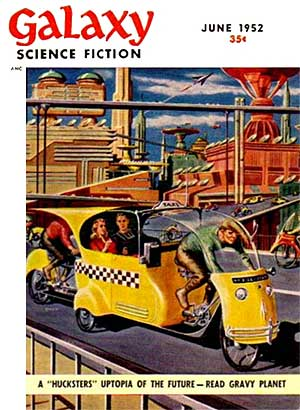

<!-- translated by Yandex Translate -->

# Путь к блогам будущего

Фредерик Пол

## История космических торговцев, часть 3

[** Мы с Сирилом Корнблатом**](/fred-pohl/2009-04-20-cyril/) сотрудничали над несколькими не очень хорошими (но все равно проданными и опубликованными) рассказами до того, как война изменила все.  Сейчас он не слишком много писал, потому что твердо решил жить по-честному, под чем подразумевал получение высшего образования.  Соответственно, он переехал в Чикаго со своей новой женой [Мэри](/fred-pohl/2010-12-09-mary-byers-kornbluth-part-1-a-fan-is-born/) и поступил в Иллинойский университет с финансовой помощью Билля о правах штата Джорджия.  У него было времени написать очень мало, но то, что он написал (и я немедленно продал его через [агентство **Дирка Уайли**](/fred-pohl/2010-12-17-how-i-lost-my-oldest-friend-and-gained-a-literary-agency/)), становилось все лучше и лучше.

Я думал, что он может поддаться искушению.  Поскольку он только что пришел к нам в гости, проверить это было легко, поэтому я показал ему неполную рукопись, и он попался на крючок.  Когда Сирил ушел домой, он забрал фрагмент с собой.  Он кое-что подчистил в первой трети книги, затем самостоятельно написал черновик следующей трети и вернулся, чтобы показать его мне.

Я был доволен его черновиком.  Затем мы написали заключительный раздел "От начала и до конца", четырехстраничный фрагмент Сирила, за которым последовали четыре страницы меня * и Со Вайтера.*  Затем я сам просмотрел рукопись в последний раз.  Затем я передал его Хорасу, и он запустил его по расписанию, сменив название на *Торговец Космосом(Gravy Planet)[*, сразу после окончания сериала Альфи Бестера](/fred-pohl/2011-03-08-alfie/).

* "Торговец Космосом(Gravy Planet)* вызвал большой интерес в сообществе НФ.  Какое-то время считалось, что именно она вдохновила на создание совершенно нового вида научной фантастики под названием “когда мусорщики захватят мир”.  И когда это было закончено в журнале, я сделал аккуратную упаковку из отрывных листов, чтобы продать издание в твердой обложке тому или иному книжному издательству.  Будучи агентом, я продавал тонну НФ-романов новорожденному и ненасытному книжному рынку НФ.  Я не ожидал, что у меня возникнут какие-либо проблемы с получением контракта на книгу.

Я не мог бы ошибиться сильнее.

*Продолжение следует. . . .*

**Связанные должности:**

- ** История о Торговцах Космосом(The Space Merchants)**, [** Часть 1**](/fred-pohl/2013-12-18-the-story-of-the-space-merchants/), [** Часть 2**](/fred-pohl/2013-12-23-the-story-of-the-space-merchants-part-2/)

[WordPress](https://web.archive.org/web/20160416122354/http://wordpress.org/)
[TWTFB2](https://web.archive.org/web/20160416122354/http://dicksmithsoftware.com/)