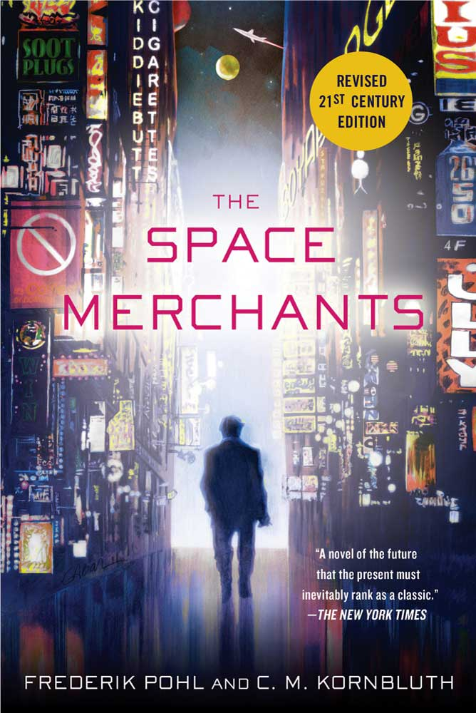

<!-- translated by Yandex Translate -->

# Путь к блогам будущего

Фредерик Пол

## История космических торговцев, часть 5

Видишь ли, однажды ночью мне пришла в голову освобождающая мысль: “Эй, Фред!  Все те люди, над которыми вам с Сирилом было так приятно подшучивать, они все еще рядом — только хуже, чем когда—либо, - и им все еще нужно, чтобы кто-нибудь указал им на то, насколько презренны их стремления и какими жалкими они сделали бы нашу жизнь, если бы могли".

Пришло время для [нового издания](https://web.archive.org/web/20160416223651/http://www.amazon.com/gp/product/1250000157/ref=as_li_ss_tl?ie=UTF8&camp=1789&creative=390957&creativeASIN=1250000157&linkCode=as2&tag=twtfb-20)!  Некоторые торговые марки утратили свою актуальность — сколько людей в наши дни владеют Kelvinator или ездят на Nash? — но заменить эти названия на более современные было несложно.

Единственной вещи, которая сделала бы всю работу проще и намного веселее, с нами больше не было.  Это было присутствие самого [**Сирила Корнблата**](/posts/2009-04-20-cyril/), вечно изящного в использовании слов и еще более достоверно сардонического в своем понимании мира, в котором мы живем.

* * *

Итак, по прошествии всех этих долгих и насыщенных событиями полувека, прошедших с того дня, когда я робко передал незаконченную рукопись "Торговцев Космосом([The Space Merchants](https://web.archive.org/web/20160416223651/http://www.amazon.com/gp/product/1250000157/ref=as_li_ss_tl?ie=UTF8&camp=1789&creative=390957&creativeASIN=1250000157&linkCode=as2&tag=twtfb-20)) [Хорасу Голду](https://web.archive.org/web/20160416223651/http://www.gcwillick.com/Spacelight/gold_hl.html), что я думаю о самой книге?

Я думаю, что это не совсем обычный роман, и, возможно, именно поэтому так много редакторов отказались от возможности его опубликовать.  Конечно, это не был обычный научно-фантастический роман в том смысле, в каком этот термин понимался в те далекие времена, в нем отсутствовали инопланетные персонажи с радарными глазами и множеством конечностей, а также их эскадрильи боевых машин, летающих быстрее света.  То, что это было и есть, - это то, что [Кингсли Эмис](https://web.archive.org/web/20160416223651/http://www.nybooks.com/books/authors/kingsley-amis/) удачно назвал “комическим адом” или “новой картой ада".  Таким образом, читатели, разделявшие мои и Сирила опасения по поводу мира будущего, услышали голос, который разделял их опасения, и им понравилось то, что они услышали.

И сейчас я бы не стал предъявлять более сильных претензий к этой книге.

**Связанные должности:**

- ** История о Торговцах Космосом(The Space Merchants)**, [**Часть 1**](/posts/2013-12-18-the-story-of-the-space-merchants/), [** Часть 2**](/posts/2013-12-23-the-story-of-the-space-merchants-part-2/), [** Часть 3**](/posts/2013-12-26-the-story-of-the-space-merchants-part-3/), [часть 4](https://web.archive.org/web/20160416223651/http://www.thewaythefutureblogs.com/?p=6096)

### 2 Комментария

- [Алан Робсон](https://web.archive.org/web/20160416223651/http://tyke.net.nz/) говорит:
Очаровательно! Мне всегда нравились “Торговцы Космосом(The Space Merchants)". Впервые я прочитал ее подростком. Сейчас мне за 60, и недавно я перечитала это в сотый раз, и мне снова все понравилось.
—  

- Алан
[**5 января 2014 года, 11:20 вечера**](/posts/2014-01-05-the-story-of-the-space-merchants-part-5/)
- Дэвид говорит:
Я рад, что ты все-таки выкладываешь новые фрагменты. В последние месяцы я время от времени останавливался в надежде на большее, но я просто видел сообщение с черной каймой вверху и думал: “Ну и ладно”.
[**7 января 2014 года, 10:10 вечера**](/posts/2014-01-05-the-story-of-the-space-merchants-part-5/)

[WordPress](https://web.archive.org/web/20160416223651/http://wordpress.org/)
[TWTFB2](https://web.archive.org/web/20160416223651/http://dicksmithsoftware.com/)