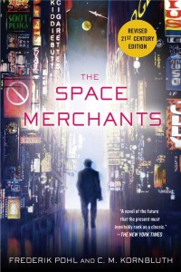

<!-- translated by Yandex Translate -->

# Путь к блогам будущего

Фредерик Пол

## Подробнее о космических торговцах, издание 21 века

В 2011 году Фред пересмотрел [** "Торговцев Космосом(The Space Merchants)**](/posts/2013-12-18-the-story-of-the-space-merchants/), свою классическую [*совместную работу**](/posts/2010-04-27-fred-s-distilled-writing-wisdom-part-2-collaboration/) с [** Сирилом Корнблатом**](/posts/2009-04-20-cyril/).  Наиболее заметными изменениями в [издании 21st Century](https://web.archive.org/web/20160416133417/http://www.amazon.com/gp/product/1250000157/ref=as_li_ss_tl?ie=UTF8&camp=1789&creative=390957&creativeASIN=1250000157&linkCode=as2&tag=twtfb-20) стали замена несуществующих названий брендов на более современные и несколько изменений, призванных сделать науку более точной.

Не все были довольны обновлением, но поскольку предыдущие издания уже некоторое время не [выходили из печати](https://web.archive.org/web/20160416133417/http://www.thewaythefutureblogs.com/?p=6096/#op), наличие новых экземпляров является благом. Увы, эта классика не была выпущена в электронном издании, и мы надеемся, что те из вас, кто хотел бы иметь ее в своих библиотеках для чтения электронных книг, [уговорят издателей](https://web.archive.org/web/20160416133417/mailto:ThomasDunneBooks@stmartins.com?bcc=blog@thewaythefutureblogs.com&subject=Please%20bring%20out%20The%20Space%20Merchants%20in%20electronic%20format&body=I%20want%20this%20Pohl%20and%20Kornbluth%20classic%20in%20my%20e-reader!) сделать это.

Мы подумали, что поклонникам Фреда, возможно, захочется ознакомиться с несколькими рецензиями на последнее издание:

- “Роман полон фантастических поворотов сюжета и демонстрирует непочтительное отношение ко всему - от того, что мы едим, до власти президента. Его ироничный взгляд на роль СМИ в формировании популярной культуры делает его ослепительным протопоп-романом”. — Дуг Кьюб, [Cubic Muse](https://web.archive.org/web/20160416133417/http://cubicmuse.com/?p=1311).
- “В конце концов, книга не может не сохранить своего качества предостерегающего взгляда в будущее, сделанного чуть более полувека назад. . . . Поклонникам научной фантастики, которые почему-то пропустили чтение "Торговцев Космосом (The Space Merchants), определенно стоит приобрести это новое издание. Остальные из нас могут отложить свои заезженные экземпляры в мягкой обложке и с удовольствием перечитать их снова в этом более прочном и удобном формате”. - Алан Крэнис, [Bookgasm](https://web.archive.org/web/20160416133417/http://www.bookgasm.com/reviews/sci-fi/the-space-merchants/).
- “В 1953 году Пол и Корнблат (1923-1958) опубликовали эту ироничную повесть о будущем, управляемом корпорациями, новаторское повествование для своего времени". — [Publishers Weekly](https://web.archive.org/web/20160416133417/http://www.publishersweekly.com/978-1-250-00015-6).
- “Лучший роман в жанре научной фантастики о Мэдисон-авеню, который вы когда-либо читали. . . . Сейчас выходит в "Пересмотренном издании 21-го века" * Торговцы Космосом (The Space Merchants)* - это буквально "Безумцы в космосе". Это также напоминание о том, что эта книга должна занять свое место среди великих литературных сатир двадцатого века”. — Аннали Ньюитц, [io9](https://web.archive.org/web/20160416133417/http://io9.com/5880721/the-best-science-fiction-novel-about-madison-ave-youll-ever-read).

Вы читали обе версии? А ты как думал?

*Команда блога*

**Связанные должности:**

- ** История о Торговцах Космосом(The Space Merchants)**, [**Часть 1**](/posts/2013-12-18-the-story-of-the-space-merchants/), [** Часть 2**](/posts/2013-12-23-the-story-of-the-space-merchants-part-2/), [** Часть 3**](/posts/2013-12-26-the-story-of-the-space-merchants-part-3/), [Часть 4](https://web.archive.org/web/20160416133417/http://www.thewaythefutureblogs.com/?p=6096), [часть 5](https://web.archive.org/web/20160416133417/http://www.thewaythefutureblogs.com/?p=6102)

### 3 Комментария

- [Стефан Джонс](https://web.archive.org/web/20160416133417/http://www.flickr.com/photos/stefan_e_jones/) говорит:
У меня есть предложение:
Измените дань уважения Фреду с черной каймой, чтобы новые посты были сразу видны. Возможно, его можно превратить в “панель” с заголовком и картинкой, при нажатии на которую можно перейти к полной статье о трибьюте.
Я упоминаю об этом потому, что до тех пор, пока меня не “предупредило” упоминание в Twitter, я перемещал ссылку на “Путь блогов будущего” далеко вниз по списку закладок. Я думал, что все стихло, а когда я все-таки проверил, то увидел только дань уважения и подумал, что ничего нового не добавляется.
Мне действительно понравились записи Элизабет, а также история Торговцев Космосом(The Space Merchants).
Заставляйте их приближаться!
[**8 января 2014 года, 14:18 вечера**](/posts/2014-01-08-more-on-the-space-merchants-21st-century-edition/)
- Джей [Джей Брэннон](https://web.archive.org/web/20160416133417/http://www.youtube.com/watch?v=xPgZeOsG8sk) говорит:
Я согласен со Стефаном Джонсом.
Сокращенный баннер с некрологом Фреда лучше подошел бы сайту.  Держите его поверх нового материала, но не более чем на трети высоты дисплея.
Мне нравятся материалы как Фреда, так и доктора Халла.
JJB
[**8 января 2014, 20:15 вечера**](/posts/2014-01-08-more-on-the-space-merchants-21st-century-edition/)
- [Роберт Новолл](https://web.archive.org/web/20160416133417/http://www.robertnowall.com/) говорит:
Меня приводило в замешательство то, что я видел современные имена в том, что я читал примерно сорок с лишним лет назад... не знаю, что могли подумать современные (то есть “молодые”) читатели.  Но я все же вернулся к исходному тексту после пары глав в…
[**9 января 2014 года, 9:15 утра**](/posts/2014-01-08-more-on-the-space-merchants-21st-century-edition/)

[WordPress](https://web.archive.org/web/20160416133417/http://wordpress.org/)
[TWTFB2](https://web.archive.org/web/20160416133417/http://dicksmithsoftware.com/)