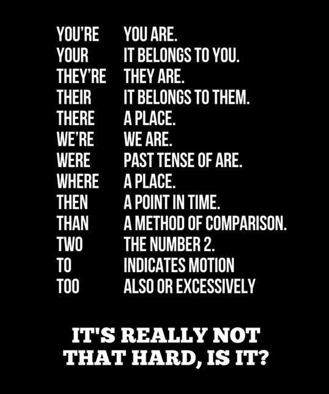

# The Way the Future Blogs

Frederik Pohl

## Stumbling Blocks to Persuasive Writing

  

**By Elizabeth Anne Hull**



An important shibboleth of literacy when I was much younger was whether people could properly use, spell, and punctuate the common words [to, two, and too](https://web.archive.org/web/20160416125329/http://www.writingforward.com/grammar/homophones/homophones-two-too-and-to).  Likewise [there, their and they’re](https://web.archive.org/web/20160416125329/http://www.storyboardthat.com/userboards/kated/there--they-re--their), and [it’s and its](https://web.archive.org/web/20160416125329/http://www.betteratenglish.com/grammar-mistakes-that-make-you-look-like-a-dork-its-vs-its/), and dozens of other often confused sets of words.

While a colleague and I were judging advanced-placement credit writing samples, she commented on how damaging spelling mistakes could be to the success of a short piece of writing, the kind on which we were making decisions of whether a student received credit and passed or faced the frustration of failure.

I’m very lucky that spelling always came very easily to me as a child, but I soon realized that it’s not the most important part of writing. That is, it’s necessary but not sufficient to achieve success.

A casual reader of a correctly spelled essay written in standard English grammar with conventional punctuation rarely notices its mechanical perfection.  It’s the flaws that grab attention.  We notice mistakes even more when we’re looking for a reason to reject what a writer is trying to say — when we dislike or don’t believe the point being made.

There are other ways to go wrong, of course, but to write effectively, you need to do a great many things right.  Why distract your reader from your point with needless stumbling blocks to communication?  Not everyone will agree with your point, even if you do such things perfectly and reason clearly and provide supporting evidence, but why make it harder to understand what that point is?

Yet I doubt that there’s a foolproof rule that governs the grammar of English that doesn’t have an exception.  Wouldn’t people be [better off](https://web.archive.org/web/20160416125329/http://blogs.telegraph.co.uk/news/tomchiversscience/100219178/there-changing-theyre-mind-about-correct-spelling-and-good-grammar-at-oxford-university/) if we could understand what our opponents really meant, in spite of the lame way they said it?

I was making elevator conversation with a stranger the other day on the *to, too, two confusion, and my fellow person-on-the-way-to the-fourth-floor mentioned that the debate brought up tutus* in her mind, because she taught ballet.  Context matters.

How do we ever expect mere human beings to understand one another well enough to reach solutions to the problems facing our nation and our planet, such as how to solve the [health-care situation](https://web.archive.org/web/20160416125329/http://www.kevinmd.com/blog/2012/06/communication-skills-lacking-health-care-today.html) in the U.S. or what can we do to mitigate the damage scientists predict [global warming](https://web.archive.org/web/20160416125329/http://www.prevention.com/health/healthy-living/10-global-warming-misconceptions) will produce?

### 5 Comments

- [Stefan Jones](https://web.archive.org/web/20160416125329/http://www.flickr.com/photos/stefan_e_jones/) says:
I’m tempted to print out that graphic, because even though I know the rules, I still have to think about them once in a while.
We need a second list, summing up the rules for pluralization, possesives, and apostrophe placement.
* * *  

Large picture: Too many people do not read enough to know what properly composed sentences look like. Which likely started when they didn’t get read *to* enough as kids.
[**January 13, 2014, 11:32 am**](/fred-pohl/2014-01-13-stumbling-blocks-to-persuasive-writing/)
- Nate Whilk says:
dnot you tnihk taht it’s an imposition to ecpxet the lntiesr or rdaeer to usternad waht a pornes is tnyirg to say?
Seriously, there are a zillion ideas out there. If someone has an idea they think is great, why doesn’t that motivate that person to make sure people can read it? If they won’t make that basic effort, why should *I* expend that effort on it?
[**January 13, 2014, 10:24 pm**](/fred-pohl/2014-01-13-stumbling-blocks-to-persuasive-writing/)
- Steve Leavell says:
A little something I wrote a few years ago while teaching summer school:
“Apostrophe to the Apostrophe”
Your a pesky little piece of punctuation.  

(Of all the common mark’s, least understood.)  

You are a source of constant consternation,  

And explanation’s dont do any good.
[**January 15, 2014, 3:27 pm**](/fred-pohl/2014-01-13-stumbling-blocks-to-persuasive-writing/)
- H. E. Parmer says:
“I got all these great ideas, but I don’t know how to spell ’em!”
Jack Carson, as aspiring playwright Officer O’Hara, in Frank Capra’s “Arsenic and Old Lace”
[**January 16, 2014, 4:26 pm**](/fred-pohl/2014-01-13-stumbling-blocks-to-persuasive-writing/)
- pjcamp says:
Just so you know, you’re doing an awesome job continuing the blog. Fred would be proud.
[**January 19, 2014, 1:56 am**](/fred-pohl/2014-01-13-stumbling-blocks-to-persuasive-writing/)

[WordPress](https://web.archive.org/web/20160416125329/http://wordpress.org/)
[TWTFB2](https://web.archive.org/web/20160416125329/http://dicksmithsoftware.com/)