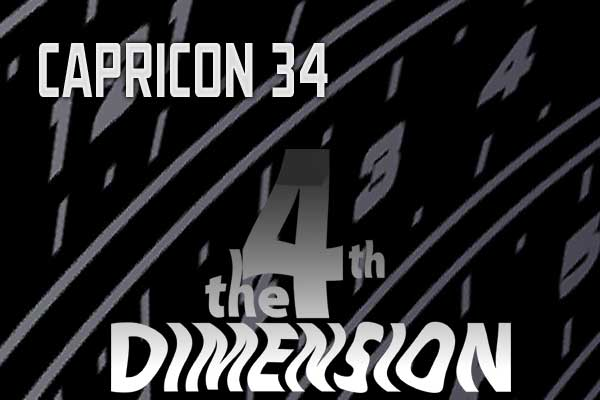

<!-- translated by Yandex Translate -->

# Путь к блогам будущего

Фредерик Пол

## Присоединяйтесь к нам в Capricon!

Большая часть команды блога соберется на [Capricon 34](https://web.archive.org/web/20160416122523/http://capricon.org/capricon34/), в Уилинге, штат Иллинойс, 6-9 февраля. Приходите к нам в гости!

[Бетти](https://web.archive.org/web/20160416122523/http://www.thewaythefutureblogs.com/elizabeth-anne-hull/):

- ** “Является ли канон угасающей концепцией?”**  

Пятница, 19:00, Берч Б  

С повсеместными переделками и повторной загрузкой canon может превратиться в увядающую концепцию роскоши. Заменено на $$$. Вымрут ли пуристы, считающие канон важным, и их заменят потребители, которые просто хотят, чтобы их развлекали?
- **Раздача автографов**  

Суббота, 14:00, Стол для раздачи автографов  

Бетти подпишет экземпляры "[Врат](https://web.archive.org/web/20160416122523/http://www.amazon.com/gp/product/0765326620?ie=UTF8&tag=twtfb-20&linkCode=as2&camp=1789&creative=390957&creativeASIN=0765326620)", [антологии "фестшрифт"](/posts/2009-01-01-elizabeth-anne-hull/), которую она отредактировала к 90-летию Фреда, и у нее также будут несколько книг, которые Фред подписал перед смертью.
- **Чтение**  

Суббота, 15:15, Берч А
- ** “По-настоящему подрывная литература”**  

Суббота, 17:30, Берч А  

Дэвид Джерролд написал о “поистине подрывной природе научной фантастики как литературы, которая ставит под сомнение статус-кво". Действительно ли научная фантастика подрывна? Если это так, то почему и как некоторым людям может быть приятно читать?
- ** “Что это зеленое, семи футов ростом и с рогами?”**  

Воскресенье, 10 часов утра, Уиллоу  

Авторы рассказывают о своих чувствах к рецензентам. Служат ли рецензенты полезной цели? Что отличает хорошего рецензента от плохого? Может ли или должен ли автор когда-либо публично (или даже в частном порядке) отвечать рецензенту?

[Дик](https://web.archive.org/web/20160416122523/http://www.dicksmithsoftware.com/):

- ** Дискуссия: “Претерпевает ли Фэндом смену поколений?”**  

Пятница, 19:00, Берч А  

Дебаты между старшим и младшим членами фэндами, модератором которых является фэн в середине. Есть ли молодое поколение фэнов и авторов, которые пытаются направить фэндом научной фантастики в другое русло, чем это было раньше? Могут и должны ли фэны постарше адаптироваться?
- ** “Свержение искусственного интеллекта”**  

Воскресенье, 10 часов утра, Ботанический сад А  

Компьютеры есть везде: на столах, в наших карманах, внутри наших телевизоров и автомобилей. Возможно ли полностью отключиться от сети? Желательно ли это? Как мы можем утвердить свое господство над нашими кремниевыми хозяевами?
- ** “Кто такой автор фэнов?”**  

Воскресенье, 14:00, Берч Б  

Многие люди слышат слова “Фэн-писатель” или “фэнзин” и думают о фэн-чтиве, но есть также определения этих слов, которые не имеют ничего общего с фэн-чтивом. На этой панели обсуждается разнообразие фанатского письма, от фанфиков до эссе и путевых заметок, а также то, где вы можете найти лучшее в фэн-литературе, как бы вы это ни определяли.

[Лия](https://web.archive.org/web/20160416122523/http://www.zeldes.com/):

- ** “Чирикать или не чирикать?”**  

Четверг, 16:00, Берч Б  

Если вы слышали о твиттинге, но не пробовали, наша группа экспертов по твиттингу объяснит, с чего начать, на кого подписываться и каких ловушек вам следует избегать.
- ** “Является ли канон угасающей концепцией?”**  

Пятница, 19:00, Берч Б

[**Смотрите выше**](/posts/2014-01-30-join-us-at-capricon/).
- ** “Так ужасно, это потрясающе: Guilty Pleasures”**  

Суббота, 8:30 вечера, Берч Б  

Вам нравятся мегаакулы, сражающиеся с гигантскими осьминогами? Был ли Ричард Грико вашим любимым Локи? Становится ли Шерлок Холмс лучше, когда сражается с невероятными компьютерными динозаврами? Эти участники дискуссии рассказывают о своих любимых средствах массовой информации и книгах “so bad it's awesome” за последние несколько лет.
- ** “Фэндом спас мне жизнь”**  

Воскресенье, 10 часов утра, Берч А  

Как сообщество фанатов пыталось обеспечить безопасное пространство для того, чтобы люди могли быть самими собой? Для многих это первое место, где они могут сделать это безопасно. Дальнейшее обсуждение того, как каждый из нас может обеспечить безопасное пространство для новичков и друг для друга по мере роста нашего сообщества.

Надеюсь увидеть вас там!

*Команда блога*

### Один комментарий

- [Стефан Джонс](https://web.archive.org/web/20160416122523/http://www.flickr.com/photos/stefan_e_jones/) говорит:
Я рад видеть, что “Отряд” Фредерика Пола выходит на сцену.
Я с нетерпением жду новых постов.
[**1 февраля 2014, 12:55 вечера**](/posts/2014-01-30-join-us-at-capricon/)

[WordPress](https://web.archive.org/web/20160416122523/http://wordpress.org/)
[TWTFB2](https://web.archive.org/web/20160416122523/http://dicksmithsoftware.com/)